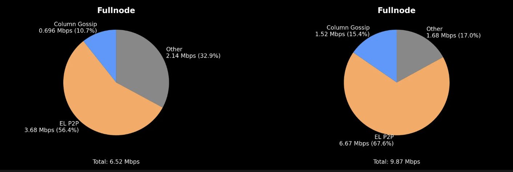

## Abstract

This proposal introduces the sparse blobpool, a construction that brings cell-level, custody-aligned sampling in the Execution Layer (EL). For every new type 3 (blob-carrying) transaction, an EL node fetches full blob payloads only with probability p = 0.15, and otherwise it merely samples the blobs, using the same custody assignment as its Consensus Layer (CL) counterpart. For full nodes, this means downloading as little as 1/8 of the data (8 out of 128 cells), so that the average bandwidth consumption compared to the (current) full blobpool is 0.15 + 0.85/8 ~ 0.25, a ~4x reduction. The choice of p = 0.15 balances reducing bandwidth consumption with guaranteeing the full propagation of txs, by ensuring that for each blob tx there exists a large connected backbone of nodes that have the full blob payload. At an individual node level, p = 0.15 translates to 98.6% probability of least 3/50 neighbours holding the full blob payload, only 0.03% chance of total unavailability. The sampling performed with probability 1 - p = 0.85 enables streamlined data availability checks during block validation, as well as enhancing the availability of the data.

## Motivation

As Blob Parameter Only (BPO) forks progressively increase throughput, the full-replication nature of today's EL blobpool will begin dominating bandwidth utilization, causing us to hit [EIP-7870](./eip-7870.md) limits. Furthermore, this traffic will compete, and potentially starve, block and attestation propagation, risking instability and liveness issues. This behavior has already been observed in Fusaka devnets, where the average bandwidth consumption _of a full node_ is dominated by the EL blobpool, since column propagation on the CL benefits from sampling.

**Figure 1.** _Breakdown of the average bandwidth consumption (download) of full nodes in Fusaka Devnet 5, for blob count target/max of 22/33 (left) and 48/72 (right). The average bandwidth consumption of the EL is ~4-5x that of the CL._

While the average bandwidth consumption does not reflect that the load on the EL is spread out over time rather than concentrated in a small time window as it is in the CL, the gap between the EL and CL is quite large (~4-5x), and future upgrades will enable the CL to better spread out data propagation in the slot, leaving the EL blobpool as even more of a bottleneck.

The sparse blobpool mechanism brings sampling to the EL as well, with an anticipated ~4x reduction in average bandwidth consumption for a given blobpool load. In doing so, it preserves the unstructured, stochastic nature of the current blobpool rather than introducing complex sharding architectures, prioritizing simplicity and resilience. Moreover, it preserves the CL's ability to satisfy its own sampling needs with the pre-propagated data in the EL blobpool (through the `getBlobs` Engine API). This is achieved by aligning the EL and CL sampling, in particular by having the EL fetch the cells corresponding to the CL custody set. This preserves a key feature of the blobpool, as it stretches the time window for blob data propagation, offloading this work from the critical path of block validation and leading to smoother and less bursty bandwidth utilization patterns over time.

While the scalability gain may be more modest than with other solutions, we believe this design balances between simplicity, security, and scalability, in order to unlock the next tier of blob throughput without requiring user-facing changes, or deeper architectural redesigns.

## Specification

The key words "MUST", "MUST NOT", "REQUIRED", "SHALL", "SHALL NOT", "SHOULD", "SHOULD NOT", "RECOMMENDED", "NOT RECOMMENDED", "MAY", and "OPTIONAL" in this document are to be interpreted as described in [RFC 2119](https://www.rfc-editor.org/rfc/rfc2119) and [RFC 8174](https://www.rfc-editor.org/rfc/rfc8174).

### Execution clients :: devp2p changes

We introduce a new devp2p protocol version, `eth/71` extending the existing `eth/70` protocol (TODO: spec for eth/70 missing).

**Modify `NewPooledTransactionHashes` (`0x08`) message.**
Add a new field `cell_mask` of type `B_16` (`uint128`). This field MUST be interpreted as a bitarray of length `CELLS_PER_EXT_BLOB`, carrying `1` in the indices of columns the announcer has available for **all type 3 txs announced within the message**. This field MUST be set to `nil` when no transactions of such type are announced. (TODO: this approach is not expressive enough if the node wants to offer randomly sampled columns, nor if it wants to announce transactions with full and partial availability in a single message).

- old schema (`eth/70`): `[types: B, [size_0: P, size_1: P, ...], [hash_0: B_32, hash_1: B_32, ...]]`
- new schema (`eth/71`): `[types: B, [size_0: P, size_1: P, ...], [hash_0: B_32, hash_1: B_32, ...], cell_mask: B_16]`

**Modify `GetPooledTransactions` (`0x09`) / `PooledTransactions` (`0x10`) behaviour.**
Responses now elide blob payloads for type 3 transactions requested via this RPC. This is performed by setting an RLP `nil` literal in the list position corresponding to the transaction's blob data. Cell proofs and commitments are unaffected and continue to be sent.

**New message type `GetCells` (`0x12`).** Used to request cells for type 3 transactions. It specifies the transaction hashes being requested, along with a `cell_mask` specifying which cell indices are needed, with syntax identical as `cell_mask` in `NewPooledTransactionHashes`.

- `eth/71`: `[[hash_0: B_32, hash_1: B_32, ...], cell_mask: B_16]`

**New message type `Cells` (`0x13`).** Used to respond to a `GetCells` requests.

- `eth/71`: `[[hash_0: B_32, hash_1: B_32, ...], cells: [[cell_0_0: B_2048, cell_0_1: B_2048, ...], [cell_1_0: B_2048, cell_1_1: B_2048, ...]], cell_mask: B_16]`

### Execution clients :: Blobpool behavior

**New transaction hash.**
Upon receiving a `NewPooledTransactionHashes` announcement containing a previously unknown type 3 transaction hash, the node makes a probabilistic decision about fetching the blob payload: it decides to fetch the full blob payload with probability p = 0.15 (provider role), or simply sample otherwise (sampler role). This decision MAY be remembered for some period chosen by the implementer, in which case stateless heuristics are RECOMMENDED (e.g. calculating a hash by appending some time-bound value mixed in with stable transaction properties, and applying p to it).

**Provider role.**
If the node is a provider, and the announcing peer signaled full availability, the node MUST request the signed transaction and full blob data from that peer via `GetPooledTransactions` and `GetCells` with an all-ones `cell_mask` bitmap. Upon successful retrieval and validation (as per [EIP-7594](./eip-7594.md)), the node MUST in turn announce the transaction hash to its peers via `NewPooledTransactionHashes`, also with an all-ones `cell_mask`.

**Sampler role.**
If the node is a sampler, the node MUST only request the transaction payload via `GetPooledTransactions`. It SHOULD await to observe at least 2 distinct provider announcements, and to successfully receive and validate the signed transaction, before acting further. It then MUST request custody-aligned cells from peers that announced overlapping availability, including providers. When fetching from a provider, the node MUST request `C_extra` random columns in addition to its custody set (see "Sampling noise" in Rationale). The node MUST request no more than `C_req` columns per request, at all times.

**Ensuring fairness.**
Nodes MAY keep a record of the frequency of full payload fetches made by each peer, relative to their sampling requests. Nodes MAY elect to disconnect peers who exceed some locally-determined fairness heuristic. Such heuristics are not object of standardization.

**Supernode behaviour.**
Supernodes (nodes intending to fetch every blob payload in full) MUST load balance requests across samplers and providers. Furthermore, supernodes SHOULD prioritize reconstructing blobs and proofs from 64 columns. Supernodes SHOULD maintain a larger peerset in order to satisfy their increased blob fetching needs without over-stressing a small set of neighbours and violating fairness.

**Sampler eviction**
A sampler MAY drop a transaction if it has not observed sufficient network saturation (i.e., announcements from other peers for the same blob) within a defined period.

**Continued sampling**
Tenured transactions MAY be subject to resampling in order to test for liveness and confirm confidence of continued network-wide availability.

### Execution clients :: Local block builders

> TODO: config specification needed.

Client implementations MUST provide configuration options for local block builders to specify a blob inclusion policy when proposing a block. Implementations SHOULD support at least these policies:

1. Conservative: include only blob transactions for which all blob data is fully available locally (equivalent to today's behaviour).
2. Optimistic: also include blob transactions that have been successfully sampled.
3. Proactive: resample prior to blob proposal time in order to assess network-wide confidence of blobs potentially selected for inclusion. This requires an additional Engine API extension for the CL to notify the EL of upcoming proposer duty (TODO).

### Engine API extensions

> TODO: This specification will be moved out to the Execution APIs repo and linked to from here.

**Method `engine_blobCustodyUpdatedV1`**

Called by the Consensus layer client to inform the Execution layer of the indices of their current blob column custody set at startup, as well as subsequent changes during live operation.

Request:

- method: `engine_blobCustodyUpdatedV1`
- params:
  - `indices_bitarray`: uint128, interpreted as a bitarray of length `CELLS_PER_EXT_BLOB` indicating which column indices form the custody set.
- timeout: 150ms

Response:

- result: no payload
- error: code and message set in case an error occurs during processing of the request.

Specification:

1. The Consensus client MUST call this method whenever its custody set changes. Additionally, it MUST call it on start, on restart, and when an Engine API interruption is detected.
2. The Execution client MUST return an Ok response if the request is well-formed. All subsequent sampling requests MUST adopt the new custody set. Queued sampling requests MAY be patched to reflect the new custody set.
3. For type 3 transactions pending in the blobpool:
    1. If the custody set has expanded, the Execution client MUST issue new sampling requests for the delta. It SHOULD broadcast updated `NewPooledTransactionHashes` announcement with the new available set.
    2. If the custody set has contracted, the Execution client MAY prune dropped cells from local storage, but only AFTER it has broadcast an updated `NewPooledTransactionHashes` announcement with the reduced available set. This is to avoid peers from perceiving an availability fault if they happen to request those previously announced cells.
4. The Execution client MUST treat a request to update the custody set to the current value as a no-op operation returning an Ok.

**Method `engine_getBlobsV4`**

Called by the Consensus layer client to retrieve blob cells from the Execution layer blobpool.

Request:

- method: `engine_getBlobsV4`
- params:
  - `versioned_blob_hashes`: []bytes32, an array of blob versioned hashes.
  - `indices_bitarray`: uint128, a bitarray denoting the indices of the cells to retrieve.
- timeout: 500ms

Response:

- result: `[]BlobCellsAndProofsV1`
- error: code and message set in case an error occurs during processing of the request.

**Data structure `BlobCellsAndProofsV1`**

- `blob_cells`: a sequence of byte arrays `[]bytes` representing the partial matrix of the requested blobs, with `nil` entries for missing cells.
- `proofs`: `Array of DATA` - Array of `KZGProof` as defined in [EIP-4844](./eip-4844.md), 48 bytes each (`DATA`)

### Parameters

- **Fetching probability**: p = 0.15
- **Mesh degree**: D = 50 (default peerset size)
- **Sampling requirement**: Minimum `SAMPLES_PER_SLOT = 8` columns per node as per PeerDAS specification
- **Reconstruction threshold**: 64 cells required for Reed-Solomon decoding
- **Minimum providers to sample**: minimum 2 providers should be observed before sampling
- **Extra random columns per request**: `C_extra = 1`
- **Maximum columns per request**: `C_req = 8`

## Rationale

### Parameter selection

The choice of p = 0.15 balances bandwidth reduction with availability guarantees. Mathematical analysis for a mesh degree D = 50 shows:

- **Primary reliability**: Probability of having at least 3 peers with complete blob payload is 98.6%
- **Secondary reliability**: Via reconstruction from partial availability, recovery probability exceeds 80% when 6+ provider peers exist.
- **Total unavailability**: Only 0.03% chance with these parameters.

### Reliability framework

**Primary reliability.** Let $X$ be the number of direct peers with the full payload. With $X∼Binomial(D,p)$, the probability that at least $k$ honest peers hold the full blob payload for a type 3 tx is:

$$
P(X \geq k) = 1 - \sum_{i=0}^{k-1} \binom{D}{i} p^i (1-p)^{D-i}
$$

Evaluating for sensible values of $p$ and $k$ yields, where $D=50$ (Geth's default mesh degree):

| $p$      | $k = 6$      | $k = 5$      | $k = 4$      | $k = 3$      | $k = 2$      | $k = 1$      | $P(0)$       |
| -------- | ------------ | ------------ | ------------ | ------------ | ------------ | ------------ | ------------ |
| 0.05     | 0.037776     | 0.103617     | 0.239592     | 0.459467     | 0.720568     | 0.923055     | 0.076945     |
| 0.08     | 0.208126     | 0.371050     | 0.574704     | 0.774026     | 0.917288     | 0.984534     | 0.015466     |
| 0.10     | 0.383877     | 0.568802     | 0.749706     | 0.888271     | 0.966214     | 0.994846     | 0.005154     |
| 0.125    | 0.606513     | 0.765366     | 0.886232     | 0.958237     | 0.989739     | 0.998740     | 0.001260     |
| **0.15** | **0.780647** | **0.887895** | **0.953953** | **0.985811** | **0.997095** | **0.999704** | **0.000296** |
| 0.20     | 0.951973     | 0.981504     | 0.994344     | 0.998715     | 0.999807     | 0.999986     | 0.000014     |

**Secondary reliability.** Probability that a payload can be reconstructed from partial availability when primary reliability fails. Let $Y$ be the number of distinct columns available from sampler peers. Given $k$ provider peers that failed to serve the full payload, a node with $D - k$ sampler peers (each holding 8 random columns, assuming they're all minimal custody full nodes) can reconstruct with probability $P(Y \geq 64 \mid n = D - k)$. For the adversarial scenario where we attained $k = 3$, yet all failed to serve the blob data, with $D = 50$, secondary reliability exceeds 99.9% as samplers provide an expected 124 distinct columns from 47 peers.

| Providers ($k$) | Samplers ($n=D-k$) | $E[Distinct Columns]$ | $P(Y ≥ 64)$ |
| --------------- | ------------------ | --------------------- | ----------- |
| 0               | 50                 | 125.1                 | >99.99%     |
| 1               | 49                 | 124.9                 | >99.99%     |
| 2               | 48                 | 124.6                 | >99.99%     |
| 3               | 47                 | 124.3                 | >99.99%     |
| 4               | 46                 | 124.0                 | >99.99%     |
| ...             | ...                | ...                   | ...         |
| ~40             | ~10                | ~68                   | ~80%        |

**Minimum threshold**: Approximately $n_{\min} \approx 10$ samplers needed for reasonable reconstruction probability (>80%).

## Backwards Compatibility

This EIP changes the `eth` protocol and requires rolling out a new version, `eth/71`. Supporting multiple versions of a wire protocol is possible. Rolling out a new version does not break older clients immediately, since they can keep using protocol version `eth/70`.

This EIP does not change consensus rules and does not strictly require a hard fork. We are assessing the gradual rollout possibilities. In the meantime, it is RECOMMENDED that this EIP be deployed within the context of a hard fork.

## Test Cases

TBD

## Security Considerations

### Attack scenarios and threat model

**DoS attacks.** An important consideration in all mempool sharding mechanisms is the possibility of DoS attacks. This refers to the case where a malicious sender posts a transaction to the mempool disclosing only part of it, which makes the transaction impossible to be included in any future block, while still consuming mempool resources. In this system, such a sender can be detected by nodes that request the full payload of the transaction.

**Selective withholding attacks.** TODO

**Eclipse attacks.** TODO

### Peer disconnection policies

Nodes MAY keep a record of the frequency of full payload and column requests made by each peer. If a frequency exceeds some quota or the probabilistic expectation by some tolerance threshold, the node MAY decide to disconnect the offending peer alleging abuse as a reason. This prevents nodes from spending too much upload bandwidth on peers that fetch full payloads much more often that the expected p = 0.15.

### The need for sampling noise

Custody-aligned sampling generates in stable and predictable request patterns that attackers could game. For example, a malicious node may trick a victim by pretending to be a provider when in reality it only stores the few, predictable columns the victim is expected to sample. To defend against this, this EIP introduces the simple mechanism of "sampling noise."

When a peer requests its custody columns from a provider, it must also request at least ONE randomly selected column. A failure to serve this extra column can be interpreted as a strong sign of misbehavior. The attacker could choose to timeout, but after a number of repetitions, the victim would likely disconnect anyway due to high failure rates.

This simple mechanism reinforces key model assumptions (a provider is truly a provider) in exchange for negligible overhead per request (MAX_BLOBS_PER_TX x CELL_SIZE + proofs = ~12KiB).

### No normative peer scoring

An earlier design considered a peer scoring system to grade peers by tracking their statistical ratio of requests to announcements (leechiness vs. helpfulness). After careful consideration, we deemed this approach brittle and dropped the feature. Our rationale was that such mechanism would strongly encode assumptions and confine the system to conform to some modellic behaviour, thus reducing flexibility and resilience in the face of environmental changes, shocks, or unexpected/improbable events (properties that are crucial in open and permissionless systems). Instead, we defer to implementations to define their own local heuristics for peer disconnection, if any.

### devp2p message schema choices

We note that `cell_mask` field in `NewPooledTransactionHashes` is not expressive enough to signal different local availability for type 3 txs announced within the same message. This limitation implies that (a) fully and partially available txs cannot be announced together, and (b) availability of randomly sampled columns cannot be signaled in practice (because indices vary per tx), only custody columns can be consistently announced (they're shared across all sampled transactions).

Nevertheless, the sender can efficiently split and group announcements: fully-available txs can be bundled together, and partially-available txs can be announced in separate messages. Per-message dispatch overhead is minimal (one uint64 request_id and one uint8 message_type), and more expressive designs are likely to incur in higher overhead. Furthermore, from a protocol flow perspective, devp2p supports concurrent requests and unordered responses (via `request_id` correlation), so this approach is not affected by head-of-line blocking either (at least from a protocol perspective).

We considered more expressive designs, ranging from simple arrays of `cell_mask`s (one per tx), to union types express full availability more compactly, to more complex schemes involving run-length encoding and compression. But we concluded that the added complexity was not justified at this time.

### Open points

- Further threat modelling and security hardening.
- RBF (replace-by-fee) impact.

## Copyright

Copyright and related rights waived via [CC0](../LICENSE.md).
