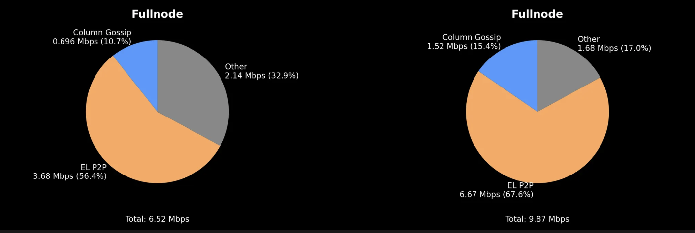

## Abstract

This proposal introduces the sparse blobpool, a construction that brings cell-level, custody-aligned sampling in the Execution Layer (EL). For every new type 3 (blob-carrying) transaction, an EL node fetches full blob payloads only with probability p = 0.15, and otherwise it merely samples the blobs, using the same custody assignment as its Consensus Layer (CL) counterpart. For full nodes, this means downloading as little as 1/8 of the data (8 out of 128 cells), so that the average bandwidth consumption compared to the (current) full blobpool is 0.15 + 0.85/8 ~ 0.25, a ~4x reduction. The choice of p = 0.15 balances reducing bandwidth consumption with guaranteeing the full propagation of txs, by ensuring that for each blob tx there exists a large connected backbone of nodes that have the full blob payload. At an individual node level, p = 0.15 translates to 98.6% probability of least 3/50 neighbours holding the full blob payload, only 0.03% chance of total unavailability. The sampling performed with probability 1 - p = 0.85 enables streamlined data availability checks during block validation, as well as enhancing the availability of the data.

## Motivation

As Blob Parameter Only (BPO) forks progressively increase throughput, the full-replication nature of today's EL blobpool will begin dominating bandwidth utilization, causing us to hit [EIP-7870](./eip-7870.md) limits. Furthermore, this traffic will compete, and potentially starve, block and attestation propagation, risking instability and liveness issues. This behavior has already been observed in Fusaka devnets, where the average bandwidth consumption _of a full node_ is dominated by the EL blobpool, since column propagation on the CL benefits from sampling.

**Figure 1.** _Breakdown of the average bandwidth consumption (download) of full nodes in Fusaka Devnet 5, for blob count target/max of 22/33 (left) and 48/72 (right). The average bandwidth consumption of the EL is ~4-5x that of the CL._

While the average bandwidth consumption does not reflect that the load on the EL is spread out over time rather than concentrated in a small time window as it is in the CL, the gap between the EL and CL is quite large (~4-5x), and future upgrades will enable the CL to better spread out data propagation in the slot, leaving the EL blobpool as even more of a bottleneck.

The sparse blobpool mechanism brings sampling to the EL as well, with an anticipated ~4x reduction in average bandwidth consumption for a given blobpool load. In doing so, it preserves the unstructured, stochastic nature of the current blobpool rather than introducing complex sharding architectures, prioritizing simplicity and resilience. Moreover, it preserves the CL's ability to satisfy its own sampling needs with the pre-propagated data in the EL blobpool (through the `getBlobs` Engine API). This is achieved by aligning the EL and CL sampling, in particular by having the EL fetch the cells corresponding to the CL custody set. This preserves a key feature of the blobpool, as it stretches the time window for blob data propagation, offloading this work from the critical path of block validation and leading to smoother and less bursty bandwidth utilization patterns over time.

While the scalability gain may be more modest than with other solutions, we believe this design balances between simplicity, security, and scalability, in order to unlock the next tier of blob throughput without requiring user-facing changes, or deeper architectural redesigns.

## Specification

The key words "MUST", "MUST NOT", "REQUIRED", "SHALL", "SHALL NOT", "SHOULD", "SHOULD NOT", "RECOMMENDED", "NOT RECOMMENDED", "MAY", and "OPTIONAL" in this document are to be interpreted as described in [RFC 2119](https://www.rfc-editor.org/rfc/rfc2119) and [RFC 8174](https://www.rfc-editor.org/rfc/rfc8174).

### Execution clients :: devp2p changes

We introduce a new devp2p protocol version, `eth/71` extending the existing `eth/70` protocol (TODO: spec for eth/70 missing).

**Modify `NewPooledTransactionHashes` (`0x08`) message.**
Add a new field `cell_mask` of type `B_16` (`uint128`). This field MUST be interpreted as a bitarray of length `CELLS_PER_EXT_BLOB`, carrying `1` in the indices of colums the announcer has available for **all type 3 txs announced within the message**. This field MUST be set to `nil` when no transactions of such type are announced. (TODO: this approach is not expressive enough if the node wants to offer randomly sampled columns, nor if it wants to announce transactions with full and partial availability in a single message).

- old schema (`eth/70`): `[types: B, [size_0: P, size_1: P, ...], [hash_0: B_32, hash_1: B_32, ...]]`
- new schema (`eth/71`): `[types: B, [size_0: P, size_1: P, ...], [hash_0: B_32, hash_1: B_32, ...], cell_mask: B_16]`

**Modify `GetPooledTransactions` (`0x09`) / `PooledTransactions` (`0x10`) behaviour.**
Responses now elide blob payloads for type 3 transactions requested via this RPC. This is performed by setting an RLP `nil` literal in the list position corresponding to the transaction's blob data. Cell proofs and commitments are unaffected and continue to be sent.

**New message type `GetCells` (`0x12`).** Used to request cells for type 3 transactions. It specifies the transaction hashes being requested, along with a `cell_mask` specifying which cell indices are needed, with syntax identical as `cell_mask` in `NewPooledTransactionHashes`.

- `eth/71`: `[[hash_0: B_32, hash_1: B_32, ...], cell_mask: B_16]`

**New message type `Cells` (`0x13`).** Used to respond to a `GetCells` requests.

- `eth/71`: `[[hash_0: B_32, hash_1: B_32, ...], cells: [[cell_0_0: B_2048, cell_0_1: B_2048, ...], [cell_1_0: B_2048, cell_1_1: B_2048, ...]], cell_mask: B_16]`

### Execution clients :: Blobpool behavior

**New transaction hash.**
Upon receiving a `NewPooledTransactionHashes` announcement containing a previously unknown type 3 transaction hash, the node makes a probabilistic decision about fetching the blob payload: it decides to fetch the full blob payload with probability p = 0.15 (provider role), or simply sample otherwise (sampler role). This decision MAY be remembered for some period chosen by the implementer, in which case stateless heuristics are RECOMMENDED (e.g. calculating a hash by appending some time-bound value mixed in with stable transaction properties, and applying p to it).

**Provider role.**
If the node is a provider, and the announcing peer signaled full availability, the node MUST request the signed transaction and full blob data from that peer via `GetPooledTransactions` and `GetCells` with an all-ones `cell_mask` bitmap. Upon successful retrieval and validation (as per [EIP-7594](./eip-7594.md)), the node MUST in turn announce the transaction hash to its peers via `NewPooledTransactionHashes`, also with an all-ones `cell_mask`.

**Sampler role.**
If the node is a sampler, the node MUST only request the transaction payload via `GetPooledTransactions`. It SHOULD await to observe at least 2 distinct provider announcements, and to successfully receive and validate the signed transaction, before acting further. It then MUST request custody-aligned cells from peers that announced overlapping availability, including providers. When fetching from a provider, the node MUST request `C_extra` random columns in addition to its custody set (see "Sampling noise" in Rationale). The node MUST request no more than `C_req` columns per request, at all times.

**Ensuring fairness.**
Nodes MAY keep a record of the frequency of full payload fetches made by each peer, relative to their sampling requests. Nodes MAY elect to disconnect peers who exceed some locally-determined fairness heuristic. Such heuristics are not object of standardization.

**Supernode behaviour.**
Supernodes (nodes intending to fetch every blob payload in full) MUST load balance requests across samplers and providers. Furthermore, supernodes SHOULD prioritize reconstructing blobs and proofs from 64 columns. Supernodes SHOULD maintain a larger peerset in order to satisfy their increased blob fetching needs without over-stressing a small set of neighbours and violating fairness.

**Sampler eviction**
A sampler MAY drop a transaction if it has not observed sufficient network saturation (i.e., announcements from other peers for the same blob) within a defined period. See heuristic H2 in Security Considerations for an example implementation. 

**Continued sampling**
Tenured transactions MAY be subject to resampling in other to test for liveness and confirm confidence of continued network-wide availability.

### Execution clients :: Local block builders

**Eager mode for block builders.**
Before assembling an execution payload, a local block builder MUST switch its fetch policy to eager mode: it acts as a provider (p = 1.0) for every type 3 transaction it intends to include, fetching the full blob payload unconditionally regardless of its normally configured p value. This guarantees that the builder holds complete blob data for all transactions in the payload, satisfying DA checks without reliance on probabilistic network-wide availability. Consequently, local block builders MUST apply a conservative inclusion policy: only blob transactions for which full blob data is locally available may be included in an execution payload.

**Private blob transactions.**
A significant concern arises when blob transactions are delivered to the builder privately (i.e., bypassing the public mempool). In this case the builder is the sole holder of the full blob payload at the time the execution payload envelope is revealed. Nodes that were not previously exposed to these transactions via `NewPooledTransactionHashes` cannot satisfy custody columns via `engine_getBlobsV4`, and must instead fetch column data directly from the builder during the critical path of block validation. In the worst case, where all blob transactions in the payload are private, this creates a concentrated bandwidth spike on the builder at exactly the moment the envelope is revealed, competing with and potentially starving block and attestation traffic.

To mitigate this, implementations SHOULD provide a pre-seeding mechanism: upon selecting a blob transaction for inclusion, and prior to committing to a bid, the builder SHOULD proactively push full availability announcements (`NewPooledTransactionHashes` with all-ones `cell_mask`) to a sufficient subset of its peers to seed column propagation before the execution payload envelope is revealed. This spreads seeding load off the critical path. The minimum number of peers to pre-seed and the timing window relative to bid submission are implementation-defined.

Pre-seeding does reveal the builder's blob transaction selection to peers before the bid is committed. However, this is an acceptable tradeoff: blob transactions carry little to no MEV value compared to regular transactions (they are primarily rollup data postings with no in-EVM execution side-effects), so early disclosure of blob transaction content does not meaningfully advantage competitors or enable front-running.

### Engine API extensions

The Engine API extensions `engine_blobCustodyUpdatedV1` and `engine_getBlobsV4` are specified in the [Execution APIs](https://github.com/ethereum/execution-apis) repository. See the [Amsterdam Engine API specification](https://github.com/kamilsa/execution-apis/blob/update/engine-getBlobsV4-spec/src/engine/amsterdam.md) for details.

## Rationale

### Parameter selection

The choice of p = 0.15 balances bandwidth reduction with availability guarantees. Mathematical analysis for a mesh degree D = 50 shows:

- **Primary reliability**: Probability of having at least 3 peers with complete blob payload is 98.6%
- **Secondary reliability**: Via reconstruction from partial availability, recovery probability exceeds 80% when 6+ provider peers exist.
- **Total unavailability**: Only 0.03% chance with these parameters.

### Reliability framework

**Primary reliability.** Let $X$ be the number of direct peers with the full payload. With $X∼Binomial(D,p)$, the probability that at least $k$ honest peers hold the full blob payload for a type 3 tx is:

$$
P(X \geq k) = 1 - \sum_{i=0}^{k-1} \binom{D}{i} p^i (1-p)^{D-i}
$$

Evaluating for sensible values of $p$ and $k$ yields, where $D=50$ (Geth's default mesh degree):

| $p$      | $k = 6$      | $k = 5$      | $k = 4$      | $k = 3$      | $k = 2$      | $k = 1$      | $P(0)$       |
| -------- | ------------ | ------------ | ------------ | ------------ | ------------ | ------------ | ------------ |
| 0.05     | 0.037776     | 0.103617     | 0.239592     | 0.459467     | 0.720568     | 0.923055     | 0.076945     |
| 0.08     | 0.208126     | 0.371050     | 0.574704     | 0.774026     | 0.917288     | 0.984534     | 0.015466     |
| 0.10     | 0.383877     | 0.568802     | 0.749706     | 0.888271     | 0.966214     | 0.994846     | 0.005154     |
| 0.125    | 0.606513     | 0.765366     | 0.886232     | 0.958237     | 0.989739     | 0.998740     | 0.001260     |
| **0.15** | **0.780647** | **0.887895** | **0.953953** | **0.985811** | **0.997095** | **0.999704** | **0.000296** |
| 0.20     | 0.951973     | 0.981504     | 0.994344     | 0.998715     | 0.999807     | 0.999986     | 0.000014     |

**Secondary reliability.** Probability that a payload can be reconstructed from partial availability when primary reliability fails. Let $Y$ be the number of distinct columns available from sampler peers. Given $k$ provider peers that failed to serve the full payload, a node with $D - k$ sampler peers (each holding 8 random columns, assuming they're all minimal custody full nodes) can reconstruct with probability $P(Y \geq 64 \mid n = D - k)$. For the adversarial scenario where we attained $k = 3$, yet all failed to serve the blob data, with $D = 50$, secondary reliability exceeds 99.9% as samplers provide an expected 124 distinct columns from 47 peers.

| Providers ($k$) | Samplers ($n=D-k$) | $E[Distinct Columns]$ | $P(Y ≥ 64)$ |
| --------------- | ------------------ | --------------------- | ----------- |
| 0               | 50                 | 125.1                 | >99.99%     |
| 1               | 49                 | 124.9                 | >99.99%     |
| 2               | 48                 | 124.6                 | >99.99%     |
| 3               | 47                 | 124.3                 | >99.99%     |
| 4               | 46                 | 124.0                 | >99.99%     |
| ...             | ...                | ...                   | ...         |
| ~40             | ~10                | ~68                   | ~80%        |

**Minimum threshold**: Approximately $n_{\min} \approx 10$ samplers needed for reasonable reconstruction probability (>80%).

## Backwards Compatibility

This EIP changes the `eth` protocol and requires rolling out a new version, `eth/71`. Supporting multiple versions of a wire protocol is possible. Rolling out a new version does not break older clients immediately, since they can keep using protocol version `eth/70`.

This EIP does not change consensus rules and does not strictly require a hard fork. We are assessing the gradual rollout possibilities. In the meantime, it is RECOMMENDED that this EIP be deployed within the context of a hard fork.

## Test Cases

See the simulation-backed test cases and parameter sweeps in the companion report:
[Heuristic simulation report](https://hackmd.io/@kamilsa/Hyrn7V-sZx).

## Security Considerations

### Attack scenarios and threat model

**DoS attacks.** An important consideration in all mempool sharding mechanisms is the possibility of DoS attacks. This refers to the case where a malicious sender posts a transaction to the mempool disclosing only part of it, which makes the transaction impossible to be included in any future block, while still consuming mempool resources.

**Selective withholding attacks.** A malicious peer may announce provider-like availability for a blob transaction while selectively withholding some of the requested cells. In the simplest form, the attacker serves only the victim's predictable custody-aligned columns. This can cause a sampler to overestimate network-wide availability, retain transactions with weak backing for too long, or waste bandwidth and time repeatedly querying peers that do not in fact hold the promised data.

**Eclipse attacks.** A malicious peer may attempt to isolate a victim by controlling all of its connections, and then feed it false information about blob availability, or simply refuse to serve any blob data. 

### Peer disconnection policies and local anti-abuse heuristics

To mitigate aforementioned attacks, multiple heuristics could be implemented at the node level.

#### H1 — Includability check

Nodes SHOULD reject or deprioritize newly announced blob transactions that are clearly non-includable under current fee conditions. A simple implementation compares the transaction's blob fee against the current blob base fee, optionally with a local discount factor to tolerate small fee movements. Transactions failing this check SHOULD NOT be included in the blobpool, and nodes SHOULD avoid issuing further `GetCells` requests for them. Repeated floods of such transactions from the same peer MAY contribute to local rate-limiting or disconnection heuristics. This mechanism primarily mitigates pool-spam DoS attacks.

Example configuration parameters: `includability_discount`, which sets how far below the current blob base fee a transaction may fall before being treated as non-includable.

#### H2 — Corroboration / saturation check

Nodes SHOULD avoid retaining newly announced blob transactions unless they are corroborated by additional peers within a bounded period. A simple implementation requires at least a minimum number of independent announcements from distinct peers before the transaction is granted longer tenure in the blobpool. Transactions that fail to reach this threshold SHOULD be evicted.

Example configuration parameters: `saturation_timeout`, which defines how long to wait for corroboration, and `min_independent_peers`, which defines how many distinct announcers are required for retention.

#### H3 — Randomized availability probing (sampling noise)

When requesting cells for a transaction from a peer that claims provider-like availability, a node SHOULD include a small number of randomly selected extra columns (`C_extra`) in addition to its custody-aligned columns, while respecting the per-request cap (`C_req`). The purpose is to make requests less predictable and reduce the attack surface for selective withholding.

Example configuration parameters: `c_extra_max`, which bounds how many extra random probe columns may be added, and `C_req`, which caps the total number of columns requested in a single `GetCells` request.

#### H4 — Probe failure tracking and withholding response

Nodes MAY maintain rolling statistics on peer responses to `GetCells` requests, with particular attention to randomly selected probe columns requested under H3. A peer that repeatedly fails to serve such columns, times out, or returns responses inconsistent with its announced `cell_mask` MAY be treated as exhibiting selective withholding behavior.

To reduce false positives, implementations SHOULD use bounded observation windows and minimum sample sizes before taking punitive action. Isolated failures can occur under benign conditions (e.g., transient congestion, race conditions, or temporary partial state), so H4 decisions SHOULD be based on sustained patterns rather than single events.

Example configuration parameters: `max_random_failure_rate`, which sets the tolerated fraction of failed random probes, and `tracking_window`, which defines how many recent observations are retained when evaluating a peer.

#### H5 — Request/contribution imbalance (bandwidth fairness)

Nodes MAY track whether a peer consumes disproportionate bandwidth relative to its useful contribution (e.g., repeatedly requesting cells while rarely announcing transactions or serving data). Peers exhibiting sustained request-heavy, contribution-light behavior MAY be deprioritized or disconnected under local fairness policies.

Example configuration parameter: `max_request_to_announce_ratio`, which sets the maximum tolerated ratio between a peer's cell requests and its transaction announcements.

#### H6 — Inclusion contribution / announcement recall

Nodes MAY track whether peers contribute to the propagation of blob transactions that are eventually included in canonical blocks. The goal is to identify peers that consume bandwidth and mesh slots while persistently failing to relay useful blob transactions (or failing to announce them via `NewPooledTransactionHashes`).

A simple local signal is computed at block import time:
for each included type 3 transaction that was observable before block inclusion, record which peers had announced its hash via `NewPooledTransactionHashes` prior to import. Peers that announced included transactions receive contribution credit; peers that repeatedly fail to announce included transactions over a sufficiently large sample MAY be treated as low-contribution peers.

Example configuration parameters: `h6_ema_alpha`, which controls how quickly the contribution score reacts to new blocks, `h6_ema_disconnect_threshold`, which sets the minimum acceptable EMA score, and `h6_warmup_blocks`, which delays enforcement until enough block history has accumulated.

The heuristic parameters used by the simulation-backed analysis are summarized in the companion report at [https://hackmd.io/@kamilsa/Hyrn7V-sZx](https://hackmd.io/@kamilsa/Hyrn7V-sZx). In particular:

- H1: `includability_discount`
- H2: `saturation_timeout`, `min_independent_peers`
- H3: `c_extra_max`, `C_req`
- H4: `max_random_failure_rate`, `tracking_window`
- H5: `max_request_to_announce_ratio`
- H6: `h6_ema_alpha`, `h6_ema_disconnect_threshold`, `h6_warmup_blocks`

### Parameters

This section separates protocol-facing parameters specified by this EIP from non-normative local heuristic defaults suggested by the companion analysis.

**Protocol-facing parameters**

- **Fetching probability**: `p = 0.15`
- **Mesh degree**: `D = 50` (default peerset size)
- **Sampling requirement**: minimum `SAMPLES_PER_SLOT = 8` columns per node as per PeerDAS specification
- **Reconstruction threshold**: `64` cells required for Reed-Solomon decoding
- **Minimum providers to sample before sampler fetch proceeds**: `2`
- **Sampling-noise floor**: `C_extra >= 1`
- **Maximum columns per request**: `C_req = 12` (8 custody columns plus up to 4 extra probe columns in the recommended sampler profile)

**Non-normative local heuristic defaults**

The following values were obtained from the heuristic analysis referenced in the Test Cases section and are suggested only as recommendations for local anti-abuse heuristics, not as normative protocol parameters:

- **H1 includability threshold**: `includability_discount = 0.7`
- **H2 corroboration retention**: `saturation_timeout = 1 s`, `min_independent_peers = 2`
- **H3 randomized probing**: `c_extra_max = 4`
- **H4 withholding detection**: `max_random_failure_rate = 0.10`, `tracking_window = 100`
- **H5 fairness threshold**: `max_request_to_announce_ratio = 5.0`
- **H6 EMA scoring**: `h6_ema_alpha = 0.05`, `h6_ema_disconnect_threshold = 0.05`, `h6_warmup_blocks = 50`

### No normative peer scoring

An earlier design considered a normative peer scoring system (e.g., grading peers by request-to-announcement ratios such as "leechiness" vs. "helpfulness"). After careful consideration, we dropped that approach as too brittle for open and permissionless networks: fixed scoring formulas can overfit assumptions about normal behavior, reduce adaptability to changing conditions, and create unnecessary coupling between implementations.

Accordingly, the heuristics described above (H1–H6) are RECOMMENDED as practical guidance and representative examples, not mandatory protocol rules. Clients are free to adopt, modify, combine, or ignore these heuristics, and to define their own local anti-abuse and disconnection policies based on implementation goals and operational experience.

### devp2p message schema choices

We note that `cell_mask` field in `NewPooledTransactionHashes` is not expressive enough to signal different local availability for type 3 txs announced within the same message. This limitation implies that (a) fully and partially available txs cannot be announced together, and (b) availability of randomly sampled columns cannot be signaled in practice (because indices vary per tx), only custody columns can be consistently announced (they're shared across all sampled transactions).

Nevertheless, the sender can efficiently split and group announcements: fully-available txs can be bundled together, and partially-available txs can be announced in separate messages. Per-message dispatch overhead is minimal (one uint64 request_id and one uint8 message_type), and more expressive designs are likely to incur in higher overhead. Furthermore, from a protocol flow perspective, devp2p supports concurrent requests and unordered responses (via `request_id` correlation), so this approach is not affected by head-of-line blocking either (at least from a protocol perspective).

We considered more expressive designs, ranging from simple arrays of `cell_mask`s (one per tx), to union types express full availability more compactly, to more complex schemes involving run-length encoding and compression. But we concluded that the added complexity was not justified at this time.

### Open points

- Further threat modelling and security hardening.
- RBF (replace-by-fee) impact.

## Copyright

Copyright and related rights waived via [CC0](../LICENSE.md).
