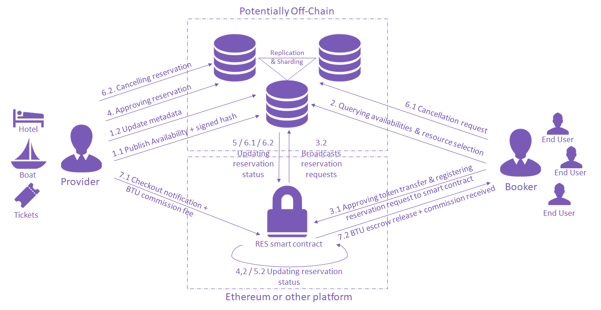

## Preamble

    EIP: 808
    Title: Booking Token Unit protocol, a decentralized booking protocol standard
    Author: Vidal Chriqui <vidal@btuprotocol.com>
    Type: Standard
    Category: ERC
    Status: Draft
    Created: 2017-12-26
    Requires: 20

## Abstract

The following describes standard functions for a decentralized booking protocol that can be used to reserve any kind of resource (hotel room, concert ticket, restaurant table).
The protocol involves the following participants :

- Provider : an entity providing its own resource or a third-party party resource to be booked
- Booker : an entity that books the resource for itself or a third party
- Booking infrastructure : a public "location" where providers can "post" resource availability data and where these resources can be searched by bookers. The booking infrastructure facilitates signaling between providers and bookers by aggregating a high volume of resource type and availabilities.
- RES smart contract : A booking smart contract implementation of the decentralized standardized BTU protocol.

## Motivation

The Booking Token Unit (BTU) protocol is a building block for any decentralized application (dApp) or web site willing to implement booking features for their end-users.
This standard also brings interoperability among decentralized applications that incorporate it.
We strongly believe that a transparent and public inventory enabled by an open-source standardized protocol would considerably lower the entry barriers to many Internet booking markets.

## Specification

The BTU protocol involves potentially ten steps and our standardized decentralized reservation contract (RES). Some of following steps can be relayed off-chain, but are always settled on-chain.



Hereafter the general sequence:

(Step 1.1) Provider is creating an “availability offer” (OFFER) specifying :

* resource id OR bundle id. A bundle is a group of resources.
* resource name OR bundle name
* resource category
* deposit amount in BTU : amount requested for escrow in order to allow a reservation request
* commission amount in BTU : amount paid to booker
* availability start date,
* availability end date
* limit date and time for a free reservation cancellation
* signed (r,s,v) hash of previous information. This signed hash serves as a signed identifier of the resource to be reserved.
* Metadatas : daily price of the resource (fiat amount to be paid at resource “delivery”), links to images, long description, key-values that can be used as search criteria, etc...
The availability data is broadcasted over any communication channel, ideally a decentralized off-chain solution.

(Step 1.2) At any moment, the provider can update the resource metadata by broadcasting a new message.
It is very common that yield management requires many prices (fiat price of the resource) update during the same day. This update only impacts the off-chain components.

(Step 2) Booker is looking for a resource is querying all resources matching is criteria and is selecting a resource he is willing to reserve

(Step 3.1) In the same operation :
Booker is approving (via approve function of ERC20 compliant function of BTU token) to RES smart contract the required amount of BTU to make the booking (amount defined in step 1.1 by the provider)
A booking entry is registered into the smart contract with following information

* Signed hash of resource
* Signed pointer to all full offer information (datas + metadatas) at the moment of the reservation request. Those information are stored in the offchain booking infrastructure.
* Public address matching the hash signature
* desired reservation start date
* desired reservation end date
* status : RESERVATION_REQUESTED

(Step 3.2) Booker broadcasts the resource reservation request to the Booking infrastructure adding all end-user profile information off-chain that may be necessary for the reservation approval. This would help comply with privacy protection requirements.
It is the responsibility of the Booker to notify its end user customer of the full resource information and the provider signature (Availability “snapshot” data). This can be used as proof of reservation details in (the extreme) case resource information at reservation time is deleted from off-chain infrastructure.

(Step 4) Provider is validating the reservation request and broadcasts the new status to “RESERVATION_CONFIRMED”.

(Step 5) RES smart contract is updating the reservation status to “RESERVATION_CONFIRMED”

(Step 6.1 - Optional) Booker cancels the reservation by broadcasting a cancellation request. This triggers a submission to the RES smart contract that empties the registries for this resource.
Depending on the conditions and cancellation date, the BTU escrowed into the RES smart contract are affected back to the user or to the provider

(Step 6.2 - Optional) Provider cancels the reservation by broadcasting a cancellation request. This triggers a submission to the RES smart contract that empties the registries for this resource. RES smart contract is releasing the escrowed amount to booker.

(Step 7.1 & 7.2) Booker is notifying that the resource has been paid (presumably at resource check-out). RES smart contract is releasing the escrowed BTU back to user in addition to a BTU agreed commission.

## Implementation

The implementation involves following functions :

- publishAvailabilities (likely off-chain) : Publishes one or multiple available resources for reservations and for being “searchable”.
- listAvailabilities (likely off-chain) : List all available resources matching a search criteria
- requestReservation : Request for a reservation. The function can be used for initial reservation request OR updating
- getReservationStatus : Read reservation status. Following values are possible : REQUESTED, REJECTED, CONFIRMED


```
contract RES {
    // Availability structure
    enum BookingStatus { REQUESTED, REJECTED, CONFIRMED, CANCELLED  }
    struct availability {
	address               _contractAdress;
	uint                     _resourceId ;   // resource id OR bundle id
	uint                     _type;   // Type of Availability
	uint                     _minDeposit ; // minimum BTU deposit for booking this resource
	uint                     _commission ; // commission amount paid to booker in BTU
	uint                     _freeCancelDateTs; // Limit date for a reservation cancellation
	uint                     _startDateTs;   //availability start date timestamps
	uint                     _endDateTs;   //availability end date timestamps
	BookingStatus    _bookingStatus ; // reservation status
	string                  _metaDataLink // Link to Meta Data of the bookable resource (desc, image links, etc…)
   }
    //Submit one or multiple availability - production implementation should be off-chain
    function publishAvailabilities (address _owner, availability[] _availability, bytes32 _signatureProof )  constant returns (BookingStatus status);
    //Query Availabilities -  production implementation should be off-chain
    function ListAvailabilities(address _requester, string _criterias)  constant returns (availability[] a);
    //Request reservation
    function requestReservation(address _requester, availability _availability)  constant returns (uint status);
    //Check booking status
    function getReservationStatus(address _requester, availability _availability)  constant returns (BookingStatus status);
}
```

## Additional References

[BTU website](http://www.btuprotocol.com)


## Copyright

Copyright and related rights waived via [CC0](https://creativecommons.org/publicdomain/zero/1.0/).
