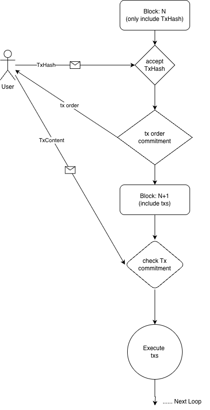

## Abstract

This proposal introduces the MEVless protocol, a novel approach to prevent Maximum Extractable Value (MEV) attacks by implementing blind transaction sequencing. The core principle of MEVless is to prevent validators from seeing transaction content during the ordering phase, thereby eliminating the fundamental prerequisite for MEV attacks. The protocol separates block production into two phases: sequencing blocks that order transactions based on transaction hashes without revealing transaction content, and execution blocks that execute transactions in the predetermined order. This design eliminates the ability of miners and validators to perform MEV attacks such as sandwich attacks and front-running by removing their access to transaction content during the critical ordering phase.

## Motivation

MEV attacks, particularly sandwich attacks and front-running, represent a significant threat to blockchain ecosystems, especially in DeFi applications. The fundamental prerequisite for MEV attacks is that validators can see transaction content before ordering, which allows them to:

1. **Sandwich Attacks**: Insert buy and sell transactions around user transactions to manipulate prices and extract value
2. **Front-running**: Execute similar transactions before users to capture arbitrage opportunities
3. **Back-running**: Execute transactions after users to benefit from price movements

Unlike legitimate arbitrage activities that provide liquidity, these attacks are purely extractive and harmful to the ecosystem. They reduce user confidence, increase transaction costs, and can lead to significant financial losses for users.

Current solutions have limitations:

- **Encrypted Mempools**: High computational overhead for encryption/decryption
- **Private Mempools**: Centralized and not fully decentralized, use trustful instead of trustless.
- **PBS (Proposer-Builder Separation)**: Still allows builders to see transaction content and becoming more and more centralized.

The MEVless protocol addresses these issues by fundamentally changing how transactions are ordered, making it impossible for miners to perform MEV attacks while maintaining decentralization and efficiency. By eliminating MEV attacks at the protocol level, DeFi developers can focus on building innovative financial products and user experiences without constantly worrying about MEV protection mechanisms, leading to faster development cycles and more robust applications.

## Specification

### Protocol Overview

The MEVless protocol operates on a two-phase block system:

1. **Sequencing Blocks**: Order transactions based on transaction hashes and prepayment amounts without revealing transaction content. Sequencing blocks interval can be shorter than execution blocks.
2. **Execution Blocks**: Execute transactions in the predetermined order from sequencing blocks

### Block Types

#### Sequencing Blocks

- **Purpose**: Order transactions and collect prepayments
- **Frequency**: Every odd-numbered block height
- **Operations**:
    - Receive transaction hashes from users
    - Collect prepayments (gas fees + optional tips)
    - Order transactions by prepayment amount (highest first)
    - Publish ordered transaction sequence as commitment
    - Store transaction hashes in block

#### Execution Blocks

- **Purpose**: Execute transactions in predetermined order
- **Frequency**: Every even-numbered block height
- **Operations**:
    - Receive transaction content from users
    - Verify transaction content matches committed hashes
    - Execute transactions in predetermined order

### Transaction Flow

#### Phase 1: Transaction Submission and Sequencing

1. User creates transaction and calculates transaction hash
2. User sends transaction hash to the network with prepayment:
    - **Base Gas Fee**: Fixed fee for hash storage and sequencing computation
    - **Optional Tip**: Additional payment for priority in sequencing
3. Network validates user has sufficient balance for prepayment
4. Network orders transaction hashes by total prepayment amount (descending)
5. Network deducts prepayment from user account
6. Network publishes ordered transaction sequence as commitment
7. Network stores transaction hashes in sequencing block


*MEVless Protocol Transaction Flow*

#### Phase 2: Transaction Content Submission and Execution

1. User monitors network for their transaction hash commitment
2. User submits actual transaction content(including the remaining gasfee) to network
3. Network receives transaction content during execution block
4. Network verifies transaction content matches committed hash
5. Network executes transactions in predetermined order, deduct the remaining fee and 50% of the actual difference between gasUsed and gaslimit for tax ( prevent the gasLimit much more than gasUsed so that validators can entire the whole block to get MEV)


### Gas Economics

#### Prepayment Structure

```
Total Prepayment = Base Gas Fee + Optional Tip
```

- **Base Gas Fee**: Fixed cost for hash storage and sequencing computation
- **Optional Tip**: Variable amount for priority in transaction ordering

#### Gas Cost Calculation

- **Sequencing Phase**: Minimal gas cost for hash operations
- **Execution Phase**: Standard gas cost for transaction execution

## Rationale

### Why Blind Sequencing?

Blind sequencing eliminates the root cause of MEV attacks by preventing miners from seeing transaction content during the critical ordering phase. This approach is more efficient than encryption-based solutions and more decentralized than private mempool approaches.

### Why Two-Phase Blocks?

Separating sequencing and execution allows for:

- **Efficient Ordering**: Hash-based ordering is computationally lightweight
- **Network Efficiency**: Small hash data reduces bandwidth requirements
- **Commitment Mechanism**: Public ordering commitment prevents manipulation

### Why Random Block Production is Critical?

Random block production is essential to prevent speculative MEV attacks. When block producers cannot predict when they will be selected to produce blocks, they cannot reliably perform speculative MEV attacks because:

- **Unpredictable Selection**: Attackers cannot know if they will be the next block producer
- **Economic Risk**: Speculative transactions require prepayments that are lost if the attacker is not selected
- **Decentralization Amplification**: More validators mean lower individual selection probability, increasing attack costs exponentially

## Backwards Compatibility

This protocol will add some RPC methods to support the two-phase block system:    

- **eth_sendTxHash**: Users submit transaction hashes instead of full transactions
- **eth_getTxSequence**: Returns the ordered transaction sequence that is committed

## Test Cases

### Basic Transaction Flow

1. User submits transaction hash with prepayment
2. Network orders transaction by prepayment amount
3. User submits transaction content
4. Network executes transaction in predetermined order

### MEV Attack Prevention

1. Attacker submits transaction hash for sandwich attack
2. Network orders transaction without revealing content
3. Attacker cannot see victim transaction content during ordering
4. Attack fails due to lack of transaction visibility

## Security Considerations

The MEVless protocol requires a consensus mechanism with unpredictable block production to prevent speculative MEV attacks. Without unpredictable block production, block producers can perform cost-free speculative MEV attacks by submitting transaction hashes and then deciding whether to submit their transaction content based on other users' transaction content, thus performing cost-free speculative MEV attacks. Since the prepayment ultimately goes to the block producer themselves, predictable block production allows them to recover their prepayment costs through block fees, making MEV attacks economically viable. Random block production forces attackers to pay prepayments for speculative transactions without knowing if they will be selected to produce the next block, making the prepayment cost real rather than recoverable through block fees, thus making such attacks economically unviable. The anti-MEV effectiveness increases exponentially with network decentralization - more validators mean lower individual selection probability, making attacks economically unviable.   

## Copyright

Copyright and related rights waived via [CC0](../LICENSE.md).
