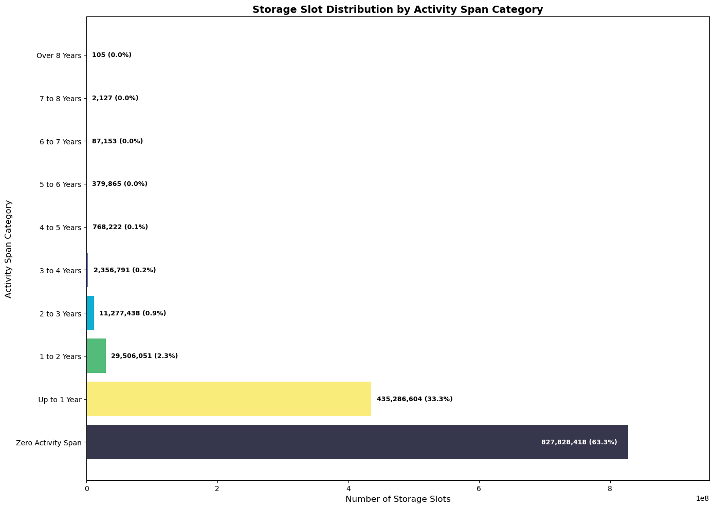

## Abstract

This EIP introduces *temporary storage*: a new contract-accessible key-value store that persists across transactions and blocks, but is automatically cleared at a protocol-defined schedule. Two new opcodes are added:

- `TMPSTORE(key, value)` to write temporary storage for the executing contract.
- `TMPLOAD(key)` to read temporary storage for the executing contract.

Temporary storage is intended for data that does not need indefinite retention, providing a safer alternative to using permanent state for ephemeral data and enabling bounded growth of this class of state.

## Motivation



*Figure 1: Over 60% of the storage slots are written once and never accessed again onchain.*

Permanent contract storage is costly because it increases long-term node resource requirements (disk, I/O, state maintenance). However, many applications write data that is only valuable for a bounded time window.

This EIP provides:

- **Bounded lifetime semantics** without requiring explicit deletes.
- **Predictable clearing** that can be relied upon at the application layer.
- **A building block** for reducing state growth created by ephemeral use cases.

## Specification

The key words "MUST", "MUST NOT", "REQUIRED", "SHALL", "SHALL NOT", "SHOULD", "SHOULD NOT", "RECOMMENDED", "NOT RECOMMENDED", "MAY", and "OPTIONAL" in this document are to be interpreted as described in [RFC 2119](https://www.rfc-editor.org/rfc/rfc2119) and [RFC 8174](https://www.rfc-editor.org/rfc/rfc8174).

### Constants and parameters

|Name|Value|Description|
|-|:-:|-|
| `FORK_BLOCK` | TBD | Activation block of this EIP |
| `TEMP_STORAGE_PERIOD` | TBD | The number of blocks that the temporary storage holds for a given period |
| `TEMP_STORAGE_SYSTEM_ADDRESS_0` | TBD | First reserved address used to store temporary storage |
| `TEMP_STORAGE_SYSTEM_ADDRESS_1` | TBD | Second reserved address used to store temporary storage |
| `TMPLOAD_GAS` | TBD | The gas cost of a warm read at temporary storage slot |
| `COLD_TMPLOAD_COST` | TBD | The gas cost surchage of a cold access at the temporary storage |
| `TMPSTORE_SET_GAS` | TBD | The gas cost of setting a slot from zero to non-zero at the temporary storage |
| `TMPSTORE_RESET_GAS` | TBD | The gas cost of changing a non-zero slot to another value at the temporary storage |

### Temporary storage data model

Temporary storage is backed by **two reserved system accounts** at `TEMP_STORAGE_SYSTEM_ADDRESS_0` and `TEMP_STORAGE_SYSTEM_ADDRESS_1`.

The temporary storage keyspace is a mapping of `(contract_address, key) -> value`, where:

```
derived_slot_key = keccak256(contract_address || key)
```

Temporary storage values are stored in the regular storage tries of the system accounts using `derived_slot_key` as the slot key.

### Periodic rollover (storage reset)

Temporary storage is organized into periods, each of length `TEMP_STORAGE_PERIOD` blocks after activation.

For blocks with `block.number >= FORK_BLOCK`, define:

```
period_index(block_number) = floor((block_number - FORK_BLOCK) / TEMP_STORAGE_PERIOD)
```

Define the current and previous system accounts for a block `B` (where `B.number >= FORK_BLOCK`) as:

```
current_index = period_index(B.number) % 2

if current_index == 0:
    CURRENT_SYSADDR = TEMP_STORAGE_SYSTEM_ADDRESS_0
    PREVIOUS_SYSADDR = TEMP_STORAGE_SYSTEM_ADDRESS_1
else if current_index == 1:
    CURRENT_SYSADDR = TEMP_STORAGE_SYSTEM_ADDRESS_1
    PREVIOUS_SYSADDR = TEMP_STORAGE_SYSTEM_ADDRESS_0
```

At the first block of each new period, the protocol MUST clear the storage of the system account that becomes the current.

When processing a block `B` (with parent `P`) where both are `>= FORK_BLOCK`, if `period_index(B.number) > period_index(P.number)`, then before executing transactions in `B`, the protocol MUST perform:

- `CURRENT_SYSADDR.storageRoot = EMPTY_TRIE_ROOT`

where `CURRENT_SYSADDR` is computed from `B.number` as specified above.

No other accounts are modified by the rollover.

**Effect:** After rollover, entries written in the immediately previous period remain readable via `PREVIOUS_SYSADDR` for one additional period, while entries older than one period are removed.

### New opcodes

Add 2 new opcodes as follows:

#### `TMPLOAD(key)`

Compute `derived_slot_key` from `(contract_address, key)`. Then load `derived_slot_key` from `CURRENT_SYSADDR` first. If it doesn't exist (i.e. `value == 0` ), then load `derived_slot_key` from `PREV_SYSADDR`.

#### `TMPSTORE(key,value)`  

Compute `derived_slot_key` from `(contract_address, key)`. Then:

- If `value != 0`, store in the storage of `CURRENT_SYSADDR`.
- If `value == 0`, delete slot from both `CURRENT_SYSADDR` and `PREV_SYSADDR`.

**Rationale:** Because reads fall back from current to previous, clearing only the current store would allow an older previous-period value to be returned. Clearing both ensures `TMPSTORE(key,0)` makes subsequent `TMPLOAD(key)` return `0` (until a new non-zero is written).

The call rules should follow `SSTORE` and `SLOAD`.

The gas rules should follow the conventions in [EIP-2929](./eip-2929.md) and [EIP-2200](./eip-2200.md) referencing `SSTORE` and `SLOAD`, except that:

- The gas costs should be much lower than `SSTORE` and `SLOAD`, but higher than `TSLOAD` and `TSTORE`
- No refunds are given for clearing temporary storage
- `TMPLOAD` MAY perform up to 2 storage reads (current then previous). Gas MUST account for this behaviour.
- Deletion in `TMPSTORE` is more expensive than creation/modification as the storage root of both system accounts are updated. Gas MUST account for this behaviour.

### Activation and reserved address

At `FORK_BLOCK`, the chain MUST treat `TEMP_STORAGE_SYSTEM_ADDRESS_0` and `TEMP_STORAGE_SYSTEM_ADDRESS_1` as reserved addresses:

- If either does not exist in the state trie, it is created with:
  - `nonce = 1`
  - `balance = 0`
  - `codeHash = EMPTY_CODE_HASH`
  - `storageRoot = EMPTY_TRIE_ROOT`

No contract code is deployed at this address.

## Rationale

### Why not just use transient storage (EIP-1153)?

[EIP-1153](./eip-1153.md) (transient storage) is discarded after every transaction, which is ideal for intra-tx operations. This EIP targets a different class of use cases where data must persist across multiple transactions/blocks, but does not need indefinite retention.

### Why two-period rollover?

Two-period rollover provides a stronger usability guarantee:

- An entry is retained for **at least** one full `TEMP_STORAGE_PERIOD` after it is written (it will be readable in the next period via the previous-period system account).
- An entry is retained for **at most** two periods (once the current-period system account is cleared and reused).

This provides a simple mental model for contract developers. That is, if an entry is stored in temporary storage, it will at least last for `TEMP_STORAGE_PERIOD`.

In contrast, a single global rollover makes effective lifetime depend on when data is written within the period: a write near the end of a period could be cleared almost immediately, which may not be developer-friendly.

### Why two system accounts?

Using two reserved system accounts allows constant-time rollover:

- At each period boundary, only the **current-period** system account is reset by setting a single `storageRoot = EMPTY_TRIE_ROOT`.
- The previous-period system account remains intact for one more period.
- Storage older than one period becomes unreachable and can be pruned.

## Backwards Compatibility

This EIP requires a hard fork to implement.

It does not change behavior of any existing opcodes. Therefore, it is backward compatible with all existing contract accounts.

## Security Considerations

- **DoS surface**: Temporary storage writes still create state that must be processed and stored for at least 1 period. Gas costs should be calibrated so that worst-case temp writes do not create new per-block disk I/O DoS attack vectors beyond existing storage writes.
- **Reorg safety**: Clients should retain sufficient history to handle plausible reorg depths.
- **Application safety**: Contracts MUST treat temp storage as ephemeral and handle the case where entries are unexpectedly missing.

## Copyright

Copyright and related rights waived via [CC0](../LICENSE.md).
