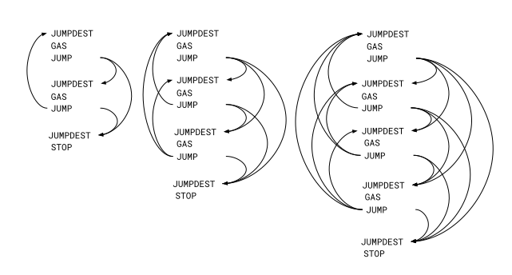

## Abstract

This Informational EIP provides foundational context for understanding control flow in the EVM. It covers the historical development of control flow mechanisms in computing, the technical foundations of control flow analysis, and the impact of static control flow on Ethereum's scaling roadmap.

This document serves as background material for proposals for static control flow, including [EIP-615](./eip-615.md): Subroutines and Static Jumps for the EVM, [EIP-4750](./eip-4750.md): EOF Functions, [EIP-7979](./eip-7979.md): Call and Return Opcodes, [EIP-8013](./eip-8013.md): Static Relative Jumps, discussions around RISC-V migration and ZK verification infrastructure, and discussions still to come.

## Motivation

### Historical Context

#### Babbage 1833: Jumps and Conditional Jumps

In 1833 Charles Babbage began the design of the Analytical Engine: a steam-powered, mechanical, Turing-complete computer. Programs were to be encoded on punched cards which controlled a system of rods, gears and other machinery to implement arithmetic, storage (for 1,000 40-digits decimal numbers) and conditional jumps.  Jumps were supported by cards that shuffled the card deck forwards or backwards a fixed number of cards.

#### Lovelace 1843: Computer Science and Machine Intelligence

The first published description of the Analytical Engine was in French, by L. F. Menabrea, 1842[^1]. The English translator, Ada Augusta, Countess of Lovelace, made extensive notes on the science of computer programming, and published her translation in 1843. The notes include her famous program for iteratively computing Bernoulli numbers — arguably the world's first complete computer program — which used conditional jumps to implement the required nested loops.

In Lady Lovelace's notes we also find her prescient recognition of the Analytic Engine's power — "In enabling mechanism to combine together general symbols in successions of unlimited variety and extent, a uniting link is established between the operations of matter and the abstract mental processes of the most abstract branch of mathematical science."[^1]  Here also we find what Alan Turing later called "Lady Lovelace's Objection"[^2] to the possibility of machine intelligence — "It can do whatever we know how to order it to perform. It can follow analysis; but it has no power of anticipating any analytical relations or truths. Its province is to assist us in making available what we are already acquainted with."[^1]  

#### Turing, 1946: Calls and Returns

In 1945 Alan Turing began designing his Automatic Computing Engine[^3] (ACE), completing the proposal in early 1946, where he introduced the concept of calls and returns: _"To start on a subsidiary operation we need only make a note of where we left off the major operation and then apply the first instruction of the subsidiary. When the subsidiary is over we look up the note and continue with the major operation."_

The ACE used mercury delay-line memory, including a return stack holding return addresses. The smaller Pilot ACE was for a time the world's fastest computer.

#### Industry Practice: 1945 to present

Call and return facilities of various names … subroutines, procedures, functions, methods … and levels of complexity … link registers, return stacks, stack frames … have proven their worth across a long line of important machines over the last 80 years, including most of the machines I have programmed or implemented:  Physical machines including the Burroughs 5000, CDC 7600, IBM 360, PDP-11, VAX, Motorola 68000 and Intel x86, and virtual machines including those for Scheme, Forth, Pascal, Java, and WebAssembly.

Especially relevant to the EVM's design are the Java, WebAssembly (Wasm), and CLI (.NET) VMs. They share crucial common properties:

* they are represented with portable bytecode
* that can be directly interpreted
* with static control flow
* that can be validated before runtime
* and can be compiled to machine code at runtime
* in _linear time_.

The static control flow that supports linear-time compilers also supports any other code that needs to traverse the control flow of a program, traversing each path only once.

### Control Flow

Among the most important reasons to traverse the control flow of a program is to extract the control flow graph.  The EVM makes this quadratically difficult due to its dynamic control flow.

#### Control Flow Graphs

A _control flow graph (CFG)_ is a directed graph representation of a program where:

* _Nodes_ represent blocks of instructions (sequences with no more than one entry and one exit)
* _Edges_ represent possible transfers of control between blocks

A _complete and sound CFG_ represents all and only the possible paths of program execution and is a fundamental starting point for many downstream tasks, including many static analyses:

* validating bytecode before execution
* translating bytecode to other representations (virtual register code, machine code)
* automated formal security analysis
* constructing ZK proof systems
* and many more

#### Dynamic Control Flow: The Problem

Dynamic jumps make dynamic control flow possible, make quadratically complex _CFGs_ possible, and can make static analysis of control difficult to impossible.  Dynamic jumps are not a problem for machines which run on physical hardware -- their instructions are designed for speed.  But they are uncommon in virtual machines whose code is the source for downstream tools.  This is because, as we will illustrate below, building and traversing a dynamic control flow graph can take quadratic space and time.  For this reason Java and Wasm do not support dynamic jumps and CLI carefully restricts them.

#### EVM: Dynamic Control Flow

For an example, consider these EVM programs and the easily generated series of longer programs like them ... the really long ones make for nice exploits.  It's not important that at runtime `gas` isn't random or that the `jump` will most often fail, what matters is that because the jump destination is taken from the stack it is impossible to know _a priori_ where the jumps go, so every path must be explored.

```

   jumpdest           jumpdest          jumpdest          ...
   gas                gas               gas               ...
   jump               jump              jump              ...
   jumpdest           jumpdest          jumpdest          ...
   gas                gas               gas               ...
   jump               jump              jump              ...
   jumpdest           jumpdest          jumpdest          ...
   stop               gas               gas               ...
                      jump              jump              ...
                      jumpdest          jumpdest          ...
                      stop              gas               ...
                                        jump              ...
                                        jumpdest          ...
                                        stop              ...
                                                          ...
                                                          ...
                                                          ...
```

The control flow graphs for these programs make the problem clear.  Each block of instructions in a graph is a sequence from the above programs with at most one entry (a `JUMPDEST`) and one exit (a `JUMP`), and each arc is a transfer of control.  Arcs on the left are backwards branches, arcs on the right are forwards branches.  See how the tangle of arcs goes up fast, faster than the programs get longer.



To be precise, the number of arcs in these graphs can be as large as the number of blocks times the number of blocks minus one — that is, O(N²) — since every block's dynamic jump might target any other block.  At each block's exiting instruction (except the `stop`) the analyzer cannot know _a priori_ where control will transfer, so every possible destination must be considered.  Building the complete CFG therefore requires O(N²) time and space, and this is not just a theoretical worst-case, as shown above.  Downstream analyses that must traverse all paths through the CFG — such as formal verification or ZK circuit construction — can be worse still, since the number of distinct paths through a fully-connected graph grows exponentially with the number of blocks.

In Java, Wasm, and CLI it is simply impossible to have programs like these.

#### EVM: Calls and Returns

The Ethereum Virtual Machine does _not_ provide explicit facilities for calls and returns. Instead, they _must_ be synthesized using the dynamic `JUMP` instruction, which takes its argument from the stack and stores intermediate links on the stack. So control flow _must be_ dynamic, which creates the quadratic CFG problems explained above.

For Ethereum, this quadratic behavior is a _denial-of-service vulnerability_ for any online static analysis, including validating bytecode and AOT compilation at contract creation time and JIT compilation at runtime.

Even offline, dynamic jumps (and the lack of calls and returns) can cause static analyses of many contracts to become quadratically impractical, exponentially intractable or even mathematically impossible. For a few examples, consider these abstracts from just a few recent papers on the problem.  The last paper resorts to neural nets to disassemble (most) Solidity programs.  There is an entire academic literature of complex, incomplete solutions to problems that static analysis renders trivial.

> "Ethereum smart contracts are distributed programs running on top of the Ethereum blockchain. Since program flaws can cause significant monetary losses and can hardly be fixed due to the immutable nature of the blockchain, there is a strong need of automated analysis tools which provide formal security guarantees. Designing such analyzers, however, proved to be challenging and error-prone."[^4]
>
> "The EVM language is a simple stack-based language ... with one significant difference between the EVM and other virtual machine languages (like Java bytecode or CLI for .Net programs): the use of the stack for saving the jump addresses instead of having it explicit in the code of the jumping instructions. Static analyzers need the complete control flow graph (CFG) of the EVM program in order to be able to represent all its execution paths."[^5]
>
> "Static analysis approaches mostly face the challenge of analyzing compiled Ethereum bytecode... However, due to the intrinsic complexity of Ethereum bytecode (especially in jump resolution), static analysis encounters significant obstacles."[^6]
>
> "Analyzing contract binaries is vital ... comprising function entry identification and detecting its boundaries... Unfortunately, it is challenging to identify functions ... due to the lack of internal function call statements."[^7]

In our experience, to avoid the problems of dynamic control flow VMs use static jumps, calls and returns.

### Static Control Flow and Ethereum Scaling

As laid out above, _Static control flow_ means that the destinations of every jump or call is determinable _a priori,_ before execution. This has concrete implications for Ethereum's scaling roadmap, particularly around ZK verification, rollups, and future execution layer changes.

#### Static Control Flow and Rollups [^8]

##### ZK-Rollups

To understand why static control flow matters for ZK-Rollups, we need to briefly understand how ZK systems verify computation:

* _Execution Traces:_ When a transaction executes, it produces an execution trace: a concrete, step-by-step record of every opcode executed, with the values of the stack, memory, and storage at each step. The trace records what actually happened — including exactly where every jump went — so it is always linear in the number of steps executed.
* _Circuits:_ A circuit is a mathematical model of a computation. For a ZK system, the circuit encodes the rules of the EVM: what states can follow from what prior states, how gas is consumed, which memory accesses are valid, etc. The circuit is a set of polynomial constraints that must all be satisfied. Crucially, the circuit encodes the _rules_ for each opcode type (including the rule for JUMP), not the specific paths taken by any particular execution.
* _Witnesses:_ The witness is the private data the prover supplies to demonstrate that a specific execution was correct. It includes the execution trace itself plus auxiliary data. The public inputs are the pre- and post-state roots — what the state was before and after the transaction.
* _Proofs:_ A ZK proof is a cryptographic proof that the witness satisfies the circuit's constraints, without revealing the witness itself.

A ZK-Rollup sequencer or prover batches many transactions, generates a ZK proof that all transactions executed correctly, and submits that proof to L1, where it is quickly verified. The prover works from the _actual_ execution trace — it does not explore or enumerate possible paths. The jump destinations are already known because they were recorded when the transaction ran.

The benefits of static control flow for ZK proving are therefore not about path exploration, but about the efficiency of the code being proven and the tractability of the analyses that surround it:

* _Leaner bytecode:_ Static jumps, explicit subroutine calls, and better stack discipline (eliminating SWAP/DUP workarounds) produce significantly smaller and simpler bytecode. Because the prover must process every opcode in the execution trace, fewer opcodes means less work. Succint's Benchmarks of EOF (which introduces static control flow) against legacy EVM code show roughly 3x better cycle efficiency, 2.69x faster proof generation, and 50% smaller STARK proofs for equivalent computations.
* _Deployment-time validation:_ With static control flow, bytecode can be fully validated once at deployment in linear time — including stack safety and reachability — rather than requiring expensive per-execution checks or quadratic offline analysis. This is where the O(N²) CFG problem described above directly impacts ZK infrastructure: building and analyzing the CFG of legacy EVM code before constructing a circuit or a formal model requires quadratic work; static control flow reduces this to linear.
* _Parallelization:_ Static control flow makes it possible to partition execution into independent segments whose boundaries are provably non-interfering. This enables parallel proof generation across transactions and within a single transaction, significantly reducing end-to-end proving latency.
* _Faster proof generation and lower hardware requirements_ follow directly from the above: fewer opcodes to prove, cheaper analysis, and better parallelism reduce the compute and memory demands on rollup provers.

##### Optimistic Rollups

_Optimistic Rollups_ assume transactions are valid but allow fraud proofs to dispute invalid state roots. A fraud proof re-executes the contested transaction and demonstrates that the submitted state root was wrong. Key implications of static control flow include:

* _Bytecode validation:_ Static control flow allows contract bytecode to be fully validated at deployment in linear time, establishing safety properties that can be relied on during dispute resolution.
* _Dispute resolution:_ When a fraud dispute arises, the dispute system must re-execute the contested transaction. The re-execution itself is deterministic regardless of control flow style, but static control flow makes the surrounding machinery — validators, formal checkers, and the interactive verification game — simpler to implement correctly and easier to reason about.
* _Interactive verification:_ Some optimistic rollup designs use multi-round interactive verification games that bisect execution to identify the disputed step. Clear, structured control flow makes the bisection protocol more tractable and reduces the risk of edge cases in the dispute game implementation.

#### Static Control Flow and Code Generation

As already discussed, static control flow enables contracts to be compiled to machine code before execution, just-in-time or ahead-of-time.  This is an obvious win for non-ZK Clients, whether on L1, L2, or EVM-compatible chains.

#### Static Control Flow and RISC-V Migration

There are ongoing discussions within the Ethereum research community about potentially replacing the EVM with a RISC-V execution environment. RISC-V has a standard instruction set architecture which is seeing increasing use in the ZK community.  One current strategy for creating a ZK-EVM is to compile an EVM interpreter like evmone or reth to RISC-V for use in a ZK-VM.  Supporting RISC-V directly eliminates the overhead of the EVM interpreter.  An EVM with static control flow opens up another strategy — compile the EVM code to RISC-V code.  That gives good RISC-V code in one linear-time pass, and better code in multiple passes, altogether linear time.

A missing piece in this puzzle is that RISC-V is a 32-bit or 64-bit architecture, but the current EVM is a 256-bit architecture.  For that purpose we have [EIP-7937](./eip-7937.md): EVM64 — 64-bit mode EVM opcodes.  It's also the case that the prover has the actual trace, and can tell how many bits are actually in use at each step of the computation, so the 256-bit registers might not be that big of a problem.

## Specification

Four EIPs currently specify new EVM opcodes and semantics for static control flow:  [EIP-615: Subroutines and Static Jumps for the EVM](./eip-615.md), [EIP-4750: EOF - Functions](./eip-4750.md), [EIP-7979: Call and Return Opcodes for the EVM](./eip-7979.md), and [EIP-8013: Static relative jumps and calls for the EVM](./eip-8013.md).  They are all implemented with the standard Turing return stack architecture, and are for the most part compatible with each other.  In particular, EIP-7979 can be used to implement every other EIP here.

## Rationale

Static control flow has been a cornerstone of efficient computation since Babbage and Turing. The EVM's reliance on dynamic jumps is an anomaly among virtual machines and a significant barrier to analysis, compilation, and scaling. Proposals to introduce explicit call/return opcodes and enforce static  control flow bring the EVM in line with industry best practices and unlock a range of optimizations critical to Ethereum's scaling roadmap.

Static control flow is not a silver bullet. But it is a _foundational piece_ that enables:

* Better tooling and security analysis for language developers and auditors
* Faster execution via compilation for non-ZK clients
* Future migrations to other execution environments (RISC-V, etc.)
* Efficient ZK proof generation for ZK-Rollups
* Cleaner fraud proofs for Optimistic Rollups

By making control flow explicit and enforceable, the EVM becomes compatible with the full ecosystem of optimization and analysis techniques that other VMs and processor designs have leveraged for decades.

## Security Considerations

This Informational proposal itself specifies no changes to the protocol.  Therefore it has no direct security implications.  It does not affect the security considerations of the EIPs it references, rather, it helps to motivate and specify them.

<!--

[^1]: Menabrea, L.F. Sketch of The Analytical Engine Invented by Charles Babbage. Bibliothèque Universelle de Genève, No. 82, October 1842. Translation with Notes by the Translator [Ada Augusta, Countess of Lovelace]. Scientific Memoirs, Vol. 3, 1843, pp. 666–731.
[^2]: Turing, A.M. Computing Machinery and Intelligence. Mind, Volume LIX, Issue 236, October 1950
[^3]: Carpenter, B.E. et al. The other Turing machine. The Computer Journal, Volume 20, Issue 3, January 1977. DOI: comjnl/20.3.269
[^4]: Schneidewind, Clara et al. The Good, the Bad and the Ugly: Pitfalls and Best Practices in Automated Sound Static Analysis of Ethereum Smart Contracts. DOI: 10.48550/arXiv.2101.05735
[^5]: Albert, Elvira et al. Analyzing Smart Contracts: From EVM to a Sound Control Flow Graph. DOI: 10.48550/arXiv.2004.14437
[^6]: Contro, Filippo et al. EtherSolve: Computing an Accurate Control Flow Graph from Ethereum Bytecode. DOI: 10.48550/arXiv.2103.09113
[^7]: He, Jiahao et al. Neural-FEBI: Accurate Function Identification in Ethereum Virtual Machine Bytecode. DOI: 10.48550/arXiv.2301.12695
[^8]: Jain, Akshita et al. Exploring The Efficacy Of Rollups: A Comparative Study Of Optimistic And ZK-Rollups And Their Popular Implementations. DOI: [to be verified]
[^9]: Guibas, John. Benefits of EOF (EVM Object Format) for Zero Knowledge Proofs. Succinct Blog, November 2024. https://blog.succinct.xyz/learn/eofbenefits/

-->

<!-- markdownlint-capture -->
<!-- markdownlint-disable code-block-style -->

[^1]:
    ```csl-json
    {
      "type": "article",
      "id": 1,
      "author": [
        {
          "family": "Menabre",
          "given": "L.F."
        }
      ],
      "DOI": "10.1145/2809523.2809528",
      "title": "Sketch of The Analytical Engine Invented by Charles Babbage.",
      "original-date": {
        "date-parts": [
          [1842, 10, 1]
        ]
      },
      "URL": "https://doi.org/10.1145/2809523.2809528"
    }
    ```

[^2]:
    ```csl-json
    {
      "type": "article",
      "id": 2,
      "author": [
        {
          "family": "Turing",
          "given": "A.M."
        }
      ],
      "DOI": "mind/LIX.236.433",
      "title": "Computing Machinery and Intelligence.", 
      "original-date": {
        "date-parts": [
          [1950, 10, 1]
        ]
      },
      "URL": "https://doi.org/10.1093/mind/LIX.236.433"
    }
    ```

[^3]:
    ```csl-json
    {
      "type": "article",
      "id": 3,
      "author": [
        {
          "family": "Carpenter",
          "given": "B.E"
        }
      ],
      "DOI": "comjnl/20.3.269",
      "title": "The other Turing machine.",
      "original-date": {
        "date-parts": [
          [1977, 1, 1]
        ]
      },
      "URL": "https://doi.org/10.1093/comjnl/20.3.269"
    }
    ```

[^4]:
    ```csl-json
    {
      "type": "article",
      "id": 4,
      "author": [
        {
          "family": "Schneidewind",
          "given": "Clara"
        }
       ],
       "DOI": "arXiv:2101.05735",
       "title": "The Good, the Bad and the Ugly: Pitfalls and Best Practices in Automated Sound Static Analysis of Ethereum Smart Contracts.",
       "original-date": {
         "date-parts": [
         [2021, 1, 14]
        ]
      },
      "URL": "https://arxiv.org/abs/2101.05735"
    }
    ```

[^5]:
    ```csl-json
    {
      "type": "article",
      "id": 5,
      "author": [
        {
          "family": "Albert",
          "given": "Elvira"
        }
      ],
      "DOI": "arXiv:2004.14437",
      "title": "Analyzing Smart Contracts: From EVM to a sound  Graph.",
      "original-date": {
        "date-parts": [
          [2020, 4, 29]
        ]
      },
      "URL": "https://arxiv.org/abs/2004.14437"
    }
    ```

[^6]:
    ```csl-json
    {
      "type": "article",
      "id": 6,
      "author": [
        {
          "family": "Contro",
          "given": "Filippo"
        }
      ],
      "DOI": "arXiv:2103.09113",
      "title": "EtherSolve: Computing an Accurate  Graph from Ethereum Bytecode.",
      "original-date": {
        "date-parts": [
          [2021, 3, 16]
        ]
      },
      "URL": "https://arxiv.org/abs/2103.09113"
    }
    ```

[^7]:
    ```csl-json
    {
      "type": "article",
      "id": 7,
      "author": [
        {
          "family": "He",
          "given": "Jiahao"
        }
      ],
      "DOI": "arXiv:2301.12695",
      "title": "Neural-FEBI: Accurate Function Identification in Ethereum Virtual Machine Bytecode.",
      "original-date": {
        "date-parts": [
          [2023, 1, 30]
        ]
      },
      "URL": "https://arxiv.org/abs/2301.12695"
    }
    ```

[^8]:
    ```csl-json
    {
      "type": "article",
      "id": 8,
      "author": [
        {
          "family": "Jain,  et al.  Doi: ",
          "given": "Akshita"
        }
      ],
      "DOI": "10.48550/Arxiv.2301.12695",
      "title": "Exploring The Efficacy Of Rollups’ A Comparative Study Of Optimistic And ZK-Rollups And Their Popular Implementations.",
      "original-date": {
        "date-parts": [
          [2024, 1, 1]
        ]
      },
      "URL": "https://arxiv.org/10.48550/Arxiv.2301.12695"
    }
    ```

<!-- markdownlint-restore -->

## Copyright

Copyright and related rights waived via [CC0](../LICENSE.md).
