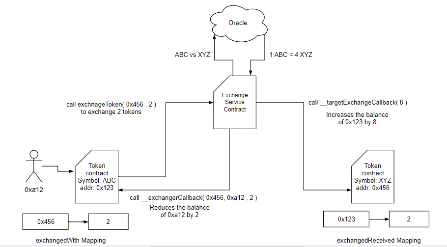
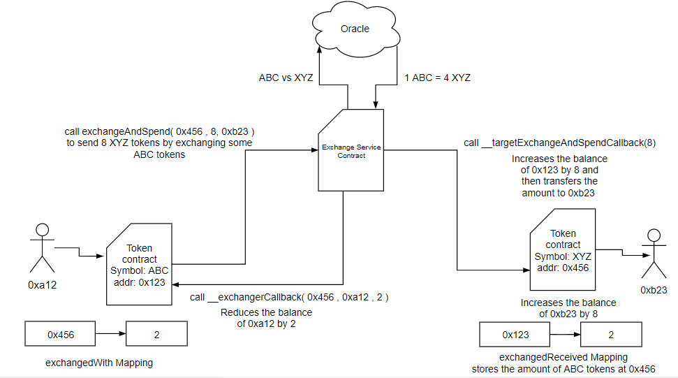

## Simple Summary
A standard for token contracts, providing token exchange services thereby facilitating cross token payments.

## Abstract
The following standard provides functionally to make payments in the form of any other registered tokens, as well as allow token contracts to store any other tokens in an existing token contract. This standard allows ERC20 token holders to exchange their token with another ERC20 token and use the exchanged tokens to make payments. After a successful payment, the former specified ERC20 tokens, will be stored within the ERC20 token contract they are exchanged with. This proposal uses the term target contract which is used to denote the contract to the token with whom we want to exchange our tokens.

## Motivation
Existing token standards do not provide functionality to exchange tokens. Existing token converters reduce the total supply of an existing token, which in the sense destroys the currency. Token converters do not solve this problem and hence discourages creation of new tokens. This solution does not destroy the existing token but in essence preserve them in the token contract that they are exchanged with, which in turn increases the market value of the latter.

## Specification
### Sender Interface
This interface must be inherited by a ERC20 token contract that wants to exchange its tokens with another token.

#### Storage Variables
##### exchnagedWith
This mapping stores the number of tokens exchanged with another token, along with the latter’s address. Every time more tokens are exchanged the integer value is incremented consequently. This mapping acts as a record to denote which target contract holds our tokens.

```solidity
mapping ( address => uint ) private exchangedWith;
```
##### exchangedBy
This mapping stores the address of the person who initiated the exchange and the amount of tokens exchanged.

```solidity
mapping ( address => uint ) private exhangedBy;
```

#### Methods

NOTE: Callers MUST handle false from returns (bool success). Callers MUST NOT assume that false is never returned!

##### exchangeToken
This function calls the intermediate exchange service contract that handles the exchanges. This function takes the address of the target contract and the amount we want to exchange as parameters and returns boolean `success` and `creditedAmount`.

```solidity
function exchangeToken(address _targetContract, uint _amount) public returns(bool success, uint creditedAmount)
```

##### exchangeAndSpend
This function calls an intermediate exchange service contract that handles exchange and expenditure. This function takes the address of the target contract, the amount we want to spend in terms of target contract tokens and address of the receiver as parameters and returns boolean `success`.

```solidity
function exchangeAndSpend(address _targetContract, uint _amount,address _to) public returns(bool success)
```

##### __exchangerCallback
This function is called by the exchange service contract to our token contract to deduct calculated amount from our balance. It takes the address of the targert contract , the address of the person who exchanged the tokens and amount to be deducted from exchangers account as parameters and returns boolean `success`.

NOTE: It is required that only the exchange service contract has the authority to call this function.

```solidity
function __exchangerCallback(address _targetContract,address _exchanger, uint _amount) public returns(bool success)
```

#### Events

##### Exchange
This event logs any new exchanges that have taken place.

```solidity
event Exchange(address _from, address _ targetContract, uint _amount)
```

##### ExchangeSpent
This event logs any new exchange that have taken place and have been spent immediately.

```solidity
event ExchangeSpent(address _from, address _targetContract, address _to, uint _amount)
```

### Receiver Interface
This interface must be inherited by a ERC20 token contract that wants to receive exchanged tokens.

#### Storage Variables
##### exchangesRecieved
This mapping stores the number of tokens received in terms of another token, along with its address. Every time more tokens are exchanged the integer value is incremented consequently. This mapping acts as a record to denote which tokens do this contract holds apart from its own.

```solidity
mapping ( address => uint ) private exchnagesReceived;
```
#### Methods

NOTE: Callers MUST handle false from returns (bool success). Callers MUST NOT assume that false is never returned!

##### __targetExchangeCallback
This function is called by the intermediate exchange service contract. This function should add `_amount` tokens of the target contract to the exchangers address for exchange to be completed successfully.

NOTE: It is required that only the exchange service contract has the authority to call this function.

```solidity
function __targetExchangeCallback (uint _to, uint _amount) public returns(bool success)
```

##### __targetExchangeAndSpendCallback
This function is called by the intermediate exchange service contract. This function should add `_amount` tokens of the target contract to the exchangers address and transfer it to the `_to` address for the exchange and expenditure to be completed successfully.

NOTE: It is required that only the exchange service contract has the authority to call this function.

```solidity
function __targetExchangeAndSpendCallback (address _from, address _to, uint _amount) public returns(bool success)
```

#### Events
##### Exchange
This event logs any new exchanges that have taken place.

```solidity
event Exchange(address _from, address _with, uint _amount)
```

##### ExchangeSpent
This event logs any new exchange that have taken place and have been spent immediately.
```solidity
event ExchangeSpent(address _from, address _ targetContract, address _to, uint _amount)
```

### Exchange Service Contract

This is an intermediate contract that provides a gateway for exchanges and expenditure. This contract uses oracles to get the authenticated exchange rates.

#### Storage Variables

##### registeredTokens

This array stores all the tokens that are registered for exchange. Only register tokens can participate in exchanges.

```solidity
address[] private registeredTokens;
```

#### Methods

##### registerToken

This function is called by the owner of the token contract to get it’s tokens registered. It takes the address of the token as the parameter and return boolean `success`.

NOTE: Before any exchange it must be ensured that the token is registered.

```solidity
function registerToken(address _token) public returns(bool success)
```

##### exchangeToken

This function is called by the token holder who wants to exchange his token with the `_targetContract` tokens. This function queries the exchange rate, calculates the converted amount, calls `__exchangerCallback` and calls the `__targetExchangeCallback`. It takes address of the target contract and amount to exchange as parameter and returns boolean `success` and amount credited.

```solidity
function exchangeToken(address _targetContract, uint _amount, address _from) public returns(bool success, uint creditedAmount)
```

##### exchangeAndSpend

This function is called by the token holder who wants to exchange his token with the `_targetContract` tokens. This function queries the exchange rate, calculates the converted amount, calls `__exchangerCallback` and calls the `__targetExchangeAndSpendCallback`. It takes address of the target contract and amount to exchange as parameter and returns boolean `success` and amount credited.

```solidity
function exchangeAndSpend(address _targetContract, uint _amount, address _from, address _to) public returns(bool success)
```

#### Events

##### Exchanges

This event logs any new exchanges that have taken place.

```solidity
event Exchange( address _from, address _by, uint _value ,address _target )
```
##### ExchangeAndSpent

This event logs any new exchange that have taken place and have been spent immediately.

```solidity
event ExchangeAndSpent ( address _from, address _by, uint _value ,address _target ,address _to)
```

### Diagramatic Explanation

#### Exchanging Tokens


NOTE: After the successful exchange the contract on right owns some tokens of the contract on the left.

#### Exchanging And Spending Tokens



NOTE: After the successful exchange the contract on right owns some tokens of the contract on the left.

## Rationale

Such a design provides a consistent exchange standard 
applicable to all ERC20 tokens that follow it.
The primary advantage for of this strategy is that the exchanged tokens will not be lost. They can either be spent or preserved.
Token convert face a major drawback of destroying tokens after conversion. This mechanism treats tokens like conventional currency where tokens are not destroyed but are stored.

## Backward Compatibility

This proposal is fully backward compatible. Tokens extended by this proposal should also be following ERC20 standard. The functionality of ERC20 standard should not be affected by this proposal but will provide additional functionality to it.

## Copyright

Copyright and related rights waived via [CC0](../LICENSE.md).

