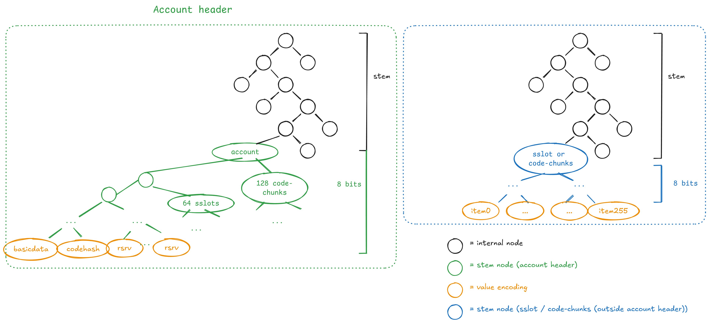

## Abstract

Introduce a new binary state tree to replace the hexary Patricia tries. Account
and storage tries are merged into a single tree with 32-byte keys that also holds
contract code. Account data is broken into independent leaves grouped by 256 to
provide locality.

The tree is partitioned into zones. The high 4 bits of every key are a zone
identifier that labels the category of state the key holds: account headers,
contract code, or storage. Storage takes the entire upper half of the zone space
(any key with the high bit set), so it is rooted at depth 1 and occupies about half
the tree. Account headers and code take fixed low zones, and the remaining low
zones are reserved for future categories.

Note: the hash function used in this draft is not final. The reference
implementation uses BLAKE3 to reduce friction for clients experimenting with this
EIP, but the choice remains open.

## Motivation

Ethereum's long-term goal is to let blocks be proved with validity proofs so chain
verification is as simple and fast as possible. Part of this work consists of proving the
state read during EVM execution.

The Merkle Patricia Trie (MPT) is unfriendly to validity proofs: it uses RLP for
node encoding, Keccak for hashing, is a "tree of trees", and does not allow for the efficient proving of segments of bytecode. It also produces large Merkle proofs. For a 2^32-size tree, the
expected size of a single branch is `15 * 32 * log_16(2^32) = 3840` bytes. In the
worst case, spending 30M gas to touch one byte of many different unchunked codes
needs `30M/2400*(5*480+24k) = 330MB`.

A binary tree shrinks regular Merkle proofs, because proof size scales with
`siblings * log_arity(N)` and arity 2 minimizes it. Switching from Keccak to a more
proving-friendly hash improves circuit performance.

Partitioning the tree into zones adds two properties on top of a flat unified
tree:

**Structural boundaries.** A node at a known depth is always the root of a known
category: all storage at depth 1, the account zone and code zone at depth 4, one
account's storage bucket at depth 61. Protocols can reference these subtree roots
as commitments without a side structure. This is what later proposals for state
expiry and partial statelessness build on.

**Code deduplication.** Code beyond the first chunks is content-addressed by code
hash rather than by account, so thousands of contracts deployed from the same
factory share their code leaves instead of each storing a copy.

## Specification

The key words "MUST", "MUST NOT", "REQUIRED", "SHALL", "SHALL NOT", "SHOULD", "SHOULD NOT", "RECOMMENDED", "NOT RECOMMENDED", "MAY", and "OPTIONAL" in this document are to be interpreted as described in RFC 2119 and RFC 8174.

### Notable changes from the hexary structure

- The account and storage tries are merged into a single trie.
- RLP is no longer used.
- The account's code is chunked and included in the tree.
- Account data (balance, nonce, first storage slots, first code chunks) is
  co-located to reduce branch openings.

### Notable changes from EIP-7864

[EIP-7864](./eip-7864.md) specifies a flat unified binary tree where every key is
`key_hash(address || tree_index)[:31] || sub_index`. This proposal keeps that
tree, its node types, and its merkelization, and changes how keys are assigned:

- A 4-bit zone prefix is added to every stem. In EIP-7864 all of an account's
  data (header, storage, code) is derived from its address and scattered through
  the tree by `tree_index`. Here each category lives in its own zone.
- Overflow code (chunks at index 128 and above) moves to zone `0x1` and is keyed
  by `code_hash` instead of by account, so contracts with identical bytecode share
  leaves. EIP-7864 keys all code per account, storing a copy for every contract.
- Overflow storage (slots 64 and above) moves to the storage zone, where a stem is
  the storage high bit, a 60-bit address prefix, and a 187-bit suffix. EIP-7864
  uses `key_hash(address || tree_index)[:31]` with no per-account bucket boundary.
- `MAIN_STORAGE_OFFSET` is removed. EIP-7864 offsets main storage by `256**31` to
  keep it clear of the header and code region. Here the storage zone bit separates
  storage structurally, so no numeric offset is needed.
- Non-storage stems are a 4-bit zone followed by a 244-bit hash. The hash is
  truncated to 244 bits rather than EIP-7864's 248, since the zone takes the high
  4 bits of the stem.

The account header layout (`BASIC_DATA` packing, `CODE_HASH`, the first 64 storage
slots, the first 128 code chunks), the code chunkification, and the four node types
are unchanged from EIP-7864.

### Tree structure

The tree stores key-value entries where both key and value are 32 bytes. The first
31 bytes of the key are the entry stem, and the last byte is the sub-index within
that stem. Two keys with the same stem live in the same group of 256 leaves.



There are four node types:

- `InternalNode` has `left_hash` and `right_hash`.
- `StemNode` has `stem`, `left_hash`, and `right_hash`.
- `LeafNode` has a `value` that is a 32-byte blob or empty.
- `EmptyNode` represents an empty node or subtree.

The path to a `StemNode` is the key's first 248 bits from MSB to LSB. From that
node a subtree of 256 values is indexed by the last byte. The path does not use the
full 248 bits: it contains the minimal number of `InternalNode`s needed to separate
stems that share a prefix. Walking the path to insert a new stem ends on an
`EmptyNode` (replace it with the stem) or a `StemNode` (create as many
`InternalNode`s as the two stems share prefix bits). There are no extension nodes.

This minimal-internal-node rule keeps the zone prefix cheap. Only a few low zones
are populated, so the zone bits between the root and a populated zone collapse to
the minimal set of internal nodes rather than a full four-level chain.

```python
class StemNode:
    def __init__(self, stem: bytes):
        assert len(stem) == 31, "stem must be 31 bytes"
        self.stem = stem
        self.values: list[Optional[bytes]] = [None] * 256

    def set_value(self, index: int, value: bytes):
        self.values[index] = value

class InternalNode:
    def __init__(self):
        self.left = None
        self.right = None

class BinaryTree:
    def __init__(self):
        self.root = None

    def insert(self, key: bytes, value: bytes):
        assert len(key) == 32, "key must be 32 bytes"
        assert len(value) == 32, "value must be 32 bytes"
        stem = key[:31]
        subindex = key[31]

        if self.root is None:
            self.root = StemNode(stem)
            self.root.set_value(subindex, value)
            return

        self.root = self._insert(self.root, stem, subindex, value, 0)

    def _insert(self, node, stem, subindex, value, depth):
        assert depth < 248, "depth must be less than 248"

        if node is None:
            node = StemNode(stem)
            node.set_value(subindex, value)
            return node

        stem_bits = self._bytes_to_bits(stem)
        if isinstance(node, StemNode):
            if node.stem == stem:
                node.set_value(subindex, value)
                return node
            existing_stem_bits = self._bytes_to_bits(node.stem)
            return self._split_leaf(
                node, stem_bits, existing_stem_bits, subindex, value, depth
            )

        bit = stem_bits[depth]
        if bit == 0:
            node.left = self._insert(node.left, stem, subindex, value, depth + 1)
        else:
            node.right = self._insert(node.right, stem, subindex, value, depth + 1)
        return node

    def _split_leaf(self, leaf, stem_bits, existing_stem_bits, subindex, value, depth):
        if stem_bits[depth] == existing_stem_bits[depth]:
            new_internal = InternalNode()
            bit = stem_bits[depth]
            if bit == 0:
                new_internal.left = self._split_leaf(
                    leaf, stem_bits, existing_stem_bits, subindex, value, depth + 1
                )
            else:
                new_internal.right = self._split_leaf(
                    leaf, stem_bits, existing_stem_bits, subindex, value, depth + 1
                )
            return new_internal
        else:
            new_internal = InternalNode()
            bit = stem_bits[depth]
            stem = self._bits_to_bytes(stem_bits)
            if bit == 0:
                new_internal.left = StemNode(stem)
                new_internal.left.set_value(subindex, value)
                new_internal.right = leaf
            else:
                new_internal.right = StemNode(stem)
                new_internal.right.set_value(subindex, value)
                new_internal.left = leaf
            return new_internal
```

### Node merkelization

Define `hash(value)` as:

- `hash([0x00] * 64) = [0x00] * 32`
- `hash(value) = H(value)`, where `H` is the selected hash function.

The `value` length is 32 or 64. Merkelize each node type as:

- `internal_node_hash = hash(left_hash || right_hash)`
- `stem_node_hash = hash(stem || 0x00 || hash(left_hash || right_hash))`
- `leaf_node_hash = hash(value)`
- `empty_node_hash = [0x00] * 32`

```python
def _hash(self, data):
    if data in (None, b"\x00" * 64):
        return b"\x00" * 32
    assert len(data) == 64 or len(data) == 32, "data must be 32 or 64 bytes"
    return blake3(data).digest()  # replaced with the final hash function

def merkelize(self):
    def _merkelize(node):
        if node is None:
            return b"\x00" * 32
        if isinstance(node, InternalNode):
            left_hash = _merkelize(node.left)
            right_hash = _merkelize(node.right)
            return self._hash(left_hash + right_hash)

        level = [self._hash(x) for x in node.values]
        while len(level) > 1:
            new_level = []
            for i in range(0, len(level), 2):
                new_level.append(self._hash(level[i] + level[i + 1]))
            level = new_level
        return self._hash(node.stem + b"\0" + level[0])

    return _merkelize(self.root)
```

### Zones

The high 4 bits of every stem are the zone identifier `Z`. The most significant
bit separates storage from everything else.

| Zone `Z` | Category |
|---|---|
| `0x0` | Account headers |
| `0x1` | Code chunks (content-addressed overflow) |
| `0x2`–`0x7` | Reserved for future categories (e.g. nullifiers) |
| `0x8`–`0xF` | Storage |

New categories MUST be allocated from `0x2`–`0x7`. The storage range MUST NOT be subdivided for other categories, since that would remove address entropy from
storage keys.

The zones place deterministic boundaries at fixed depths:

| Depth | Boundary                                                      |
| ----- | ------------------------------------------------------------- |
| d=1   | Storage (right) vs. non-storage (left)                        |
| d=4   | Account zone vs. code zone vs. other low zones                |
| d=61  | Storage per-account bucket (high bit + 60-bit address prefix) |
| d=248 | Stem level in every zone                                      |
| d=256 | Leaf level                                                    |

### Tree embedding

All state is embedded into the single key/value space. Data accessed together is
co-located in one stem to reduce branch openings. The account header stem holds an
account's basic data, code hash, first 64 storage slots, and first 128 code chunks.
Storage slots and code chunks beyond those live in their own zones, grouped 256 to
a stem.

| Parameter             | Value |
| --------------------- | ----- |
| BASIC_DATA_LEAF_KEY   | 0     |
| CODE_HASH_LEAF_KEY    | 1     |
| HEADER_STORAGE_OFFSET | 64    |
| CODE_OFFSET           | 128   |
| STEM_SUBTREE_WIDTH    | 256   |
| ZONE_BITS             | 4     |
| ACCOUNT_ZONE          | 0     |
| CODE_ZONE             | 1     |

It is a required invariant that `STEM_SUBTREE_WIDTH > CODE_OFFSET >
HEADER_STORAGE_OFFSET` and that `HEADER_STORAGE_OFFSET` is greater than the leaf keys.

Addresses are passed as `Address32`. Convert a legacy address by prepending 12 zero
bytes:

```python
def address20_to_address32(address: Address) -> Address32:
    return b'\x00' * 12 + address
```

Stems in a non-storage zone are a 4-bit zone prefix followed by 244 bits of hash:

```python
def key_hash(inp: bytes) -> bytes32:
    return blake3.blake3(inp).digest()

def zone_stem(zone: int, digest: bytes) -> bytes:
    # 4-bit zone || 244-bit hash = 248-bit (31-byte) stem
    zone_bits = [(zone >> (ZONE_BITS - 1 - i)) & 1 for i in range(ZONE_BITS)]
    return _bits_to_bytes(zone_bits + _bytes_to_bits(digest)[:248 - ZONE_BITS])
```

### Header values

The account header stem is in `ACCOUNT_ZONE` and is keyed by the address alone, so
each account has exactly one header stem.

```python
def get_tree_key_for_header(address: Address32, sub_index: int) -> bytes:
    stem = zone_stem(ACCOUNT_ZONE, key_hash(address))
    return stem + bytes([sub_index])

def get_tree_key_for_basic_data(address: Address32):
    return get_tree_key_for_header(address, BASIC_DATA_LEAF_KEY)

def get_tree_key_for_code_hash(address: Address32):
    return get_tree_key_for_header(address, CODE_HASH_LEAF_KEY)
```

`version`, `balance`, `nonce`, and `code_size` are packed big-endian in the value
at `BASIC_DATA_LEAF_KEY`:

| Name        | Offset | Size |
| ----------- | ------ | ---- |
| `version`   | 0      | 1    |
| `code_size` | 4      | 4    |
| `nonce`     | 8      | 8    |
| `balance`   | 16     | 16   |

Bytes 1 through 3 are reserved. The 4-byte `code_size` holds values up to `2^32 - 1`
bytes, far beyond any foreseeable contract size limit. Packing these fields into one
leaf needs one branch opening instead of three or four, which lowers gas and
simplifies witness generation. Setting any header field also sets `version` to zero.
`code_hash` and `code_size` are set on contract or EOA creation.

### Code

Code chunks 0 through 127 live in the account header stem at sub-indices
`CODE_OFFSET`..`255`. Chunks at index 128 and above live in `CODE_ZONE`,
content-addressed by `code_hash` so contracts with identical bytecode share leaves.

```python
def get_tree_key_for_code_chunk(address: Address32, code_hash: bytes32, chunk_id: int):
    if chunk_id < STEM_SUBTREE_WIDTH - CODE_OFFSET:        # chunk_id < 128
        return get_tree_key_for_header(address, CODE_OFFSET + chunk_id)
    overflow = chunk_id - (STEM_SUBTREE_WIDTH - CODE_OFFSET)
    tree_index = overflow // STEM_SUBTREE_WIDTH
    sub_index  = overflow %  STEM_SUBTREE_WIDTH
    stem = zone_stem(CODE_ZONE, key_hash(code_hash + tree_index.to_bytes(32, "big")))
    return stem + bytes([sub_index])
```

Chunk `i` stores a 32-byte value where bytes 1..31 are the i'th 31-byte slice of the
code and byte 0 is the number of leading bytes that are PUSHDATA. For example, if
code is `...PUSH4 99 98 | 97 96 PUSH1 128 MSTORE...` where `|` begins a new chunk, the latter chunk begins `2 97 96 PUSH1 128 MSTORE`, recording that its first 2 bytes are PUSHDATA.

```python
PUSH_OFFSET = 95
PUSH1 = PUSH_OFFSET + 1
PUSH32 = PUSH_OFFSET + 32

def chunkify_code(code: bytes) -> Sequence[bytes32]:
    if len(code) % 31 != 0:
        code += b'\x00' * (31 - (len(code) % 31))
    bytes_to_exec_data = [0] * (len(code) + 32)
    pos = 0
    while pos < len(code):
        if PUSH1 <= code[pos] <= PUSH32:
            pushdata_bytes = code[pos] - PUSH_OFFSET
        else:
            pushdata_bytes = 0
        pos += 1
        for x in range(pushdata_bytes):
            bytes_to_exec_data[pos + x] = pushdata_bytes - x
        pos += pushdata_bytes
    return [
        bytes([min(bytes_to_exec_data[pos], 31)]) + code[pos: pos+31]
        for pos in range(0, len(code), 31)
    ]
```

### Storage

Storage slots 0 through 63 live in the account header stem at sub-indices
`HEADER_STORAGE_OFFSET`..`127`. Slots 64 and above live in the storage zone.

A storage stem is 248 bits: the high bit is `1` (the storage zone), the next 60
bits are an address prefix, and the last 187 bits are a suffix bound to both the
address and the `tree_index`. The address prefix groups one account's storage under
a common bucket at depth 61. The suffix hashes the address with `tree_index`, so two
accounts that share a prefix still produce independent stems.

```python
STORAGE_ADDR_PREFIX_BITS = 60
STORAGE_SUFFIX_BITS      = 187

def storage_stem(address: Address32, tree_index: int) -> bytes:
    prefix = key_hash(address)
    suffix = key_hash(address + tree_index.to_bytes(32, "big"))
    bits = [1]                                              # storage zone high bit
    bits += _bytes_to_bits(prefix)[:STORAGE_ADDR_PREFIX_BITS]
    bits += _bytes_to_bits(suffix)[:STORAGE_SUFFIX_BITS]    # 1 + 60 + 187 = 248
    return _bits_to_bytes(bits)

def get_tree_key_for_storage_slot(address: Address32, storage_key: int):
    if storage_key < CODE_OFFSET - HEADER_STORAGE_OFFSET:   # storage_key < 64
        return get_tree_key_for_header(address, HEADER_STORAGE_OFFSET + storage_key)
    tree_index = storage_key // STEM_SUBTREE_WIDTH
    sub_index  = storage_key %  STEM_SUBTREE_WIDTH
    return storage_stem(address, tree_index) + bytes([sub_index])
```

Slots within one `STEM_SUBTREE_WIDTH` range share a stem, except for slots 0..63,
which are in the header. Adjacent slots, common in mappings and arrays, group
together.

### Fork

Described in [EIP-7612](./eip-7612.md).

### Access events

Partitioned Binary Tree (PBT) adopts [EIP-4762](./eip-4762.md)'s access-event framework with two required modifications:

1. Content-addressed code. [EIP-4762](./eip-4762.md) keys code-chunk access events per account at `(CODE_OFFSET + i) // STEM_SUBTREE_WIDTH`. PBT moves chunks ≥ 128 to a leaf shared by all contracts with the same `code_hash`. Access events for overflow code MUST be keyed by the `(zone, stem, sub-index)` tree-key, not by `(address, chunk)`, so that a shared chunk is charged once per block regardless of which contract triggers the access and so the witness contains one copy. Header chunks (0–127) remain per-account.

2. Branch-cost calibration. `WITNESS_BRANCH_COST (1900)` is calibrated in [EIP-4762](./eip-4762.md) to ≈13.2 gas/byte assuming a ~144-byte average branch for the EIP-7864 depth profile. PBT's branches are deeper, so we need to adjust the values.

## Rationale

This EIP defines a binary tree that starts empty. Only new state changes are stored
in it. The MPT continues to exist but is frozen, setting up a later hard fork that
migrates MPT data into the binary tree ([EIP-7748](./eip-7748.md)).

### Single tree with zones

A single key/value tree is simpler to work with than a tree of tries: database
access, caching, syncing, and proof code all operate on one abstraction, and
witness gas rules are clearer. State spreads uniformly, so one contract's millions
of slots are not concentrated in one place, which helps state sync and blunts
unbalanced-tree-filling attacks.

Zones add structure without giving up that uniformity. Each zone is a self-contained
subtree at a known depth, so a node can sync, prove, or expire one category without
touching the rest. Because no leaf stores a `storage_root`, an account's nonce in
the account zone and one of its slots in the storage zone are independent writes.
The root recomputes in one bottom-up pass and the two branches meet near the root.
This admits parallelism across zones, across accounts within a zone, and across
stems within an account.

### Storage layout

Storage takes the upper half of the tree because it is the largest category and the
most frequently proven, so it should branch earliest and shallowest. The 60-bit
address prefix gives each account its own storage bucket at depth 61, which is the
unit later expiry and partial-statefulness schemes can prune or sync. The 187-bit
suffix is bound to the address and `tree_index` so a prefix collision cannot
correlate two accounts' storage layouts.

### Content-addressed code

Keying overflow code by `code_hash` rather than by account lets all contracts with
identical bytecode share leaves. Most deployed contracts repeat a small number of
templates, so this removes a large amount of duplicate code from the state. The
first 128 chunks stay in the account header, keyed per account, so they expire with
the account and need no reference counting. Only chunks beyond ~4 KB are shared.

### SNARK friendliness and post-quantum security

The design avoids complex branching: no extension nodes mid-branch, no RLP. This
keeps circuit implementations simple and lowers proving overhead. The dominant
factor is the merkelization hash, which should be efficient in and out of circuit.
The choice is open, with candidates:

1. **BLAKE3**: good native performance, reasonable in-circuit, well-studied,
   currently used in the reference implementation.
2. **Keccak**: already in Ethereum, well-studied, less efficient to prove.
3. **Poseidon2**: strong in-circuit performance, security analysis ongoing through
   the EF cryptography initiative, needs extra specification for field encoding.

Because the tree depends only on a hash function and not on elliptic curves, it
stays secure under the post-quantum assumptions that NIST's 2030 guidance and
Verkle's curve-based stack do not. Progress in proving systems suggests pre-state
and post-state proofs can be generated fast enough, which was Verkle's main
advantage.

### Arity-2

Binary tries minimize witness size. In an `N`-element tree with `k` children per
node, the average branch is roughly `32 * (k-1) * log(N) / log(k)` bytes, minimized
at `k = 2`. For `N = 2**24`:

| `k` | Branch length (chunks) | Branch length (bytes) |
| --- | ---------------------- | --------------------- |
| 2   | 24                     | 768                   |
| 4   | 36                     | 1152                  |
| 8   | 56                     | 1792                  |
| 16  | 90                     | 2880                  |

### Tree depth

The tree design attempts to be as simple as possible considering both out-of-circuit and circuit implementations, while satisfying our throughput constraints on proving hashes.

The proposed design avoids a full 248-bit depth as it would happen in a Sparse Merkle Tree (SMT). This approach helps reduce the hashing load in proving systems, which is currently a throughput bottleneck on commodity hardware.

Moreover, we could push this further trying to introduce extension nodes in the middle of paths as done in an MPT, but this also adds complexity that might not be worth it considering the tree should be quite balanced.

### State expiry

Per-account and per-bucket expiry is a natural operation on the zone topology. The
storage bucket at depth 61 roots one account's storage in the common case. Record
its hash and prune below it. The account header stem expires the account's core
data, hot storage, and initial code in one step. Content-addressed code needs
reference counting or deferral to a state sweep, since its leaves may be shared.
Resurrection re-attaches a subtree consistent with the recorded commitment. The
mechanism itself is left to a separate EIP.

## Backwards Compatibility

The main breaking changes are:

1. Gas costs for code chunk access can affect application economics. This can be
   mitigated by raising the gas limit alongside this EIP.
2. The tree structure change makes in-EVM proofs of historical state stop working.

The change is invisible to the EVM. Contracts address storage by 256-bit slot
numbers through `SLOAD` and `SSTORE` and never see tree keys. Key derivation runs
inside the client, below the EVM, exactly as the MPT already hashes slot keys and
addresses. No contract, Solidity, or Yul code changes.

## Test Cases

The hash function is not fixed, so digests cannot be pinned. The deterministic parts
of the derivation are given as vectors. `H(...)[:n]` is the high `n` bits.

Account header, `BASIC_DATA` of address `A`:

```
stem    = 0x0 || H(A)[:244]      (4-bit zone || 244-bit hash)
sub_idx = 0x00
widths  = 4 + 244 + 8 = 256
```

Storage slot `storage_key = 5` of address `A` (in the header, since 5 < 64):

```
sub_idx = HEADER_STORAGE_OFFSET + 5 = 69 (0x45)
key     = 0x0 || H(A)[:244] || 0x45
```

Storage slot `storage_key = 1000` (in the storage zone, since 1000 >= 64):

```
tree_index = 1000 // 256 = 3
sub_idx    = 1000 %  256 = 232 (0xE8)
stem       = 1 || H(A)[:60] || H(A || 3)[:187]      (high bit = 1)
widths     = 1 + 60 + 187 + 8 = 256
```

Code chunk `chunk_id = 5` (in the header, since 5 < 128):

```
sub_idx = CODE_OFFSET + 5 = 133 (0x85)
key     = 0x0 || H(A)[:244] || 0x85
```

Code chunk `chunk_id = 300` of bytecode with hash `C` (overflow, since 300 >= 128):

```
overflow   = 300 - 128 = 172
tree_index = 172 // 256 = 0
sub_idx    = 172 %  256 = 172 (0xAC)
stem       = 0x1 || H(C || 0)[:244]
widths     = 4 + 244 + 8 = 256
```

## Security Considerations

A collision means two distinct items derive the same stem.

| Field | Bits | Birthday bound | Assessment |
|---|---|---|---|
| Account stem (`0x0`) | 244 | 2^122 | Far beyond reach |
| Code stem (`0x1`) | 244 | 2^122 | Far beyond reach |
| Storage address prefix | 60 | ~43 colliding pairs at 10^10 accounts | Benign, see below |
| Storage stem suffix | 187 | 2^93.5 | Future-proof |

**Storage prefix collisions are not consensus-fatal.** At 10 billion accounts, about
43 address pairs share a 60-bit prefix and so share a bucket. Their leaves interleave
below depth 61 but stay distinct, because the suffix hashes the address with
`tree_index`. An attacker who finds a prefix collision cannot overwrite
the other account's storage. The only effect is reduced parallelism at that bucket.

**Content-addressed code.** Two contracts with identical bytecode share code-zone
leaves by design, which is deduplication, not a collision. Two distinct bytecodes
mapping to the same stem would need a 244-bit collision on `H(code_hash ||
tree_index)`, which is infeasible.

**Sub-index.** The sub-index is `storage_key % 256` or the analogous code arithmetic,
a direct mapping rather than a hash. Two distinct keys share a sub-index only if they
also share a `tree_index`, in which case they are the same item, so no collision is
possible between distinct items.

The hash function selection is the dominant security parameter and remains open. The
collision bounds above assume a hash with uniform 256-bit output truncated to the
stated widths.

## Copyright

Copyright and related rights waived via [CC0](../LICENSE.md).
