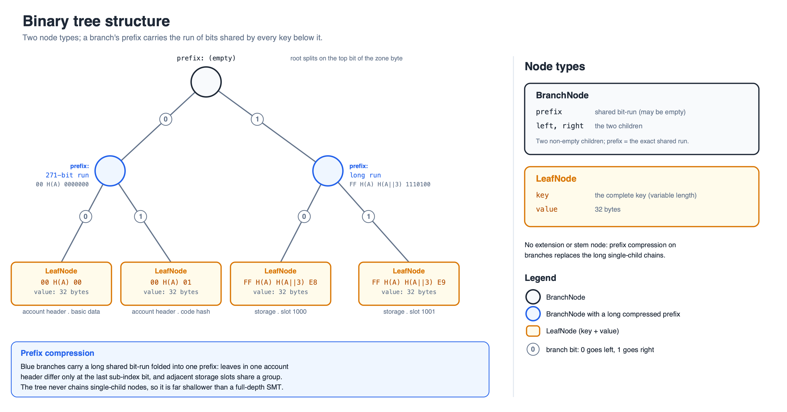

## Abstract

Introduce a new binary state tree to replace the hexary Patricia tries. Account
and storage tries are merged into a single tree with variable-length,
prefix-free keys that also holds contract code. Account data is broken into
independent leaves grouped under a shared key prefix to provide locality.

The tree is partitioned into zones. The first byte of every key is a zone
identifier that labels the category of state the key holds: account headers,
contract code, or storage. Account headers and code take fixed low zones,
storage takes a fixed high zone, and the remaining zones are reserved for
future categories.

Note: the hash function used in this draft is not final. The reference
implementation uses BLAKE3 to reduce friction for clients experimenting with this
EIP, but the choice remains open.

## Motivation

Ethereum's long-term goal is to let blocks be proved with validity proofs so chain
verification is as simple and fast as possible. Part of this work consists of proving the
state read during EVM execution.

The Merkle Patricia Trie (MPT) is unfriendly to validity proofs: it uses RLP for
node encoding, Keccak for hashing, is a "tree of trees", and does not allow for the efficient proving of segments of bytecode. It also produces large Merkle proofs. As an example, the account trie today reaches a maximum depth of about 12, so a
branch at that depth is `15 * 32 * 12 = 5760` bytes: 15 sibling hashes of
32 bytes at each of the 12 levels. From a worst-case block perspective, spending all
60M gas to touch a single byte of many distinct account codes, none of which is
chunked, needs `60M/2400 * (12*480 + 64k) ≈ 1.8GB`. Here `2400` is the cheapest gas
to touch a fresh account, the [EIP-2930](./eip-2930.md) access-list address cost
(a cold access under [EIP-2929](./eip-2929.md) costs `2600`); `12*480` is the
branch to that account; and `64k` is the [EIP-7954](./eip-7954.md) 64 KiB code size
limit that must be revealed in full to prove any single byte of unchunked code.

A binary tree shrinks regular Merkle proofs, because proof size scales with
`siblings * log_arity(N)` and arity 2 minimizes it. Switching from Keccak to a more
proving-friendly hash improves circuit performance.

Partitioning the tree into zones adds two properties on top of a flat unified
tree:

**Structural boundaries.** A key prefix of a known length is always the root of
a known category: the zone byte identifies account headers, code, or storage;
within storage, `key_hash(address)` identifies one account's bucket. Protocols
can reference these key-space regions as commitments without a side structure.
Because the tree compresses shared prefixes (see "Tree structure"), a boundary
does not always correspond to a distinct node at a fixed depth, but the region
of keys it owns is exact. This is what later proposals for state expiry and
partial statelessness build on.

**Code deduplication.** Code beyond the first chunks is content-addressed by code
hash rather than by account, so thousands of contracts deployed from the same
factory share their code leaves instead of each storing a copy.

## Specification

The key words "MUST", "MUST NOT", "REQUIRED", "SHALL", "SHALL NOT", "SHOULD", "SHOULD NOT", "RECOMMENDED", "NOT RECOMMENDED", "MAY", and "OPTIONAL" in this document are to be interpreted as described in [RFC 2119](https://www.rfc-editor.org/rfc/rfc2119) and [RFC 8174](https://www.rfc-editor.org/rfc/rfc8174).

### Notable changes from the hexary structure

- The account and storage tries are merged into a single tree.
- RLP is no longer used.
- The account's code is chunked and included in the tree.
- Account data (balance, nonce, first storage slots, first code chunks) is
  co-located to reduce branch openings.

### Tree structure

The tree stores key-value entries where the key is a non-empty,
variable-length byte string of at most `MAX_KEY_LENGTH` bytes (see
"Maximum key length") and the value is 32 bytes. Keys MUST be prefix-free:
no key in the tree may be a prefix of another key in the tree. `insert`
rejects keys that violate either constraint.



There are two node types:

- `LeafNode` has `key` (the complete key) and `value` (32 bytes).
- `BranchNode` has `prefix` (a bit string, possibly empty), `left`, and
  `right`.

There is no separate extension node. A `BranchNode`'s `prefix` carries the
run of bits shared by every key below it that are not already consumed by
an ancestor.

A `BranchNode` MUST have two non-empty children: a prefix shorter than the
true shared run would leave the keys still agreeing at the next bit,
emptying one side, which is not a valid `BranchNode`. This forces every
prefix to be exactly the shared run, so each key/value set has exactly one
valid tree.

A `LeafNode` commits its complete key rather than a suffix relative to its
position in the tree, so its meaning never depends on where it sits;
splitting or merging branches elsewhere never changes an unrelated leaf's
hash.

```python
def _bytes_to_bits(data: bytes) -> list[int]:
    return [(byte >> (7 - i)) & 1 for byte in data for i in range(8)]

class LeafNode:
    def __init__(self, key: bytes, value: bytes):
        self.key = key
        self.value = value

class BranchNode:
    def __init__(self, prefix: list[int]):
        self.prefix = prefix
        self.left = None
        self.right = None

class BinaryTree:
    def __init__(self):
        self.root = None

    def insert(self, key: bytes, value: bytes):
        assert 1 <= len(key) <= MAX_KEY_LENGTH, "key length out of range"
        assert len(value) == 32, "value must be 32 bytes"
        if self.root is None:
            self.root = LeafNode(key, value)
            return
        self.root = self._insert(self.root, _bytes_to_bits(key), key, value, 0)

    def _insert(self, node, bits, key, value, depth):
        if isinstance(node, LeafNode):
            if node.key == key:
                node.value = value
                return node
            other_bits = _bytes_to_bits(node.key)
            limit = min(len(bits), len(other_bits))
            run = 0
            while depth + run < limit and bits[depth + run] == other_bits[depth + run]:
                run += 1
            assert depth + run < limit, "insert violates prefix-freedom"
            prefix = bits[depth:depth + run]
            new_leaf = LeafNode(key, value)
            branch = BranchNode(prefix)
            if bits[depth + run] == 0:
                branch.left, branch.right = new_leaf, node
            else:
                branch.left, branch.right = node, new_leaf
            return branch

        matched = 0
        while (matched < len(node.prefix) and depth + matched < len(bits)
               and bits[depth + matched] == node.prefix[matched]):
            matched += 1
        assert depth + matched < len(bits), "insert violates prefix-freedom"
        if matched == len(node.prefix):
            split = depth + matched
            if bits[split] == 0:
                node.left = self._insert(node.left, bits, key, value, split + 1)
            else:
                node.right = self._insert(node.right, bits, key, value, split + 1)
            return node

        # The key diverges inside the prefix: split the branch at the
        # divergence point. The surviving branch keeps the bits after it;
        # a new branch takes the bits before it.
        survivor = BranchNode(node.prefix[matched + 1:])
        survivor.left, survivor.right = node.left, node.right
        new_leaf = LeafNode(key, value)
        new_branch = BranchNode(node.prefix[:matched])
        if bits[depth + matched] == 0:
            new_branch.left, new_branch.right = new_leaf, survivor
        else:
            new_branch.left, new_branch.right = survivor, new_leaf
        return new_branch
```

### Node merkelization

Define tags `LEAF_TAG = 0x00` and `BRANCH_TAG = 0x01`. `H` is the tree's
32-byte hash function, the same function as `key_hash` (see the note in
the Abstract).

`encode_bit_prefix` packs a bit string for hashing as a two-byte big-endian
bit count followed by the bits themselves, most significant bit first,
zero-padded to a byte boundary:

```python
def encode_bit_prefix(prefix: list[int]) -> bytes:
    assert len(prefix) < 2**16, "prefix exceeds encodable bit count"
    packed = bytearray((len(prefix) + 7) // 8)
    for i, bit in enumerate(prefix):
        packed[i // 8] |= bit << (7 - i % 8)
    return len(prefix).to_bytes(2, "big") + bytes(packed)
```

Merkelize each node type as:

- `leaf_hash = H(LEAF_TAG || key || value)`
- `branch_hash = H(BRANCH_TAG || encode_bit_prefix(prefix) || left_hash || right_hash)`
- The hash of an empty tree is `[0x00] * 32`

```python
def merkelize(node) -> bytes:
    if node is None:
        return b"\x00" * 32
    if isinstance(node, LeafNode):
        return H(bytes([LEAF_TAG]) + node.key + node.value)
    return H(
        bytes([BRANCH_TAG])
        + encode_bit_prefix(node.prefix)
        + merkelize(node.left)
        + merkelize(node.right)
    )
```

### Maximum key length

`MAX_KEY_LENGTH = 8192` bytes. The bound comes from the branch prefix encoding:

- `encode_bit_prefix` stores a branch's bit count in two bytes, so the
  largest representable prefix is `2**16 - 1 = 65535` bits.
- A branch's prefix is the run of bits its keys agree on, ending just
  before the first bit where they diverge.
- Two distinct keys of `L` bytes (`8*L` bits) must differ in at least one
  bit, so the longest run they can share is `8*L - 1` bits: agreement on
  everything except the final bit.
- To encode this, we require `8*L - 1 <= 65535`, giving `L <= 8192`.

`insert` MUST reject keys longer than `MAX_KEY_LENGTH`. Enforcing this
unconditionally at insertion, rather than only inside `encode_bit_prefix`,
keeps the bound a stated property of every key instead of a failure that
depends on which other keys happen to be present: a key longer than
`MAX_KEY_LENGTH` is not itself invalid until a second key shares enough of
its prefix to overflow the count field.

### Zones

The first byte of every key is the zone identifier `Z`.

| Zone `Z`      | Category                                    |
| ------------- | -------------------------------------------- |
| `0x00`        | Account headers                             |
| `0x01`        | Code chunks (content-addressed overflow)    |
| `0x02`-`0xFE` | Reserved for future categories              |
| `0xFF`        | Storage                                     |

New categories MUST be allocated from `0x02`-`0xFE` and MUST keep their
keys mutually prefix-free (see "Tree embedding").

### Tree embedding

All state is embedded into the single key/value space. Data accessed
together is co-located under one shared key prefix ("stem") to reduce
branch openings. The account header holds an account's basic data, code
hash, first 64 storage slots, and first 128 code chunks under keys sharing
one header stem.

| Parameter              | Value |
| ----------------------- | ----- |
| BASIC_DATA_LEAF_KEY     | 0     |
| CODE_HASH_LEAF_KEY      | 1     |
| HEADER_STORAGE_OFFSET   | 64    |
| CODE_OFFSET             | 128   |
| STEM_SUBTREE_WIDTH      | 256   |
| ACCOUNT_ZONE            | 0x00  |
| CODE_ZONE               | 0x01  |
| STORAGE_ZONE            | 0xFF  |
| ACCOUNT_KEY_LENGTH      | 34    |
| CODE_KEY_LENGTH         | 34    |
| STORAGE_KEY_LENGTH      | 66    |

It is a required invariant that `STEM_SUBTREE_WIDTH > CODE_OFFSET >
HEADER_STORAGE_OFFSET`.

Every key produced by this embedding has a length fixed by its zone:
`ACCOUNT_KEY_LENGTH`, `CODE_KEY_LENGTH` and `STORAGE_KEY_LENGTH` for the
account, code and storage zones respectively.

Fixing one length per zone is what keeps keys prefix-free within a zone, since
a shorter key of the same zone would otherwise be a proper prefix of a longer one.
Keys of different zones already differ in their first byte. Implementations MUST assert the length of every key they construct.

Addresses are passed as `Address32`. Convert a legacy address by prepending
12 zero bytes:

```python
def address20_to_address32(address: Address) -> Address32:
    return b'\x00' * 12 + address
```

A key is built from a zone byte, a hash-derived tree position, and a
sub-index byte. The zone byte and the tree position together are a key's
stem:

```python
def key_hash(inp: bytes) -> bytes32:
    return blake3(inp).digest()

def get_tree_key(zone: int, tree_position: bytes, sub_index: int) -> bytes:
    return bytes([zone]) + tree_position + bytes([sub_index])
```

### Header values

The account header's stem is in `ACCOUNT_ZONE` and is keyed by the
address alone, so each account has exactly one header stem.

```python
def get_tree_key_for_header(address: Address32, sub_index: int) -> bytes:
    key = get_tree_key(ACCOUNT_ZONE, key_hash(address), sub_index)
    assert len(key) == ACCOUNT_KEY_LENGTH
    return key

def get_tree_key_for_basic_data(address: Address32):
    return get_tree_key_for_header(address, BASIC_DATA_LEAF_KEY)

def get_tree_key_for_code_hash(address: Address32):
    return get_tree_key_for_header(address, CODE_HASH_LEAF_KEY)
```

`version`, `balance`, `nonce`, and `code_size` are packed big-endian in the value
at `BASIC_DATA_LEAF_KEY`:

| Name        | Offset | Size |
| ----------- | ------ | ---- |
| `version`   | 0      | 1    |
| `code_size` | 4      | 4    |
| `nonce`     | 8      | 8    |
| `balance`   | 16     | 16   |

Bytes 1 through 3 are reserved. The 4-byte `code_size` holds values up to `2^32 - 1`
bytes, far beyond any foreseeable contract size limit. Packing these fields into one
leaf needs one branch opening instead of three or four, which lowers gas and
simplifies witness generation.

Setting any header field also sets `version` to zero. `code_hash` and
`code_size` are set on contract or EOA creation; a codeless account's code
hash leaf holds the Keccak hash of empty bytecode, unaffected by this EIP's
choice of merkelization hash (see "Backwards Compatibility").

### Code

Code chunks 0 through 127 live in the account header's stem at
sub-indices `CODE_OFFSET`..`255`. Chunks at index 128 and above live in
`CODE_ZONE`, content-addressed by `code_hash` so contracts with identical
bytecode share leaves.

```python
def get_tree_key_for_code_chunk(address: Address32, code_hash: bytes32, chunk_id: int):
    if chunk_id < STEM_SUBTREE_WIDTH - CODE_OFFSET:        # chunk_id < 128
        return get_tree_key_for_header(address, CODE_OFFSET + chunk_id)
    overflow = chunk_id - (STEM_SUBTREE_WIDTH - CODE_OFFSET)
    tree_index = overflow // STEM_SUBTREE_WIDTH
    sub_index  = overflow %  STEM_SUBTREE_WIDTH
    key = get_tree_key(
        CODE_ZONE, key_hash(code_hash + tree_index.to_bytes(32, "big")), sub_index
    )
    assert len(key) == CODE_KEY_LENGTH
    return key
```

Chunk `i` stores a 32-byte value where bytes 1..31 are the i'th 31-byte slice of the
code and byte 0 is the number of leading bytes that are PUSHDATA. For example, if
code is `...PUSH4 99 98 | 97 96 PUSH1 128 MSTORE...` where `|` begins a new chunk, the latter chunk begins `2 97 96 PUSH1 128 MSTORE`, recording that its first 2 bytes are PUSHDATA.

```python
PUSH_OFFSET = 95
PUSH1 = PUSH_OFFSET + 1
PUSH32 = PUSH_OFFSET + 32

def chunkify_code(code: bytes) -> Sequence[bytes32]:
    if len(code) % 31 != 0:
        code += b'\x00' * (31 - (len(code) % 31))
    bytes_to_exec_data = [0] * (len(code) + 32)
    pos = 0
    while pos < len(code):
        if PUSH1 <= code[pos] <= PUSH32:
            pushdata_bytes = code[pos] - PUSH_OFFSET
        else:
            pushdata_bytes = 0
        pos += 1
        for x in range(pushdata_bytes):
            bytes_to_exec_data[pos + x] = pushdata_bytes - x
        pos += pushdata_bytes
    return [
        bytes([min(bytes_to_exec_data[pos], 31)]) + code[pos: pos+31]
        for pos in range(0, len(code), 31)
    ]
```

### Storage

Storage slots 0 through 63 live in the account header's stem at
sub-indices `HEADER_STORAGE_OFFSET`..`127`. Slots 64 and above live in the
storage zone.

A storage key's stem begins with the storage zone byte, followed by its
tree position: two full hash digests.

`key_hash(address)` places all of an account's overflow storage under
one shared prefix.

An aligned range of `STEM_SUBTREE_WIDTH` slots sharing one `tree_index`
is a storage group; its slots share a stem and differ only in the
sub-index byte. `key_hash(address || tree_index)` spreads the account's
storage groups within that bucket. The second digest is bound to the
address as well as `tree_index` (see "Security Considerations").

```python
def storage_tree_position(address: Address32, tree_index: int) -> bytes:
    prefix = key_hash(address)
    suffix = key_hash(address + tree_index.to_bytes(32, "big"))
    return prefix + suffix

def get_tree_key_for_storage_slot(address: Address32, storage_key: int):
    if storage_key < CODE_OFFSET - HEADER_STORAGE_OFFSET:   # storage_key < 64
        return get_tree_key_for_header(address, HEADER_STORAGE_OFFSET + storage_key)
    tree_index = storage_key // STEM_SUBTREE_WIDTH
    sub_index  = storage_key %  STEM_SUBTREE_WIDTH
    key = get_tree_key(
        STORAGE_ZONE, storage_tree_position(address, tree_index), sub_index
    )
    assert len(key) == STORAGE_KEY_LENGTH
    return key
```

Group 0 is the exception: slots 0..63 live in the header, so its
storage-zone leaves are slots 64..255 only. Adjacent slots, common in
mappings and arrays, share a group.

### Zero values and deletion

Writing 32 zero bytes stores that value like any other: the leaf stays
present, and a zero-valued leaf is distinct from an absent key, committing
to a different root. EVM execution never removes entries from the tree, so
insertion and in-place update are the only mutations, and implementations
never need delete logic that restores the canonical form by merging a lone
surviving child back into its parent. Removing entries is reserved for a
future state-expiry mechanism (see "State expiry").

### Fork

Described in [EIP-7612](./eip-7612.md): the overlay-tree transition
applies with this EIP's tree in place of the Verkle tree.

### Access events

Partitioned Binary Tree (PBT) adopts [EIP-4762](./eip-4762.md)'s access-event framework with two required modifications:

1. Content-addressed code. [EIP-4762](./eip-4762.md) keys code-chunk access events per account at `(CODE_OFFSET + i) // STEM_SUBTREE_WIDTH`. Because overflow chunks are shared between contracts (see "Code"), their access events MUST be keyed by the `(zone, tree_position, sub-index)` tree-key, not by `(address, chunk)`, so a shared chunk is charged once per block regardless of which contract triggers the access and the witness contains one copy. Header chunks (0..127) remain per-account.

2. Branch-cost calibration. [EIP-4762](./eip-4762.md) prices a witness branch at `WITNESS_BRANCH_COST = 1900`, calibrated for the shallow branches of the Verkle tree it targets. PBT's branches are deeper (see "Arity-2"), so the witness gas constants MUST be recalibrated for PBT's depth profile. The recalibrated values are not yet fixed in this draft.

## Rationale

This EIP defines a binary tree that starts empty. Only new state changes are stored
in it. The MPT continues to exist but is frozen, setting up a later hard fork that
migrates MPT data into the binary tree ([EIP-7748](./eip-7748.md), adapted from the Verkle tree to this one).

### Single tree with zones

A single key/value tree is simpler to work with than a tree of tries: database
access, caching, syncing, and proof code all operate on one abstraction, and
witness gas rules are clearer. Placement is hash-derived at every level: stems
scatter uniformly within their zone, and an account's storage groups scatter
uniformly within its bucket, so the tree stays balanced up to the deliberate
shared prefixes, which compression folds away (see "Tree depth").

Zones add structure without giving up that balance. Each zone is a
self-contained key-space region, so a node can sync, prove, or expire one
category without touching the rest. Because no leaf stores a `storage_root`,
an account's nonce in the account zone and one of its slots in the storage
zone are independent writes. The root recomputes in one bottom-up pass and
the two branches meet near the root. This admits parallelism across zones,
across accounts within a zone, and across stems within an account.

### Storage layout

Storage is the largest state category by a wide margin and the most
frequently proven, so its bucket assignment gets the strongest available
guarantee: the full `key_hash(address)` digest gives each account its own
storage bucket, with negligible chance of two accounts sharing one; the
bucket is the unit later expiry and partial-statefulness schemes can
prune or sync.
Binding the group-spreading digest to the address as well as `tree_index`
restricts the grinding analyzed in "Security Considerations" to the
attacker's own bucket.

### Content-addressed code

Keying overflow code by `code_hash` rather than by account lets all contracts with
identical bytecode share leaves. Most deployed contracts repeat a small number of
templates, so this removes a large amount of duplicate code from the state. The
first 128 chunks stay in the account header, keyed per account, so they expire with
the account and need no reference counting. Only chunks beyond ~4 KB are shared.

### SNARK friendliness and post-quantum security

The design avoids RLP and the MPT's variable-arity branching. The dominant
factor, though, is the merkelization hash, which should be efficient in and
out of circuit. The choice is open, with candidates:

1. **BLAKE3**: good native performance, reasonable in-circuit, well-studied,
   currently used in the reference implementation.
2. **Keccak**: already in Ethereum, well-studied, less efficient to prove.
3. **Poseidon2**: strong in-circuit performance, security analysis ongoing through
   the Ethereum Foundation (EF) cryptography initiative, needs extra specification for field encoding.

Because the tree depends only on a hash function and not on elliptic curves, it
remains secure against quantum adversaries; Verkle's curve-based stack does not,
and NIST guidance calls for retiring elliptic-curve cryptography by 2030.
Progress in proving systems suggests pre-state and post-state proofs can be
generated fast enough, matching Verkle's main advantage.

### Arity-2

Binary tries minimize witness size. In an `N`-element tree with `k` children per
node, the average branch is roughly `32 * (k-1) * log(N) / log(k)` bytes, minimized
at `k = 2`. For `N = 2**24`:

| `k` | Branch length (chunks) | Branch length (bytes) |
| --- | ---------------------- | ---------------------- |
| 2   | 24                     | 768                    |
| 4   | 36                     | 1152                   |
| 8   | 56                     | 1792                   |
| 16  | 90                     | 2880                   |

### Tree depth

The proposed design avoids a full-depth Sparse Merkle Tree (SMT), which
helps reduce the hashing load in proving systems, currently a throughput
bottleneck on commodity hardware.

A `BranchNode`'s prefix exists because storage buckets manufacture long
shared runs: every one of an account's overflow storage groups shares the
same `key_hash(address)`, up to 256 bits. Without compression this would
produce long chains of branch nodes with a single occupied child. Folding
the shared run into the branch's prefix (see "Tree structure") collapses
each such chain to one node, which is also what bounds the proof-size cost
of a grinded set of groups in "Security Considerations".

### State expiry

Per-account and per-bucket expiry is a natural operation on the zone
topology. The storage bucket keyed by `key_hash(address)` roots one
account's storage in the common case. Record its hash and prune below it.
The account header's stem expires the account's core data, hot
storage, and initial code in one step. Content-addressed code needs
reference counting or deferral to a state sweep, since its leaves may be
shared. Resurrection re-attaches a subtree consistent with the recorded
commitment. The mechanism itself is left to a separate EIP.

## Backwards Compatibility

The main breaking changes are:

1. Gas costs for code chunk access can affect application economics. Raising the
   gas limit alongside this EIP restores block capacity, but relative prices are
   set by the gas schedule so transactions dominated by cold code
   reads pay more by design, as the schedule must also price the witness data they force into every proof.
2. The tree structure change breaks in-EVM verification of MPT state proofs.
   Post-fork state roots commit to the new tree, so contracts that verify
   proofs against them must adopt the new tree's proof format.

The change is invisible to the EVM. Contracts address storage by 256-bit slot
numbers through `SLOAD` and `SSTORE` and never see tree keys. Key derivation runs
inside the client, below the EVM, exactly as the MPT already hashes slot keys and
addresses. No contract, Solidity, or Yul code changes.

`EXTCODEHASH` is unaffected since the `code_hash` leaf stores the Keccak hash of the
account's code regardless of the tree's own merkelization hash.

## Test Cases

The hash function is not fixed, so digests cannot be pinned. The
deterministic parts of the derivation are given as vectors. `H(x)` is the
full 32-byte digest of `x`.

Account header, `BASIC_DATA` of address `A`:

```
key    = 0x00 || H(A) || 0x00
length = 1 + 32 + 1 = 34 bytes
```

Storage slot `storage_key = 5` of address `A` (in the header, since 5 < 64):

```
sub_idx = HEADER_STORAGE_OFFSET + 5 = 69 (0x45)
key     = 0x00 || H(A) || 0x45
length  = 34 bytes
```

Storage slot `storage_key = 1000` (in the storage zone, since 1000 >= 64):

```
tree_index = 1000 // 256 = 3
sub_idx    = 1000 %  256 = 232 (0xE8)
key        = 0xFF || H(A) || H(A || 3) || 0xE8
length     = 1 + 32 + 32 + 1 = 66 bytes
```

Code chunk `chunk_id = 5` (in the header, since 5 < 128):

```
sub_idx = CODE_OFFSET + 5 = 133 (0x85)
key     = 0x00 || H(A) || 0x85
length  = 34 bytes
```

Code chunk `chunk_id = 300` of bytecode with hash `C` (overflow, since 300 >= 128):

```
overflow   = 300 - 128 = 172
tree_index = 172 // 256 = 0
sub_idx    = 172 %  256 = 172 (0xAC)
key        = 0x01 || H(C || 0) || 0xAC
length     = 34 bytes
```

`A || 3` and `C || 0` denote `A` (respectively `C`) concatenated with the
32-byte big-endian encoding of the integer.

## Security Considerations

A collision means two distinct items derive the same key.

Keys contain three hash-derived components:

- `key_hash(address)`: both the account stem and the storage bucket.
- `key_hash(address || tree_index)`: the storage suffix.
- `key_hash(code_hash || tree_index)`: the code stem.

Each is a full 256-bit digest, so any collision costs about `2^128`
birthday work, far beyond reach. Keys of different zones differ in their
first byte and cannot collide at all.

**Content-addressed code.** Two contracts with identical bytecode share
code-zone leaves by design, which is deduplication, not a collision. Two
distinct bytecodes mapping to the same stem would need a 256-bit
collision, on Keccak for `code_hash` or on `key_hash(code_hash ||
tree_index)`, either of which is infeasible.

**Sub-index.** The sub-index is `storage_key % 256` or the analogous code
arithmetic, a direct mapping rather than a hash. Two distinct keys share a
sub-index only if they also share a stem, in which case they are
the same item, so no collision is possible between distinct items.

**Grinding.** `key_hash(address || tree_index)` places a storage group in
its account's bucket, and `tree_index` comes from the slot number. An
attacker chooses slots freely: directly in their own contract, or through
mapping keys in any contract that hashes them into slots.

Grinding for digests that share `k` leading bits would deepen the tree. Without
compression that buys a `k`-node chain for about `2^(k/2)` work.

Compression folds the run into one `BranchNode` prefix of about `k/8`
bytes (see "Tree depth"), and `d` real extra nodes cost about `2^d` work.
The address in the digest stops cross-contract reuse, so a slot set grinded for one
contract is random in every other.

**Preimage.** Every node's hash preimage begins with a one-byte tag
(`LEAF_TAG` or `BRANCH_TAG`) distinguishing the two node types, and a
`BranchNode`'s prefix carries an explicit bit count.
This makes the mapping from logical node to preimage injective; no leaf and branch
preimage can coincide, and no two prefixes of different bit length pack to
the same bytes.

## Copyright

Copyright and related rights waived via [CC0](../LICENSE.md).
