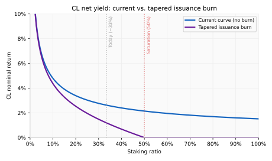
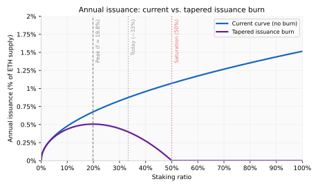

## Abstract

This EIP introduces a **tapered issuance burn**: at each epoch boundary each validator is charged a deduction for every duty it was assigned (attestation, block proposal, sync committee participation), sized as a fraction of the idealised reward for that duty, and the deducted ETH is burned. The burn fraction tapers linearly with the staking ratio, reaching 100% at a fixed *saturation balance*, so net staking yield declines as more ETH is staked. This removes the yield floor implicit in the current curve, letting the staking market settle where the yield meets the risk premium stakers demand. For a positive premium, this occurs at a staking ratio below 50%, beyond which issuance no longer incentivises further stake growth.

Applied in full at the fork, the burn would reduce yields sharply at today's staking ratio, so the reduction is phased in over an 18-month transition by temporarily raising `BASE_REWARD_FACTOR`, which scales rewards, penalties, and the burn together. Net yield therefore begins close to today's level and moves gradually to the permanent curve, with the balance between micro-incentives preserved throughout. The taper's *shape*, however, is in full effect from activation: from day one, issuance no longer rewards growth beyond a 50% staking ratio.

## Motivation

The choice between staking and simply holding ETH is made on the gap between the yields the two options offer and the risks each carries. For staking these include liquidity, slashing, operational, and regulatory risks; liquid staking exchanges some of these for risks attaching to the token issuer, whether smart-contract and governance risks for on-chain protocols or counterparty risk for a centralised provider. Stake is therefore expected to keep flowing in for as long as the net incentive to stake, given by the nominal yield, exceeds the premium the marginal staker demands for bearing those risks. The staking market reaches equilibrium only if the nominal yield falls to the level of the staking risk premium. This risk premium is trending down owing to the maturity of staking setups at the infrastructure, smart contract and software level. Furthermore, the credibility of slashing is negatively impacted by large amounts of ETH at stake, further weighing on the staking risk premium.

Under the current issuance curve there is no point at which the incentive to stake switches off: the yield falls only as $1/\sqrt{f}$ in the staking ratio $f$, and retains a floor of roughly 1.5% however much ETH is staked. Where stake growth comes to rest therefore depends on the marginal staker's risk premium staying above that floor. There is reason to think the premium may continue to fall: as the staking ecosystem matures, trusted low-friction custodians such as ETF providers emerge, and tooling and liquid staking reduce the costs and risks that justify it. Meanwhile, since issuance increases with staking ratio, dilution costs to unstaked ETH holders increase, adding greater incentive to stake to avoid this dilution.

A drift toward a very high staking ratio is undesirable for two distinct reasons, which correspond to the two goals of this proposal: preserving Ethereum's **security, neutrality and resistance to capture**, and protecting **ETH's role as money**.

### Security, neutrality, and resistance to capture

Beyond a certain level, additional stake makes Ethereum *less* secure, not more: the marginal contribution of new stake to economic security falls as the ratio rises, while several risks compound. As an ever-larger share of the ETH supply is held by custodians and staking providers rather than its owners, the social layer is deprived of its ability to hold large operators to account, while solo stakers are forced out.

- **Stake concentration leads to moral hazard.** A large operator that misbehaves can degrade consensus for its own gain, and its delegators bear the loss if slashing follows. This is a risk that should be priced by delegators, increasing the effective cost of delegated staking. But whenever one event puts a large share of the supply at risk (for example, a slashing event, or an exploit of the operator's own systems) the holders with most to lose are also the best resourced and best organised to coordinate a fork reversing it. The DAO rescue is the precedent for the social layer overriding protocol rules at that scale. A dominant operator could therefore come to be treated as "too big to fail". The resulting moral hazard is self-reinforcing: anticipating rescue rather than ruin, delegators stop demanding compensation for tail risk, the discount makes the largest operators cheaper to stake with, and stake concentrates further still.
- **The social layer loses its backstop.** Meanwhile, a fork that *should* happen becomes much harder to coordinate: "social slashing" of a colluding coalition can only succeed if the wider economy coordinates on the forked chain. Since most ETH holders cannot run validators themselves, the incentive toward ever-higher staking participation pushes an ever-larger share of the supply into custody with a handful of exchanges, ETFs, and staking service providers. With the owners of ETH no longer in full control of it ("not your keys, not your coins"), the credibility of a fork which implements social slashing, and therefore its deterrent effect, is diminished.
- **Solo stakers are forced out.** Dilution erodes everyone's real return as the ratio climbs, but solo stakers, who in most jurisdictions pay income tax on their *nominal* yield, cross into negative dilution-adjusted returns well before large operators and holders of tax-shielded positions do (this includes accumulating exchange traded products (ETPs) and non-rebasing or wrapped liquid staking tokens (LSTs)).

The consequence is the capture of both the validator set and the ETH supply by a small group of actors who are at much greater risk of coercion, undermining core Ethereum properties of neutrality and censorship resistance.

Nothing in the current curve arrests these trends. Because total issuance keeps rising as the staking ratio climbs, a large operator's income grows with every validator it adds. This applies equally at every operator size, and at every staking ratio. Under this proposal increasing size is not rewarded, and this applies soonest for the largest operators, as set out in [The effect on large operators](#the-effect-on-large-operators).

### ETH as money

Within the Ethereum economy ETH is not only the asset that secures the chain and pays for blockspace. It is also that economy's money: its default collateral, unit of account, and medium of exchange. Performing those functions earns ETH a monetary premium, giving it value beyond what its use as a fee asset alone would command.

Monetary premium benefits ETH holders, but its significance is not confined to them. Economic security depends directly on the value of ETH: the cost of attacking Ethereum is the market value of the stake an attacker must acquire and forfeit, so a higher ETH price places a greater real value at slashing risk behind the same quantity of stake. This is security that scales with the value of ETH rather than with the quantity of it staked, and it carries none of the risks set out above. The existing issuance curve, however, undermines the monetary role on which that premium rests:

- **Excess issuance taxes holders.** Issuance to the staked base operates as a continuous dilution tax on holders of unstaked ETH, eroding the scarcity and monetary premium that underpin its value as money. This forces on every holder an artificial choice: accept the dilution, or take on the costs and risks of staking merely to avoid it. Neither leaves ETH functioning as neutral money: the first taxes holding it, the second makes holding it conditional on running infrastructure or trusting somebody who does.
- **Staking derivatives displace ETH itself.** At high staking ratios, yield-bearing LSTs and other staking derivatives come to dominate raw ETH as collateral and medium of exchange within the Ethereum economy, displacing the most neutral, permissionless, trustless asset available with intermediated claims on staked ETH. At a high staking ratio, holding unstaked ETH means accepting dilution, so the yield-bearing form is preferred for collateral, settlement, and savings alike, and each application that adopts it raises the cost of not adopting it. In consequence, liquidity fragments across competing derivatives and slippage rises on decentralised exchanges, while every application that settles in a staking derivative inherits its issuer's smart-contract, counterparty, and governance risk.
- **The social layer gains a dependency.** Once one or more ETH derivatives become the ecosystem's working money, the social layer becomes dependent on outside organisations, the derivatives they issue, and their governance processes. The applications that power the money thereby acquire outsized influence over the applications that use the money, making Ethereum a less desirable blockchain to build and develop on.

By removing the issuance incentive for further stake growth, this proposal keeps issuance itself bounded: it peaks at a staking ratio of roughly 20% and falls beyond that point, settling at the ratio where yield equals the compensation stakers require for the costs and risks they bear. Each staking derivative then faces stronger competition from non-staked ETH, keeping a trustless asset at the foundation of the ecosystem. On the supply side of the ledger, the tapered burn complements the fee burn of [EIP-1559](./eip-1559.md). Together they protect the monetary role of unstaked ETH, and with it the real value of the stake that secures the chain.

### Restoring an equilibrium

This EIP proposes the minimal change needed to ensure that the issuance mechanism no longer drives stake growth beyond a 50% staking ratio: after computing rewards exactly as today, deduct from each validator a fraction of the idealised reward for each assigned duty, with that fraction tapering linearly in the staking ratio up to a fixed saturation point. The deducted ETH is not credited anywhere and is therefore in effect burned. At the 50% saturation ratio the burn cancels the issuance a validator earns for performing its duties. It therefore meets any positive risk premium at a staking ratio strictly below 50%, and the level of that premium is what fixes the equilibrium.

The two goals are served by different aspects of this change. The **security and capture-resistance** goal is met by the *shape* of the tapered curve: with the burn fully cancelling issuance at 50%, issuance no longer incentivises staking beyond that ratio. The **ETH-as-money** goal is served additionally by the *level* of issuance. This proposal bounds it below today's curve, so that holders of ETH do not overpay for security through dilution.

The reduction is phased in over an 18-month transition, during which the effective base reward factor decays from twice its current value back to today's, limiting the impact on existing stakers at activation. The tapered *shape* is nonetheless in full effect from the moment the transition begins: immediately after the fork, the issuance mechanism no longer rewards growth in the staking ratio beyond 50%, so the market has an equilibrium below that point.

## Specification

The key words "MUST", "MUST NOT", "REQUIRED", "SHALL", "SHALL NOT", "SHOULD", "SHOULD NOT", "RECOMMENDED", "NOT RECOMMENDED", "MAY", and "OPTIONAL" in this document are to be interpreted as described in RFC 2119 and RFC 8174.

Let $D$ denote `get_total_active_balance(state)` in Gwei, and let `SATURATION_BALANCE` (Gwei, $D_\text{sat}$) be a fixed constant set at the hard fork to approximately half the ETH supply. Define the **burn fraction** $b = \left(\frac{D}{D_\text{sat}}\right)^{3/2}$, clamped so that $b \le 1$.

For each validator duty, a deduction of $b$ times the idealised reward for that duty MUST be applied (via `decrease_balance`) to every validator assigned the duty, immediately after rewards and penalties are applied for the epoch; the deducted ETH is destroyed. The deduction MUST be a function of effective balance and total active balance only — it is charged whether or not the duty was performed. The attestation portion of the deduction MUST be suspended while the chain is in an inactivity leak.

The only modification to the existing rewards machinery is temporary: `get_base_reward_per_increment` MUST read a time-varying *effective* base reward factor that starts at `TRANSITION_BASE_REWARD_FACTOR` (128) and decays linearly to `BASE_REWARD_FACTOR` (64) over `TRANSITION_DURATION_EPOCHS` (≈ 18 months). Because both rewards and the burn's reference rewards derive from `get_base_reward_per_increment`, this elevation scales the whole schedule — rewards, penalties, and burn — uniformly, so the balance between them is preserved. Once the transition completes the effective factor is permanently 64, and `process_rewards_and_penalties` behaves exactly as it does today.

### Constants

The following constants are added:

| Name | Value | Notes |
|---|---|---|
| `SATURATION_BALANCE` | `Gwei(60_250_000 * 10**9)` | Total active balance $D_\text{sat}$ at which the burn fraction reaches 100%; set at the hard fork to approximately half the current ETH supply |
| `TRANSITION_BASE_REWARD_FACTOR` | `Uint64(128)` | Effective base reward factor at the start of the transition — twice `BASE_REWARD_FACTOR` — decaying linearly to `BASE_REWARD_FACTOR` over the transition |
| `TRANSITION_START_EPOCH` | `Epoch(...)` | Epoch at which the transition begins; set at the hard fork to the activation epoch |
| `TRANSITION_DURATION_EPOCHS` | `Epoch(123_300)` | Transition length; $123{,}300 = 548 \times 225$ epochs $\approx 18$ months (225 epochs per day) |

`SATURATION_BALANCE` is expressed as a balance rather than as the ratio $f_\text{sat}$ because the protocol observes `get_total_active_balance(state)` directly but has no notion of total ETH supply, so $f$ is not something the state transition can compute. Fixing $D_\text{sat} = f_\text{sat}\,S$ at the hard fork, using the supply at that time, means the effective saturation ratio drifts slowly as supply changes thereafter; the drift is small over any reasonable horizon, and a future EIP that made the protocol aware of total supply could recover $D_\text{sat}$ from $f_\text{sat}\,S$ directly.

### Helper functions

`get_issuance_burn` applies the burn fraction to a reward. It is expressed as the cube of a square-root ratio so that it can be computed as three successive `Uint64` multiply-divides, keeping every intermediate value within `Uint64` — consistent with the rest of the reward machinery, which never forms a value wider than 64 bits. The two square roots are computed once per epoch by the caller and passed in.

```python
def get_issuance_burn(reward: Gwei, sqrt_active: Uint64, sqrt_sat: Uint64) -> Gwei:
    # reward * (sqrt_active / sqrt_sat)**3 == reward * (D / SATURATION_BALANCE)**(3/2)
    burn = Uint64(reward)
    for _ in range(3):
        burn = burn * sqrt_active // sqrt_sat
    return Gwei(burn)
```

`get_participating_increments` returns the participating balance per attestation flag, the quantity `get_flag_index_deltas` scales each flag's reward by. It sums effective balances directly rather than calling `get_total_balance`, whose `max(EFFECTIVE_BALANCE_INCREMENT, ...)` floor exists to keep existing reward denominators from dividing by zero: here the quantity is a numerator, and an empty flag set must contribute nothing rather than a phantom increment. Effective balances are always whole multiples of `EFFECTIVE_BALANCE_INCREMENT`, so this changes no non-empty result. The floor remains in use for `get_total_active_balance`, where it is still needed as a divisor.

The flags are kept separate rather than pre-summed because the existing machinery floors each flag's reward to Gwei independently. Summing the weighted participation first and flooring once yields $\lfloor x_s + x_t + x_h \rfloor$, which exceeds $\lfloor x_s \rfloor + \lfloor x_t \rfloor + \lfloor x_h \rfloor$ by up to 2 Gwei; at saturation, where the deduction equals its basis exactly, that difference would come out of a faultless validator's principal.

```python
def get_participating_increments(state: BeaconState, epoch: Epoch) -> Sequence[Uint64]:
    increments = []
    for flag_index in range(len(PARTICIPATION_FLAG_WEIGHTS)):
        indices = get_unslashed_participating_indices(state, flag_index, epoch)
        increments.append(Uint64(sum(
            state.validators[index].effective_balance // EFFECTIVE_BALANCE_INCREMENT
            for index in indices
        )))
    return increments
```

`get_attestation_participation` collapses those into the single weighted total that `process_attestation` forms as its `proposer_reward_numerator`. Proposer issuance takes one floor over the whole weighted sum, so pre-summing is correct there.

```python
def get_attestation_participation(state: BeaconState, epoch: Epoch) -> Uint64:
    return Uint64(sum(
        weight * increments
        for weight, increments
        in zip(PARTICIPATION_FLAG_WEIGHTS, get_participating_increments(state, epoch))
    ))
```

This EIP also relies on one lookup not present in the current specification: `get_beacon_proposer_index_at_slot`, the existing `get_beacon_proposer_index` generalised to an arbitrary slot in the epoch.

### The base reward factor transition

`get_base_reward_factor` returns the effective base reward factor for an epoch: `TRANSITION_BASE_REWARD_FACTOR` at the start of the transition, decaying linearly to `BASE_REWARD_FACTOR` over `TRANSITION_DURATION_EPOCHS`, and permanently `BASE_REWARD_FACTOR` thereafter. Because the factor is an integer, the decay is a staircase of 65 steps, each lasting `TRANSITION_DURATION_EPOCHS` divided by the boost — about 1,927 epochs, or 8.6 days. Each step moves the whole schedule by under one part in sixty-four, and moves rewards, penalties and the burn together, so the balance between them is unaffected.

```python
def get_base_reward_factor(epoch: Epoch) -> Uint64:
    # Elevated during the transition to cushion the yield reduction, decaying
    # linearly from TRANSITION_BASE_REWARD_FACTOR at TRANSITION_START_EPOCH to
    # BASE_REWARD_FACTOR after TRANSITION_DURATION_EPOCHS. Permanently
    # BASE_REWARD_FACTOR — today's value — once the transition completes.
    if epoch <= TRANSITION_START_EPOCH:
        return TRANSITION_BASE_REWARD_FACTOR
    elapsed = epoch - TRANSITION_START_EPOCH
    if elapsed >= TRANSITION_DURATION_EPOCHS:
        return BASE_REWARD_FACTOR
    remaining = Uint64(TRANSITION_DURATION_EPOCHS - elapsed)
    boost = Uint64(TRANSITION_BASE_REWARD_FACTOR - BASE_REWARD_FACTOR)
    duration = Uint64(TRANSITION_DURATION_EPOCHS)
    return BASE_REWARD_FACTOR + (boost * remaining + duration // 2) // duration
```

`get_base_reward_per_increment` is modified to use this factor in place of the `BASE_REWARD_FACTOR` constant; this is the sole change to the existing rewards machinery, and it reverts to today's behaviour once the transition completes:

```python
def get_base_reward_per_increment(state: BeaconState) -> Gwei:
    active = get_total_active_balance(state)
    factor = get_base_reward_factor(get_current_epoch(state))
    return Gwei(EFFECTIVE_BALANCE_INCREMENT * factor // integer_squareroot(active))
```

### Beacon chain state transition

A new step, `process_issuance_burn`, MUST be added to `process_epoch` immediately after `process_rewards_and_penalties` and before `process_effective_balance_updates`. Running it there means effective balances still hold the epoch's values, so the proposer burn below charges exactly the proposers that were selected during the epoch. Each duty is charged where its issuance is paid: the attestation and proposer burns in this new epoch step, the sync committee burn in `process_sync_aggregate`.

- **Attestation burn**: a burn of $b$ times the attestation reward a perfect attester earned, applied to every validator that was active in the previous epoch. That set, rather than the currently active one, is what `process_rewards_and_penalties` has just paid: it settles the previous epoch's attestations over `get_eligible_validator_indices`;
- **Proposer burn**: a burn of $b$ times an equal share of the epoch's proposer issuance, charged to each of the 32 proposers. Its basis reads participation from the *current* epoch, not the previous one: proposer rewards were credited during this epoch as its blocks included attestations and sync aggregates, so the current epoch's participation is what they were paid on;
- **Sync committee burn**: a burn of $b$ times the sync committee reward for each block, charged to each of the 512 sync committee members. Because sync committee rewards are paid per block rather than per epoch, this deduction is applied in `process_sync_aggregate` rather than in the epoch step.

Each basis MUST be sized on the issuance the duty actually paid, not on what it would have paid under perfect network conditions: the attestation and proposer bases scale with the participating balance, and the sync committee burn is levied only when a block exists to pay the reward it offsets. Every one of those factors is a network-wide aggregate, so no deduction depends on the behaviour of the validator paying it; see [Why the burn uses idealised rewards](#why-the-burn-uses-idealised-rewards).

Splitting the burn by duty, rather than applying a single uniform per-validator deduction, keeps the variance between validators low despite the rare duties of proposal and sync committee participation. Every deduction reads `base` from `get_base_reward_per_increment`, so during the transition all three scale with the elevated effective factor automatically, and no further change is needed. Only the attestation pass is suspended during an inactivity leak, for the reasons given in [Why the burn uses idealised rewards](#why-the-burn-uses-idealised-rewards).

```python
def process_issuance_burn(state: BeaconState) -> None:
    # Clamping sqrt_active to sqrt_sat keeps the burn fraction at or below 1.
    sqrt_sat = integer_squareroot(SATURATION_BALANCE)
    sqrt_active = min(integer_squareroot(get_total_active_balance(state)), sqrt_sat)
    increment = EFFECTIVE_BALANCE_INCREMENT
    base = get_base_reward_per_increment(state)
    epoch = get_current_epoch(state)
    previous_epoch = get_previous_epoch(state)
    n_total = get_total_active_balance(state) // increment
    attest_weight = TIMELY_SOURCE_WEIGHT + TIMELY_TARGET_WEIGHT + TIMELY_HEAD_WEIGHT

    # Both burns are sized on the balance that attested, each taken from the
    # epoch whose issuance it offsets: process_rewards_and_penalties has just
    # settled the previous epoch's attestations, while proposer rewards were
    # credited during the current epoch, as its blocks included attestations.
    flag_increments = get_participating_increments(state, previous_epoch)
    proposer_participation = get_attestation_participation(state, epoch)

    # 1. Attestation burn — the validators active in the previous epoch, which
    #    is the set process_rewards_and_penalties has just paid. Each flag is
    #    floored separately, with the same numerator, denominator and order as
    #    get_flag_index_deltas, so the basis equals a perfect attester's reward
    #    exactly rather than exceeding it by the rounding of the three flags.
    #    Suspended during an inactivity leak, when attestation rewards are
    #    withheld entirely.
    if not is_in_inactivity_leak(state):
        for index in get_active_validator_indices(state, previous_epoch):
            n = state.validators[index].effective_balance // increment
            attest_reward = Gwei(sum(
                n * base * weight * participating // (n_total * WEIGHT_DENOMINATOR)
                for weight, participating
                in zip(PARTICIPATION_FLAG_WEIGHTS, flag_increments)
            ))
            burn = get_issuance_burn(attest_reward, sqrt_active, sqrt_sat)
            decrease_balance(state, index, burn)

    # 2. Proposer burn — the 32 proposers of the epoch. Proposer rewards are
    #    paid during a leak, so this pass is never suspended. A proposer is
    #    paid from two sources, and the basis carries both explicitly rather
    #    than relying on the two shares summing to PROPOSER_WEIGHT: its share
    #    of the attestation rewards it includes, per process_attestation, and
    #    its share of the sync committee reward, per process_sync_aggregate.
    #    Sync participation is not accumulated in the state, so attestation
    #    participation stands in for it; the error vanishes when the two
    #    streams agree and is bounded by 3.57% of the proposer component.
    attestation_component = (
        base * proposer_participation
        // ((WEIGHT_DENOMINATOR - PROPOSER_WEIGHT) * WEIGHT_DENOMINATOR // PROPOSER_WEIGHT)
    )
    sync_component = (
        base * proposer_participation * SYNC_REWARD_WEIGHT * PROPOSER_WEIGHT
        // (attest_weight * WEIGHT_DENOMINATOR * (WEIGHT_DENOMINATOR - PROPOSER_WEIGHT))
    )
    ideal_proposer_reward = Gwei(
        (attestation_component + sync_component) // SLOTS_PER_EPOCH
    )
    proposer_burn = get_issuance_burn(
        ideal_proposer_reward, sqrt_active, sqrt_sat
    )
    start_slot = compute_start_slot_at_epoch(epoch)
    for slot in range(start_slot, start_slot + SLOTS_PER_EPOCH):
        proposer = get_beacon_proposer_index_at_slot(state, Slot(slot))
        decrease_balance(state, proposer, proposer_burn)
```

The sync committee burn is applied in block processing instead, because sync committee rewards are paid per block. `process_sync_aggregate` MUST be modified to deduct $b$ times `participant_reward` from every committee member, alongside the rewards and penalties it already applies:

```python
def process_sync_aggregate(state: BeaconState, sync_aggregate: SyncAggregate) -> None:
    # ... signature verification and reward computation unchanged, yielding
    # participant_reward, proposer_reward and committee_indices ...

    # Burn the tapered fraction of the sync committee issuance for this block.
    sqrt_sat = integer_squareroot(SATURATION_BALANCE)
    sqrt_active = min(integer_squareroot(get_total_active_balance(state)), sqrt_sat)
    sync_burn = get_issuance_burn(participant_reward, sqrt_active, sqrt_sat)

    # Apply participant and proposer rewards
    for participant_index, participation_bit in zip(
        committee_indices, sync_aggregate.sync_committee_bits, strict=True
    ):
        if participation_bit:
            increase_balance(state, participant_index, participant_reward)
            increase_balance(state, get_beacon_proposer_index(state), proposer_reward)
        else:
            decrease_balance(state, participant_index, participant_reward)
        decrease_balance(state, participant_index, sync_burn)
```

The deduction sits outside the participation branch, so it is charged to every committee member whether or not it participated: were only participants charged, a member could avoid the burn by abstaining, and the balance difference between participating and not would fall from twice `participant_reward` to $(2-b)$ times it. The proposer's share of the sync reward is deliberately left alone, since a deduction contingent on having produced a block would weaken the incentive to propose; it remains covered by the proposer pass above.

The dominant new cost is one O(1)-per-validator deduction (the attestation burn), whose basis is three multiply-divides rather than one because each flag is floored separately. That deduction is foldable into the existing rewards/penalties pass, which already walks the same previous-epoch flags. The proposer pass adds a fixed pass over the 32 proposers, and the sync committee deduction adds one balance update per member to a loop `process_sync_aggregate` already runs. The one genuinely new traversal is `get_participating_increments` over the *current* epoch, needed for the proposer basis: no existing step in `process_epoch` totals current-epoch participating balance, so this is an additional walk of the participation flags that cannot be folded into existing work.

## Rationale

### Why a burn

An alternative route to lower issuance would be to redesign the reward curve itself. The burn approach in this proposal is to be preferred, for the following reasons:

- **A single parameter, with a natural value.** Reward curves engineered to exhibit several desirable properties at once (a cap on total issuance, a yield floor, a target ratio) tend to introduce several new parameters, each of which must be set and defended. The burn introduces exactly one, `SATURATION_BALANCE`, and its value has a natural focal point: half the ETH supply. (Temporary parameters are introduced to specify the transition, but `SATURATION_BALANCE` is the only permanently operative parameter this proposal introduces.)
- **A market-determined yield.** To avoid introducing a vulnerability to griefing attacks, rewards and penalties must remain matched. With matched incentives, a performing validator always earns a positive yield, so any reshaped reward curve without burn still imposes a floor on the yield, and stake growth stops only if the market's risk premium happens to sit above that floor. A deduction removes the floor: the staking ratio settles at the point where the yield meets the premium stakers demand, so the equilibrium yield is set by the market rather than by the shape of the curve.
- **Micro-incentives at full strength.** Reaching a low yield by scaling the reward and penalty schedule down weakens the per-duty incentives for correct and timely participation. With substantial MEV (here including priority fees) available, consensus rewards and penalties must remain large relative to the external incentives to misbehave (through block-timing games or reorgs, for example), or chain stability is put at risk. The burn leaves the entire schedule at its current magnitude and nets macro yield off afterwards.
- **Credible neutrality.** Any redirection of the deducted ETH, whether to other validators, a treasury, or any other recipient, would leave total issuance unchanged and so defeat the proposal's monetary purpose, while creating a new claimant whose incentives must be analysed and whose share can be lobbied over. Destroying it, as established by the base-fee burn of EIP-1559, is the neutral alternative: the value removed accrues pro rata to all ETH holders.

### Why a 50% saturation ratio

The saturation ratio is not a target. It marks where the issuance incentive is fully neutralised, with the market settling below it, wherever net yield meets the premium stakers demand. Several of the risks set out above are qualitatively different once a majority of ETH is staked: a rescue coalition drawn from stakers is then a majority of the economy by construction, and a fork opposing a captured validator set has no larger constituency left to appeal to. The same threshold governs ETH's monetary role. Once most ETH is staked, the derivatives representing it are drawn from a larger pool than the unstaked ETH they compete with, and liquidity and collateral acceptance tend to bestow moneyness on the larger pool.

Furthermore, above half there is no next natural stopping place. Nothing distinguishes 60% from 70%, or 70% from 80%. Half the supply is the last figure that refers to anything beyond preference: it is the majority threshold the risks above turn on. A constant anchored that way is far harder to argue upward than one resting on a judgement of degree. The choice is also bounded from below. With today's ratio near 33%, a saturation point at or beneath it would clamp the burn at 100% on activation and take net consensus yield to zero for every validator, forcing stake out rather than curbing its growth.

### Why the burn uses idealised rewards

The same concern that keeps the reward schedule at full magnitude governs how each deduction is sized: were the burn to track the reward actually earned, every duty's marginal payoff would be multiplied by $(1-b)$, reducing the incentive for correct participation. The burn is sized instead on what perfect performance would have earned. That is, perfect performance with respect to the validator's *own conduct*, not the network's. A faultless attester's reward already scales with network participation, so the burn scales with it too; sized on the full-participation figure it would take the full amount out of a reduced reward, leaving that validator at a loss whenever the offline share of the network exceeded $1-b$. During an inactivity leak, where attestation rewards are withheld outright, the attestation deduction is accordingly suspended entirely.

### Why the burn is split by duty

Applying $b$ as a single, uniform per-validator deduction each epoch would be simpler to specify, but every validator only proposes and joins a sync committee rarely. A uniform deduction sized to also cover those infrequent, larger rewards would exceed a typical epoch's attestation reward as the burn fraction grows, leaving even a perfectly performing validator with a negative balance change in every epoch spent waiting for a rare duty assignment. Allocating the deduction by assigned duty avoids this: a validator that performs its attestation duties is never pushed into a negative balance change merely for lack of a proposal or sync-committee assignment, and each deduction stays proportionate to the reward on offer at each opportunity.

### Deriving the burn fraction

Expressed as a function of the staking ratio $f = D/S$ (with $S$ the total ETH supply), the current consensus-layer yield is $y(f) = \frac{B\,E}{\sqrt{f\,S}}$, with `BASE_REWARD_FACTOR` $B$ and epochs per year $E$. Issuance is the yield paid on the staked fraction, $i(f) = B\,E\sqrt{f/S}$. The burn fraction derived below is independent of $B$: it scales the reward whatever its magnitude. The permanent policy uses today's $B = 64$; during the transition $B$ is temporarily elevated, which lifts $y(f)$ uniformly without changing $b(f)$.

The goal is to subtract from the yield a term that is zero at $f = 0$ and grows linearly to cancel the yield entirely at a saturation ratio $f_\text{sat}$, so that the net yield reaches zero there. Writing the result piecewise, $\tilde y(f) = y(f) - \frac{f}{f_\text{sat}}\,y(f_\text{sat})$ for $f \le f_\text{sat}$, and $\tilde y(f) = 0$ for $f > f_\text{sat}$.



Consensus layer net yield under the current curve and under the tapered issuance burn in its permanent (post-transition) state, both with `BASE_REWARD_FACTOR` at today's value of 64. Under the tapered curve the burn cancels a performing validator's issuance at the 50% saturation ratio.

Writing $\tilde y(f) = (1 - b(f))\,y(f)$ and solving for the burn fraction $b(f)$ that reproduces this linear taper gives $b(f) = \left(\frac{f}{f_\text{sat}}\right)^{3/2}$.

The exponent of $3/2$ rather than $1$ follows from the reward curve's $f^{-1/2}$ shape: the *absolute* deduction needed is linear in $f$, but expressed as a fraction of a reward that itself scales as $f^{-1/2}$, it picks up an extra half power. With $f_\text{sat} = 50\%$, the resulting issuance curve is $\tilde i(f) = f\,\tilde y(f)$ for $f \le f_\text{sat}$ and zero above it. It no longer rises monotonically with $f$: it rises, peaks at $f^* = 2^{-7/3} \approx 19.8\%$, and is fully cancelled by the burn at $f_\text{sat}$.



Annual ETH issuance under the current curve and under the tapered issuance burn in its permanent (post-transition) state, both with `BASE_REWARD_FACTOR` at today's value of 64. The tapered curve peaks at $f^* = 2^{-7/3} \approx 19.8\%$ and is fully cancelled by the burn at $f = 1/2$.

### The effect on large operators

An operator's income from consensus issuance is its share of the stake multiplied by the total amount issued. Under the current curve both factors move in its favour as it grows: its share rises, and because issuance keeps rising with the staking ratio, so does the pot being shared. There is no size, and no staking ratio, at which adding another validator fails to increase its income.

The tapered burn changes this. Issuance now peaks at a staking ratio of roughly 20% and declines beyond it, so an operator that keeps growing is claiming a larger share of a shrinking pot, and past some point the second effect dominates the first. The point at which an operator's income reduces from increased scale comes sooner the larger the operator already is. An operator holding half the stake finds that growth stops paying once about 31% of the ETH supply is staked. Every operator has such a point somewhere below the 50% saturation staking ratio, but the smaller it is, the closer that point sits to saturation.


The staking ratio beyond which an operator's income from consensus issuance falls as it adds stake, plotted against the share of total stake it already holds, with other operators' stake held fixed. Under the current curve no such point exists at any operator size or staking ratio.

It should be noted that MEV is unaffected by the burn and accrues in proportion to an operator's share whatever the staking ratio, so it always rewards growth and will act to increase the staking ratio at which a large operator is no longer rewarded for further growth.

### The transition period

Imposed in full at the fork, the burn would cut the net yield at today's staking ratio ($f \approx 33\%$) by more than half, from about 2.6% to 1.2% — enough to prompt a substantial exit of stake on activation. `TRANSITION_BASE_REWARD_FACTOR` is set to 128 because doubling the factor lifts the net yield curve to cross the current one at $f \approx 31\%$, close to today's ratio: stakers begin at a yield near what they receive now, and the reduction arrives gradually rather than at the fork.

The 18-month figure is measured from activation, but the window for participants to adjust is longer. A hard fork is generally *scheduled for inclusion* (SFI) six months or more before it goes live, and this proposal is fully specified and predictable from that moment. Adding that lead time gives ecosystem participants on the order of two years, from the change becoming certain to yields reaching their permanent level, in which to respond.


Net yield (left) and annual issuance (right) as the tapered issuance burn phases in, driven together by a single control. The animation sweeps the 18-month transition: at month 0 the effective base reward factor is 128, so net yield starts close to today's; by month 18 it has decayed to 64 and both curves reach their permanent shape. Throughout, the burn cancels a performing validator's issuance at the 50% saturation ratio, whatever the effective base reward factor.

The transition defers none of the security benefit: the burn fraction reaches 100% at the saturation balance whatever the base reward factor, so from the first epoch after activation issuance no longer rewards growth in the staking ratio beyond 50%.

### Issuance and MEV

Lowering issuance raises the question about the role of MEV, since if consensus rewards reduce, MEV becomes a larger share of a validator's return. Block proposal timing games are the most pernicious distortions caused by MEV, but these are unaffected by this proposal, since the microincentive levels are preserved. By contrast, reducing issuance by reshaping the reward curve would instead shrink the proposer reward and increase the significance of MEV on a per-block basis.

Summing MEV-Boost relay payments to proposers over the year to 31 July 2026 gives about 72,600 ETH across 2.42 million blocks, a mean of 0.030 ETH per block. Pricing the further 190,000 locally built blocks at that same mean (an upper bound, since locally built blocks receive lower execution layer rewards) puts total execution-layer rewards below 78,300 ETH. Against the roughly 40 million ETH staked today ($f \approx 33\%$) that is a return of at most 0.20%. Consensus issuance pays $64\sqrt{D}$ Gwei per epoch, with $D$ the total active balance in Gwei: about 1,054,000 ETH a year at that staked base, or 2.62%. Issuance therefore accounts for at least 93% of the staking yield today. Under this proposal, if the staking ratio were to settle at 40%, issuance would still account for at least 80% of the yield. So the equilibrium staking ratio remains set predominantly by the issuance curve and the risk premium.

Nonetheless, proposals which would address MEV (such as MEV burn) remain worth pursuing, and compose with this one: removing MEV from proposers would lower total staking yield, and with it the equilibrium staking ratio.

## Backwards Compatibility

This EIP introduces a backwards-incompatible change to the consensus-layer state transition and must be accompanied by a hard fork. No changes are required to the execution layer or to existing on-chain contracts.

## Test Cases

Test vectors are not yet included in this draft. On progressing toward implementation, test cases would be added to the `epoch_processing` and `block_processing` test suites in the consensus specifications repository, following the existing formats for `process_rewards_and_penalties` and `process_sync_aggregate`, covering the cases below.

**The burn fraction.**

- Active balance at the `get_total_balance` floor, with no active validators: the burn must round to zero rather than fault.
- Active balance strictly between that floor and `SATURATION_BALANCE`, with the resulting burn fraction checked against $(D/D_\text{sat})^{3/2}$.
- Active balance at and above `SATURATION_BALANCE`, and the boundary behaviour of `get_issuance_burn` at `sqrt_active == sqrt_sat`.

**The attestation basis.**

- `get_participating_increments` at full and at partial participation.
- One flag set empty, and all three empty: each empty set must contribute zero rather than `get_total_balance`'s floor of one increment. The correct and incorrect results are distinguishable only at a small total active balance, so the vector must pin one.
- The basis matching a perfect attester's reward from `get_flag_index_deltas` to the Gwei, at participation levels chosen so the three flags round differently. A basis that pre-sums the weighted participation before flooring exceeds that reward by 1 to 2 Gwei in most epochs, and must fail.
- Equivalence with the unscaled form at full participation.
- Epoch alignment across the activation and exit boundaries: a validator whose `activation_epoch` equals the current epoch is charged nothing, one whose `exit_epoch` equals the current epoch is charged in full, and the charged set matches the set paid by `process_rewards_and_penalties` in the same `process_epoch` call.
- Suspension of the attestation pass alone while `is_in_inactivity_leak(state)` holds, and its resumption on the first finalising epoch thereafter.

**The proposer basis.**

- Both the attestation-driven and the sync-driven components of proposer issuance covered: a vector with `SYNC_REWARD_WEIGHT` altered must change the basis, catching any reliance on the current weights summing as they do.
- The basis error at equal and at divergent attestation and sync participation.
- The basis reading current-epoch participation while the attestation basis reads the previous epoch's: a vector in which the two differ must move the two burns independently, and a participation step across an epoch boundary must charge each epoch's proposers on its own conditions rather than the preceding epoch's.
- Equivalence with the unscaled form at full participation.

**The sync committee deduction.**

- The deduction falling on participating and non-participating members alike.
- A consolidated validator holding several of the 512 seats charged once per seat, against the reward it receives per seat.

**Consolidated validators.**

- The proposer deduction identical for a 32 ETH and a 2048 ETH proposer of the same slot.

**Net outcomes.**

- The net balance change of a perfectly performing validator at `sqrt_active == sqrt_sat`: exactly zero for each of the three duties, at both full and partial participation.
- The sign and magnitude of the aggregate residual under partial participation.

**The transition.**

- `get_base_reward_factor` at `TRANSITION_START_EPOCH` (exactly `TRANSITION_BASE_REWARD_FACTOR`), and one epoch later (still `TRANSITION_BASE_REWARD_FACTOR`, which truncation would have reduced immediately).
- At the midpoint; one epoch before `TRANSITION_START_EPOCH + TRANSITION_DURATION_EPOCHS`; at that epoch itself and beyond it (`BASE_REWARD_FACTOR` in each case).
- Across a step boundary in both directions, with the returned value never exceeding `TRANSITION_BASE_REWARD_FACTOR` nor falling below `BASE_REWARD_FACTOR` at any epoch in the range.

## Reference Implementation

The Python in the [Specification](#specification) section constitutes the reference implementation, in the same style used throughout the beacon chain consensus specification. An implementation of this EIP has also been completed in the Prysm consensus layer client, at commit `2a0558e03412f75c473dc693b220da88b2d7a7ee`.

## Security Considerations

**Incentive compatibility.** The burn fraction $b(f)$ is a deterministic, publicly computable function of total active balance, and applies identically to every validator. No validator or coalition can shift a larger share onto another, so it introduces no new griefing or discrimination vector. Because each deduction is computed from the idealised duty reward rather than the reward actually earned, it is independent of the validator's behaviour within the epoch, leaving every marginal performance incentive intact; during the transition the elevated base reward factor scales the reward and penalty schedule up together, preserving the balance between them, and once the transition completes the schedule is exactly as it is today. And because $b(f) \le 1$ for all $f$ (clamped via `sqrt_active = min(..., sqrt_sat)`), no deduction ever exceeds the reward it is derived from. Because each basis is scaled to the issuance the duty actually paid rather than to a headline figure the network may not have reached, a validator performing its duties correctly retains a non-negative net reward for the epoch — specifically $(1-b)$ times what it earned — at any level of participation or block production. The attestation pass is suspended outright during an inactivity leak, when attestation rewards are withheld entirely, so the guarantee holds in that case too.

**Cost of downtime.** Because the deduction is independent of behaviour, an offline validator pays it alongside the usual penalties. The marginal incentive to be online is unaffected (the balance difference between performing a duty and missing it is exactly what it is today), so the cost of an outage relative to remaining online is no greater in ETH than it is today; what rises is that cost measured in days of net earnings. Since the penalty is unchanged while net earnings fall to $(1-b)$ of the idealised reward, the period needed to make good an outage grows by a factor of $(1 + b/p)/(1-b)$, where $p = 40/54 \approx 0.74$ is the ratio of penalty to idealised reward: roughly 3.8× at today's staking ratio ($f \approx 33\%$), and rising as the ratio approaches saturation.

This is the unavoidable consequence of holding the penalty schedule at full magnitude while net issuance falls. Scaling penalties down in step would hold the ratio constant, but that is precisely the weakening of per-duty incentives the burn exists to avoid. Its practical weight is limited by realised validator performance, which has run consistently above the levels anticipated when the penalty schedule was set before the beacon chain launched: at 99% uptime a validator retains 96% of a flawless validator's net yield under this proposal, against 98% today.

**Effect on economic security.** This EIP deliberately results in a lower equilibrium quantity of stake than the current curve. In proof-of-stake with slashing, the cost of attack is set by the stock of slashable stake an attacker must acquire and forfeit, and at any staking ratio in the tens of percent that stock remains vast relative to any plausible attack reward. Nor does economic security increase monotonically with stake: as set out in the Motivation, beyond a certain level the accompanying concentration of stake and supply makes the network less secure, not more. To the extent the proposal protects ETH's monetary premium, it also supports the real value of the stake securing the chain.

**Computational cost.** The additional per-epoch cost is one O(1) deduction per active validator (foldable into the existing rewards/penalties pass, which already walks the same previous-epoch participation flags), a fixed-size pass over the 32 proposers, and one further walk of the participation flags to total current-epoch participating balance for the proposer basis. That last traversal is the only one not shared with existing work; it is O(n) in the validator set, the same order as `process_rewards_and_penalties` itself, and is performed once per epoch rather than per validator. The whole step therefore remains linear in the validator set and introduces no new DoS surface. Per block, the sync committee deduction adds one balance update for each of the 512 members, within a loop `process_sync_aggregate` already performs.

**Constant drift.** As noted in [Constants](#constants), `SATURATION_BALANCE` is fixed at the fork and does not track live supply, so the effective saturation ratio will drift slowly over time. This drift changes only the location of the equilibrium point, not any safety property of the mechanism, and is not expected to be security-relevant on the timescale of a single fork's lifetime.

## Copyright

Copyright and related rights waived via [CC0](../LICENSE.md).
