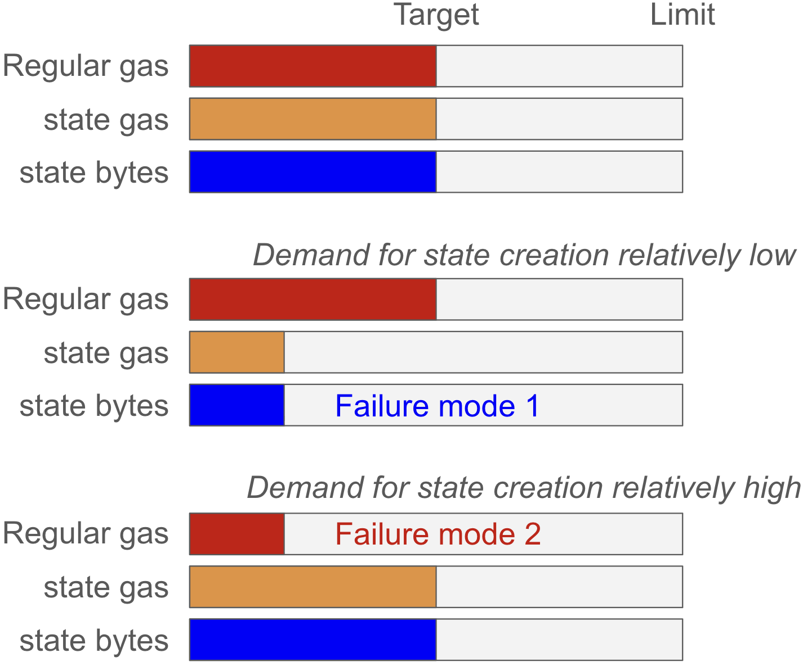
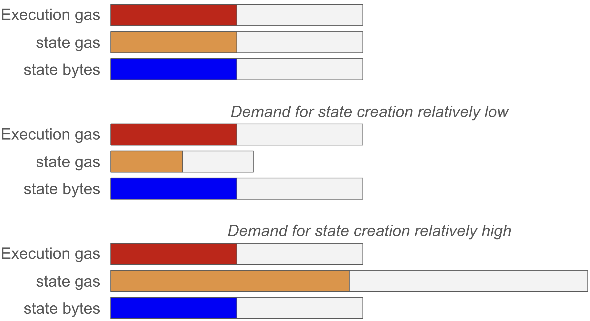

## Abstract

This EIP modifies [EIP-8037](./eip-8037.md) by assigning state gas a scaled raw limit and normalizing state-gas usage before computing block-level `gas_used`. At activation, cost per state byte (`CPSB`) and the limit scale are set so the state-byte price can reflect estimated demand while the selected state-growth target continues to correspond to 50% normalized state-gas utilization. No new transaction or block-header fields are introduced.

## Motivation

EIP-8037 gives execution gas and state gas the same block limit and uses the larger cumulative gas value as block-level `gas_used`. Its `CPSB` therefore determines how many state bytes correspond to the 50% state-gas target.

Ethereum users are not guaranteed, in aggregate, to spend half of their gas budget on state creation. At the cost per state byte (`CPSB`) selected by EIP-8037, state demand may be lower or higher than the level that lets state gas and execution gas both approach their common 50% target. Figure 1 illustrates the resulting failure modes. Relatively low state demand produces less state than intended, while relatively high state demand makes state gas the bottleneck and suppresses execution-gas consumption.



**Figure 1.** Failure modes of EIP-8037. If demand for state creation is lower than anticipated, too little state is created. If it is higher than anticipated, state gas becomes the bottleneck and too little execution gas is consumed.

Ideally, the state-byte price and the relative state-gas limit would adapt continuously to demand. This is the longer-term direction of [EIP-7999](./eip-7999.md), where resources have separate prices and limits. For simplicity, this EIP instead performs a one-time calibration at the hardfork boundary. Developers select a target annual state-growth rate and an expected future block gas limit, derive a baseline `CPSB` that maps this growth target to the 50% state-gas target, and then use demand elasticities observed during the Glamsterdam hardfork and gradual post-Glamsterdam gas-limit increases to select the actual `CPSB` and matching state-gas limit scale. The selected constants remain fixed after activation.

## Specification

### Parameters

The EIP-8037 parameter table is updated as follows:

| Parameter | Value |
|---|---:|
| `CPSB` | `TBD` |
| `STATE_GAS_LIMIT_SCALE` | `TBD` |
| `STATE_GAS_LIMIT_SCALE_DENOMINATOR` | `100` |

The `CPSB` and `STATE_GAS_LIMIT_SCALE` parameters must be positive integers. The `STATE_GAS_LIMIT_SCALE` parameter specifies the raw state-gas limit as a percentage of the block gas limit.

### Transaction validation

The EIP-8037 definition of `state_gas_available` is updated to:

```python
state_gas_limit = block_env.block_gas_limit * STATE_GAS_LIMIT_SCALE // STATE_GAS_LIMIT_SCALE_DENOMINATOR
state_gas_available = state_gas_limit - block_output.block_state_gas_used
```

### Block-level gas accounting

The EIP-8037 block-level `gas_used` computation and validity conditions are updated to:

```python
normalized_block_state_gas_used = (block_output.block_state_gas_used * STATE_GAS_LIMIT_SCALE_DENOMINATOR) // STATE_GAS_LIMIT_SCALE
gas_used = max(block_output.block_execution_gas_used, normalized_block_state_gas_used)
assert block_output.block_state_gas_used <= state_gas_limit
assert gas_used <= block_env.block_gas_limit
```

The `block_output.block_state_gas_used` counter remains denominated in raw state gas. No new block header field is introduced.

## Rationale

### Calibration methodology

EIP-8037 uses one common base fee for execution gas and state gas. A mismatch between the state-byte price and user demand therefore affects more than state growth: it determines which dimension reaches the common target first and can leave the other dimension underutilized.

This EIP makes one fixed best-effort calibration at activation. The objective is to select a `CPSB` that is expected to induce the desired amount of state creation, and to set the raw state-gas limit so that this amount of state creation occupies approximately 50% of that limit. If the demand estimate is accurate, state gas and execution gas can both approach their respective targets.

This can be viewed as a manual, one-time analogue of [EIP-8075](./eip-8075.md): EIP-8075 adapts the state-byte price and relative state-gas limit with demand, whereas this EIP selects fixed values at activation.

The calibration starts by determining the `target_state_growth_per_year` and `expected_block_gas_limit`, then deriving: 
`baseline_cpsb = expected_block_gas_limit * blocks_per_year // (2 * target_state_growth_per_year)`.

Both `blocks_per_year` and `baseline_cpsb` are here simply analytical values rather than additional consensus parameters. The `baseline_cpsb` value maps the selected annual state-growth target to 50% of the block gas limit when the raw state-gas limit equals the block gas limit. Thus, the `baseline_cpsb` is equal to `CPSB` only if demand at that price is expected to produce the target state growth.

Figure 2 illustrates the three possible calibrations after comparing expected demand at `baseline_cpsb` with the target. If demand is expected to match the target, no scaling is needed. If expected demand is lower, both `CPSB` and the raw state-gas limit are reduced. If expected demand is higher, both are increased. These are alternative fixed settings selected from demand estimated before activation, not dynamic adjustments performed after activation.



**Figure 2.** The hardfork may retain, contract, or expand the raw state-gas limit according to the state demand estimated before activation. The `CPSB` is changed proportionally so that the targeted state-byte capacity is preserved after normalization.

The next step is to use observed demand elasticities to select the actual `CPSB` so that expected state growth is close to `target_state_growth_per_year`. Then select the matching limit scale according to:

```python
STATE_GAS_LIMIT_SCALE = CPSB * STATE_GAS_LIMIT_SCALE_DENOMINATOR // baseline_cpsb
```

Scaling `CPSB` and the raw state-gas limit proportionally preserves the normalized state gas assigned to the targeted number of state bytes. It therefore changes the price needed to induce the desired state-byte consumption without changing the corresponding normalized blockspace allocation. The denominator of `100` provides one-percentage-point calibration steps, which are sufficiently granular relative to the uncertainty in demand estimates.

Demand elasticity can be estimated from how state-byte consumption responds to the new `CPSB` of Glamsterdam and shifts in the demand for state creation during the gradual gas-limit increases after Glamsterdam. Application-specific analysis as well as analysis of past changes can supplement these observations.

## Backwards Compatibility

This EIP changes consensus-critical block validation and requires a scheduled network upgrade. After activation, clients that do not implement the scaled state-gas limit and normalization rules may disagree on transaction inclusion, block validity, or the block header `gas_used` value.

Blocks before activation are unaffected. Transaction formats, the EIP-8037 reservoir model, transaction-level gas accounting, and receipt semantics remain unchanged. Block builders, execution clients, and gas-estimation implementations must use the new `CPSB`, raw state-gas limit, and normalized block-level accounting after activation.

## Security Considerations

The primary risk is parameter miscalibration, which may shift the system from one failure mode to the other and cannot be corrected without a subsequent hardfork. The selected parameters should therefore be stress-tested across plausible demand elasticities. Because the raw state-gas limit and `CPSB` scale proportionally, the maximum state-byte capacity remains approximately invariant across calibrations, up to integer rounding.

## Copyright

Copyright and related rights waived via [CC0](../LICENSE.md).
