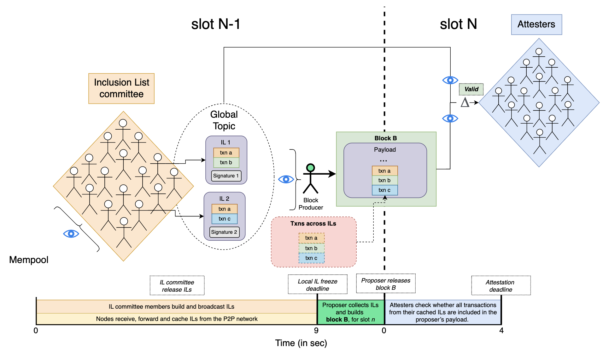

## Abstract

Implement a robust mechanism to preserve Ethereum’s censorship resistance and chain neutrality properties by guaranteeing timely transaction inclusion.

FOCIL is built in a few simple steps:

- In each slot, a set of validators is selected to become IL committee members. Each member gossips one inclusion list (IL) according to their subjective view of the mempool.
- The proposer and all attesters of the next slot monitor, forward and collect available ILs.
- The proposer includes transactions from all collected ILs in its block before broadcasting it to the rest of the network.
- Attesters only vote for the proposer's block if it includes transactions from ILs they collected.

## Motivation

In an effort to shield the Ethereum validator set from centralizing forces, the right to build blocks has been auctioned off to specialized entities known as builders. Over the past year, this has resulted in a few sophisticated builders dominating the network’s block production. Economies of scale have further entrenched their position, making it increasingly difficult for new entrants to gain significant market share. A direct consequence of centralized block production is a deterioration of the network’s censorship resistance properties. In contrast, 90% of the more decentralized and heterogeneous validator set is not engaging in censorship. This has driven research toward ways that allow validators to impose constraints on block construction by force-including transactions in the blocks. These efforts recently culminated in the first practical implementation of forward ILs, [EIP-7547](./eip-7547.md), being considered for inclusion in the upcoming Pectra fork. However, some concerns were raised about the specific mechanism proposed in EIP-7547, leading to its rejection. 

FOCIL is a simple committee-based design improving upon previous IL mechanisms or block co-creation proposals and addressing issues related to bribing/extortion attacks, IL equivocation, account abstraction (AA) and transaction invalididation.

## High-level Overview


### Roles And Participants

This section outlines the workflow of FOCIL, detailing the roles and responsibilities of various participants, including IL committee members, nodes, proposers, and attesters.

#### IL Committee Members

- **`Slot N`, `t=0 to 8s`**:
IL committee members construct their ILs and broadcast them over the P2P network after processing the block for `slot N` and confirming it as the head. If no block is received by `t=7s`, they should run `get_head` and build and release their ILs based on their node’s canonical head.

  By default, ILs are built by selecting raw transactions from the public mempool, ordered by priority fees, up to the IL’s maximum size in bits (e.g., 8 KB per IL). Additional rules can be optionally applied to maximize censorship resistance, such as prioritizing valid transactions that have been pending in the mempool the longest.

#### Nodes

- **`Slot N`, `t=0 to 9s`**:
Nodes receive ILs from the P2P network and only forward and cache those that pass the CL P2P validation rules.

- **`Slot N`, `t=9s`**: IL freeze deadline. At this point, nodes freeze their IL view and stop caching new ILs in memory. After the deadline, nodes continue forwarding ILs to peers following the CL P2P validation rules, but they discard any new local ILs received after the deadline (`t=9s`) and keep only minimal information (i.e., the number of ILs forwarded per committee member) to forward according to the rules.

#### Block Producer
- **`Slot N`, `t=0 to 11s`**: The block producer (i.e., a proposer or a proposer builder pair) receive ILs from the P2P network, forwarding and caching those that pass the CL P2P validation rules. Optionally, an RPC endpoint can be added to allow the block producer to request missing ILs from its peers (e.g., by committee index at `t=10s`).

- **`Slot N`, `t=11s`**:
The block producer freezes its view of ILs and asks the EL to update its execution payload by adding transactions from its view (the exact timings will be defined after running some tests/benchmarks).

- **`Slot N+1`, `t=0s`**:
The proposer broadcasts its block with the up-to-date execution payload satisfying IL transactions over the P2P network.

#### Attesters
- **`Slot N+1`, `t=0 to 4s`**:
Attesters monitor the P2P network for the proposer’s block. Upon detecting it, they verify whether all transactions from their cached ILs are included in the proposer’s execution payload. The `Valid` function, based on the frozen view of the ILs from `t=9s` in the previous slot, checks if the execution payload satisfies IL validity conditions. This is done either by confirming that all transactions are present or by determining if any missing transactions are invalid when appended to the end of the payload. In such cases, attesters use the EL to perform nonce and balance checks to validate the missing transactions and check whether there is enough space in the block to include the transaction(s).

#### CL P2P Validation Rules

When nodes receive ILs from the P2P network, they perform a series of validation checks before forwarding or caching them. These rules protect against Denial-of-Service (DoS) attacks by (1) limiting ILs' byte size and (2) restricting IL proposals to a small committee of IL committee members, thereby tightly bounding the main resource consumed by the propagation of ILs. Consumption of other relevant resources, such as verification time, is minimal because the only nontrivial check performed on IL propagation is signature verification. At this stage, there is no EL verification of the transactions within ILs. This means that ILs are allowed to contain any transactions—valid or invalid—since nodes do not perform EL-side checks. This design choice is intended to avoid additional computational overhead.

1. The slot of the IL matches the current slot. ILs not matching the current slot should be ignored.
2. The parent hash of the IL is recognized.
3. Received two or fewer ILs from this IL committee member (see IL equivocation section below).
4. The IL is correctly signed by the validator.
5. The validator is part of the IL committee.
6. The size of a IL does not exceed the maximum size allowed (e.g., 8 KB).

## Specification

### Execution Layer

On the execution layer, the block validity conditions are extended such that, after all of the transactions in the block have been executed, we attempt to execute each valid transaction from ILs that was not present in the block.
If one of those transactions executes successfully, then the block is invalid.

Let `B` denote the current block.
Let `S` denote the execution state following the execution of the last transaction in `B`.

For each transaction `T` in ILs, perform the following:

1. Check whether `T` is present in `B`. If `T` is present, then continue to the next transaction.
2. Validate `T` against `S`. If `T` is invalid, then continue to the next transaction.
3. Execute `T` on state `S`. Assert that the execution of `T` fails.

If `B` is full, the process terminates. Also note that we do not need to reset the state to `S`, since the only way for a transaction to alter the state is for it to execute sucessfully, in which case the block is invalid, and so the block will not be applied to the state.

We make the following changes to the engine API:

- Add `engine_getInclusionList` endpoint to retrieve a IL from the `ExecutionEngine`
- Modify `engine_newPayload` endpoint to include a parameter for transactions in ILs determined by the proposer
- Modify `engine_forkchoiceUpdated` endpoint to include a field in the payload attributes for transactions in ILs determined by the proposer

### Consensus Layer

The full consensus changes can be found in the following Github repository. They are split between: 

- [Beacon Chain](https://github.com/terencechain/consensus-specs/blob/6056b69ea1215c3dff6042da2b0a8563347be645/specs/_features/focil/beacon-chain.md) changes.
- [Fork choice](https://github.com/terencechain/consensus-specs/blob/6056b69ea1215c3dff6042da2b0a8563347be645/specs/_features/focil/fork-choice.md) changes.
- [P2P](https://github.com/terencechain/consensus-specs/blob/6056b69ea1215c3dff6042da2b0a8563347be645/specs/_features/focil/p2p-interface.md) changes.
- [Honest validator guide](https://github.com/terencechain/consensus-specs/blob/6056b69ea1215c3dff6042da2b0a8563347be645/specs/_features/focil/validator.md) changes.
- [Engine API](https://github.com/terencechain/consensus-specs/blob/6056b69ea1215c3dff6042da2b0a8563347be645/specs/_features/focil/engine-api.md) changes.

#### Beacon chain changes

##### Preset

| Name | Value |
| - | - |
| `DOMAIN_IL_COMMITTEE`       | `DomainType('0x0C000000')`  |
| `IL_COMMITTEE_SIZE` | `uint64(2**4)` (=16)  |
| `MAX_BYTES_PER_INCLUSION_LIST` |  `uint64(2**13)` (=8192) | 

##### New containers

```python
class InclusionList(Container):
    slot: Slot
    validator_index: ValidatorIndex
    parent_root: Root
    parent_hash: Hash32
    transactions: List[Transaction, MAX_TRANSACTIONS_PER_INCLUSION_LIST]
```

```python
class SignedInclusionList(Container):
    message: InclusionList
    signature: BLSSignature
```

#### Fork choice changes

- Cache ILs observed over gossip before the IL freeze deadline.
- If more than one IL is observed from the same IL committee member, remove all ILs from the member from the cache.
- Fork choice head retrieval is based on the `Valid` function being satisfied by the EL.
  
#### P2P changes

- A new global topic for broadcasting `SignedInclusionList` objects.
- A new RPC topic for request `SignedInclusionList` based on IL committee index.

## Rationale

### Core Properties
- Committee-based: FOCIL relies on a committee of multiple validators, rather than a single proposer, to construct and broadcast ILs. This approach significantly reduces the surface for bribery and extortion attacks and strengthens censorship resistance.
- Fork-choice enforced: FOCIL incorporates the force-inclusion mechanism into the fork-choice rule, an integral component of the consensus process, thereby preventing any actor from bypassing the system. Attesters vote only for blocks that include transactions from a set of ILs provided by the IL committee and that satisfy the IL constraints. Any block failing to meet these criteria will not be voted on by the attesters, and therefore cannot be canonical.
- Same-slot: With FOCIL running in parallel with the block building process for `slot N+1` during `slot N`, the constraints imposed on `block B` for `slot N+1` can include transactions submitted during `slot N`. This represents a strict improvement over forward IL designs like EIP-7547, where the forward property introduced a 1-slot delay.
- Conditional inclusion: FOCIL adopts conditional inclusion, accepting blocks that may lack some transactions from ILs if they cannot append the transactions to the end of the block or if they are full.
- Anywhere-in-block: FOCIL is unopinionated about the placement of transactions from ILs within a block. This reduces incentives for sophisticated actors to use side channels to bypass the mechanism. Combined with conditional inclusion, this flexibility makes the emergence of off-protocol markets even less attractive.
- No incentive mechanism: FOCIL does not provide explicit rewards for IL committee members participating in the mechanism. We believe that the added complexity of implementing a transaction fee system for FOCIL is not justified. Instead, we rely on altruistic behavior, as FOCIL requires only `1/n` IL committee members to act honestly for the mechanism to function as intended.

## Backwards Compatibility

This EIP introduces backward incompatible changes to the block validation rule set on the consensus layer and must be accompanied by a hard fork. These changes do not break anything related to current user activity and experience.

## Security Considerations

### Consensus Liveness

The block producer (i.e., a proposer or a proposer builder pair) of `slot N+1` cannot construct a canonical block without first receiving the ILs broadcast during `slot N`. This means that the block producer must be well-connected to the IL committee members to ensure timely access to these inclusion lists. Additionally, there must be sufficient time between the IL freeze deadline (`t=9s` of `slot N`) and the moment the block producer must broadcast `block B` to the rest of the network. This buffer allows the block producer to gather all available ILs and update the execution payload of `block B` accordingly.

### IL Equivocation

To mitigate IL equivocation, FOCIL introduces a new P2P network rule that allows forwarding up to two ILs per IL committee member. If the proposer or attesters detect two different ILs sent by the same IL committee member, they should ignore all ILs from that member. In the worst case, the bandwidth of the IL gossip subnet can at most double.

### Payload Construction

The block producer, responsible for constructing the execution payload, must ensure that the IL is satisfied. A naive way to do so would be to build an initial payload in whatever way the builder desires, then execute the following algorithm:

1. Sequentially check validity of any yet-to-be-included IL tx against the post-state. If none is found, payload building is over.
2. If one is found, append it to the end of the payload and update the post-state. Go back to step 1.

The issue with this simple approach is that, given a set of `n` IL transactions, one might end up needing to do `n + (n-1) + (n-2) + ...` validity checks, so `O(n^2)`. For example, the `n`th tx might be valid while all others are not, but its execution sends balance to the sender of the `(n-1)`th tx, making it valid, and in turn, the `(n-1)`th sends balance to the sender of the `(n-2)`th tx, etc.

To efficiently ensure that all valid IL txs have been included in the payload, builders can adopt a simple strategy: prior to building the payload, they store the `nonce` and `balance` of all Externally Owned Accounts (EOAs) involved in IL transactions. As they construct the payload, builders track these EOAs, maintaining and updating each EOA's `nonce` and `balance` whenever changes occur—specifically, when the `nonce` increments (indicating that a transaction from that EOA has been executed) or when the `balance` changes without a `nonce` increment (e.g., after an Account Abstraction (AA) transaction has interacted with that EOA). 

This tracking allows builders to verify IL transaction validity in real-time, enabling them to add transactions sequentially until all remaining transactions are either invalid because the nonce or balance of the associated EOA does not change or cannot be included due to insufficient gas. This approach minimizes overhead by keeping track only of the state changes that are relevant to the validity of IL txs.

## Copyright

Copyright and related rights waived via [CC0](../LICENSE.md).
