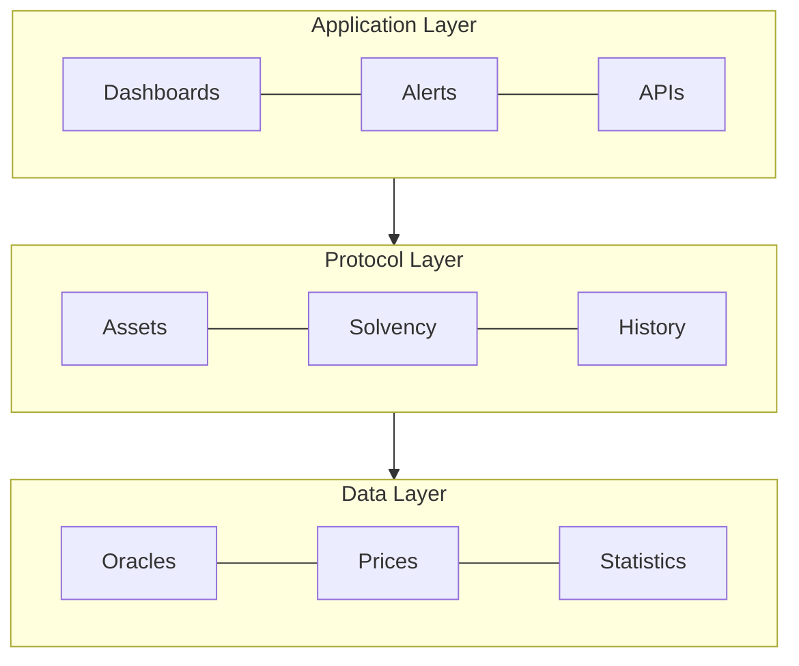
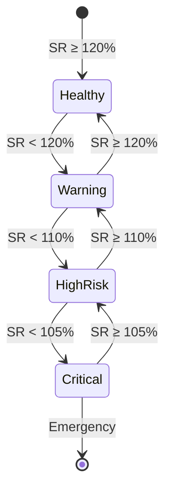
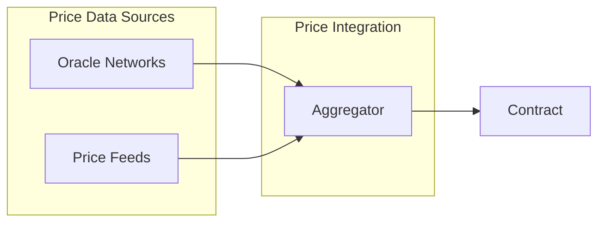

## Abstract

A standardized interface that enables DeFi protocols to implement verifiable solvency proofs through smart contracts. The standard defines methods for reporting assets, liabilities, and financial metrics, enabling real-time verification of protocol solvency.

## Motivation

The DeFi ecosystem currently lacks standardization in financial health reporting, leading to:

1. Inconsistent reporting methodologies across protocols
2. Limited transparency in real-time financial status
3. Absence of standardized early warning systems
4. Complex and time-consuming audit processes
5. Difficulty in assessing cross-protocol risks

## Specification

The key words "MUST", "MUST NOT", "REQUIRED", "SHALL", "SHALL NOT", "SHOULD", "SHOULD NOT", "RECOMMENDED", "NOT RECOMMENDED", "MAY", and "OPTIONAL" in this document are to be interpreted as described in RFC 2119 and RFC 8174.



### Core Interfaces

The standard defines a comprehensive interface for solvency verification. Key features include:

1. Asset and Liability Management
   - Protocol assets tracking
   - Protocol liabilities tracking
   - Real-time value updates

2. Solvency Verification
   - Ratio calculations
   - Health factor monitoring
   - Historical data tracking

3. Risk Alert System
   - Threshold monitoring
   - Event emissions
   - Emergency notifications

For the complete interface specification, see [ISolvencyProof.sol](https://github.com/SeanLuis/eip-draft/blob/master/contracts/SolvencyProof/ISolvencyProof.sol).

### Mathematical Model

The solvency verification system is based on comprehensive mathematical models:

#### 1. Core Solvency Calculations

$SR = (TA / TL) × 100$

Where:
- $TA = \sum(A_i × P_i)$  // Total Assets
- $TL = \sum(L_i × P_i)$  // Total Liabilities
- $A_i$ = Amount of asset i
- $P_i$ = Price of asset i
- $L_i$ = Liability i

#### 2. Risk-Adjusted Health Factor

$HF = \frac{\sum(A_i × P_i × W_i)}{\sum(L_i × P_i × R_i)}$

Where:
- $W_i$ = Risk weight of asset i $(0 < W_i \leq 1)$
- $R_i$ = Risk factor for liability i $(R_i \geq 1)$

#### 3. Risk Metrics

##### Value at Risk (VaR)

$VaR(\alpha) = \mu - (\sigma × z(\alpha))$

Where:
- $\mu$ = Expected return
- $\sigma$ = Standard deviation
- $z(\alpha)$ = z-value for confidence level $\alpha$

##### Liquidity Coverage Ratio (LCR)

$LCR = \frac{HQLA}{TNCO} × 100$

Where:
- HQLA = High Quality Liquid Assets
- TNCO = Total Net Cash Outflows (30 days)

#### 4. System Health Index

$SI = \frac{SR × w_1 + LCR × w_2 + (1/\sigma) × w_3}{w_1 + w_2 + w_3}$

Where:
- $w_1,w_2,w_3$ = Weighting factors
- $\sigma$ = System volatility

#### 5. Default Probability

$PD = N(-DD)$
$DD = \frac{ln(TA/TL) + (\mu - \sigma^2/2)T}{\sigma\sqrt{T}}$

Where:
- DD = Distance to Default
- T = Time horizon
- N() = Standard normal distribution

### Risk Thresholds

The following thresholds have been validated through extensive testing:

| Risk Level | Ratio Range | Action Required | Validation Status |
|------------|-------------|-----------------|-------------------|
| CRITICAL   | < 105%      | Emergency Stop  | ✅ Validated |
| HIGH RISK  | 105% - 110% | Risk Alert     | ✅ Validated |
| WARNING    | 110% - 120% | Monitor        | ✅ Validated |
| HEALTHY    | ≥ 120%      | Normal         | ✅ Validated |

Testing has confirmed that:
1. The system correctly handles 50% market drops
2. Ratios are calculated accurately in all scenarios
3. State updates maintain consistency
4. Ratio limits are effective for early detection



### Risk Assessment Framework

The standard implements a multi-tiered risk assessment system:

1. Primary Metrics:
   - Base Solvency Ratio (SR)
   - Risk-Adjusted Health Factor (HF)
   - Liquidity Coverage Ratio (LCR)

2. Threshold Levels:
   ```mermaid
   flowchart LR
       H[Healthy] -->|"SR < 120%"| W[Warning]
       W -->|"SR < 110%"| R[High Risk]
       R -->|"SR < 105%"| C[Critical]
   ```

### Oracle Integration (Optional)

This standard intentionally leaves oracle implementation flexible. Protocols MAY implement price feeds in various ways:

1. Direct Integration
   - Using existing oracle networks (Chainlink, API3, etc.)
   - Custom price feed implementations
   - Internal price calculations

2. Aggregation Strategies
   - Multiple oracle sources
   - TWAP implementations
   - Medianized price feeds




### Implementation Requirements

1. Asset Management:
   - Real-time asset tracking
   - Price feed integration
   - Historical data maintenance

2. Liability Tracking:
   - Debt obligation monitoring
   - Collateral requirement calculation
   - Risk factor assessment

3. Reporting System:
   - Event emission for significant changes
   - Threshold breach notifications
   - Historical data access

### Implementation Considerations

#### Oracle Management (Optional)
While not part of the core standard, implementations should consider including oracle management:

```solidity
// Recommended but not required
event OracleUpdated(address indexed oracle, bool authorized);
function setOracle(address oracle, bool authorized) external;
```

This provides:
- Flexible price feed management
- Security controls
- Update authorization

The core standard focuses on solvency verification, leaving oracle management implementation details to individual protocols.

### Implementation Notes

Based on conducted tests, it is recommended:

1. Liability Management:
   - Maintain constant liabilities during price updates
   - Validate that liabilities are never 0 to avoid division by zero
   - Update liabilities only when actual positions change

2. Ratio Calculation:
   ```solidity
   function calculateRatio(uint256 assets, uint256 liabilities) pure returns (uint256) {
       if (liabilities == 0) {
           return assets > 0 ? RATIO_DECIMALS * 2 : RATIO_DECIMALS;
       }
       return (assets * RATIO_DECIMALS) / liabilities;
   }
   ```

3. State Validation:
   - Verify values before updating
   - Maintain accurate history
   - Emit events for significant changes

4. Gas Considerations:
   - Optimize history storage
   - Batch updates for multiple tokens
   - Limit array sizes in updates

## Rationale

The standard's design prioritizes:

1. Reliability through multiple oracle support and robust calculations
2. Efficiency via optimized data structures
3. Flexibility through modular design
4. Transparency via standardized metrics

## Backwards Compatibility

This EIP is compatible with existing DeFi protocols and requires no changes to existing token standards.

## Test Cases

Test cases are provided in the reference implementation demonstrating:

1. Solvency ratio calculations
2. Risk threshold monitoring
3. Oracle integration
4. Historical data tracking

## Reference Implementation

A reference implementation is provided in [SolvencyProof.sol](https://github.com/SeanLuis/eip-draft/blob/master/contracts/SolvencyProof/SolvencyProof.sol).

## Security Considerations

Key security considerations include:

1. Oracle Security:
   - Multiple price feed sources
   - Manipulation resistance
   - Fallback mechanisms

2. Access Control:
   - Authorized updaters
   - Rate limiting

3. Risk Management:
   - Threshold calibration
   - Alert system reliability

## Copyright

Copyright and related rights waived via [CC0](../LICENSE.md).