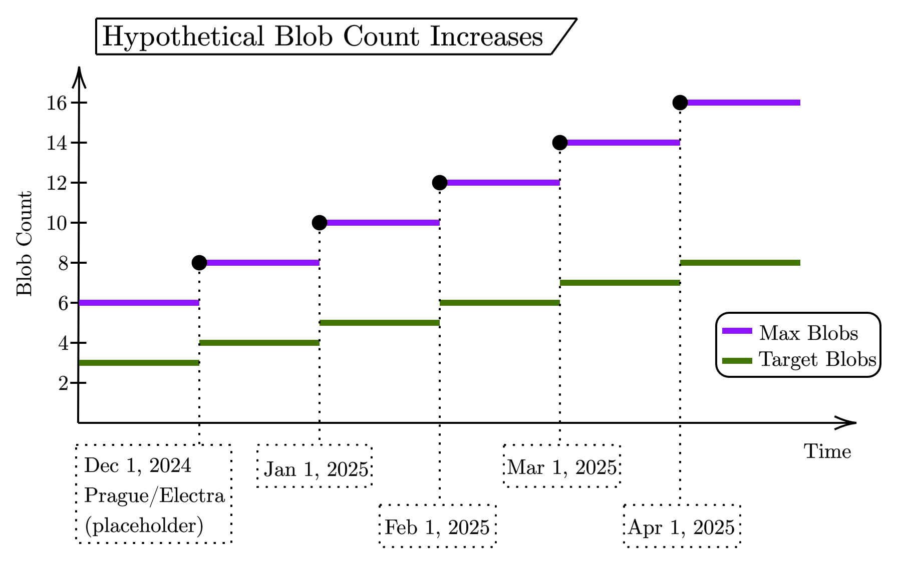

## Abstract

This EIP introduces a time-based, stepwise upward adjustment to the blob gas target and maximum values to provide more scale to Ethereum via L2 solutions that scale with L1 data.

Starting with today's configuration of `(target,max)=(3,6)`, it increases the target blob count by one (and thus the max by two) every month starting at the Prague/Electra fork and stopping at four months later with `(target,max) = (8/16)`.

It separately also simplifies the way the maximum blob gas and the update fraction are specified, by defining them relative to the blob gas target.

## Motivation

Ethereum scales by providing more L1 data to supercharge L2 roll-ups. Since the release of EIP-4844, this is parametrized by the blob gas target and maximum. At the Dencun upgrade, these values were selected as 3/6, respectively, in an effort to find a compromise between p2p network stability and an initial performance value, with the intention of increasing these limits as mainnet stability of 3/6 were better understood.

[EIP-7623](./eip-7623.md) proposes a calldata cost increase that would significantly lower the worst case base block size. It would thus create more p2p headroom for a blob throughput increase.

Simulations, testnets, and current mainnet analysis can only go so far in demonstrating what a safe maximum blob gas-limit is for the network, so this specification proposes what that safe maximum is likely to be, while providing a conservative, step-wise route to get there. In the event instabilities are detected prior to reaching the maximum in this specification, an additional upgrade can be introduced to halt further increases.

## Specification

### Parameters

| Constant | Value |
| - | - |
| `PECTRA_FORK_EPOCH` | `tbd` |
| `EPOCHS_PER_STEP` | `6750` (30 days) |
| `TOTAL_STEP_NUMBER` | `4` |
| `BASE_TARGET_BLOB_GAS_PER_BLOCK` | `524288` (4 blobs) |
| `INCREMENTAL_TARGET_BLOB_GAS_PER_STEP` | `131072` (1 blob) |
| `BLOB_GAS_ELASTICITY` | `2` |
| `UPDATE_FRACTION_NUMERATOR` | `17` |
| `UPDATE_FRACTION_DENOMINATOR` | `2` |

### Blob Gas Logic

The following functions turn the three [EIP-4844](./eip-4844.md) constants `TARGET_BLOB_GAS_PER_BLOCK`, `MAX_BLOB_GAS_PER_BLOCK`, and `BLOB_BASE_FEE_UPDATE_FRACTION` into functions of the current epoch:

```python
def target_blob_gas_per_block(epoch: int) -> int:
    steps = min((epoch - PECTRA_FORK_EPOCH) // EPOCHS_PER_STEP, TOTAL_STEP_NUMBER)
    return BASE_TARGET_BLOB_GAS_PER_BLOCK + steps * INCREMENTAL_TARGET_BLOB_GAS_PER_STEP

def max_blob_gas_per_block(epoch: int) -> int:
    return target_blob_gas_per_block(epoch) * BLOB_GAS_ELASTICITY

def blob_base_fee_update_fraction(epoch: int) -> int:
    return target_blob_gas_per_block(epoch) * UPDATE_FRACTION_NUMERATOR // UPDATE_FRACTION_DENOMINATOR
```

These are now used in place of the old constants.

## Rationale

### Gradual Throughput Increase

The stepwise approach will result in a gradual blob throughput increase:

- At the fork time, the throughput will be increased from `3/6` to `4/8`.
- Every 30 days, the throughput is further increased by 1 target blob (and 2 max).
- After 120 days, the throughput reaches its final level at `8/16`.

The figure below illustrates that stepwise increase:



### Elasticity and Update Fraction Simplifications

This EIP simplifies both the maximum blob gas and the update fraction, by defining them relative to the blob gas target. In particular:

- The maximum blob gas is controlled by the new `BLOB_GAS_ELASTICITY`. This ensures that the maximum automatically scales with any increase in the target.
- The update fraction is defined as `target_blob_gas_per_block(epoch) * 17 // 2`. This ensures that the maximum blob base fee change rate stays at `e**(2/17) ≈ 1.1248`, which is a close approximation of today's `1.125` with significantly simpler parameters.

## Backwards Compatibility

todo

## Security Considerations

todo

## Copyright

Copyright and related rights waived via [CC0](../LICENSE.md).