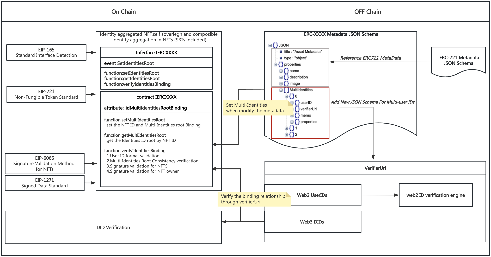

## Abstract

This standard extends ERC-721 by binding individuals' Web2 and Web3 identities to non-fungible tokens (NFTs). By binding multiple identities, aggregated and composible identity infomation can be verified, resulting in more beneficial onchain scenarios for individuals, such as self-authentication, social overlapping, commercial value generation from user targetting, etc. 

## Motivation

One of the most interesting aspects of Web3 is the ability to bring an individuals own identity to different applications. Even more powerful is the fact that individuals truly own their accounts without relying on centralized gatekeepers, disclosing to different apps components necessary for authentication and approved by individuals. 
Exisiting solutions such as ENS, although open, decentralized, and make it more convenient for Ethereum-based applications, lack of data standardization and athentication of itentity due to inherent anominity. Other solutions such as SBTs rely on centralized attestors, can not prevent data tampering, nor inscribe data into the ledger itself in a privacy enabling way. Previous work such as ERC6066 does not bind nor verify user identity data, thus unable to meet the user identity aggregation, user Kyc verification and other application scenarios related to user data sovereignty
The proposed ERC-XXXX pushes the boundaries of solving identity problems with Identity Aggregated NFT, i.e., the individual-authenticated aggregation of web2 and web3 identities to NFTs (SBTs included). 


## Specification

The keywords “MUST”, “MUST NOT”, “REQUIRED”, “SHALL”, “SHALL NOT”, “SHOULD”, “SHOULD NOT”, “RECOMMENDED”, “MAY” and “OPTIONAL” in this document are to be interpreted as described in RFC 2119.

### Every ERC-XXXX compliant contract must implement the Interface
```typescript
// SPDX-License-Identifier: CC0-1.0
pragma solidity ^0.8.15;

interface IERCXXXX {

    /**
     * @notice emit the use binding informain
     * @param id nft id 
     * @param identitiesRoot new identity root
     */
    event SetIdentitiesRoot(
        uint256 id,
        bytes32 identitiesRoot
    );

    /**
     * @notice 
     * @dev set the user ID binding information of NFT with identitiesRoot
     * @param id nft id 
     * @param identitiesRoot multi UserID Root data hash
     * MUST allow external calls
     */
    function setIdentitiesRoot(
        uint256 id,
        bytes32 identitiesRoot
    ) external;

    /**
     * @notice 
     * @dev get the multi-userID root by  NFTID
     * @param id nft id 
     * MUST return the bytes32 multiUserIDsRoot
     * MUST NOT modify the state
     * MUST allow external calls
     */
    function getIdentitiesRoot(
        uint256 id
    ) external returns(bytes32);

    /**
     * @notice 
     * @dev verify the userIDs binding 
    * @param id nft id 
     * @param userIDs userIDs for check
     * @param identitiesRoot msg hash to veriry
     * @param signature ECDSA signature 
     * MUST If the verification is passed, return true, otherwise return false
     * MUST NOT modify the state
     * MUST allow external calls
     */
    function verifyIdentitiesBinding(
        uint256 id,address nftOwnerAddress,string[] memory userIDs,bytes32 identitiesRoot, bytes calldata signature
    ) external returns (bool);
    
}
```

This is the “ERCXXX Metadata JSON Schema” referenced above.
```json
{
  "title": "Asset Metadata",
  "type": "object",
  "properties": {
    "name": {
      "type": "string",
      "description": "Identifies the asset to which this NFT represents"
    },
    "description": {
      "type": "string",
      "description": "Describes the asset to which this NFT represents"
    },
    "image": {
      "type": "string",
      "description": "A URI pointing to a resource with mime type image"
    },
    "MultiIdentities": [
      {
        "userID": {
          "type": "string",
          "description": "User ID of Web2 and web3(DID)"
        },
        "verifierUri": {
          "type": "string",
          "description": "Verifier Uri of the userID"
        },
        "memo": {
          "type": "string",
          "description": "Memo of the userID"
        },
        "properties": {
          "type": "object",
          "description": "properties of the user ID information"
        }
      }
    ]
  }
}
```

## Rationale

Designing the proposal, we considered the following problems that are solved by this standard:



1. Resolve the issue of multiple ID bindings for web2 and web3.
By incorporating the MultiIdentities schema into the metadata file, an authorized bond is established between user identity information and NFTs. This schema encompasses a userID field that can be sourced from a variety of web2 platforms or a decentralized identity (DID) created on blockchain. By binding the NFT ID with the UserIDInfo array, it becomes possible to aggregate multiple identities seamlessly.
2. Users have full ownership and control of their data
Once the user has set the metadata, they can utilize the setIdentitiesRoot function to establish a secure binding between hashed userIDs objects and NFT ID. As only the user holds the authority to carry out this binding, it can be assured that the data belongs solely to the user.
3. Verify the binding relationship between data on-chain and off-chain data through signature based on ERC-1271
Through the signature method based on the ERC-1271 protocol, the verifyIdentiesBinding function of this EIP realizes the binding of the userID and NFT owner address between on-chain and off-chain.
   1. userID format validation
   2. IdentitiesRoot Consistency verification
   3. Signature validation for NFTs
   4. Signature validation for NFT owner

As for how to verify the authenticity of the individuals' identities, wallets, accounts, there are various methods, such as zk-based DID authentication onchain, and offchain authentication algorithms, such as auth2, openID2, etc.

## Backwards Compatibility

As mentioned in the specifications section, this standard can be fully EIP-721 compatible by adding an extension function set.
In addition, new functions introduced in this standard have many similarities with the existing functions in EIP-721. This allows developers to easily adopt the standard quickly.

## Test Cases

Tests are included in [`ercXXXX.ts`](../assets/eip-XXXX/test/ercXXXX.ts).

To run them in terminal, you can use the following commands:

```
cd ../assets/eip-XXXX
npm install
npx hardhat test
```

## Reference Implementation

`ERCXXXX.sol` Implementation: [`ERCXXXX.sol`](../assets/eip-4907/contracts/ERCXXXX.sol)

## Security Considerations

This EIP standard can comprehensively empower individuals to have ownership and control of their identities, wallets, and relevant data by themselves adding or removing the NFTs and identity bound information. 

## Copyright

Copyright and related rights waived via [CC0](../LICENSE.md).
