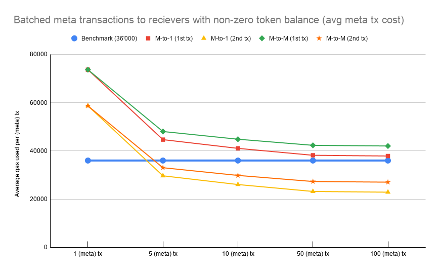
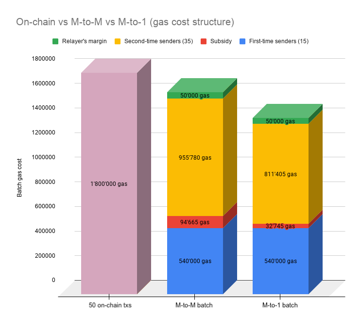

## Simple Summary

A meta transaction is a cryptographically signed message that a user sends to a relayer who then makes an on-chain transaction based on the meta transaction data. A relayer effectively pays gas fees in Ether, while an original sender can compensate the relayer in tokens.

This article explores the **economic viability** of **batched** meta transactions in terms of gas usage.

The **purpose** of the research is to find out whether batched meta transactions **spend less gas** (per meta tx) than a normal on-chain token transfer transaction.

Note that this research uses an implementation in form of a function called `processMetaBatch()` which **extends the ERC-20 token** standard. No other functions or contracts are involved, nor is there any usage of zkRollups or other L2 solutions.

## Abstract

Gas usage of batched meta transactions is affected by **many factors** ranging from the batch size, to the amount of expensive SSTORE instructions where storage value is set to non-zero from zero.

In this research, tests have been made for various scenarios in order to determine gas usage and figure out **which kinds** of batched meta transactions are the **most cost-effective**.

The results have shown that batched meta transactions make the most sense in case the receiver has a prior non-zero token balance and the sender has a prior non-zero meta nonce value.

The **M-to-M** batched meta transactions use case (many senders, many receivers) turned out as **not economically viable enough** in terms of gas savings. 

On the other hand, the **M-to-1** use case (many senders, 1 receiver) showed **promising gas cost reductions**, while also having good potential for real-world usage.

## Contents

- [Motivation](#motivation)
- [Specification of a proof-of-concept](#specification-of-a-proof-of-concept)
- [Rationale](#rationale)
- [Backwards Compatibility](#backwards-compatibility)
- [Implementation](#implementation)
- [Security Considerations](#security-considerations)
- [Test Cases](#test-cases)
- [Types of batched meta transactions](#types-of-batched-meta-transactions)
- [Gas usage tests](#gas-usage-tests)
	- [Benchmark](#benchmark)
	- [The first meta transaction](#the-first-meta-transaction)
	- [The second meta transaction (and subsequent transactions)](#the-second-meta-transaction-and-subsequent-transactions)
- [The economics](#the-economics)
	- [M-to-M example](#m-to-m-example)
	- [M-to-1 example](#m-to-1-example)
- [Conclusion](#conclusion)

## Motivation

Meta transactions have proven useful as a solution for Ethereum accounts that don't have any ether, but hold ERC-20 tokens and would like to move them (gas-less transactions).

With rising gas prices, meta transactions could also serve as a solution to avoid high gas fees, if batched together in one on-chain transaction.

This article explores the implementation and economic viability of that idea.

## Specification of a proof-of-concept

The implementation of the proof-of-concept is pretty straightforward. A user sends a meta transaction to a relayer (through relayer's web app, for example). The relayer waits for multiple meta txs to arrive until the meta tx fees (at least) cover the cost of the on-chain gas fee.


Technically, the implementation means **adding a couple of functions** to the existing **ERC-20** token standard:

- `processMetaBatch()`
- `nonceOf()` (optional)

You can see the proof-of-concept implementation in this file: [ERC20MetaBatch.sol](/contracts/ERC20MetaBatch.sol). This is an extended ERC-20 contract with added meta tx batch transfer capabilities (see function `processMetaBatch()`).

### `processMetaBatch()`

The `processMetaBatch()` function is responsible for receiving and processing a batch of meta transactions that change token balances.

```solidity
function processMetaBatch(address[] memory senders,
                          address[] memory recipients,
                          uint256[] memory amounts,
                          uint256[] memory relayerFees,
                          uint256[] memory blocks,
                          uint8[] memory sigV,
                          bytes32[] memory sigR,
                          bytes32[] memory sigS) public returns (bool) {
    
    address sender;
    uint256 newNonce;
    uint256 relayerFeesSum = 0;
    bytes32 msgHash;
    uint256 i;

    // loop through all meta txs
    for (i = 0; i < senders.length; i++) {
        sender = senders[i];
        newNonce = _metaNonces[sender] + 1;

        if(sender == address(0) || recipients[i] == address(0)) {
            continue; // sender or recipient is 0x0 address, skip this meta tx
        }

        // the meta tx should be processed until (including) the specified block number, otherwise it is invalid
        if(block.number > blocks[i]) {
            continue; // if current block number is bigger than the requested number, skip this meta tx
        }

        // check if meta tx sender's balance is big enough
        if(_balances[sender] < (amounts[i] + relayerFees[i])) {
            continue; // if sender's balance is less than the amount and the relayer fee, skip this meta tx
        }

        // check if the signature is valid
        msgHash = keccak256(abi.encode(sender, recipients[i], amounts[i], relayerFees[i], newNonce, blocks[i], address(this), msg.sender));
        if(sender != ecrecover(keccak256(abi.encodePacked("\x19Ethereum Signed Message:\n32", msgHash)), sigV[i], sigR[i], sigS[i])) {
            continue; // if sig is not valid, skip to the next meta tx
        }

        // set a new nonce for the sender
        _metaNonces[sender] = newNonce;

        // transfer tokens
        _balances[sender] -= (amounts[i] + relayerFees[i]);
        _balances[recipients[i]] += amounts[i];
        relayerFeesSum += relayerFees[i];
    }

	// give the relayer the sum of all relayer fees
    _balances[msg.sender] += relayerFeesSum;

    return true;
}
```

As you can see, the `processMetaBatch()` function takes the following parameters:

- an array of **sender addresses** (meta txs senders, not relayers)
- an array of **receiver addresses**
- an array of **amounts**
- an array of **relayer fees** (relayer is `msg.sender`)
- an array of **block numbers** (a due "date" for meta tx to be processed)
- Three arrays that represent parts of a **signature** (v, r, s)

**Each item** in these arrays represents **data of one meta tx**. That's why the **correct order** in the arrays is very important.

If a relayer gets the order wrong, the `processMetaBatch()` function would notice that (when validating a signature), because the hash of the meta tx values would not match the signed hash. A meta transaction with an invalid signature is **skipped**.

### `nonceOf()` (optional)

Nonces are needed due to the replay protection (see *Replay attacks* under *Security Considerations*).

The function `nonceOf()` is optional because if the meta nonce mapping is set to public, the function is not needed:

```solidity
mapping (address => uint256) public _metaNonces;
```

This is the approach that Uniswap uses in its [UniswapV2ERC20.sol](https://github.com/Uniswap/uniswap-v2-core/blob/4dd59067c76dea4a0e8e4bfdda41877a6b16dedc/contracts/UniswapV2ERC20.sol#L19) smart contract.

A more **appropriate** approach, though, is to set the mapping to **private** and access the values via the `nonceOf()` function:

```solidity
mapping (address => uint256) private _metaNonces;

// ...

function nonceOf(address account) public view returns (uint256) {
    return _metaNonces[account];
}
```

> The EIP-2612 (`permit()` function) also requires a nonce mapping. At this point, I'm not sure yet if this mapping should be **re-used** in case a smart contract implements both this idea and EIP-2612. 
> 
> At the first glance, it seems the nonce mapping could be re-used, but this should be thought through (and tested) for possible security implications.

## Rationale

The reason for this EIP is to research the economic viability of batched meta transactions. At first glance, batching (meta) transactions seem to offer significant gas reduction benefits.

If batched meta transactions do provide meaningful gas savings, the concept could be used as one of the approaches in Ethereum scaling.

## Backwards Compatibility

The code implementation of batched meta transactions is backwards compatible with ERC-20 (it only extends it with one function).

## Implementation

Link to the implementation (along with security considerations explained in the README): [https://github.com/defifuture/erc20-batched-meta-transactions](https://github.com/defifuture/erc20-batched-meta-transactions)

The `processMetaBatch()` function can be found in **contracts/ERC20MetaBatch.sol**.

## Security Considerations

Here is a list of potential security issues and how are they addressed in this implementation.

### Forging a meta transaction

The solution against a relayer forging a meta transaction is for a user to sign the meta transaction with their private key.

The `processMetaBatch()` function then verifies the signature using `ecrecover()`.

### Replay attacks

The `processMetaBatch()` function is secure against two types of a replay attack:

1. A nonce prevents a replay attack where a relayer would send the same meta tx more than once.
2. The current smart contract address (`address(this)`) is included in the meta tx data hash, which prevents a relayer from sending a meta tx to different token smart contracts (see the code below, under Signature validation). 

### Signature validation

Signing a meta transaction and validating the signature is crucial for this whole scheme to work.

The `processMetaBatch()` function validates a meta tx signature, and if it's **invalid**, the meta tx is **skipped** (but the whole on-chain transaction is **not reverted**).

```solidity
bytes32 msgHash = keccak256(abi.encode(sender, recipients[i], amounts[i], relayerFees[i], newNonce, blocks[i], address(this), msg.sender));

if(senders[i] != ecrecover(keccak256(abi.encodePacked("\x19Ethereum Signed Message:\n32", msgHash)), sigV[i], sigR[i], sigS[i])) {
    continue; // if sig is not valid, skip to the next meta tx in the loop
}
```

Why not reverting the whole on-chain transaction? Because there could be only one problematic meta tx, and the others should not be dropped just because of one rotten apple.

That said, it is expected of relayers to validate meta txs in advance before relaying them. That's why relayers are not entitled to a relayer fee for an invalid meta tx.

### Malicious relayer forcing a user into over-spending

A malicious relayer could delay sending some user's meta transaction until the user would decide to make the token transaction on-chain.

After that, the relayer would relay the delayed meta tx which would mean that the user would have made two token transactions (over-spending).

**Solution:** Each meta transaction should have an "expiry date". This is defined in a form of a block number by which the meta transaction must be relayed on-chain.

```solidity
function processMetaBatch(...
                          uint256[] memory blocks,
                          ...) public returns (bool) {
    
    //...

	// loop through all meta txs
    for (i = 0; i < senders.length; i++) {

        // the meta tx should be processed until (including) the specified block number, otherwise it is invalid
        if(block.number > blocks[i]) {
            continue; // if current block number is bigger than the requested number, skip this meta tx
        }

        //...
```

### Front-running attack

A malicious relayer could scout the Ethereum mempool to steal meta transactions and front-run the original relayer.

**Solution:** The protection that `processMetaBatch()` function uses is that it requires the meta tx sender to add the relayer's Ethereum address as one of the values in the hash (which is then signed).

When the `processMetaBatch()` function generates a hash it includes the `msg.sender` address in it:

```solidity
bytes32 msgHash = keccak256(abi.encode(sender, recipients[i], amounts[i], relayerFees[i], newNonce, blocks[i], address(this), msg.sender));

if(senders[i] != ecrecover(keccak256(abi.encodePacked("\x19Ethereum Signed Message:\n32", msgHash)), sigV[i], sigR[i], sigS[i])) {
    continue; // if sig is not valid, skip to the next meta tx in the loop
}
```

If the meta tx was "stolen", the signature check would fail because the `msg.sender` address would not be the same as the intended relayer's address.

### A malicious (or too impatient) user sending a meta tx with the same nonce through multiple relayers at once

A user that is either malicious or just impatient could submit a meta tx with the same nonce (for the same token contract) to various relayers. Only one of them would get the relayer fee (the first one on-chain), while the others would get an invalid meta transaction.

**Solution:** Relayers could **share a list of their pending meta txs** between each other (sort of an info mempool).

The relayers don't have to fear that someone would steal their respective pending transactions, due to the front-running protection (see above).

If relayers see meta transactions from a certain sender address that have the same nonce and are supposed to be relayed to the same token smart contract, they can decide that only the first registered meta tx goes through and others are dropped (or in case meta txs were registered at the same time, the remaining meta tx could be randomly picked).

At a minimum, relayers need to share this meta tx data (in order to detect meta tx collision):

- sender address
- token address
- nonce

### Too big due block number

The relayer could trick the meta tx sender into adding too big due block number - this means a block by which the meta tx must be processed. The block number could be far in the future, for example, 10 years in the future. This means that the relayer would have 10 years to submit the meta transaction.

**One way** to solve this problem is by adding an upper bound constraint for a block number within the smart contract. For example, we could say that the specified due block number must not be bigger than 100'000 blocks from the current one (this is around 17 days in the future if we assume 15 seconds block time).

```solidity
// the meta tx should be processed until (including) the specified block number, otherwise it is invalid
if(block.number > blocks[i] || blocks[i] > (block.number + 100000)) {
    // If current block number is bigger than the requested due block number, skip this meta tx.
    // Also skip if the due block number is too big (bigger than 100'000 blocks in the future).
    continue;
}
```

This addition could open new security implications, that's why it is left out of this proof-of-concept. But anyone who wishes to implement it should know about this potential constraint, too.

**The other way** is to keep the `processMetaBatch()` function as it is and rather check for the too big due block number **on the relayer level**. In this case, the user could be notified about the problem and could issue a new meta tx with another relayer that would have a much lower block parameter (and the same nonce).

## Test Cases

Link to tests: [https://github.com/defifuture/erc20-batched-meta-transactions/tree/master/test](https://github.com/defifuture/erc20-batched-meta-transactions/tree/master/test) 

## Types of batched meta transactions

There are three main types of batched meta transactions:

- 1-to-M: 1 sender, many recipients
- M-to-1: many senders, 1 recipient
- M-to-M: many senders, many recipients

Right from the start, we can see that **1-to-M use case does not make sense** for this implementation, because if there's only one unique sender in the whole batch, there's no need to sign and then validate each meta tx separately (which costs additional gas). In this case, a token multisender such as [Disperse.app](http://disperse.app/) can be more useful (higher throughput) and less costly.

The *Gas usage* section below will thus focus **only** on the **M-to-1** and **M-to-M** use cases.

> There are two additional types of batched meta transactions:
> 
> - A batch where sender and recipient are the same address
> - A batch that has only one unique sender and only one unique recipient (but both different from each other)
> 
> Both of these examples are very impractical and are not useful in reality. But the gas usage tests for both were made anyway (Test #2 and #3, respectively) and can be found in the [calculateGasCosts.js](/test/calculateGasCosts.js) file in the test folder.

## Gas usage tests

Gas usage is heavily dependent on whether a meta transaction is **the first transaction** of a **sender** (where prior nonce value is zero) and whether the **receiver** held any **prior token balance**.

The gas usage tests are thus separated into two groups:

- **First-meta-transaction tests** (initially sender has a zero nonce, and a receiver has a zero token balance)
- **Second-meta-transaction tests** (sender has a non-zero nonce value, and a receiver has a non-zero token balance)

All the tests were run with different batch sizes:

- 1 meta tx in the batch
- 5 meta txs in the batch
- 10 meta txs in the batch
- 50 meta txs in the batch
- 100 meta txs in the batch

### Benchmark

A benchmark for the following tests is gas usage cost in case of a **normal on-chain token transfer transaction**.

There are **two possible benchmarks** and they both depend on whether a recipient has a prior non-zero token balance, or not.

In case a **recipient's token balance** (prior to the meta tx) is **zero**, the on-chain transaction cost is **51'000 gas**.

But if a **recipient's token balance is bigger than zero**, the on-chain token transfer transaction would cost only **36'000 gas**.

### The first meta transaction

In this group of tests, a **sender's nonce** prior to the meta tx is **always 0**.

#### M-to-1 (to a zero-balance receiver)

The M-to-1 (many senders, 1 receiver with a zero token balance) gas usage test results are the following:

- 1 meta tx in the batch: 88666/meta tx (total gas: 88666)
- 5 meta txs in the batch: 47673.6/meta tx (total gas: 238368)
- 10 meta txs in the batch: 42553/meta tx (total gas: 425530)
- 50 meta txs in the batch: 38485.5/meta tx (total gas: 1924275)
- 100 meta txs in the batch: 38025.83/meta tx (total gas: 3802583)

A further test has been done to determine that having 4 meta txs in a batch costs 50232 gas/meta tx. 

This means that the **M-to-1 use case beats the benchmark** (51'000 gas) in case of 4 or more meta txs in a batch.

> Note that using 51'000 gas as a benchmark in this example might not be entirely fair because only the first meta tx is made towards the receiver with a zero token balance. After that, the receiver's balance is non-zero.
> 
> Hence, the next test is more appropriate.

#### M-to-1 (to a non-zero balance receiver)

The M-to-1 (many senders, 1 receiver with a non-zero token balance) gas usage test results are the following:

- 1 meta tx in the batch: 73666/meta tx (total gas: 73666)
- 5 meta txs in the batch: 44671.2/meta tx (total gas: 223356)
- 10 meta txs in the batch: 41049.4/meta tx (total gas: 410494)
- 50 meta txs in the batch: 38182.62/meta tx (total gas: 1909131)
- 100 meta txs in the batch: 37875.83/meta tx (total gas: 3787583)

The **benchmark**, in this case, is **36'000 gas**, because the receiver already has a prior non-zero token balance. **None** of the batch sizes goes below the benchmark.

#### M-to-M (to a zero-balance receiver)

The M-to-M (many senders, many receivers) gas usage test results are the following:

- 1 meta tx in the batch: 88666/meta tx (total gas: 88666)
- 5 meta txs in the batch: 63031.2/meta tx (total gas: 315156)
- 10 meta txs in the batch: 59833/meta tx (total gas: 598330)
- 50 meta txs in the batch: 57298.86/meta tx (total gas: 2864943)
- 100 meta txs in the batch: 57032.51/meta tx (total gas: 5703251)

As you can see, the M-to-M example gas cost (per meta tx) in this case **never falls below** the benchmark value of **51'000 gas**.

#### M-to-M (to a non-zero balance receiver)

In this example (as opposed to the previous one), the recipient has a prior non-zero token balance:

- 1 meta tx in the batch: 73678/meta tx (total gas: 73678)
- 5 meta txs in the batch: 48038.4/meta tx (total gas: 240192)
- 10 meta txs in the batch: 44842.6/meta tx (total gas: 448426)
- 50 meta txs in the batch: 42310.62/meta tx (total gas: 2115531)
- 100 meta txs in the batch: 42032.75/meta tx (total gas: 4203275)

In this case, the benchmark is **36'000 gas** because the recipient had a prior non-zero token balance. As you can see, the gas used in this use case **never beats** the benchmark.

<br>

In this group of batched meta transaction tests, none of the use cases beats the benchmark. Even the first example, M-to-1 (to a zero-balance receiver), cannot be considered as successful, because the benchmark should really be 36'000 after the first meta tx is processed.

The main issue is, of course, the fact that it is each sender's **first** meta transaction, which means that the sender's nonce has to go from 0 to 1. This SSTORE operation is very expensive and takes 20'000 gas.

Updating a non-zero value (for example raising a nonce value from 1 to 2) is a much less expensive operation. It costs only 5'000 gas.

Let's now see the results of **the second** meta tx gas tests.

### The second meta transaction (and subsequent transactions)

Note that in this group of tests, the **sender's nonce is a non-zero value** (more precisely: 1). This brings visible gas reductions.

#### M-to-1 (to a non-zero balance receiver)

- 1 meta tx in the batch: 58666/meta tx (total gas: 58666)
- 5 meta txs in the batch: 29671.2/meta tx (total gas: 148356)
- 10 meta txs in the batch: 26048.2/meta tx (total gas: 260482)
- 50 meta txs in the batch: 23183.1/meta tx (total gas: 1159155)
- 100 meta txs in the batch: 22876.07/meta tx (total gas: 2287607)

An additional test showed that the **benchmark** (36'000) **is beaten** already at 3 meta transactions in a batch.

#### M-to-M (to a zero-balance receiver)

- 1 meta tx in the batch: 73666/meta tx (total gas: 73666)
- 5 meta txs in the batch: 48026.4/meta tx (total gas: 240132)
- 10 meta txs in the batch: 44829.4/meta tx (total gas: 448294)
- 50 meta txs in the batch: 42298.14/meta tx (total gas: 2114907)
- 100 meta txs in the batch: 42032.27/meta tx (total gas: 4203227)

In this case, the benchmark is 51'000, because the receiver has a zero-value balance. This M-to-M example **beats the benchmark** starting from 4 meta txs in a batch.

#### M-to-M (to a non-zero balance receiver)

- 1 meta tx in the batch: 58666/meta tx (total gas: 58666)
- 5 meta txs in the batch: 33024/meta tx (total gas: 165120)
- 10 meta txs in the batch: 29830.6/meta tx (total gas: 298306)
- 50 meta txs in the batch: 27307.98/meta tx (total gas: 1365399)
- 100 meta txs in the batch: 27033.59/meta tx (total gas: 2703359)

An additional test shows that 4 or more meta txs in a batch have a **lower** average gas than the benchmark (36'000).

<br>

All of the examples beat their respective benchmarks for the second or subsequent sender's meta transactions.

### Graph

This graph represents how M-to-1 and M-to-M fare in the case of the first and the second sender's meta transactions.



Note that only transactions where the benchmark is 36'000 are included (meaning the recipient has a prior non-zero token balance).

## The economics

Let's consider the real-world economic viability of both use cases, M-to-M and M-to-1, by calculating gas cost in USD for each.

First, we need to make a few **assumptions**:

**A) The gas price is 500 Gwei**

The purpose of batched meta transactions is to lower the tx cost for the end-user, which means batching comes useful in times of high gas prices.

**B) Ether price is 350 USD**

At the time of writing these words, the ETH price is 350 USD, so let's take this as the price for our transaction cost calculations.

**C) All meta transactions are sent to receivers with non-zero token balances**

This means the benchmark is always 36'000 gas. Having a constant benchmark will make calculations and cost comparisons easier.

**D) A relayer sends the batch after it reaches the size of 50 meta txs**

Let's say the token is very popular, so there are plenty of people who want to send a meta transaction and the relayer has no trouble getting 50 meta transactions into a single batch.

**E) A relayer includes (in a batch) no more than 15 meta txs from first-time senders**

Meta transactions coming from first-time senders are the most expensive (because these senders have a zero nonce value). 

Since meta txs from first-time senders do not go below the benchmark, the relayer subsidizes them by charging second-time senders more.

**F) The relayer wants to earn a margin equivalent to 1000 gas per each meta transaction**

Running a relayer is a business that needs to earn a margin (and make a profit) in order to make it viable.

---

Following the above assumptions, the formula to calculate the gas cost in USD is: 

```
gas cost in USD = 0.000000001 * 500 Gwei * 350 USD * gas amount
```

### M-to-M example

As per our assumptions, there are **15 first-time senders**. The cost of each such meta tx is **42'310.62 gas/mtx**. This is obviously above the benchmark:

```
gas amount above benchmark = (42311 gas/mtx - 36000) * 15 = 94665 gas
```

The gas amount above the benchmark for all 15 first-time senders is **94'665 gas**.

With the **second-time senders**, the story is just the opposite. Each of their meta transactions costs **27'307.98 gas/mtx**, which is well below the benchmark.

```
gas amount below benchmark = (36000 - 27308 gas/mtx) * 35 = 304220 gas
```

The gas savings for all the 35 second-time senders is **304'220 gas**.

Since relayers are passing the gas cost overages (over the benchmark) of first-time senders to second-time senders, we need to make additional calculations in order to determine the final gas cost per meta tx for second-time senders.

We need to subtract the gas cost overage of first-time senders from the gas savings of second-time senders. In addition, we also need to subtract the margin that the relayer expects from this batch (`50 * 1000 gas`):

```
final gas savings for second-time senders = 304220 - 94665 - 50000 = 159555 gas
```

Next, let's divide this number by the amount of second-time senders:

```
final gas savings per each second-time sender = 159555 / 35 = 4559 gas
```

Instead of saving around 8'700 gas per meta tx, each second-time sender will only save 4'559 gas (due to subsidizing first-time senders).

The meta tx gas cost for second-time senders is now the following:

```
meta tx gas cost = 36000 - 4559 = 31441 gas
```

To sum up, let's take a look at how much each of the users would pay for a meta transaction (or earn in case of a relayer):

- **First-time sender:** 6.30 USD/mtx (0 USD savings compared to benchmark)
- **Second-time sender:** 5.50 USD/mtx (0.80 USD/mtx savings compared to benchmark)
- **Relayer's margin:** 0.175 USD/mtx (8.75 USD for the whole batch)

The second-time sender would pay **13% less in tx fees** by submitting a meta tx, compared to doing an on-chain token transfer transaction (benchmark).

### M-to-1 example

Again, there are 15 first-time senders, whose meta transactions cost **38182.62 gas/mtx** each. This is **slightly above** the benchmark:

```
gas amount above benchmark = (38183 gas/mtx - 36000) * 15 = 32745 gas
```

The gas amount above the benchmark for all 15 first-time senders is **32'745 gas**.

With the second-time senders, the story is the opposite (gas savings instead of gas cost overage). Each meta tx of a second-time sender costs only **23'183.1 gas/mtx**:

```
gas amount below benchmark = (36000 - 23183 gas/mtx) * 35 = 448595 gas
```

Next, we need to subtract the cost overage of first-time senders and the margin of a relayer:

```
final gas savings for second-time senders = 448595 - 32745 - 50000 = 365850 gas
```

Now, let's divide this number by the amount of second-time senders:

```
final gas savings per each second-time sender = 365850 / 35 = 10453 gas
```

The meta tx gas cost for second-time senders is the following:

```
meta tx gas cost = 36000 - 10453 = 25547 gas
```

This is, of course, less than the original amount of 23'183.1 gas/mtx, but still significantly below the benchmark.

To sum up, let's take a look at how much each of the users would pay for a meta transaction (or earn in case of a relayer):

- **First-time sender:** 6.30 USD/mtx (0 USD savings compared to benchmark)
- **Second-time sender:** 4.47 USD/mtx (1.83 USD/mtx savings compared to benchmark)
- **Relayer's margin:** 0.175 USD/mtx (8.75 USD for the whole batch)

The second-time sender would pay **30% less in tx fees** by submitting a meta tx, compared to doing an on-chain token transfer transaction (benchmark).

### Graph: batch gas structure comparison



## Conclusion

The gas savings for **M-to-M** meta transactions (13%) are much lower compared to gas savings for **M-to-1** meta txs (30%).

That said, these savings heavily rely on a **strategy** that each relayer employs. The strategy in these examples is one option, but a relayer could decide to take a different path, which means the potential gas savings could be a lot different.

Still, the ratio between M-to-M and M-to-1 gas costs should remain more or less the same. **M-to-1** obviously **does a much better job** at keeping gas **costs lower** than M-to-M.

Considering the examples above, it's hard to see the M-to-M batching approach as an economically viable option (but, again, a different relayer strategy may counter this conclusion).

A **much more promising** use case is using **M-to-1** batched meta transactions. This could be quite handy in concert **with other L2 solutions** (like sidechains) where a user needs to deposit funds to a constant address.

Another use case could be locking tokens for staking, or putting them in a yield farming vault (applicable only if the receiving address is the same for all users).

To conclude - depending on the **relayer strategy** and the **use case**, batched meta transactions can bring the transaction costs down for transferring tokens. 

But these reductions are **not as significant** as one would hope. In some cases it's even cheaper to send a normal on-chain token transaction instead of a meta transaction.

Nevertheless, the topic of meta transactions **should be explored further** in order to find **specialized use cases** where meta transactions can provide a **valuable** solution.

## Sources

1. Griffith, Austin Thomas (2018): [Ethereum Meta Transactions](https://medium.com/@austin_48503/ethereum-meta-transactions-90ccf0859e84), Medium, 10 August 2018.
2. Kharlamov, Artem (2018): [Disperse Protocol](https://github.com/banteg/disperse-research/blob/master/paper/disperse.pdf), GitHub, 27 November 2018.
3. Lundfall, Martin (2020): [EIP-2612: permit – 712-signed approvals](https://eips.ethereum.org/EIPS/eip-2612), Ethereum Improvement Proposals, no. 2612, April 2020.
4. Sandford, Ronan (2019): [ERC-1776 Native Meta Transactions](https://github.com/ethereum/EIPs/issues/1776), GitHub, 25 February 2019.
5. Weiss, Yoav, Dror Tirosh, Alex Forshtat (2018): [EIP-1613: Gas stations network](https://eips.ethereum.org/EIPS/eip-1613), Ethereum Improvement Proposals, no. 1613, November 2018.

### Acknowledgements

A huge thanks to Patrick McCorry (@stonecoldpat), Artem Kharlamov (@banteg), Matt (@lightclient), and Ronan Sandford (@wighawag) for providing valuable feedback.

## Copyright

Copyright and related rights are waived via [CC0](https://creativecommons.org/publicdomain/zero/1.0/).