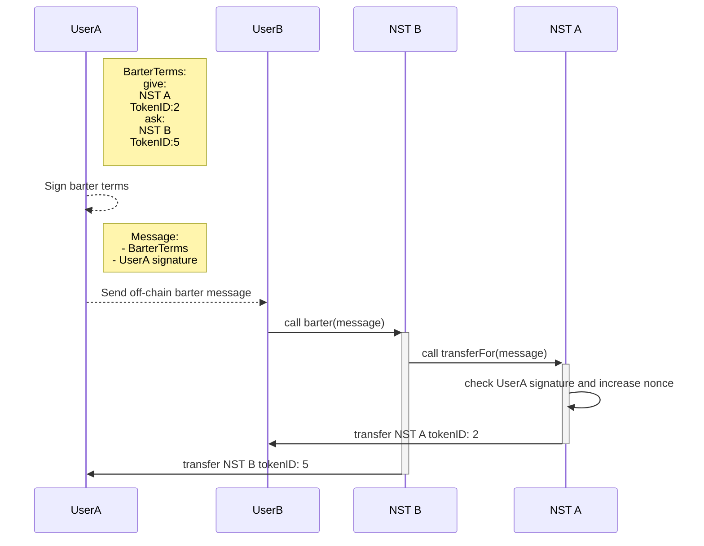

## Abstract

This EIP is an extension of [EIP-721](./eip-721.md) to create non-sellable tokens (NST). It proposes a strong resriction on transfers in order to prevent speculation on token price while maintaining the possibility of transfers, transfers are performed in a barter way (send to receive or receive to send) in an ecosystem controled by the creator.

## Motivation

Interest for soulbound tokens (SBT) in the Ethereum community still growing since the V. Buterin idea publication (Soulbound, 2022-01-26), highlighting the non-transferrability (non-)features to prevent, _in fine_, speculation of the token. While a lot of propositions emerged for implementation of SBT, the non-transferability is often too restrictive and requires a certain level of centralization, especially when users want to transfer a SBT between two owned accounts. Thus SBTs are way more fitted for account-bounded properties such as reputation, voting rights, privileges, ...

In case of transferable items which cannot be sellable, SBTs can fit but they require strong level of centralization as transfer are restricted by the token creator (or the community in case of DAO managed SBT). Here some examples of possibles NSTs:

- Video games assets that could be exchangable but non sellable, to avoid any speculation around the assets, while keeping the NFTs existing benefits
- Event tickets: Ticket hijacking is a common problem for many popular events and can force fans to pay inflated prices for tickets. By using a non-sellable token standard, event organisers could create tickets that cannot be resold, ensuring that fans can only buy tickets at face value
- Kids NSTs, in all applications dedicated to minor individuals, to avoid them to make or transact money
- Proof of authenticity for luxury items, but avoiding any economic interest to keep the NFT to resell it separately from the physical object
- Loyalty points: Many businesses offer loyalty programmes to their customers to encourage them to return. These programmes typically award points or other rewards for purchases made at the business. Using a standard non-sellable token, businesses could issue tokens that can only be used for shop credit or other non-cash rewards, ensuring that customers cannot redeem them for cash.
- Company Benefits: A company could be giving out benefits to its employees in a closed environment its controls ( hence being able to freely add in or remove exchangeables benefits).

NSTs propose a way to enforce users to perform barter of tokens between two authorized tokens in order to maintain a value equivalence in the exchange and so reduce the risk of speculation associated with an one way transfer. NSTs would provide a solution for transferring non-valuable tokens between projects based on their true value instead of their perceived/ speculated value without leveraging a third party.

## Specification

The key words "MUST", "REQUIRED", "SHOULD NOT", "RECOMMENDED", "MAY", and "OPTIONAL" in this document are to be interpreted as described in RFC 2119 and RFC 8174.

### Overview

An approval mechanism is REQUIRED before performing barters between two tokens, belonging to the same or different NST contracts (see [Permissonless barter](#permissionless-barter)).

Every contract compliant with this EIP MUST implement this transfer mecanism:

1. UserA signs a message taking up the terms of the barter
2. UserB accepts and concludes the barter by calling the `barter` function



### NST

#### Methods

In the following, the `BarterTerms` struct are defined as follows:

```solidity
struct Componant {
    address tokenAddr;
    uint256 tokenId;
}

struct BarterTerms {
    Componant bid;
    Componant ask;
    uint256 nonce;
    address owner;
    uint48 deadline;
}
```

See [Define the barter terms](#define-the-barter-terms) section for precisions on this struct.

##### transferFor

Verifies signature following the [EIP-712](https://github.com/ethereum/EIPs/blob/master/EIPS/eip-712.md) procedure, increases the nonce of `data.owner` and transfers the `data.bid.tokenId` to `to` account.

This function MUST be called only by an authorized NST contracts, the call MUST occur when users are calling the `barter` function.

NOTE: using `ECDSA.sol`(`v4.7.3` at least) and `EIP-712.sol` libraries from OpenZeppelin is very RECOMMENDED for signature verifications, verification only based on `ecrecover` SHOULD NOT be used (see the Solidity documentation, Mathematical and Cryptographic Functions).

```solidity
function transferFor(BarterTerms memory data, address to, bytes memory signature) external;
```

##### barter

Calls the `transferFor` function on the `data.bid.tokenAddr`, MAY be self, and transfers `data.bid.tokenId` to `data.owner`

This function MUST check if `data.bid.tokenAddr` is an authorized contract before calling `transferFor`

```solidity
function barter(BarterTerms memory data, bytes memory signature) external;
```

##### nonce

Returns the counter state of successful barters concluded as bidder/proposer.

This value MUST be included in the barter terms signed message to prevents a signature from being used multiple times.

```solidity
function nonce(address account) external view returns (uint256);
```

##### isBarterable

OPTIONAL - Returns `true` is the `tokenAddr` is authorized to perform barter.

```solidity
function isBarterable(address tokenAddr) external view returns (bool);
```

#### Events

##### BarterNetworkUpdated

MUST trigger when NST contract address is authorized or revoked.

```solidity
event BarterNetworkUpdated(address indexed tokenAddr, bool indexed barterable);
```

### Define the barter terms

Barter terms are represented as the `barter` function's arguments and MUST:

- be signed following the [EIP-712](https://github.com/ethereum/EIPs/blob/master/EIPS/eip-712.md) procedure
- be shared equally between NSTs
- have included for each tokens:
  - contract address
  - token ID
- have included for the signer:
  - a nonce to prevent signature reuse
  - address of the signer
  - a timestamp deadline

Barter terms MAY be represented as nested struct as follows:

```solidity
struct Componant {
    address tokenAddr;
    uint256 tokenId;
}

struct Message {
    uint256 nonce;
    address owner;
    uint48 deadline;
}

struct BarterTerms {
    Componant bid;
    Componant ask;
    Message message;
}
```

Barters MAY be declined into several types, if any, `barter` and `transferFor` MUST leverage Solidity's [functions overloading](https://docs.soliditylang.org/en/latest/contracts.html#function-overloading) to implement the specific logic for each barter type. See following example:

```solidity
{...}
struct MultiComponant {
    address tokenAddr;
    uint256[] tokenIds;
}

struct MultiBarterTerms {
    MultiComponant bid;
    MultiComponant ask;
    Message message;
}

function barter(BarterTerms memory data, bytes memory signature) external;
function barter(MultiBarterTerms memory data, bytes memory signature) external;
```

### Contract interface

Every contract compliant with this EIP MUST implement [ERC-721](./eip-721.md) where the following methods MUST be disabled:

- `safeTransferFrom(address,address,uint256,bytes)` (`0xb88d4fde`)
- `safeTransferFrom(address,address,uint256)` (`0x42842e0e`)
- `transferFrom(address,address,uint256)` (`0x23b872dd`)

## Rationale

This EIP has been designed to leverage existant features of the [ERC-721](./eip-721.md) such as `approve/allowance` and `Transfer` events and leave the full control on the implementation.

### Permissionless barter

Tokens created compliant with this EIP MUST design authorizations between tokens on both `barter` and `transferFor` functions to keep the non-sellability of tokens. We explored cases of permissionless or one-way permissionless barter, in both cases it opened up the possibility of a bypassed one-way transfer.

#### Fully permissionless

Allowing any barter type between NSTs make no such sense to prevent the non-sellability of the token. Any smart contract could bypass this kind of transfer by creating a valueless NST to barter with others. In this case, replacing transfer functions would be useless.

The value equivalence is so maintained by tokens creators as a whitelist, keeping these authorisations at the contract level is important and would help create a network of barterable NSTs.

Based on value equivalence we leverage the game theory to enforce the non-sellability instead of stronger restrictions or centralization which would lead to higher code complexity and poor interoperability. Indeed the strong couterparty at the transfer made NSTs highly illiquid to be subject to a sale on a marketplace or by OTC agreement.

#### One way permissionless

##### On `transferFor`

Leaving this method permissionless would lead to the possibility to self transfer the token to any other address, without a barter.

##### On `barter`

Using `barter` without restriction opens up the risk of unwanted barters between non-equivalent NSTs. Thus any valueless NST could be used to perform a one-way transfer.

### Multi NST contract barter

Implementing a many-to-many NST contract is quite imossible as the barter occurs at the contract level, therefore implement such feature require to call and write on each NST contracts. The gas usage for such feature would be too expensive.

### Register of allowed NST

Creating an universal register for barter allowances between NST contract (like the [ERC-1820](./eip-1820.md)) would be hard to maintain and easy to bypass.

### Third party protocol

Implementing a service for barter NFT is already existant (see Sudoswap OTC). Such a service still enable one-way transfer through EIP-721 properties and thus not prevent the sellability of the token.

## Backwards Compatibility

Excepted disabled methods specified in [Contract interface](#contract-interface), this EIP is backward compatible with [EIP-721](./eip-721.md).

## Test Cases

The references implementation includes unit tests written using Foundry

## Reference Implementation

[Implementations examples](../assets/eip-n) has been designed for this proposal.

## Security Considerations

### Sign and broadcast signed messages

In regards to [EIP-712 security considerations](./eip-712.md#security-considerations), we includes in the [Specification](#specification) that signed including barter terms must include a `nonce` to avoid replay attack, `tokenAddr` and the `tokenId` to avoid front-running attack on a barter.

Moreover adding a `deadline` is also recommanded in case of non-used signed message.

### Allowing barter between NST

Enable barter between NST should be designed as a privilege for the token owner (EOA, multisig, DAO, ...) but even with this restriction this latter should pay a particular attention on the implementation of the NST.

Every barter rely on an external call of the `transferFor` function, keep in mind that malicious actors can implement fake signature verification and/or not implement the transfer of token.

## Copyright

Copyright and related rights waived via [CC0](../LICENSE.md).
