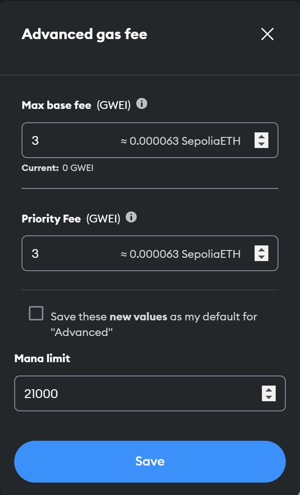

---
eip:
title: Rename `gas` to `mana`
description: This EIP picks up on Vitalik Buterin's (@vbuterin) EIP-102, which aimed to rename `gas` to `mana`
author: Pascal Caversaccio (@pcaversaccio)
discussions-to: https://ethereum-magicians.org/t/rename-gas-to-mana/13570
status: Draft
type: Standards Track
category: Core
created: 2023-03-27
requires: 102
---

## Abstract

This EIP picks up on Vitalik Buterin's (@vbuterin) proposal in [EIP-102](https://github.com/ethereum/EIPs/issues/29), which aimed to rename `gas` to `mana`.

## Motivation

Vitalik's original motivation is threefold and is still valid today:

- `mana` more accurately reflects the increased environmental friendliness of Proof-of-Stake (PoS),
- `mana` is generally understood to be ephemeral and non-transferable, and thus represents accurately the characteristic of how `gas` is actually used within Ethereum, and
- `mana` is generally considered renewable, whilst (natural) gas is considered non-renewable.

## Specification

The key words "MUST", "MUST NOT", "REQUIRED", "SHALL", "SHALL NOT", "SHOULD", "SHOULD NOT", "RECOMMENDED", "NOT RECOMMENDED", "MAY", and "OPTIONAL" in this document are to be interpreted as described in RFC 2119 and RFC 8174.

The core term `gas` MUST be renamed to `mana`. This MUST also include renaming the opcode `Gas` to `Mana`.

## Rationale

The underlying rationale for reviving the original [EIP-102](https://github.com/ethereum/EIPs/issues/29) is that we have finally arrived at the age of PoS, and given the roadmap ahead, I consider this moment as the last opportunity to make such a far-reaching semantic change.

## Backwards Compatibility

This proposal is not backward compatible as it renames the core term `gas`.

## Test Cases

### Example 1

If a transaction requires more `mana` than allowed by the `manaLimit`, it is reverted as an _out-of-mana_ transaction.

### Example 2

A Solidity contract to estimate the used `mana` via the _new_ `manaleft()` syntax for dedicated function calls.

```solidity
// SPDX-License-Identifier: MIT
pragma solidity 0.8.19;

contract ManaTesting {
    function testInlined(uint256 length) external view returns (uint256 manaUsed) {
        uint256 total;
        uint256 startMana = manaleft();
        for (uint256 i; i < length; i = _uncheckedInc(i)) {
            total += i;
        }
        manaUsed = startMana - manaleft();
    }

    function _uncheckedInc(uint256 i) private pure returns (uint256) {
        unchecked {
            return i + 1;
        }
    }
}
```

### Example 3

An example of how to set the `manaLimit` in MetaMask:



## Security Considerations

There are no security considerations directly related to the renaming of `gas` to `mana`.

## Copyright

Copyright and related rights waived via [CC0](../LICENSE.md).
