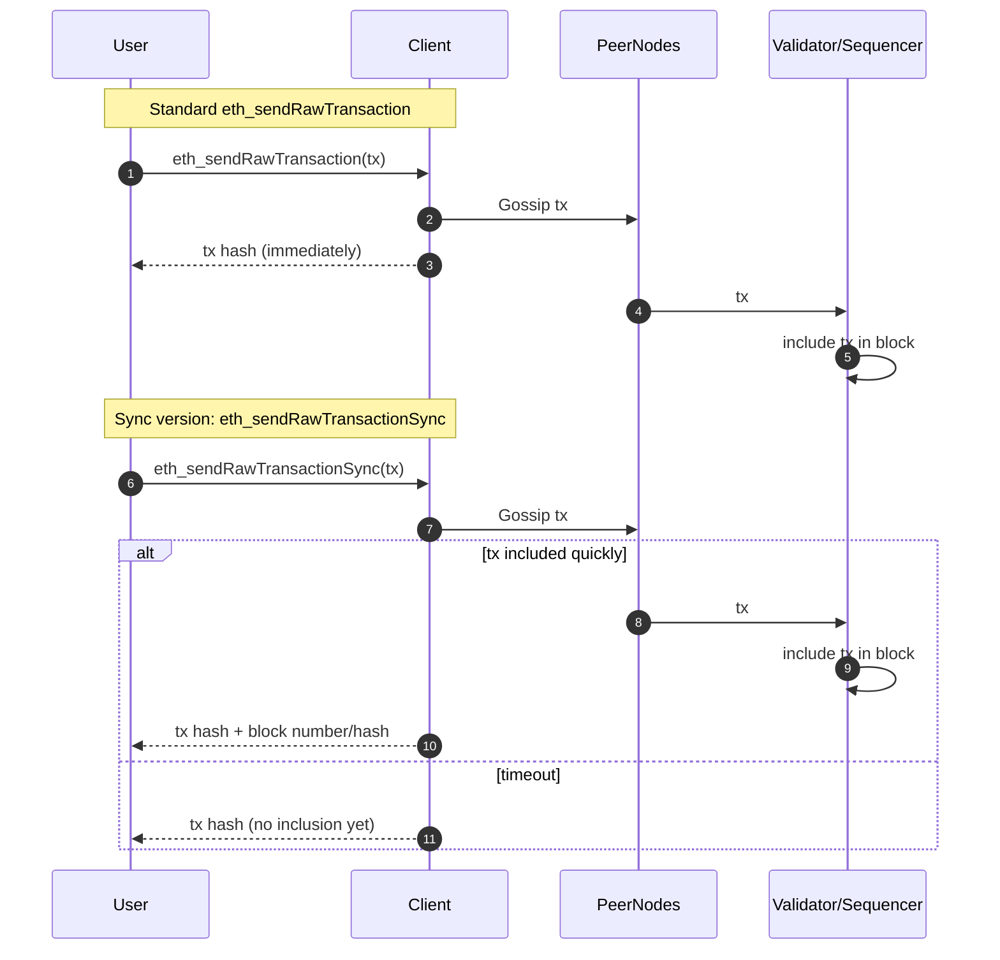

## Abstract

This EIP proposes a new JSON-RPC method `eth_sendRawTransactionSync` which reduces the latency between transaction submission and user confirmation by blocking until the transaction has been included in a block or safely gossiped to peers. This method addresses the user experience gap in high-frequency applications by offering stronger delivery guarantees than `eth_sendRawTransaction`.

## Motivation

The current `eth_sendRawTransaction` method returns almost immediately after transaction pool admission, providing weak guarantees about propagation or block inclusion. This creates uncertainty and requires clients to implement repeated polling or optimistic UX patterns. By allowing clients to block until a transaction is known to be reliably propagated or included, we can reduce redundant queries and improve latency-sensitive use cases like account abstraction paymasters, rollup sequencers, and high-frequency trading systems.

## Specification

A new JSON-RPC method is introduced:

```json
eth_sendRawTransactionSync
```

### Parameters

Identical to `eth_sendRawTransaction`:

```json
[
  "0x..." // the raw transaction data
]
```

### Behavior

- Upon receiving the request, the client attempts to propagate the transaction.
- The request blocks until one of the following occurs:
  - The transaction is included in a block.
  - A timeout (e.g. 1-2 seconds) elapses and the client confirms the transaction is in its pool and has been gossiped to peers.

The client then returns an object containing:

```json
{
  "transactionHash": "0x...",
  "blockHash": "0x...", // optional, if included in a block
  "blockNumber": "0x..." // optional, if included in a block
}
```

If the timeout elapses before block inclusion, `blockHash` and `blockNumber` are null.

### Network Sequence Comparison



## Rationale

### Why Not Extend Existing RPC?

Modifying `eth_sendRawTransaction` to support this behavior would risk compatibility issues and ambiguity. A separate method makes the semantics explicit and opt-in.

### Blocking Behavior and Timeouts

Clients SHOULD allow configuration of the timeout period, defaulting to 2 second. This balances responsiveness and propagation guarantees without creating excessive overhead in node clients.

## Backwards Compatibility

This is a non-breaking addition. Clients not supporting the method will simply return `method not found`.

## Reference Implementation

A prototype is being developed in reth:
- [issue](https://github.com/paradigmxyz/reth/issues/16674)
- [pull request](https://github.com/paradigmxyz/reth/pull/16683)

## Security Considerations

- **DoS Vector:** Care must be taken to avoid excessive blocking on RPC threads. Implementations should limit concurrency or isolate this method on separate workers.
- **False Assurance:** Clients must make clear that “sync” only means gossiped or included, not finalized. Applications must still handle reorg risk.

## Copyright

Copyright and related rights waived via [CC0](../LICENSE.md).
