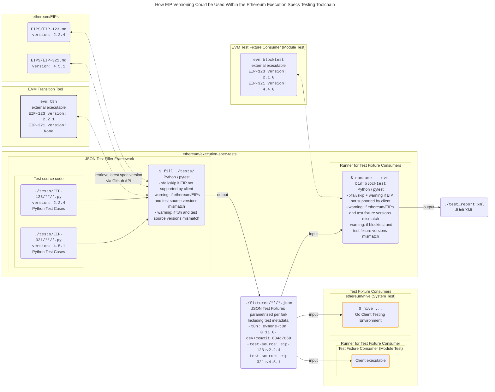

# DRAFT: EIP-X - Versioning Scheme for EIPs

---
title: Versioning Scheme for EIPs
description: Use a versioning scheme for EIPs based on changes made to their Specification section.
author: <!-- a comma separated list of the author's or authors' name + GitHub username (in parenthesis), or name and email (in angle brackets).  Example, FirstName LastName (@GitHubUsername), FirstName LastName <foo@bar.com>, FirstName (@GitHubUsername) and GitHubUsername (@GitHubUsername) -->
discussions-to: https://ethereum-magicians.org/t/XXXX
status: Draft
type: Meta
created: 2023-11-XX
---

<!--
  READ EIP-1 (https://eips.ethereum.org/EIPS/eip-1) BEFORE USING THIS TEMPLATE!

  This is the suggested template for new EIPs. After you have filled in the requisite fields, please delete these comments.

  Note that an EIP number will be assigned by an editor. When opening a pull request to submit your EIP, please use an abbreviated title in the filename, `eip-draft_title_abbrev.md`.

  The title should be 44 characters or less. It should not repeat the EIP number in title, irrespective of the category.

  TODO: Remove this comment before submitting
-->

## Abstract

<!--
  The Abstract is a multi-sentence (short paragraph) technical summary. This should be a very terse and human-readable version of the specification section. Someone should be able to read only the abstract to get the gist of what this specification does.

  TODO: Remove this comment before submitting
-->

This EIP introduces a versioning scheme for [Standards Track](https://eips.ethereum.org/EIPS/eip-1#eip-types) EIPs by applying [Semantic Versioning](https://semver.org/) to the EIP's Specification section once its status has changed from `Draft` to `Review`.

## Motivation

<!--
  This section is optional.

  The motivation section should include a description of any nontrivial problems the EIP solves. It should not describe how the EIP solves those problems, unless it is not immediately obvious. It should not describe why the EIP should be made into a standard, unless it is not immediately obvious.

  With a few exceptions, external links are not allowed. If you feel that a particular resource would demonstrate a compelling case for your EIP, then save it as a printer-friendly PDF, put it in the assets folder, and link to that copy.

  TODO: Remove this comment before submitting
-->

EIP specifications often receive increasing modifications as more people review them, which is generally the case as client teams start implementing the specifications and the community gains a better understanding of their interaction with the rest of the protocol. These changes can be difficult to track. In particular, as EVM reference tests are often not maintained (and generally not released) by client teams or the EIP's authors, it can be difficult to ascertain whether a release of reference tests (for example from ethereum/tests or ethereum/execution-spec-tests) is sufficient, or even valid, to test the latest version of an EIP's specifications or the specification as currently implemented by a client.

This EIP proposes a semantic versioning scheme for the Specification section and an addition of a CHANGELOG section for EIPs that allows the community to easily track changes, their impact on current client and test implementations and maintain a clear history.

## Specification

<!--
  The Specification section should describe the syntax and semantics of any new feature. The specification should be detailed enough to allow competing, interoperable implementations for any of the current Ethereum platforms (besu, erigon, ethereumjs, go-ethereum, nethermind, or others).

  It is recommended to follow RFC 2119 and RFC 8170. Do not remove the key word definitions if RFC 2119 and RFC 8170 are followed.

  The key words "MUST", "MUST NOT", "REQUIRED", "SHALL", "SHALL NOT", "SHOULD", "SHOULD NOT", "RECOMMENDED", "NOT RECOMMENDED", "MAY", and "OPTIONAL" in this document are to be interpreted as described in RFC 2119 and RFC 8174.

  TODO: Remove this comment before submitting
-->

Once an EIP has moved out of "Draft" status, it MUST use the EIP versioning scheme outlined below. It MAY already use the versioning scheme in "Draft" status, which could be useful if the specification is actively being implemented. If more than one team is implementing the specification, it is RECOMMENDED to change the EIP's status to "Review".

The EIP versioning scheme MUST follow a semantic versioning scheme of `MAJOR.MINOR.PATCH`, which is applied as follows:

1. `MAJOR`: A breaking change to the specifications that requires an implementation change and a change to the reference tests.
2. `MINOR`: An addition to the specifications that does not require changing an existing implementation, but requires additional implementation and additional test coverage to be added to the reference tests.
3. `PATCH`: Any cosmetic change to, or a reformulation of, the EIP without specification change.

Before the EIP has moved out of Draft status and is being versioned, the version number MUST initially have `MAJOR` version `0`.

For every change made to an EIP via a PR made to ethereum/EIPs, the PR author MUST add a new entry to the CHANGELOG section of the EIP that outlines the changes made within the PR. This CHANGELOG entry MUST include the following:

1. A new version number that follows the semantic versioning scheme outlined above.
2. The date when the changes where introduced.
3. A link to the ethereum/EIPs PR that implements the changes.
4. A line for each change made to the EIP's specifications that includes a short description of the change.

Additionally, the new version MUST be added to the metadata header of the EIP's markdown file (to a new "version" field), so that it may be easily parsed.

Tooling SHOULD be added to the ethereum/EIPs repository that checks that the CHANGELOG is updated and that the version number in the metadata header matches the latest version number in the CHANGELOG.

## Rationale

<!--
  The rationale fleshes out the specification by describing what motivated the design and why particular design decisions were made. It should describe alternate designs that were considered and related work, e.g. how the feature is supported in other languages.

  The current placeholder is acceptable for a draft.

  TODO: Remove this comment before submitting
-->

A semantic versioning scheme enables clearer communication within the community about EIP status and allows the impact of a change to be ascertained at first glance.

Making the version available in the EIP's metadata header additionally allows for programmatic parsing of the version number by tooling used in reference tests or by client teams. Currently, the ethereum/execution-spec-tests repository implements a rudimentary EIP version checker: EIP spec tests are required to declare the EIP's markdown file digest SHA that the test implementation was based on. The current value of the digest SHA is then polled via the Github API to verify that no changes have occurred since the test implementation. While this provides a warning to test implementers that the EIP has changed, it is clearly of limited use.

A richer versioning scheme, as defined by this EIP, can provide a lot of value to the testing toolchain. Client teams can provide an interface that reports the EIP version currently implemented and reference tests can specify the version they implement in generated tests as metadata. This allows a test runner to mark tests to xfail (expectedly fail) and issue a warning if the `MAJOR` or `MINOR` versions don't match. It would even be possible to automatically select the correct version of the reference tests to run against a client implementation, although given the pace of Ethereum development, this will likely be impractical to maintain and track multiple versions of tests.

## Backwards Compatibility

<!--

  This section is optional.

  All EIPs that introduce backwards incompatibilities must include a section describing these incompatibilities and their severity. The EIP must explain how the author proposes to deal with these incompatibilities. EIP submissions without a sufficient backwards compatibility treatise may be rejected outright.

  The current placeholder is acceptable for a draft.

  TODO: Remove this comment before submitting
-->

It is not necessary to retroactively add a CHANGELOG or versions for versions of the EIP prior to the introduction of this EIP. Upon the next change to the EIP's Specification section, the author MUST introduce a CHANGELOG section and a version number that follows the semantic versioning scheme outlined above.

~~## Test Cases~~

## Case Study

This section explores how the versioning scheme would be applied to existing EIPs recently under active development at the time of writing.

### EIP-4788

The [history](https://github.com/ethereum/EIPs/commits/master/EIPS/eip-4788.md) of [EIP-4788](https://eips.ethereum.org/EIPS/eip-4788) included many (necessary) breaking changes to its specification. Unfortunately, as of 2023-11-01, the EIP still has status "Draft"; this case study assumes that the EIP moved to status "Review" as of [#????](https://github.com/ethereum/EIPs/pull/???), tagged as per versioning scheme with a new major version X.Y.Z.

#### Changelog

- 2023-09-26 Update ring buffer size rationale for new ring buffer size [#7786](https://github.com/ethereum/EIPs/pull/7786).
- 2023-09-26 Post audit tweaks [#7532](https://github.com/ethereum/EIPs/pull/7532).
- 2023-08-28 4788 cleanups [#7532](https://github.com/ethereum/EIPs/pull/7532).
- 2023-08-24 Initial stab at v2 [#7456](https://github.com/ethereum/EIPs/pull/7456).
- 2023-08-01 Mention genesis block with no existing beacon block root case [#7445](https://github.com/ethereum/EIPs/pull/7445).
- 2023-07-07 Explicitly specify header schema [#7297](https://github.com/ethereum/EIPs/pull/7297).
- 2023-07-07 Fix typo [#7293](https://github.com/ethereum/EIPs/pull/7293).
- 2023-07-05 Bound precompile storage [#7178](https://github.com/ethereum/EIPs/pull/7178).
- 2023-06-13 Clarify header and validity sections [#7179](https://github.com/ethereum/EIPs/pull/7179).
- 2023-06-12 Update precompile address. [#7173](https://github.com/ethereum/EIPs/pull/7173).
- 2023-05-31 Key beacon roots by root [#7107](https://github.com/ethereum/EIPs/pull/7107).
- 2023-05-24 Favor stateful precompile over opcode [#7065](https://github.com/ethereum/EIPs/pull/7065).
- 2023-05-17 send current slot from CL to avoid timestamp conversions [#7037](https://github.com/ethereum/EIPs/pull/7037).
- 2023-05-15 Fix typo [#7005](https://github.com/ethereum/EIPs/pull/7005).
- 2023-05-03 Update eip-4788.md [#6980](https://github.com/ethereum/EIPs/pull/6980).
- 2023-04-13 minor nits [#6870](https://github.com/ethereum/EIPs/pull/6870).
- 2023-04-11 Move to Draft [#6859](https://github.com/ethereum/EIPs/pull/6859).
- 2023-02-04 0.1.3 Updating EIPS/eip-4788.md to status "Stagnant" [#6432](https://github.com/ethereum/EIPs/pull/6432).
- 2022-06-29 0.1.2 Rename "beacon block root" to "beacon state root" [#5090](https://github.com/ethereum/EIPs/pull/5090).
- 2022-05-06 0.1.1 Pandapip1 Force usage of included LICENSE file [#5055](https://github.com/ethereum/EIPs/pull/5055).
- 2022-02-17 0.1.0 Add EIP-4788: Beacon state root in EVM [#4788](https://github.com/ethereum/EIPs/pull/4788).

<!--
  This section is optional for non-Core EIPs.

  The Test Cases section should include expected input/output pairs, but may include a succinct set of executable tests. It should not include project build files. No new requirements may be be introduced here (meaning an implementation following only the Specification section should pass all tests here.)
  If the test suite is too large to reasonably be included inline, then consider adding it as one or more files in `../assets/eip-####/`. External links will not be allowed

  TODO: Remove this comment before submitting
-->

## Reference Implementation

<!--
  This section is optional.

  The Reference Implementation section should include a minimal implementation that assists in understanding or implementing this specification. It should not include project build files. The reference implementation is not a replacement for the Specification section, and the proposal should still be understandable without it.
  If the reference implementation is too large to reasonably be included inline, then consider adding it as one or more files in `../assets/eip-####/`. External links will not be allowed.

  TODO: Remove this comment before submitting
-->

## Security Considerations

<!--
  All EIPs must contain a section that discusses the security implications/considerations relevant to the proposed change. Include information that might be important for security discussions, surfaces risks and can be used throughout the life cycle of the proposal. For example, include security-relevant design decisions, concerns, important discussions, implementation-specific guidance and pitfalls, an outline of threats and risks and how they are being addressed. EIP submissions missing the "Security Considerations" section will be rejected. An EIP cannot proceed to status "Final" without a Security Considerations discussion deemed sufficient by the reviewers.

  The current placeholder is acceptable for a draft.

  TODO: Remove this comment before submitting
-->

Needs discussion.

## Copyright

Copyright and related rights waived via [CC0](../LICENSE.md).
