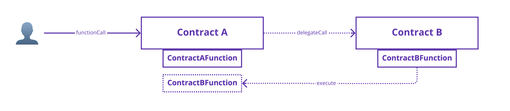
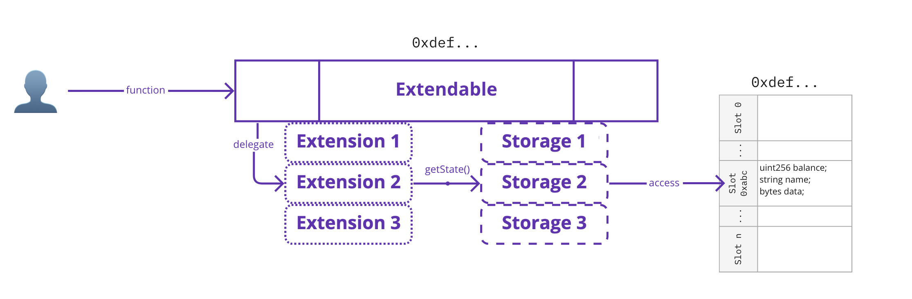

## Simple Summary

A smart contract development pattern for extendable, upgradeable, re-usable contracts.

## Abstract

This standard specifies a design pattern for the development of Extendable contracts which acquire their functionality from modular units known as Extensions.

An Extendable contract is initially empty and is "extended" with Extensions, giving the contract its functions, that can be replaced or removed to either upgrade or deprecate certain functionality.

We specify a standard for:

* Creating an "Extendable" contract
* Creating modular "Extensions"
* Extending a contract with an Extension
* Managing an "Extendable" contract's implementations through Extensions

## Motivation

The growing set of on-chain use-cases have been witnessed by a similar advent of growing complexity in smart contracts. As the space matures and newer building blocks emerge, the vast composition of different applications has led to large smart contract stacks and cross dependencies between them. Many of these applications handle significant amount of funds or similar degrees of social impact that can affect large numbers of users.

As heightened composability leads to greater complexity, it is important that this added complexity does not serve to obfuscate and deteriorate the safety and security of the smart contracts that are built. Smart contracts should remain easily manageable, readable, and understood such that the transparent nature of open-sourcing such code is also supported by its ease of take-up. Users must be able to inspect code and discern the way it functions to elevate trustlessness.

Certain primitives will start to emerge as building block commons that much of the smart contract development will use to build upon, including standards such as ERC20. These code artifacts are frequently re-deployed to a network where such code has already been deployed countless times. Such primitives are, as of yet, not re-used on-chain despite the degree of replication and re-use that they are subject to.

Using Extendable benefits from:
* Static contract address: Extendable contracts always have the same address even through upgrades
* Re-usability: Code can be re-used instead of redeployed if contracts share similar functionality
* Modularity: Separation of concerns and units of code allow for better granular organisation of contracts
* Flexibility: Contracts can be future-proof and adapt with addition or removal of features as required

## Extendable<>Extension Architecture Overview

The Extendable framework is a developer-focused design pattern facilitating the implementation of evolving smart contracts through extending.

An Extendable contract at its most basic, is an empty smart contract that contains no functionality aside from the ability to be extended.

Extending an Extendable contract allows you to attach Extensions to it, giving it the ability to gain features and functions to be called by users. An Extension is a separate, standalone smart contract that contains functional logic that can be re-used by various other contracts.


### Extendable

The core Extendable contract keeps track of its Extensions through a set of mappings.


#### Extending

When it is extended with an Extension, it records the Extension address against the interface that the Extension implements as a key-value pair. The extended contract now is marked to implement the interface implemented by the Extension. By extending more Extensions, the Extendable contract can have an evolving and growing interface as a collection of all Extensions that it has.


#### Calling functions

When a function is called, the Extendable contract identifies which Extension contains the desired functionality and performs a delegatecall.


Delegatecalls allow one contract to execute the function of another contract as if the original contract itself has the function. It shifts the context of the execution of the function to that of the delegator, but using the function logic of the delegatee.



#### Accessing state variables

Accessing storage variables are done using slot assignment. Each Extension that has functions that use storage variables imports the storage that they intend to interact with as a "storage module" library. Such a library defines the variables and exposes a function that returns them. When defining a library, the assigned slot address where the variables exist must be chosen with strict uniqueness in mind, else risks the security of the contract. An Extendable contract may have several different storage modules and each one will exist at its assigned slot.


Each Extendable contract owns its own addressable storage space, and Extensions, when called, will access the current context's contract when interacting with contract state. This allows Extensions to share storage module definitions as the variables themselves will indexed against each Extendable contract instance during execution.



---

As a reminder, this document serves to define a set of conceptual primitives and their associated building blocks to allow developers to follow an approach for writing extendable smart contracts. The reference implementation can be found [here](https://github.com/violetprotocol/extendable/).

## Specification

### Terminology

Extendable - Refers to the
Extension - 
Storage Library - 
Extend - 
Retract - 
Replace - 
Delegatecall -
Function Selector - 

### ERC165 Singleton

All Extensions MUST implement ERC165. This is done indirectly through each Extension performing external calls to a contract singleton that contains all the ERC165 functionality. The ERC165 Singleton is called by Extensions via delegatecall.

```solidity
/**
 * @dev The basic ERC165 interface that must be implemented
 */
interface IERC165 {
    /**
     * @notice Returns true if this contract implements the interface defined by
     * `interfaceId`. See the corresponding
     * https://eips.ethereum.org/EIPS/eip-165#how-interfaces-are-identified[EIP section]
     * to learn more about how these ids are created.
     *
     * This function call must use less than 30 000 gas.
     * @param interfaceId bytes4 identifier for an interface
     * @return `true` if the contract implements `interfaceId`, false otherwise
     */
    function supportsInterface(bytes4 interfaceId) external returns (bool);
}


/**
 * @dev Storage based implementation of the {IERC165} interface.
 * @notice This is not strictly part of EIP-165 but is included to facilitate use
 */
interface IERC165Register {
    /**
     * @dev Registers the contract as an implementer of the interface defined by
     * `interfaceId`. Support of the actual ERC165 interface is automatic and
     * registering its interface id is not required.
     *
     * Requirements:
     *
     * - `interfaceId` cannot be the ERC165 invalid interface (`0xffffffff`).
     * @param interfaceId bytes4 identifier for the interface to be registered
     */
    function registerInterface(bytes4 interfaceId) external;
}

/** 
 * @title ERC165 Singleton
 * @author 0xpapasmurf
 * @notice This contract is the official implementation of the ERC165 Singleton.
 * @notice For more details, see https://eips.ethereum.org/EIPS/eip-xxxx
 */
contract ERC165Logic is IERC165, IERC165Register {
    /**
     * @dev Records its own contract address during construction
     */
    address private self;
    constructor() {
        self = address(this);
    }

    /**
     * @dev Restricts calls to functions using this modifier to only come from
     * delegatecalls.
     */
    modifier onlyDelegated {
        require(address(this) != self, "ERC165Logic: undelegated calls disallowed");
        _;
    }

    /**
     * @dev See {IERC165-supportsInterface}.
     */
    function supportsInterface(bytes4 interfaceId) override(IERC165) public onlyDelegated virtual returns (bool) {
        ERC165State storage state = ERC165Storage._getState();
        return state._supportedInterfaces[interfaceId] || interfaceId == type(IERC165).interfaceId;
    }

    /**
     * @dev Registers the contract as an implementer of the interface defined by
     * `interfaceId`. Support of the actual ERC165 interface is automatic and
     * registering its interface id is not required.
     *
     * See {IERC165Register-registerInterface}.
     *
     * Requirements:
     *
     * - `interfaceId` cannot be the ERC165 invalid interface (`0xffffffff`).
     * - should only be callable by other extensions of the same contract
     */
    function registerInterface(bytes4 interfaceId) override(IERC165Register) public onlyDelegated {
        require(interfaceId != 0xffffffff, "ERC165: invalid interface id");

        ERC165State storage state = ERC165Storage._getState();
        state._supportedInterfaces[interfaceId] = true;
    }
}
```

#### Deployment

Deployment of the ERC165 Singleton is achieved through [EIP-2470](https://eips.ethereum.org/EIPS/eip-2470). This deployment only needs to be done once per chain.

Submit a transaction with a call to the `deploy(bytes _initCode, bytes32 _salt)` function of the EIP-2470 singleton factory at address `0xce0042B868300000d44A59004Da54A005ffdcf9f` with the following parameters:

`_initCode`: 
```
0x608060405234801561001057600080fd5b50306000806101000a81548173ffffffffffffffffffffffffffffffffffffffff021916908373ffffffffffffffffffffffffffffffffffffffff16021790555061068c806100606000396000f3fe608060405234801561001057600080fd5b50600436106100365760003560e01c806301ffc9a71461003b578063214cdb801461006b575b600080fd5b610055600480360381019061005091906103d4565b610087565b60405161006291906104ac565b60405180910390f35b610085600480360381019061008091906103d4565b6101f6565b005b60008060009054906101000a900473ffffffffffffffffffffffffffffffffffffffff1673ffffffffffffffffffffffffffffffffffffffff163073ffffffffffffffffffffffffffffffffffffffff161415610119576040517f08c379a0000000000000000000000000000000000000000000000000000000008152600401610110906104e7565b60405180910390fd5b600061012361036a565b9050806000016000847bffffffffffffffffffffffffffffffffffffffffffffffffffffffff19167bffffffffffffffffffffffffffffffffffffffffffffffffffffffff1916815260200190815260200160002060009054906101000a900460ff16806101ee57507f01ffc9a7000000000000000000000000000000000000000000000000000000007bffffffffffffffffffffffffffffffffffffffffffffffffffffffff1916837bffffffffffffffffffffffffffffffffffffffffffffffffffffffff1916145b915050919050565b60008054906101000a900473ffffffffffffffffffffffffffffffffffffffff1673ffffffffffffffffffffffffffffffffffffffff163073ffffffffffffffffffffffffffffffffffffffff161415610285576040517f08c379a000000000000000000000000000000000000000000000000000000000815260040161027c906104e7565b60405180910390fd5b63ffffffff60e01b817bffffffffffffffffffffffffffffffffffffffffffffffffffffffff191614156102ee576040517f08c379a00000000000000000000000000000000000000000000000000000000081526004016102e5906104c7565b60405180910390fd5b60006102f861036a565b90506001816000016000847bffffffffffffffffffffffffffffffffffffffffffffffffffffffff19167bffffffffffffffffffffffffffffffffffffffffffffffffffffffff1916815260200190815260200160002060006101000a81548160ff0219169083151502179055505050565b600080307f5d17bc13b7729fc587de98637dd16967b7d6c922cdeb6ebec28ede1e3f0b4a5d6040516020016103a0929190610480565b6040516020818303038152906040528051906020012090508091505090565b6000813590506103ce8161063f565b92915050565b6000602082840312156103e657600080fd5b60006103f4848285016103bf565b91505092915050565b61040e61040982610518565b61058c565b82525050565b61041d8161052a565b82525050565b61043461042f82610536565b61059e565b82525050565b6000610447601c83610507565b9150610452826105c7565b602082019050919050565b600061046a602983610507565b9150610475826105f0565b604082019050919050565b600061048c82856103fd565b60148201915061049c8284610423565b6020820191508190509392505050565b60006020820190506104c16000830184610414565b92915050565b600060208201905081810360008301526104e08161043a565b9050919050565b600060208201905081810360008301526105008161045d565b9050919050565b600082825260208201905092915050565b60006105238261056c565b9050919050565b60008115159050919050565b6000819050919050565b60007fffffffff0000000000000000000000000000000000000000000000000000000082169050919050565b600073ffffffffffffffffffffffffffffffffffffffff82169050919050565b6000610597826105a8565b9050919050565b6000819050919050565b60006105b3826105ba565b9050919050565b60008160601b9050919050565b7f4552433136353a20696e76616c696420696e7465726661636520696400000000600082015250565b7f4552433136354c6f6769633a20756e64656c6567617465642063616c6c73206460008201527f6973616c6c6f7765640000000000000000000000000000000000000000000000602082015250565b61064881610540565b811461065357600080fd5b5056fea264697066735822122080fb526b761687b7b75efe0d7981709097bc281657d9f657c1862b9826cf526664736f6c63430008040033
```

`_salt`: `0x0000000000000000000000000000000000000000000000000000000000000000`

#### Destination Address

A successful deployment will result in an ERC165 Singleton contract deployed at `0x16c940672fa7820c36b2123e657029d982629070`.

### Extension Contract

A custom Extension MUST inherit `Extension`.

`Extension` MUST use `0x16C940672fA7820C36b2123E657029d982629070` as the constant address for the ERC165 Singleton.

`Extension` MUST implement `supportsInterface` and `registerInterface` as delegatecalls to the ERC165 Singleton.

`Extension` MUST implement a constructor that calls `registerInterface` to register implementations using the `getInterface` function's output.

`Extension` MUST revert with custom error `ExtensionNotImplemented` in the `fallback` function.

`Extension` MUST inherit [`CallerContext`](#callercontext).


```
pragma solidity ^0.8.4;

struct Interface {
    bytes4 interfaceId;
    bytes4[] functions;
}

/**
 * @dev Interface for Extension
*/
interface IExtension {
    /**
     * @dev Returns a full view of the functional interface of the extension
     *
     * Must return a list of the functions in the interface of your custom Extension
     * in the same format and syntax as in the interface itself as a string, 
     * escaped-newline separated.
     *
     * Intent is to allow developers that want to integrate with an Extendable contract
     * that will have a constantly evolving interface, due to the nature of Extendables,
     * to be able to easily inspect and query for the current state of the interface and
     * integrate with it.
     *
     * See {ExtendLogic-getSolidityInterface} for an example.
    */
    function getSolidityInterface() external pure returns(string memory);

    /**
     * @dev Returns the interface IDs that are implemented by the Extension
     *
     * These are full interface IDs and ARE NOT function selectors. Full interface IDs are
     * XOR'd function selectors of an interface. For example the interface ID of the ERC721
     * interface is 0x80ac58cd determined by the XOR or all function selectors of the interface.
     * 
     * If an interface only consists of a single function, then the interface ID is identical
     * to that function selector.
     * 
     * Provides a simple abstraction from the developer for any custom Extension to 
     * be EIP-165 compliant out-of-the-box simply by implementing this function. 
     *
     * Excludes any functions either already described by other interface definitions
     * that are not developed on top of this backbone i.e. EIP-165, IExtension
    */
    function getInterface() external returns(Interface[] memory interfaces);
}

/**
 * @title Base Extension
 * @notice The base Extension contract that must be inherited by any contract in order to become an Extension. 
 * @dev Implements ERC165 by making calls to the ERC165 Singleton
 */
abstract contract Extension is CallerContext, IExtension, IERC165, IERC165Register {
    address constant ERC165LogicAddress = 0x16C940672fA7820C36b2123E657029d982629070;

    /**
     * @dev Constructor registers your custom Extension interface under EIP-165:
     *      https://eips.ethereum.org/EIPS/eip-165
    */
    constructor() {
        Interface[] memory interfaces = getInterface();
        for (uint256 i = 0; i < interfaces.length; i++) {
            Interface memory iface = interfaces[i];
            registerInterface(iface.interfaceId);

            for (uint256 j = 0; j < iface.functions.length; j++) {
                registerInterface(iface.functions[j]);
            }
        }

        registerInterface(type(IExtension).interfaceId);
    }

    function supportsInterface(bytes4 interfaceId) external override virtual returns(bool) {
        (bool success, bytes memory result) = ERC165LogicAddress.delegatecall(abi.encodeWithSignature("supportsInterface(bytes4)", interfaceId));

        if (!success) {
            assembly {
                revert(result, returndatasize())
            }
        }

        return abi.decode(result, (bool));
    }

    function registerInterface(bytes4 interfaceId) public override virtual {
        (bool success, ) = ERC165LogicAddress.delegatecall(abi.encodeWithSignature("registerInterface(bytes4)", interfaceId));

        if (!success) {
            assembly {
                returndatacopy(0, 0, returndatasize())
                revert(0, returndatasize())
            }
        }
    }

    /**
     * @dev Unidentified function signature calls to any Extension reverts with
     *      ExtensionNotImplemented error
    */
    function _fallback() internal virtual {
        revert ExtensionNotImplemented();
    }

    /**
     * @dev Fallback function passes to internal _fallback() logic
    */
    fallback() external payable virtual {
        _fallback();
    }
    
    /**
     * @dev Payable fallback function passes to internal _fallback() logic
    */
    receive() external payable virtual {
        _fallback();
    }

    /**
     * @dev Virtual override declaration of getFunctionSelectors() function to silence compiler
     *
     * Must be implemented in inherited contract.
    */
    function getInterface() override public virtual returns(Interface[] memory);
}
```

By inheriting `Extension` a custom Extension MUST also define and implement a custom interface.

A custom Extension MUST implement `getSolidityInterface` and `getInterface` functions. These are introspection functions that allow other contracts or users to inspect what interface is implemented by the Extension. Crucially, it is used by Extendable during extending to determine what interface it will inherit and which contract implements it.

`getSolidityInterface` MUST be implemented such that it returns a list of new-line character `\n`-appended function declarations, similar to that in interface definitions.

`getInterface` MUST be implemented such that it returns an array of the `Interface` struct, containing so-formatted structure of the interface that your Extension implements.

#### Example Custom Extension Implementation

```solidity
// Your interface definition
interface IYourExtension {
    function returnString() external returns(string memory);
    function returnUint256() external returns(uint256);
}

// Your Extension boilerplate
abstract contract YourExtension is IYourExtension, Extension {

    // Returns the functions as declared in the interface definition, each appended with `\n`
    function getSolidityInterface() public pure virtual override returns (string memory) {
        return
            "function returnString() external returns(string memory);\n"
            "function returnUint256() external returns(uint256);\n";
    }

    // Returns the interfaceId and function selectors of your interface definition as a struct
    function getInterface() public virtual override returns (Interface[] memory interfaces) {
        interfaces = new Interface[](1);

        bytes4[] memory functions = new bytes4[](2);
        functions[0] = IYourExtension.returnString.selector;
        functions[1] = IYourExtension.returnUint256.selector;

        interfaces[0] = Interface(type(IYourExtension).interfaceId, functions);
    }
}

// Your Extension custom function implementation
contract YourExtensionImplementation is YourExtension {
    function returnString() public pure override returns(string memory) {
        return "Hello world!";
    }

    function returnUint256() public pure override returns(uint256) {
        return 42;
    }
}
```

### Storage Module

Custom Extensions may require state variable access through storage module libraries.

Storage variables MUST be defined as part of a struct.

Storage libraries MUST define a unique slot for storage variables to be written to.

Storage libraries MUST define a `_getState` function that returns the storage variables located at the defined slot.

```solidity
pragma solidity ^0.8.4;

/**
 * @dev Define your storage variables into a struct like below
**/
struct YourStruct {
    string text;
    uint number;
}

/**
 * @dev Your storage variable struct is accessible by all your extensions
 *      using the library pattern below.
**/
library YourStorage {
    // This is used in combination with delegator address to locate your struct in storage
    // Choose something that is human readable/understandable and unique to avoid potential
    // collisions with other potential storage libraries used by the same delegator
    bytes32 constant private STORAGE_NAME = keccak256("your_unique_storage_identifier");

    function _getState()
        internal 
        view
        returns (YourStruct storage state) 
    {
        bytes32 position = keccak256(abi.encodePacked(address(this), STORAGE_NAME));
        assembly {
            state.slot := position
        }
    }
}
```

#### Using Storage Module

Extensions access storage variables by importing storage libraries and calling `_getState` in functions that require those variables.

Using the example Extension:

```solidity
pragma solidity ^0.8.4;

import "YourStorage.sol";

contract YourExtensionImplementation is YourExtension {
    function returnString() public pure override returns(string memory) {
        YourStruct storage state = YourStorage._getState();
        return state.text;
    }

    function returnUint256() public pure override returns(uint256) {
        YourStruct storage state = YourStorage._getState();
        return state.number;
    }
}
```

### Extendable Contract


The key words “MUST”, “MUST NOT”, “REQUIRED”, “SHALL”, “SHALL NOT”, “SHOULD”, “SHOULD NOT”, “RECOMMENDED”, “MAY”, and “OPTIONAL” in this document are to be interpreted as described in RFC 2119.

The technical specification should describe the syntax and semantics of any new feature. The specification should be detailed enough to allow competing, interoperable implementations for any of the current Ethereum platforms (go-ethereum, parity, cpp-ethereum, ethereumj, ethereumjs, and [others](https://github.com/ethereum/wiki/wiki/Clients)).

## Rationale
The rationale fleshes out the specification by describing what motivated the design and why particular design decisions were made. It should describe alternate designs that were considered and related work, e.g. how the feature is supported in other languages.

## Backwards Compatibility
All EIPs that introduce backwards incompatibilities must include a section describing these incompatibilities and their severity. The EIP must explain how the author proposes to deal with these incompatibilities. EIP submissions without a sufficient backwards compatibility treatise may be rejected outright.

## Test Cases
Test cases for an implementation are mandatory for EIPs that are affecting consensus changes.  If the test suite is too large to reasonably be included inline, then consider adding it as one or more files in `../assets/eip-####/`.

## Reference Implementation
An optional section that contains a reference/example implementation that people can use to assist in understanding or implementing this specification.  If the implementation is too large to reasonably be included inline, then consider adding it as one or more files in `../assets/eip-####/`.

## Security Considerations
All EIPs must contain a section that discusses the security implications/considerations relevant to the proposed change. Include information that might be important for security discussions, surfaces risks and can be used throughout the life cycle of the proposal. E.g. include security-relevant design decisions, concerns, important discussions, implementation-specific guidance and pitfalls, an outline of threats and risks and how they are being addressed. EIP submissions missing the "Security Considerations" section will be rejected. An EIP cannot proceed to status "Final" without a Security Considerations discussion deemed sufficient by the reviewers.

## Appendix

### CallerContext

Usage of `msg.sender` MUST NOT be used in Extension contracts. This is replaced by more expressive `_lastExternalCaller` and `_lastCaller` functions made available by the `CallerContext` contract.

`Extension` inherits `CallerContext`. This contract keeps track of the current caller in the callstack and exposes functions that allow inspection of the current execution's source, ignoring delegatecalls.

```solidity
pragma solidity ^0.8.4;

struct CallerState {
    // Stores a list of callers in the order they are received
    // The current caller context is always the last-most address
    address[] callerStack;
}

library CallerContextStorage {
    bytes32 constant private STORAGE_NAME = keccak256("extendable.framework.v1:caller-state");

    function _getState()
        internal 
        view
        returns (CallerState storage callerState) 
    {
        bytes32 position = keccak256(abi.encodePacked(address(this), STORAGE_NAME));
        assembly {
            callerState.slot := position
        }
    }
}

/**
 * @dev CallerContext contract provides Extensions with proper caller-scoped contexts.
 *      Inherit this contract with your Extension to make use of caller references.
 *
 * `msg.sender` may not behave as developer intends when using within Extensions as many
 * calls may be exchanged between intra-contract extensions which result in a `msg.sender` as self.
 * Instead of using `msg.sender`, replace it with 
 *      - `_lastExternalCaller()` for the most recent caller in the call chain that is external to this contract
 *      - `_lastCaller()` for the most recent caller
 *
 * CallerContext provides a deep callstack to track the caller of the Extension/Extendable contract
 * at any point in the execution cycle.
 *
*/
contract CallerContext {
    /**
     * @dev Returns the most recent caller of this contract that came from outside this contract.
     *
     * Used by extensions that require fetching msg.sender that aren't cross-extension calls.
     * Cross-extension calls resolve msg.sender as the current contract and so the actual
     * caller context is obfuscated.
     * 
     * This function should be used in place of `msg.sender` where external callers are read.
     */
    function _lastExternalCaller() internal view returns(address) {
        CallerState storage state = CallerContextStorage._getState();

        for (uint i = state.callerStack.length - 1; i >= 0; i--) {
            address lastSubsequentCaller = state.callerStack[i];
            if (lastSubsequentCaller != address(this)) {
                return lastSubsequentCaller;
            }
        }

        revert("_lastExternalCaller: end of stack");
    }

    /**
     * @dev Returns the most recent caller of this contract.
     *
     * Last caller may also be the current contract.
     *
     * If the call is directly to the contract, without passing an Extendable, return `msg.sender` instead
     */
    function _lastCaller() internal view returns(address) {
        CallerState storage state = CallerContextStorage._getState();
        if (state.callerStack.length > 0)
            return state.callerStack[state.callerStack.length - 1];
        else
            return msg.sender;
    }
}
```

## Copyright
Copyright and related rights waived via [CC0](../LICENSE.md).