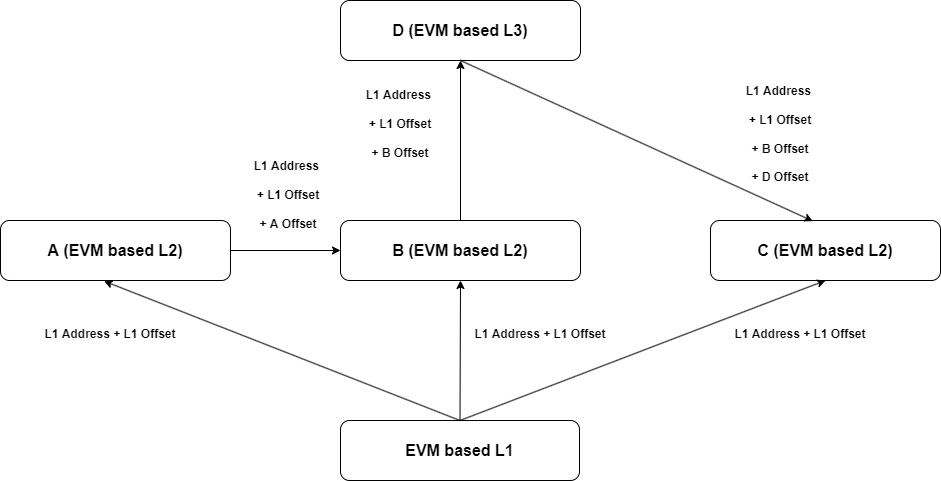

## Abstract

The document describes the minimal set of business and technical prerequisites, functional and non-functional requirements for Aliasing of EVM based Addresses that when implemented ensures that two or more Layer 1, Layer 2, or Sidechains can identify and translate EVM based addresses from different Layer 1, Layer 2, or Sidechains.

## Motivation

The L2 WG is an open-source initiative with a scope to
- Identify and document the most relevant use cases and business requirements for Layer 2 and other Blockchain Scalability solutions for EVM compatible public blockchains
- Define a technical standard with identification and differentiation of classes of scalability solutions as required that meet both ecosystem and enterprise requirements, with a particular focus on interoperability between Layer 2 solutions for EVM compatible public blockchains
- For EVM compatible public blockchains, identify, document, and devise solution approaches for Layer 2 Blockchain scalability solution specific challenges such as MEV, block (gas) limits, TVL concentration, etc.
- Identify and document characteristics of Layer 2 Blockchain environments for EVM compatible public blockchains that will be key in addressing mainstream and enterprise adoption.

The ability to deterministically derive addresses of a digital asset or an externally owned account (EOA) in EVM based execution frameworks for L1s, L2s, Sidechains based on an origin chain of an asset or EOA, known as address aliasing, simplifies interoperability between EVM based L1s, L2s, and Sidechains because: 
- It allows messages from chain A (source chain) to unambiguously address asset A (smart contract) or EOA on chain Y (target chain), if asset A or EOA exists on Chain X and on Chain Y. 
- It allows a user to deterministically verify the source chain of a message, and, if required, directly verify the origin chain of asset A or EOA and its state on its origin chain utilizing a canonical token list of the (message) source chain.

The ability to unambiguously, and deterministically, relate an address for a digital asset (smart contract) or an externally owned account (EOA) between EVM based L1s, L2s, and Sidechains where this digital asset or EOA exists, also known as address aliasing, is critical prerequisite for interoperability between EVM based L1s, L2s, and Sidechains. However, there is currently no way to do so in a standardized way -- imagine every internet service provider were to define its own IP addresses.

Hence, this document establishes an unambiguous and deterministic standard for EVM based address aliasing based on the concept of root &rarr; leaf where an address alias is derived based on the address on the origin chain and an offset which is an immutable characteristic of the origin chain.

See Figure 1 for the conceptual root &rarr; leaf design with offset.



<div align="left">
<figure>
  
  <figcaption> Figure 1: Root &rarr; Leaf address aliasing concept using an chain immanent characteristics from L1 to L2 and L3 and back </figcaption>
</figure>
</div>

To further clarify the connections between the different possible paths an asset can take from an L1 to different L2/L3s and the `relativAddress` of that asset, we visually highlight in red the path from the EVM based L1 to the B L2, to the D L3, and finally to the C L2.

<div align="left">
<figure>
  
  <figcaption> Figure 2: Visually highlighted path in red from the EVM based L1 to the B L2, to the D L3, and finally to the C L2 </figcaption>
</figure>
</div>

Note, that address aliasing between non-EVM and EVM-based L1s, L2s, and Sidechains, and between non-EVM-based L1s, L2s, and Sidechains is out of scope of this document.

## Specification

### Typographical Convention: Requirement Ids

A requirement is uniquely identified by a unique ID composed of its requirement level followed by a requirement number, as per convention **[RequirementLevelRequirementNumber]**. 
There are four requirement levels that are coded in requirement ids as per below convention: 

**[R]** - The requirement level for requirements which IDs start with the letter _R_ is to be interpreted as **MUST** as described in [RFC2119](#rfc2119). \
**[D]** - The requirement level for requirements which IDs start with the letter _D_ is to be interpreted as **SHOULD** as described in [RFC2119](#rfc2119). \
**[O]** - The requirement level for requirements which IDs start with the letter _O_ is to be interpreted as **MAY** as described in [RFC2119](#rfc2119). 

Note that requirements are uniquely numbered in ascending order within each requirement level.

Example : It should be read that [R1] is an absolute requirement of the specification whereas [D1] is a recommendation and [O1] is truly optional.

-----

The requirements below are only valid for EVM based L1s, L2, or Sidechains. Address aliasing for non-EVM systems is out of scope of this document.

#### **[R1]**
An address alias -- `addressAlias` -- to be used between Chain A and Chain B MUST be constructed as follows:
`addressAlias (Chain A) = offsetAlias (for Chain A) relativeAddress (on Chain A) offsetAlias (for Chain A)`

[[R1]](#r1) testability: `addressAlias` can be parsed and split using existing open source packages and the result compared to known `addressAlias` and `relativeAddress` used in the construction.

#### **[R2]**
The `offsetAlias` of a chain MUST be `0xchainId00000000000000000000000000000000chainId`

[[R2]](#r2) testability: `offsetAlias` can be parsed and split using existing open source packages and the result compared to known `chainId` used in the construction.

#### **[R3]**
The `chainId` used in the `offsetAlias` MUST NOT be zero (0)

[[R3]](#r3) testability: A `chainId` is a numerical value and can be compared to `0`.

#### **[R4]**
The `chainId` used in the `offsetAlias` MUST be 8 bytes.

[[R4]](#r4) testability: The length of the `chainId` string can be converted to bytes and then compared to `8`.

#### **[R5]**
In case the `chainId` has less than 16 digits the `chainId` MUST be padded with zeros to 16 digits.

For example the `chainId` of Polygon PoS is `137`, with the current list of EVM based `chainId`s to be found [here](https://chainlist.org/), and its `offsetAlias` is `0x0000000000000137000000000000000000000000000000000000000000000137`.

[[R5]](#r5) testability: `chainId` can be parsed and split using existing open source packages and the result compared to known `chainId` used in the construction. Subsequently the number of zeros used in the padding can be computed and compared to the expected number of zeros for the padding.

#### **[R6]**
The `offsetAlias`for Ethereum Mainnet as the primary anchor of EVM based chains MUST be `0x1111000000000000000000000000000000001111` due to current adoption of this offset by existing L2 solutions.

An example of address alias for the USDC asset would be `addressAlias = 0x1111A0b86991c6218b36c1d19D4a2e9Eb0cE3606eB481111` 

[[R6]](#r6) testability: This requirement is a special case of [[R1]](#r1). Hence, it is testable. 

#### **[R7]**

The `relativeAddress` of an Externally Owned Account (EOA) or Smart Contract on a chain MUST either be the smart contract or EOA address of the origin chain or a `relativeAddress` of an EOA or Smart Contract from another chain.  

An example of the former instance would be the relative address of wrapped USDC, `relativeAddress = 0x1111A0b86991c6218b36c1d19D4a2e9Eb0cE3606eB481111`, and an example of the latter would be the relative address of wrapped USDC on Polygon, `relativeAddress = 0x00000000000001371111A0b86991c6218b36c1d19D4a2e9Eb0cE3606eB4811110000000000000137`.

Finally, an example of an address alias for a message to another L1, L2, or Sidechain for wrapped USDC from Ethereum on Arbitrum would be:
```
addressAlias = 0x00000000000421611111A0b86991c6218b36c1d19D4a2e9Eb0cE3606eB4811110000000000042161
```
[[R7]](#r7) testability: Since this document is dealing with EVM-based systems with multiple live implementations, there are multiple known methods of how to verify if an address belongs to an EOA or a smart contract.

#### **[R8]**

The order of the `offsetAlias`es in an `addressAlias` MUST be ordered from the `offSetAlias` of the root chain bracketing the `relativeAddress` on the root chain through the ordered sequence of `offsetAlias`es of the chains on which the digital asset exists.

For example, a valid `addressAlias` of an asset on chain A bridged to chain B and subsequently to chain C and that is to be bridged to yet another chain from chain C would be:
```
addressAlias = chainId(C) chainId(B) chainId(A) relativeAddress chainId(A) chainId(B) chainId(C)
```   
However, the reverse order is invalid:
```
addressAlias = chainId(A) chainId(B) chainId(C) relativeAddress chainId(C) chainId(B) chainId(A)
```  
[[R8]](#r8) testability: Since [[R1]](#r1) is testable and since [[R8]](#r8) is an order rule for the construction in [[R1]](#r1), which can be tested by applying logic operations on the output of [[R1]](#r1) tests, [[R8]](#r8) is testable. 

Note, that a proof that a given order is provably correct is beyond the scope of this document.

---

### Conformance

This section describes the conformance clauses and tests required to achieve an implementation that is provably conformant with the requirements in this document.

#### Conformance Targets

This document does not yet define a standardized set of test-fixtures with test inputs for all MUST, SHOULD, and MAY requirements with conditional MUST or SHOULD requirements. 

A standardized set of test-fixtures with test inputs for all MUST, SHOULD, and MAY requirements with conditional MUST or SHOULD requirements is intended to be published with the next version of the standard.

#### Conformance Levels

This section specifies the conformance levels of this standard. The conformance levels offer implementers several levels of conformance. These can be used to establish competitive differentiation.

This document defines the conformance levels of EVM based Address Aliasing as follows:
* **Level 1:** All MUST requirements are fulfilled by a specific implementation as proven by a test report that proves in an easily understandable manner the implementation's conformance with each requirement based on implementation-specific test-fixtures with implementation-specific test-fixture inputs.
* **Level 2:** All MUST and SHOULD requirements are fulfilled by a specific implementation as proven by a test report that proves in an easily understandable manner the implementation's conformance with each requirement based on implementation-specific test-fixtures with implementation-specific test-fixture inputs.
* **Level 3:** All MUST, SHOULD, and MAY requirements with conditional MUST or SHOULD requirements are fulfilled by a specific implementation as proven by a test report that proves in an easily understandable manner the implementation's conformance with each requirement based on implementation-specific test-fixtures with implementation-specific test-fixture inputs.

#### **[D1]** 
A claim that a canonical token list implementation conforms to this specification SHOULD describe a testing procedure carried out for each requirement to which conformance is claimed, that justifies the claim with respect to that requirement.

[[D1]](#d1) testability: Since each of the non-conformance-target requirements in this documents is testable, so must be the totality of the requirements in this document. Therefore, conformance tests for all requirements can exist, and can be described as required in [[D1]](#d1).

#### **[R9]** 
A claim that a canonical token list implementation conforms to this specification at **Level 2** or higher MUST describe the testing procedure carried out for each requirement at **Level 2** or higher, that justifies the claim to that requirement.

[[R9]](#r9) testability: Since each of the non-conformance-target requirements in this documents is testable, so must be the totality of the requirements in this document. Therefore, conformance tests for all requirements can exist, be described, be built and implemented and results can be recorded as required in [[R9]](#r9).

## Security Considerations

### Data Privacy

The standard does not set any requirements for compliance to jurisdiction legislation/regulations. It is the responsibility of the implementer to comply with applicable data privacy laws.

### Production Readiness 

The standard does not set any requirements for the use of specific applications/tools/libraries etc. The implementer should perform due diligence when selecting specific applications/tools/libraries.

There are security considerations as to the Ethereum-type addresses used in the construction of the `relativeAddress`. 

If the Ethereum-type address used in the `relativeAddress` is supposed to be an EOA, the target system/recipient should validate that the `codehash` of the source account is `NULL` such that no malicious code can be executed surreptitiously in an asset transfer.    

If the Ethereum-type address used in the `relativeAddress` is supposed to be a smart contract account representing an asset, the target system/recipient should validate that the `codehash` of the source account matches the `codehash` of the published smart contract solidity code to ensure that the source smart contract behaves as expected.

Lastly, it is recommended that as part of the `relativeAddress` validation the target system performs an address checksum validation as defined in [[EIP-55](#eip55)].

### Internationalization and Localization

Given the non-language specific features of EVM-based address aliasing, there are no internationalization/localization considerations.

----

### Appendix A - Normative References

The following documents are referenced in such a way that some or all of their content constitute requirements of this document.

#### **[RFC2119]**
 S. Bradner, Key words for use in RFCs to Indicate Requirement Levels, http://www.ietf.org/rfc/rfc2119.txt, IETF RFC 2119, March 1997.


### Appendix B - Non-Normative References

#### **[EIP55]**
Vitalik Buterin , Alex Van de Sande, "Mixed-case checksum address encoding",
https://github.com/ethereum/EIPs/blob/master/EIPS/eip-55.md, EIP Repository, January 2016

...