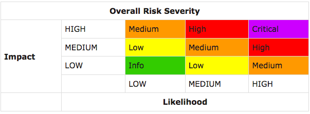

# Preamble
```
EIP: <to be assigned>
Title: Smart Contract Development Guidelines
Authors: Rex Hygate (@RexShinka), Bryant Eisenbach (@fubuloubu), Roman Pavloyski (@rpavlovs)
Type: Informational
Status: Draft
Created: 2018-02-17
```

# Simple Summary
Develop a comprehensive set of standards and methodologies formalizing
security-conscious analysis and design of Ethereum smart contracts.

# Abstract
There are many competing "best practices" in the Ethereum ecosystem describing security concerns
when designing smart contract code. There has been some effort to standardize these practices,
but "security best practices" is not a strong solution to the underlying problem.
This EIP defines that underlying problem as a lack of a robust software engineering process
for smart contract design that takes into account the unique characteristics of smart contracts.

# Motivation
Software developed for Aerospace, Medical, Telecom, and Embedded Devices typically follows a more
robust software design process due to the critical nature of the software being developed.
The standards used for the software design process in these industries arise from a need to
quantify and mitigate risk in software that has the potential to significantly impact human life and property.
Smart Contracts are similar development items, since poor behavior of these software items can have
a significant financial impact to users; therefore, it should be developed to a similar level of rigor.

This EIP aims to adopt some of these standards, particularly DO-178, to create a common
framework tailored specifically to Smart Contract design and development practices.
This includes formalizing certain software engineering guidelines
(of which "security best practices" are a major component) and tool development processes
to organize the efforts for the larger Ethereum ecosystem.

# Specification
The core of this standard is a model of understanding risk inherant to software development items.
We will leverage the OWASP model, a common framework in software security, to develop this model.

The OWASP model specifies that `Risk = Liklihood x Impact`.
In order to quantify an identified risk and communicate it to interested parties,
it is necessary to quantify the `Liklihood` that an issue with occur and the `Impact`
it will have on the platform or network.



We will perform this analysis at the method level of each smart contract,
which will provide a comphrehensive analysis of all the possible calls.

Specifically, we define `Liklihood` as the access control level (ACL) of a given method,
and `Impact` as the ability of that method to modify the underlying state of Ethereum.

Once the level of risk is understood, a level of rigor needed to verify the software can be
objectively determined, which is defined as a the Design Assurance Level (DAL).
This can inform a variety of techniques to verify software development items
(including testing, simulation, formal verification, etc.) as well as the level of
documentation required to be able to conclusively determine adequete testing has been performed.

# Rationale
This EIP only serves to establish an industry standards body,
of which the community is encouraged to actively contribute to.
This standards body develops guidelines through consensus of the community,
and as such does not endorse a particular design approach or perspective,
only the underlying goal of producing robust, security-critical smart contract code
through robust, security-conscious processes and toolsets.

# Implementations
A first draft of a subset of these guidelines and examples of their use is included in our
[GitHub](https://github.com/SecurEth) repositories.
We invite you to help contribute on the formation of this standards body through colloboration.

# Copyright
Copyright and related rights waived via [CC0](https://creativecommons.org/publicdomain/zero/1.0/).

# Special Thanks!
This project was developed at ETH Denver!
We'd like to thank the following people for helping us in designing this EIP
* Manuel Aráoz (@maraoz)
* Hudson Jameson (@Souptacular)
* Jorge Izquierdo (@izqui)
* Phillip Goldberg (@djphillyg)
