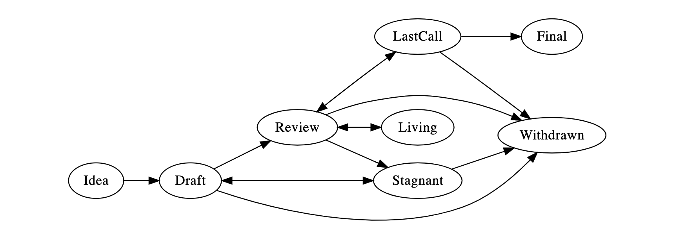

## 什么是 EIP？

EIP 代表以太坊改进提案。 EIP 是向以太坊社区提供信息，或描述以太坊或其流程或环境的新功能的设计文档。 EIP应提供该功能的简明技术规范及其基本原理。 EIP 作者负责在社区内建立共识并记录不同意见。

## EIP 原理

我们打算将EIP作为主要机制，用于提出新功能、收集有关问题的社区技术输入，以及记录进入以太坊的设计决策。 由于EIP在版本化存储库中作为文本文件进行维护，因此其修订历史记录是功能提案的历史记录。

对于以太坊执行者来说，EIP 是跟踪其实施进度的便捷方式。 理想情况下，每个执行维护者都会列出他们已经实现的 EIP。 这将为最终用户提供一种方便的方式来了解特定执行或库的当前状态。

## EIP 类型

EIP有三种类型：

- **Standards Track EIP** 描述了影响大多数或所有以太坊实施的任何更改，例如网络协议的更改、块或交易有效性规则的更改、提议的应用程序标准/约定，或影响使用以太坊的应用程序的交互性的任何更改或添加。 标准跟踪 EIP 由三部分组成 - 设计文档、实施和（如果有必要）对

正式规范的更新< /a>。 此外，标准跟踪 EIP 可以分为以下几类：</p> 
  
    - **Core**: 需要共识分叉的改进(例如) [EIP-5](./eip-5.md), [EIP-101](./eip-101.md)), 以及那些不一定是共识关键但可能与 [“核心发展”讨论相关的变化](https://github.com/ethereum/pm)（例如，[EIP-90]，并且矿工/节点策略改变了[EIP-86](./eip-86.md)的2、3和4)
  - **Networking**: 包括对 [devp2p][] ([EIP-8](./eip-8.md)) 和 [Light Ethereum Subprotocol][]的改进，以及对 [whisper][]和 [swarm][]网络协议规范的改进。
  - **Interface**：包括围绕客户端 [API 的改进/ RPC][] 规范和标准，以及某些语言级别的标准，如方法名称 ([EIP-6](./eip-6.md)) 和 [合约 ABI][]。 标签“interface”与 [interfaces repo][] 一致，讨论应该主要在提交 EIP 之前在该存储库中进行到 EIP 存储库。
  - **ERC**：应用级标准和约定，包括合约标准，如代币标准 (ERC-20</ a>)、名称注册 ([ERC-137](./eip-137.md))、URI 方案、库/ 包格式和钱包格式。</li> </ul></li> 
    
    - **元 EIP** 描述了围绕以太坊的流程或提议对流程进行更改（或其中的事件）。 流程 EIP 类似于标准跟踪 EIP，但适用于以太坊协议本身以外的领域。 他们可能会提出一个实施建议，但不能以此建议为基础; 它们通常需要社区的共识; 与信息型 EIP 不同，它们不仅仅是推荐，用户通常不能随意忽略它们。 示例包括程序、指南、决策过程的更改以及以太坊开发中使用的工具或环境的更改。 任何元 EIP 也会被视为流程 EIP。

- **Informational EIP** 描述了以太坊设计问题，或向以太坊社区提供一般指南或信息，但不提出新功能。 信息 EIP 不一定代表以太坊社区的共识或建议，因此用户和执行者可以随意忽略信息 EIP 或遵循他们的建议。</ul> 

强烈建议单个 EIP 包含单个关键提案或新想法。 EIP 的重点越突出，它就越能成功。 对一个客户端的更改不需要 EIP； 影响多个客户端的变化，或者为多个应用程序定义了一个标准，就会产生影响。

EIP 必须满足某些最低标准。 它必须清楚和完整地描述提议的改进措施。 增强必须代表净改进。 提议的实施（如果适用）必须是可靠的，并且不得使协议过度复杂化。


### 核心 EIP 的特殊要求

如果 **Core** EIP 提到或建议对 EVM（以太坊虚拟机) 进行更改，则应通过其助记符引用指令，并至少定义一次这些助记符的操作码。 首选方法如下：


```
恢复 (0xfe)
```


## EIP 工作流程


### Shepherding an EIP

参与该过程的各方是你，冠军或*EIP作者*， [*EIP编辑器*](# EIP -editors)，以及[*Ethereum 核心开发者*](https://github.com/ethereum/pm)。

在开始编写正式的 EIP 之前，您应该审查您的想法。 没有与您的搜索匹配的翻译 首先询问以太坊社区一个想法是否是原创的，以避免将时间浪费在根据先前研究将被拒绝的事情上。 因此，建议在[以太坊魔术师论坛][]上打开一个讨论线程来执行此操作，但您也可以使用[以太坊 Gitter 聊天室之一][]、[以太坊 subreddit][] 或 [此存储库的问题部分][]。 

一旦该想法已被审核， 您的下一个责任将是(通过EIP) 向审评员和所有感兴趣的方面介绍您的想法。 邀请编辑、开发人员和社区在上述渠道提供反馈。 您应该尝试并衡量对 EIP 的兴趣是否与实现它所涉及的工作以及有多少各方必须遵守它相称。 例如，实现核心 EIP 所需的工作将比 ERC 多得多，EIP 将需要以太坊客户团队足够的兴趣。 负面的社区反馈将被考虑，可能会阻止你的 EIP 通过草案阶段。 将考虑负面社区反馈，这可能会阻止您的EIP进入起草阶段。


### 核心EIPs

对于核心EIP，考虑到它们要求客户端实现被认为 **Final** (见下面的EIP过程)，你需要为客户端提供一个实现或者说服客户端实现你的 EIP。 

让客户执行者审查您的 EIP 的最佳方法是在 AllCoreDevs 电话会议上展示它。 您可以通过在 [AllCoreDevs 议程 GitHub Issue](https://github.com/ethereum/pm/issues) 上发布一条链接您的 EIP 的评论来请求这样做。  

AllCoreDevs 呼叫是客户执行者做三件事的一种方式。 第一，讨论投资促进机构的技术优势。 第二，衡量其他客户将要执行的内容。 第三，为网络升级协调EIP的执行。

这些通话一般会导致围绕应实施哪些 EIP 达成“大致共识”。 这种“大致共识”基于某种假设，即 EIP 的争议不足以导致网络分裂，并且它们在技术上是合理的。

:warning: EIP 流程和 AllCoreDevs 调用并非旨在解决有争议的非技术问题，但是，由于缺乏其他方法来解决这些问题，因此往往最终陷入其中。 这给客户端执行者带来了尝试衡量社区情绪的负担，从而阻碍了 EIP 和 AllCoreDevs 调用的技术协调功能。 如果您正在管理 EIP，您可以通过确保您的 EIP 的[以太坊魔术师论坛](https://ethereum-magicians.org/)线程来简化建立社区共识的过程 包括或链接到尽可能多的社区讨论，并且各个利益相关者得到充分代表。

*简而言之，您作为倡导者的角色是使用下面描述的风格和格式编写 EIP，在适当的论坛中引导讨论，并围绕该想法建立社区共识。* 


### EIP 流程

以下是所有轨道上的所有EIP的标准化流程：



**Idea** - 预先起草的想法。 没有在 EIP 存储库里进行跟踪。

**Draft** - 开发中的 EIP 的第一个正式跟踪阶段。 如果格式正确，EIP 编辑器会合并到 EIP 存储库。

**Review** - EIP 作者将 EIP 标记为准备好并请求同行评审。

**Last Call** - 这是 EIP 转移到之前的最终审查窗口 EIP 编辑器将分配 `Last Call` 状态，并设置审核结束日期(审核-周期-结束)，一般在 14 天之后。

如果这段时间导致必要的规范性更改，则 EIP 将恢复为 `reviEW`。

**Final** - 此 EIP 代表最终标准。 最终 EIP 处于最终确定状态，仅应更新以纠正勘误表并添加非规范性说明。

**Stagnant** - `DRAFT` 或 `REVIEW` 中的任何 EIP 如果在 6 个月或更长时间内处于非活动状态，将移至 `停滞`。 作者或 EIP 编辑可以通过将 EIP 移回 `DRAFT` 将其从该状态中恢复过来。


> *EIP 作者会收到有关其 EIP 状态的任何算法更改的通知*

**Withdrawn** - EIP 作者已撤回提议的 EIP。 此状态具有终结性，无法再使用此 EIP 编号复活。 如果这个想法在以后被采纳，它会被认为是一个新的提议。

**Living** - EIP 的特殊状态，旨在不断更新且不会达到最终状态。 其中包括最显眼的 EIP-1。


## 一个成功的 EIP 应该包括什么?

每个 EIP 应该有以下几个部分：

- 前言 - RFC 822 样式的标头，包含有关 EIP 的元数据，包括 EIP 编号、简短的描述性标题（限制为最多 44 个字符）、描述（限制为最多 140 个字符）和作者详细信息。 无论类别如何，标题和描述都不应包含 EIP 编号。 详情请参阅下文 [](./eip-1.md#eip-header-preamble)
- 摘要 - 摘要是多句（短段）技术摘要。 这应该是规范部分的一个非常简洁易读的版本。 有人应该能够只阅读摘要以了解该规范的主要内容。
- 动机（*可选）- 动机部分对于想要更改以太坊协议的 EIP 至关重要。 它应该清楚地解释为什么现有的协议规范不足以解决EIP所解决的问题。 在没有充分动机的情况下提交的 EPI 文件可能被完全驳回。
- 规范 - 技术规范应描述任何新功能的语法和语义。 规格应足够详细，以便能够对任何现有的以太坊平台进行竞争、互可操作的实现（pp-e-therum， go-eyum, parity, eysumJ, therumjs-lib, [和其他](https://github.com/ethereum/wiki/wiki/Clients)。
- 基本原理 - 基本原理通过描述设计的动机以及做出特定设计决策的原因来充实规范。 它应该描述考虑过的替代设计和相关工作，例如其他语言如何支持该功能。 这个原理还可以提供社区内达成共识的证据，并且应该讨论在讨论期间提出的重要反对意见或问题。
- 向后兼容性 - 所有引入向后不兼容的 EIP 都必须包含描述这些不兼容及其严重性的部分。 EIP 必须解释作者打算如何处理这些不兼容之处。 没有足够的向后兼容性论文的 EIP 提交可能会被彻底拒绝。
- 测试案例——对于影响到共识变化的测试案例来说，实施测试案例是强制性的。 测试应该作为数据内联在 EIP 中（例如输入/预期输出对，或包含在 `../../assets/eip-###/<filename>` 中。 
- 参考实现 - 包含参考/示例实现的可选部分，人们可以使用它来帮助理解或实现本规范。
- 安全注意事项 - 所有 EIP 必须包含一个部分，讨论与提议的更改相关的安全影响/注意事项。 安全注意事项 - 所有 EIP 必须包含一个部分，讨论与提议的更改相关的安全影响/注意事项。 例如： 包括与安全相关的设计决策、关注点、重要讨论、特定于实施的指南和陷阱、威胁和风险的概述以及如何解决它们。 缺少“安全注意事项”部分的 EIP 提交将被拒绝。 如果没有审查人员认为足够的安全注意事项讨论，EIP 无法进入“最终”状态。
- 版权豁免 - 所有 EIP 必须在公共领域。 有关版权豁免的示例，请参阅此 EIP 的底部。


## EIP 格式和模板

EIP 应以 [markdown][] 格式编写。 有一个模板可以遵循。


## EIP 标题序言

每个 EPI 必须以 [RFC 822](https://www.ietf.org/rfc/rfc822.txt) 样式标题前言，前面和后面有三个连字符(`-`)。 这个标题由 Jekyll</a> 称为 "前缀。 标题必须按下列顺序显示。 标有“*”的头部是可选的，在下面加以描述。 所有字段必填。</p> 

`eip:` *EIP 编号*（这由 EIP 编辑器决定）

`title:` *EIP 标题是几个词，不是一个完整的句子*

`description:` *描述是一个完整的句子*

`author:` *作者或作者姓名和/或用户名，或姓名和电子邮件的列表。 详情如下。*

`* discussions-to:` *指向官方讨论主题的网址*

`status:` *草稿、审核、最后通话、最终、停滞、撤回、存续*

`* last-call-deadline:` *审查周期结束* (Optional field, only needed when status is `Last Call`)


`type:` *标准跟踪、元数据或信息*

`* category:` *核心、 网络、 接口或ERC* (仅用于标准跟踪EIP)

`created:` *创建日期*

`* updated:` *逗号分隔的日期列表*

`* requires:` *EIP 编号*

`* requires:` *EIP 编号*

`* superseded-by:` *EIP 编号*

`* resolution:` *指向这个 EIP 的分辨率*

允许表头必须用逗号分隔元素。

需要日期的表头总是以 ISO 8601(yyyy-mm-dd) 的格式执行.


#### `author` 标头

`author` 标题列出了 EIP 的作者/所有者的姓名、电子邮件地址或用户名。 选择匿名的人可以只使用用户名，也可以使用名字和用户名。 `author` 页眉值的格式必须是：


> Random J. User &lt;address@dom.ain&gt;

或者


> Random J. User (@username)

如果包含电子邮件地址或 GitHub 用户名，以及


> Random J. User

如果没有给出电子邮件地址。

无法同时使用电子邮件和 GitHub 用户名。 如果同时包含两者很重要，可以将他们的名字包含两次，一次是 GitHub 用户名，一次是电子邮件。

至少有一个作者必须使用 GitHub 用户名。 为了在更改请求时得到通知，并且有权批准或拒绝它们。


#### `resolution` 标头

只有标准跟踪 EIP 需要 `resolution` 标头。 它包含一个 URL，该 URL 应指向有关 EIP 的声明的电子邮件消息或其他网络资源。


#### `discussions-to` 标头

虽然 EIP 是草稿，但 `discussions-to` 标头将指示讨论 EIP 的邮件列表或 URL。 综上所述，讨论你的 EIP 的一个例子是 [以太坊魔术师](https://ethereum-magicians.org/)（这适用于可能有争议或有 强大的治理方面）。

作为例外， `discussions-to` 不能指向 GitHub 拉取请求。


#### `type` 标头

`type` 标头指定 EIP 的类型：Standards Track、Meta 或 Informational。 如果类目是标准的，请包括子类别（核心、网络、接口或 ERC）。


#### `category` 标头

`category` 标头指定 EIP 的类别。 这仅适用于标准跟踪 EIP。


#### `created` 标头

`created` 标头记录了 EIP 被分配编号的日期。 两个标题都应采用 yyyy-mm-dd 格式，例如 2001-08-14。


#### `updated` 标头

`updated` 标头记录了 EIP 更新“重大”更改的日期。 该标头仅对 Draft 和 Active 状态的 EIP 有效。


#### `requires` 标头

EIP 可能有一个 `requires` 标头，表示该 EIP 所依赖的 EIP 编号。


#### `superseded-by` and `replaces` 标头

EIP 也可能有一个 `superseded-by` 标头，表明 EIP 已被后续文档废弃； 该值是替换当前文档的 EIP 的编号。 较新的 EIP 必须有一个 `replaces` 标头，其中包含它已废弃的 EIP 的编号。


## 链接到其他 EIP

对其他 EIP 的引用应遵循 `EIP-N` 格式，其中 `N` 是您所引用的 EIP 编号。  在 EIP 中引用的每个 EIP **必须**在第一次被引用时附有一个相对的降价链接，并且可以**附有后续参考文献的链接** 。  链接 **MUST** 始终通过相对路径完成，这样链接才能在 GitHub 存储库、此存储库的分支、主 EIP 站点、主 EIP 站点的镜像中工作， 例如，您可以使用 `[EIP-1](./eip-1.md)` 链接到此 EIP。


## 辅助文件

图像、图表和辅助文件应包含在该 EIP 的 `assets` 文件夹的子目录中，如下所示：`assets/eip-N`（其中 **N** 将替换为 EIP 号）。 链接到 EIP 中的图像时，使用相对链接，例如 `../../assets/eip-1/image.png`。


## 转让EIP所有权

有时需要将 EIP 的所有权转让给新的拥护者。 一般来说，我们希望保留原作者作为转让的 EIP 的共同作者，但这实际上取决于原作者。 转让所有权的一个很好的理由是，原作者不再有时间或兴趣更新或跟进 EIP 流程，或者已经脱离了“网络”（即无法访问或不回复电子邮件） ）。 转让所有权的一个错误原因是您不同意 EIP 的方向。 我们试图围绕一个 EIP 达成共识，但如果做不到这一点，你总是可以提交一个互相竞争的 EIP。

如果您有兴趣获得 EIP 的所有权，请向原作者和 EIP 编辑发送要求接管的消息。 如果原作者没有及时回复邮件，EIP 编辑会做出单方面的决定（不是这样的决定不能撤销:)）。


## EIP 编辑

当前的 EIP 编译者是

- Nick Johnson (@arachnid)
- Casey Detrio (@cdetrio)
- Hudson Jameson (@Souptacular)
- Vitalik Buterin (@vbuterin)
- Nick Savers (@nicksavers)
- Martin Becze (@wanderer)
- Greg Colvin (@gcolvin)
- Alex Beregszaszi (@axic)
- Micah Zoltu (@MicahZoltu)
- Matt Garnett(@lightclient)


## EIP编辑职责

对于每个进入的新 EIP，编辑会执行以下操作：

- 阅读 EIP 以检查它是否准备就绪：声音和完整。 这些想法必须具有技术意义，即使它们似乎不太可能达到最终状态。
- 标题应准确描述内容。
- 检查 EIP 语言（拼写、语法、句结构等），标记（GitHub flavored Markdown)，代码样式

如果EIP尚未就绪，编辑将会将其送回作者审阅，并附有具体指示。

EIP 安装完毕后，EIP 编辑将：

- 指定一个EPI编号（一般为 PR 编号，如果作者喜欢的话， Issue # 如果在此存储库中的Issues section 中有关于此 EIP 的讨论)

- 合并相应的拉取请求

- 在下一步中向EIP作者发送一条消息。

许多 EIP 是由对以太坊代码库具有写入权限的开发人员编写和维护的。 EIP 编辑监视 EIP 更改，并纠正我们看到的任何结构、语法、拼写或标记错误。

编辑不会对 EIP 做出判断。 我们只做行政管理 & 编辑部分。


## 代码规范指南

当通过编号引用 EIP 时，应以带连字符的形式编写 `EIP-X`，其中 `X` 是 EIP 的分配编号。


## 历史记录

本文档主要源自 Amir Taaki 编写的 [Bitcoin 的 BIP-0001][]，而后者又源自 [Python 的 PEP-0001][]。 在许多地方，文本只是简单地复制和修改。 尽管 PEP-0001 文本是由 Barry Warsaw、Jeremy Hylton 和 David Goodger 编写的，但他们不对其在以太坊改进过程中的使用负责，也不应该被以太坊或 EIP 特有的技术问题所困扰。 请将所有评论直接发送给 EIP 编辑。


### 参考文献


## 版权所有​​​​​

通过 [CC0](https://creativecommons.org/publicdomain/zero/1.0/) 放弃版权和相关权利。

[devp2p]: https://github.com/ethereum/wiki/wiki/%C3%90%CE%9EVp2p-Wire-Protocol
[Light Ethereum Subprotocol]: https://github.com/ethereum/wiki/wiki/Light-client-protocol
[whisper]: https://github.com/ethereum/go-ethereum/wiki/Whisper-Overview
[swarm]: https://github.com/ethereum/go-ethereum/pull/2959
[API的改进 /RPC]: https://github.com/ethereum/wiki/wiki/JSON-RPC
[合约 ABI]: https://github.com/ethereum/wiki/wiki/Ethereum-Contract-ABI
[interfaces repo]: https://github.com/ethereum/interfaces
[以太坊 subreddit]: https://www.reddit.com/r/ethereum/
[以太坊 Gitter 聊天室之一]: https://gitter.im/ethereum/
[此存储库的问题部分]: https://github.com/ethereum/EIPs/issues
[markdown]: https://github.com/adam-p/markdown-here/wiki/Markdown-Cheatsheet
[Bitcoin 的 BIP-0001]: https://github.com/bitcoin/bips
[Python 的 PEP-0001]: https://www.python.org/dev/peps/
[以太坊魔术师论坛]: https://ethereum-magicians.org/
