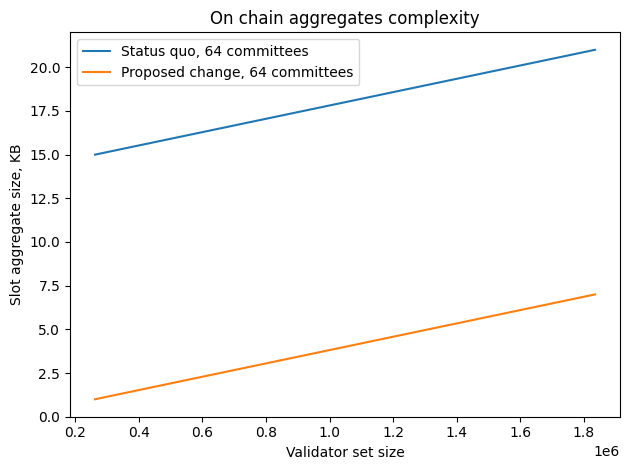
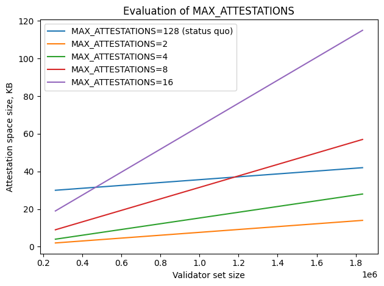
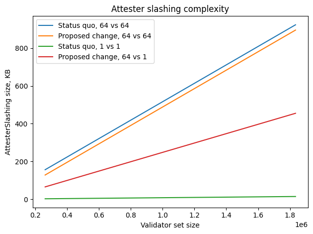

# Complexity analysis

## Network aggregates

Data complexity of the network aggregates does not increase as the new validity condition for the `beacon_aggregate_and_proof` gossipsub topic ensures that every network aggregate comprises a single committee.

## On chain aggregates

The above plot shows potential optimisation effect of the proposed change. Namely, it is roughly 18KB to 4KB reduction in the size of a 64-committee aggregate for a 1 million validator set. Note that these numbers assume perfect aggregation.

### `MAX_ATTESTATIONS`

`MAX_ATTESTATIONS` parameter should be adjusted respectively to avoid increase of the block size.

The above plot suggests `MAX_ATTESTATIONS = 8` as a reasonable limitation. Which means that assuming perfect aggregation the attestation capacity of the block increases from `128` committees to `8*64 = 512` committees, i.e. from `2` slots worth of attestations to `8`.

## Attester slashing

The plot below shows different variations of attester slashing data complexity. Numbers e.g. 64 vs 64 mean a number of committees which validator indices are represented by the corresponding `IndexedAttestation` structure. For instance, today every on chain aggregate comprises a single committee thus the worst case attester slashing produced from on chain aggregates will have two indexed attestations with `1_000_000 / 32 / 64 = 488` validator indices each, which is roughly `8 KB` of uncompressed data. With the proposed change an attester slashing obtained in the same way could require `488 KB` of uncompressed data because it could contain indices from up to 64 committees instead of just 1.

Note that in the case of attack entailing mass slashing the overall complexity of attester slashing data with the proposed change remains the same as it is with the status quo. However, the proposed changed increases the size of the beacon block as each slashing will contain up to 64 times more indices than with the status quo. The positive outcome here is that all slashable attestations can be processed during roughly one epoch (EIP-7549 makes this already possible).

The red line on the plot represents the case when one of the indexed attestations is obtained from an on chain aggregate and the other one from a network aggregate. Moreover, with the proposed change it is still possible to create a slashing from two network aggregates. Therefore, complexity of attester slashing data in case of a single slashing event depends on the _slasher database schema, i.e. whether or not a slasher has access to network aggregates_.

`MAX_ATTESTER_SLASHINGS = 1` is suggested to alleviate the increase of the attester slashing complexity.

### Compressed validator indices

Intuitively validator indices should compress well as there is just `20` bits of useful information per each validator index in the case of `1_000_000` validator set size. So `488 KB` of attester slashing data (the worst case) can be reduced to `153 KB` by employing a trivial compression algorithm.

_AttesterSlashing with 64x64 committees (1_000_000 validators) takes 320KB if compressed by Snappy (checked with PySpec SSZ test suite)._
