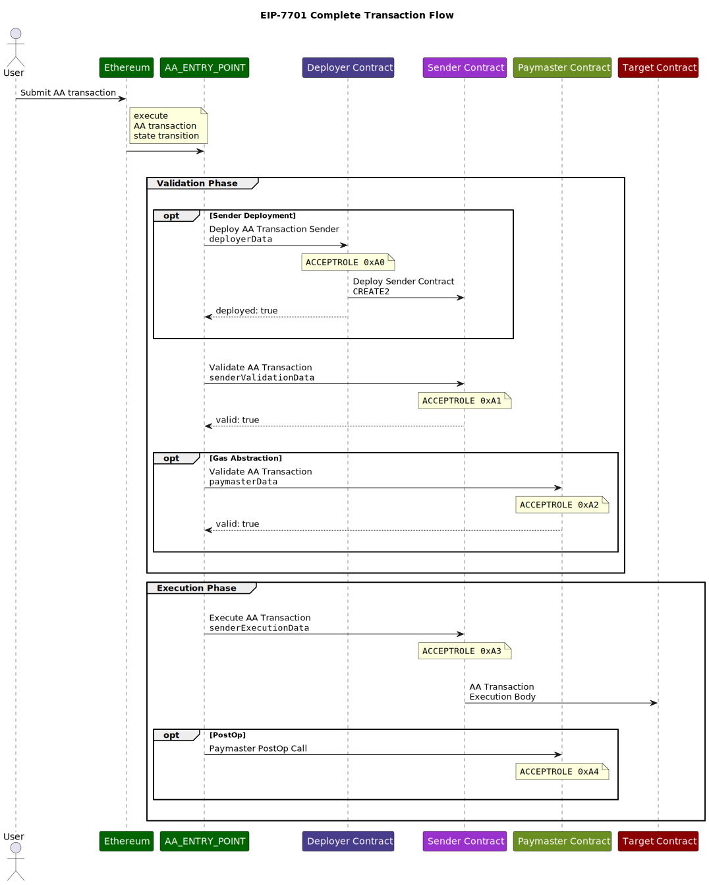

# EIP-7701: Native Account Abstraction explained

The purpose of this document is to provide more details about the design of EIP-7701,
while keeping the [Specification](../../EIPS/eip-7701.md#specification) section of the core document concise.

## Definitions for terms used in EIP-7701

* **Smart Contract Account**: an Ethereum smart contract that serves as the user's account and on-chain identity.
  It is responsible for holding user's assets, verifying user requests, and executing actions on the user's behalf.
* **Sender**: the Smart Contract Account sending the current AA transaction.
* **Paymaster**: a smart contract that is requested to pay gas fees for the current AA transaction on behalf of the
  `Sender` contract.
* **Deployer**: a smart contract that performs a deployment for a new `Sender` contract if necessary in the context of
  the current AA transaction.
* **Entity**: a common term for any of the smart contracts mentioned above in the context of an EIP-7701 Transaction.
* **Transaction Validity**:
  A property of an Ethereum transaction that describes whether this transaction can be included in a block without a
  violation of the ethereum execution and consensus rules.
  This property depends on both the inputs of the transaction and the current state of the Ethereum blockchain and can
  change over time.
* **EIP-7701 Transaction**: the entire transaction initiated by the `Sender` Smart Contract Account and represented with
  an [EIP-2718](../../EIPS/eip-2718) compatible Transaction Envelope object.
* **Call Frame**: The context and state for a specific function call during contract execution, including input
  parameters, local variables, and the execution environment.
* **Top-Level Call Frame**: The initial execution context of a transaction accessing the contract, the "entry point" to
  the EVM code.
* **EIP-7701 Call Frame**:
  A single atomic element of EVM code execution,
  represented by a single top-level call to a specific address with a given data.\
  An EIP-7701 call frame may contain inner call frames as well, but they are not referred to as "EIP-7701 call frames".\
  An EIP-7701 call frame may either succeed or revert.
* **Frame's Role**:
  An identifier of an action that the invoked contract is asked to make during the current call frame.
  An Entity may have one or more roles as part of the EIP-7701 Transaction flow.
* **EIP-7701 Transaction Phase**:
  A set of EIP-7701 Call Frames that form a single step in an EIP-7701 Transaction flow.
  There are two phases in an EIP-7701 Transaction: *validation* and *execution*
* **Validation phase**:
  A set of EIP-7701 Call Frames that define the current EIP-7701 Transaction's **Validity** by executing the
  **validation** EVM code.
* **Execution phase**:
  A set of EIP-7701 Call Frames that perform the actions according to the `Sender` and the `Paymaster` contracts'
  interpretation of the user input.
  These frames do not define the **Validity** of the transaction.

## A frame context `current_context_role` variable

During the execution of the `Sender`, `Paymaster` or a `Deployer` code as defined by the `AA_TX_TYPE` transaction,
the frame context `current_context_role` variable is set to the corresponding role.

The `current_context_role` remains set only for the top-level frame, as well as for inner frames made in the context of the entity, through an uninterrupted chain of `DELEGATECALL` calls.

By default, the value for `current_context_role` is set to `ROLE_SENDER_EXECUTION`.
Call frames initiated with any opcodes other than `DELEGATECALL` run with the `ROLE_SENDER_EXECUTION` role.

If by the end of the execution of the `Sender`, `Paymaster` or a `Deployer` code
`current_context_role` is not explicitly accepted by using the `ACCEPT_ROLE` opcode,
the EIP-7701 Call Frame reverts.

An EIP-7701 transaction is valid if and only if the following conditions are met for each of
`role_sender_deployment`, `role_sender_validation`, `role_paymaster_validation`:

* The top-level call frame did not revert.
* `ACCEPT_ROLE` was called at least once with the role input parameter equal to `current_context_role` in a frame that did not revert.

### New `TXPARAMLOAD`, `TXPARAMSIZE`, and `TXPARAMCOPY` opcodes

Accessing transaction details within call frames is performed using the new `TXPARAM*` opcode family.
The instructions accept the parameter identifier value that we call `txparam_id`.

The `TXPARAMDLOAD`, `TXPARAMSIZE`, `TXPARAMCOPY` follow the pattern of `CALLDATA*` / `RETURNDATA*` opcode
families.

### Limitations on `TXPARAM*` opcodes

The `TXPARAM*` opcodes are only functional in the top level frames for all roles.
Calling these opcodes in another context returns zero values and zero lengths.

Requesting `execution_status` and `execution_gas_used` parameters outside the `role_paymaster_post_op` role's frame returns zero values.

Contracts may use `CURRENT_ROLE` (`current_context_role`) to determine the current frame role.

## Paymaster post-operation frame (optional)

This step is performed with the `role_paymaster_post_op` role.

It is intended to provide the Paymaster contract with an opportunity to finalize any calculations after the
results of the Sender Execution are known.

The `execution_status` and `execution_gas_cost` values are runtime introspection parameters only accessible during this frame via the `TXPARAMLOAD` opcode.

The post-operation frame is considered an integral part of the transaction execution phase.
It means that if the post-operation frame reverts its execution, the Sender Execution state changes are also reverted.

## Transaction Execution Flow

All legacy transaction types only have an implicit validation phase where balance, nonce, and signature are checked,
and an implicit execution phase with a single top-level execution frame.

For all legacy transaction types, during the single top-level execution frame,
the `ORIGIN` (`0x32`, `tx.origin`) and `CALLER` (`0x33`, `msg.sender`)
are both equal to the address that is determined by the transaction's ECDSA signature (`yParity`, `r`, `s`).

When processing an EIP-7701 transaction, however, multiple execution frames will be created.
The full list of possible frames and their corresponding role definitions is as follows:

1. **Validation Phase**
    * `sender` deployment frame (once per account) - `role_sender_deployment`
    * `sender` validation frame (required) - `role_sender_validation`
    * `paymaster` validation frame (optional) - `role_paymaster_validation`
2. **Execution Phase**
    * `sender` execution frame (required) - `role_sender_execution`
    * `paymaster` post-operation frame (optional) - `role_paymaster_post_op`

All execution frames in the **Validation Phase** must be completed successfully without reverting
in order for the transaction to be considered valid for a given position in a block.

## Transaction execution context

Note that some behaviours in the EVM depend on the transaction context. These behaviours include:

1. Costs of the `SSTORE (0x55)` opcode per [EIP-2200](../../EIPS/eip-2200)
2. Costs of accessing cold addresses and slots per [EIP-2929](../../EIPS/eip-2929)
3. Values available within the transient storage per [EIP-1153](../../EIPS/eip-1153)
4. Maximum amount of gas refund assigned after the execution per [EIP-3529](../../EIPS/eip-3529)

These features are not affected by the separation of the transaction into multiple frames.
Meaning, for example, that a value set with `TSTORE (0x5D)` in one frame will remain available in the next one.

### Flow diagrams

#### Simple AA Transaction flow

#### Complete AA transaction flow

## Rationale

### Introduction of the `TXPARAM*` opcode family

The validation calls of a Smart Contract Account code need to have full access to the majority of transaction
details in order to be able to make an informed decision about either accepting or rejecting the transaction.

A small subset of this data is available with the existing opcodes, like `CALLER (0x33)` or `GASPRICE  (0x3A)`.
However, creating an opcode for every transaction parameter is not feasible or desirable.

The `TXPARAM*` opcode family provides the Account Abstraction contracts with access to this data.

These values are not made accessible to the transactions' execution or to legacy transaction types.
This limitation prevents the `TXPARAM*` opcode family from becoming a new source of a globally observable state,
which could create backwards compatibility issues in the future.

### Reverting execution on `postOp` frame revert

The `postOp` frame is part of the execution phase and is a way for Paymasters to manage their bookkeeping,
refund the user, and enforce post-execution conditions to make sure the Sender did what the Paymaster expected it to.
It is not a part of transaction validation, meaning that if it reverts, the Paymaster still pays for the transaction.

If the `postOp` frame reverts it indicates that these post-execution conditions, defined by the paymaster, were not met.
This could occur if, for example:

* A user failed to perform the specific action the Paymaster intended to pay for
* A user provided false information during validation that was found to be false when checked in the `postOp` frame.
* An "intent" was not correctly fulfilled by a solver as verified in the `postOp` frame.

By reverting the main execution frame when the `postOp` frame reverts:

* The user receives no value from the transaction, as their intended operation is undone. This removes an important potential incentive for users to exploit the paymaster.
* The paymaster is protected from sponsoring unintended or abusive operations. While the paymaster still incurs the gas costs for the transaction, they prevent non-compliant operation from successfully completing.
* The paymaster is able to identify the offending Sender account and take action, such as refusing future transactions.

## Copyright

Copyright and related rights waived via [CC0](../../LICENSE.md).

