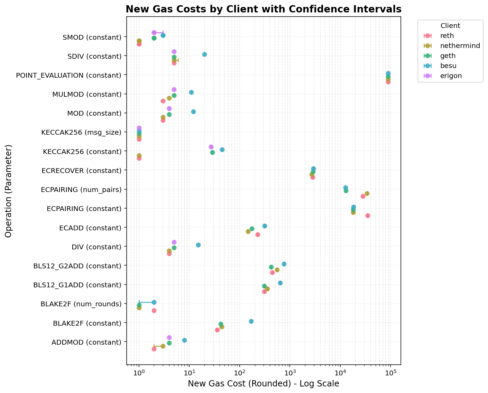

New gas cost proposal for EIP-7904
==================================


This is an automated report generated from the script `./src/estimate_7904_repricings.py`. 
The script uses the runtime estimation output generated by this script. 
The report with the runtime estimation results can be found in 
`./reports/eip-7904/2026-01-15_2026-01-29/runtime_estimation_autogenerated_report.md`.

## Methodology


New gas costs are calculated using an anchor rate of **60 million gas per second**,
which represents a target execution rate for EVM operations. The formula used is:

```
new_gas = (anchor_rate * runtime_ms) / 1000
```

Where `runtime_ms` is the estimated runtime in milliseconds from the regression models.

## Understanding the results


The table below shows the **worst-case** gas costs across all tested clients (taking the maximum
estimated cost per operation). This conservative approach ensures that the new gas costs account
for the slowest implementation among the major Ethereum clients.

The **Change** column shows the relative change as a decimal (e.g., 1.0 = 100% increase, 0.5 = 50% increase,
-0.25 = 25% decrease). Operations with `inf` indicate costs going from 0 to a positive value.

Only operations and parameters with good model fits (R² > 0.5 and p-value < 0.05) are included
in the gas cost proposals. Operations with poor model fits are listed separately in the
"Errors and caveats" section.

## New gas proposal


The following table shows the new gas cost for all operations and parameters with a good model fit.


|Opcode|Parameter|Current Gas|New Gas (Rounded)|Change|
| :---: | :---: | :---: | :---: | :---: |
|ADDMOD|constant|8|8|0.0|
|BLAKE2F|constant|0|170|inf|
|BLAKE2F|num_rounds|1|2|1.0|
|BLS12_G1ADD|constant|375|643|0.71|
|BLS12_G2ADD|constant|600|765|0.27|
|DIV|constant|5|15|2.0|
|ECADD|constant|150|314|1.09|
|ECPAIRING|constant|45000|34710|-0.23|
|ECPAIRING|num_pairs|34000|34103|0.0|
|ECRECOVER|constant|3000|2904|-0.03|
|KECCAK256|constant|30|45|0.5|
|KECCAK256|msg_size|6|1|-0.83|
|MOD|constant|5|12|1.4|
|MULMOD|constant|8|11|0.38|
|POINT_EVALUATION|constant|50000|89363|0.79|
|SDIV|constant|5|20|3.0|
|SMOD|constant|5|3|-0.4|

## Gas costs by client


The following plot shows the new gas costs (rounded) for each operation parameter across different clients, with error bars representing the confidence intervals.



## Errors and caveats


All parameters had a good model fit.


The following operations have no estimation for the following clients:


- BLAKE2F: erigon

- BLS12_G1ADD: erigon

- BLS12_G2ADD: erigon

- ECADD: erigon

- ECPAIRING: erigon

- ECRECOVER: erigon

- POINT_EVALUATION: erigon
