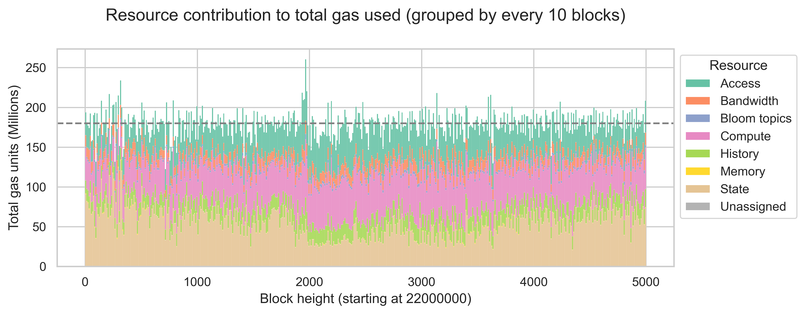
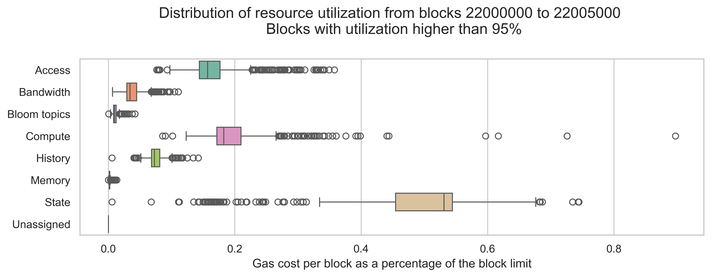
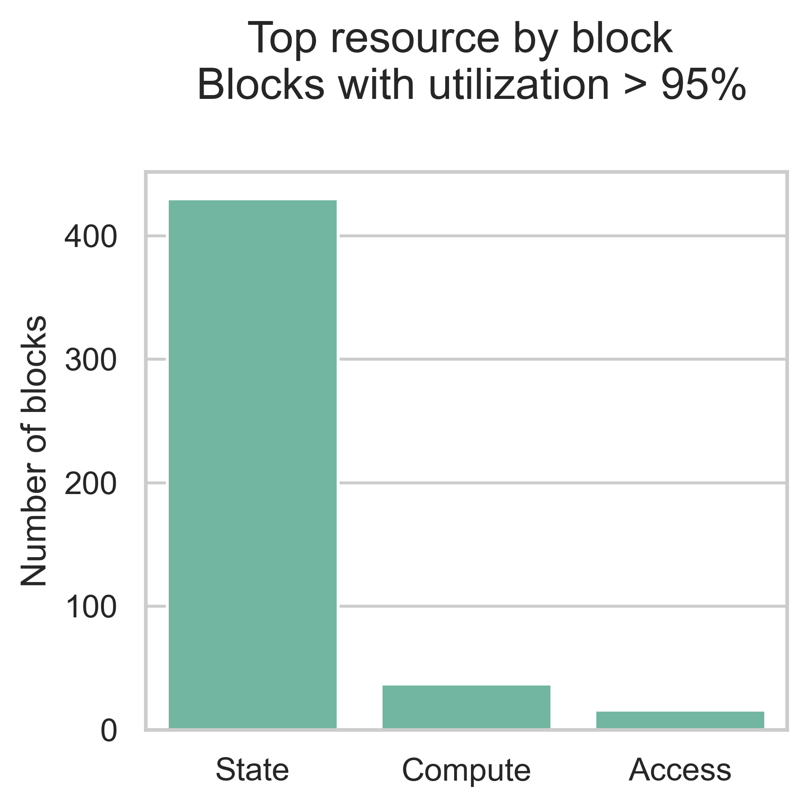
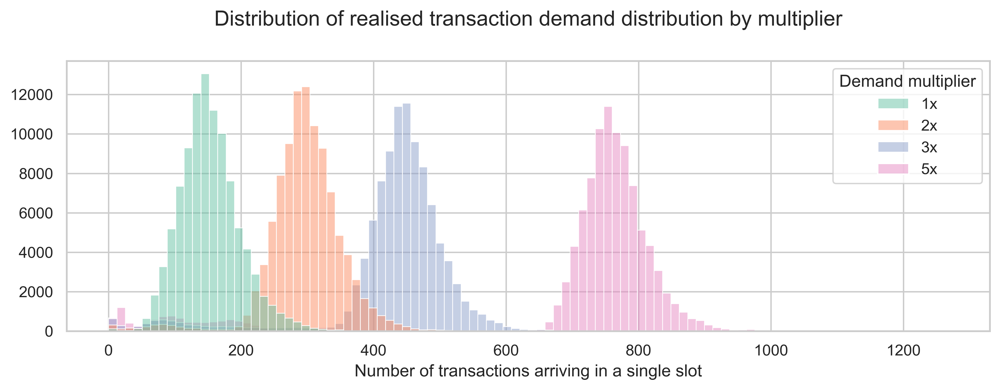
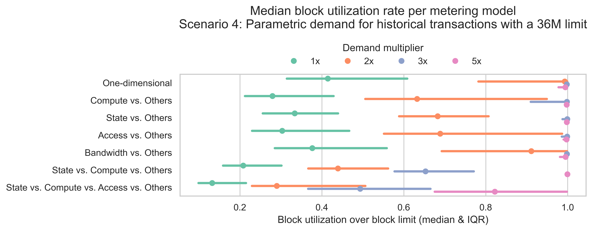

# Going multidimensional - an empirical analysis on gas metering in the EVM

**This document is a copy-paste from [this ethresearch post](https://ethresear.ch/t/going-multidimensional-an-empirical-analysis-on-gas-metering-in-the-evm/22621)**

This post summarizes the key takeaways from an empirical analysis focused on understanding how different EVM gas metering schemes impact network throughput and block utilization. Concretely, we were focused on multidimensional schemes, where the usage of different resources is metered separately.

For conciseness, I am jumping over many technical details. Please refer to the [project documentation](https://hackmd.io/@nightingale/evm-gas-meter) for more details.

I would like to thank @dcrapis for the valuable review, comments, and discussion, [Shouqiao Wang](https://x.com/qiaoqiao2001?lang=en) for the early discussions and for sharing his initial analysis, and the ethPandaOps team for access to their amazing data. This project was supported by the grant [ROP-15: EVM Gas Metering](https://blog.ethereum.org/2025/05/08/allocation-q1-25) provided by the [Robust Incentives Group](https://rig.ethereum.org/).

## Gas metering and block utilization

Gas is the unit that quantifies the computational work needed to perform operations on the Ethereum network. Every transaction on Ethereum consumes resources, and to prevent spam and endless loops, users must pay for these resources.

An essential component of this process is the gas metering scheme, i.e., the function responsible for measuring how full a block is and how many resources remain available. All decentralized networks have limited resources, and thus, protocols must have a way to meter usage and decide when a block is reaching those limits.

In Ethereum, the current metering scheme attributes a cost to each operation (measured in units of gas) and adds the gas of each transaction. Then, it compares this sum against a fixed limit of 36 million gas units. Once a block reaches 36 million gas units, it is considered completely full. In addition to this limit, the protocol also compares the gas utilized by the block against a target of 18 million, which is used to set the base fee all transactions must pay.

This scheme has the advantage of being simple and, thus, easy to interface with. However, it has the drawback of overestimating how close a block is to being at the limits of the network resources. 

To illustrate this point, let us start with a simple example. In this example, we have two blocks, $B_1$ and $B_2$, and a network that only cares about two resources, $x$ and $y$, which with a limit of 1. $B_1$ has a usage by resource of $(x=1, y=0)$ and $B_2$ has a usage by resource of $(x=0.5, y=0.5)$. According to the current scheme, both blocks have the same usage of 1 unit. However, we can see that neither block is reaching the limits of the available resources. $B_1$ is at the limit of resource $x$, but it does not use resource $y$. On the other hand, $B_2$ is only using half of both resources.

This lack of expressivity in the current scheme led to the idea of replacing it with a scheme in which the usage and limits of different resources are considered separately. These are commonly referred to as "multidimensional schemes".

A possible approach is a scheme similar to the one [described by Vitalik](https://vitalik.eth.limo/general/2024/05/09/multidim.html). In this approach, we separate the resources into groups (in our previous example, resource $x$ would be one group, and resource $y$ would be the other). Then, for each block, we add the gas units for each group ($g_x$ and $g_y$) and define the block resource utilization as the maximum of the groups ( $\text{utilization}=\max(c_x*r_x+c_y*r_y, c'_x*r_x, g_y)$). Note however that Vitalik's approach is at transaction-level, instead of at block-level. We can see that in our previous example, this metering scheme would allow us to fill both blocks with more transactions: $B_1$ can additionally include 0.5 units of each resource, while block $B_2$ can include 1 unit of resource $y$ without reaching the block limit.

This example highlights a potential advantage of multidimensional metering. By allowing for a more efficient account of resource utilization, we can increase network throughput (i.e., process more transactions in a block) without significantly impacting the risk of resource overuse. However, there are two key questions to consider here:

1. What are the actual throughput gains we should expect from going multidimensional?
2. What is the design space for multidimensional schemes? And what are the next steps to decide on the best design?

We will try to address each of these questions in the following sections.

## Going multidimensional. Why?

### Historical gas usage by resource

To understand the potential throughput gains of multidimensional metering, we first need to examine how much gas is being used by each resource. To this end, we designed a data pipeline that collects raw transaction data from [Xatu’s dataset](https://ethpandaops.io/data/xatu/) and the [debug traces](https://github.com/akegaviar/Erigon-Geth-debug_traceTransaction-guide/) from an Erigon node, processes and aggregates this data to compute individual gas cost components (intrinsic costs, input data, opcodes, and refunds) by transaction and maps these costs to specific EVM resources (compute, memory, state, history, access, and bloom topics).

The mapping between operations and resources is a major assumption underlying this analysis; different mappings will have a significant impact on the final resource breakdown. Our mapping is based on the knowledge of the underlying operations (e.g., we know that some opcodes only use compute resources) and a partial breakdown of the [cost of some opcodes by resource](https://docs.google.com/spreadsheets/d/1IBf9qD0VUQErsw-oPtaEFa2P3L5w-K46cGPB_n8j0jU/edit?usp=sharing) made when the gas model was first designed.

We should further note that this analysis overlooks the costs and resource utilization associated with blobs. Although this is a parallel free market at the moment, it will nevertheless impose constraints on bandwidth limits and, thus, should be considered when designing a new gas metering model.

The plot below shows the contribution of each resource to the total gas consumption observed between blocks 22000000 and 22005000 (which were processed on March 8th). For improved visibility, we aggregate costs across groups of 10 consecutive blocks. Since each bar is a sum over 10 blocks, the maximum gas that can be used per bar is 360 million units, while the target gas is 180 million units. We plot the target line of 180 million units.

In our data, state represents a significant portion of the gas used in Ethereum blocks, accounting for 30.2% of all gas consumed between blocks 22000000 and 22005000. The second resource with the most gas used is compute (26.8%), followed by access (21.9%). History, bandwidth, and bloom topics have less relevant contributions, accounting for 9.9%, 6.9%, and 1.6% of all the gas used, respectively.

This means that state, compute, and access are the bottleneck resources, as they cover a significant portion of the available block space. Thus, we expect that metering models that separate these resources will show the biggest gains.

When considering resource constraints and the impact of a multidimensional metering scheme on network scalability, looking into the times of congestion or "high load" is also relevant. Using the same data as before, we filtered the blocks with a high utilization rate (more than 95%) and plotted the distribution of block utilization rate by resource and the block count by top resource. These blocks constitute 9.7% of the consecutive blocks dataset.

|   |   |
|---|---|
|| |

Interestingly, state dominates in these blocks (with some contribution from compute and access), which is a significant change when compared with the average block. This indicates that, during periods of high demand, the types of operations more commonly used differ from those used in the average block. Thus, for the current usage of the EVM, state is likely the most important resource to consider when designing multidimensional schemes.

### Block building simulation and metering schemes

By now, we know that state, compute, and access are the most likely resources to achieve throughput gains. However, we still have not answered what the actual gains might be. To accomplish this, we built a simulation based on the [Monte-Carlo method](https://en.wikipedia.org/wiki/Monte_Carlo_method) that uses repeated random sampling to estimate the throughput observed under different metering schemes and transaction demand levels.

We model transaction demand through scenarios. They control the number of transactions and which transactions arrive at the mempool at each 12-second slot. For each slot, we refresh the mempool with the transactions generated by the demand scenario. Then, we build a block for the slot. First, we order the mempool transactions by their transaction fees (the highest are first). Second, we iteratively add transactions to the block until it is full according to the metering scheme being tested. Of course, once we add a transaction to block, we remove it from the mempool so that it cannot be selected again. This mempool refresh and block-building cycle is repeated for a pre-defined number of blocks.

The first scenario we want to discuss aims to mimic an infinite demand for historical transactions. In other words, it tries to estimate the maximum gains we could achieve under different metering schemes, assuming that there are always more transactions available to fill a block up to the 36 million gas units limit. This scenario samples transactions from the same historical blocks processed on March 8th until the block is full.

The following table displays the average gains in transaction throughput (i.e., the number of transactions included in a block) and total gas used (i.e., the total number of gas units included in a block) for various metering schemes. The averages are computed over 100,000 Monte Carlo iterations of a single block built under this scenario.

| **Metering scheme** | **Average gain in throughput** | **Average gain in gas used** |
|:---:|:---:|:---:|
| Compute vs. Others | 60.1% | 44.0% |
| State vs. Others | 58.9% | 52.5% |
| Access vs. Others | 49.6% | 34.1% |
| Bandwidth vs. Others | 26.2% | 11.7% |
| State vs. Compute vs. Others | 145.2% | 133.8% |
| State vs. Compute vs. Access vs. Others | 241.3% | 219.1% |

Between the two-dimensional schemes, Compute vs. Others and State vs. Others show the largest gain in throughput compared to the current one-dimensional scheme. Access vs. Others also shows a significant gain, although slightly lower than the other two schemes. Additionally, both the three-dimensional and the four-dimensional schemes result in even larger gains over the current scheme, which highlights that compute, state and access have relevant gas usage in historical transactions and, as such, metering these resources separately can have a significant impact in throughput in a case with infinite demand of these transactions.

This trend is also observed in the total gas units included in the block. Although, the gains for the gas used are slightly lower than those observed in transaction throughput.

Now that we estimated the maximum gains one could observe in the various metering schemes, it is natural to question how much additional demand would be required in each metering scheme to fill Ethereum blocks and achieve the throughput previously observed. To this end, we designed a set of scenarios where we sample historical transactions from March 8th with varying demand levels.

The demand is modeled by the empirical distribution observed on March 8th, with a multiplier to increase the average demand. For example, a multiplier of 2x will result in an average demand that is double the demand observed on March 8th. The plot below shows the transaction arrival count distributions for the four demand multipliers tested.

The next plot shows the median block utilization and the inter-quartile range (IQR) by metering scheme and demand level. Recall that the block utilization represents how full a block is and is defined as the metered gas of a block divided by the 36 million gas units limit.

In line with previous results, the base demand (multiplier = 1x) is insufficient to achieve high utilization rates across all metering schemes. As demand levels increase, median utilization rates also rise. In the two-dimensional schemes, a demand level of 3x is needed to achieve full blocks for the median case. The three-dimensional scheme requires a demand of 5x. Regarding the four-dimensional model, all demand levels tested result in partially filled blocks in the median case.

## Going multidimensional. What do?

Based on our empirical analysis, there is a significant gain in L1 scalability in moving to a multidimensional metering scheme. However, are there any downsides? The key tradeoff is complexity.

There are two levels on which multidimensional metering increases complexity. The first level is implementation complexity. We need to be able to track the amount of gas each EVM operation consumes per resource, and this requires a hard fork on the execution clients to add the new resource dimensions. In addition, we need to encode the mapping between each operation and each resource. This mapping is crucial to ensuring the network continues to function properly; therefore, it is essential to conduct in-depth benchmarks on the resource usage of each operation. This could be an analysis akin to [gas-cost-estimator](https://github.com/imapp-pl/gas-cost-estimator/tree/master) but for all the relevant EVM resources. Finally, we are introducing a new variable that is only used to track block utilization. At the same time, we continue to use the total gas to compute transaction fees, which can be confusing.

The second level of complexity relates to block building. Even though the experience for users remains the same - transactions cost the same, and users continue to submit a single gas limit and maximum fee - block builders now have a more complicated optimization problem. Not only do they need to consider the MEV and transaction fees, but also how to efficiently pack blocks into the various resources.
