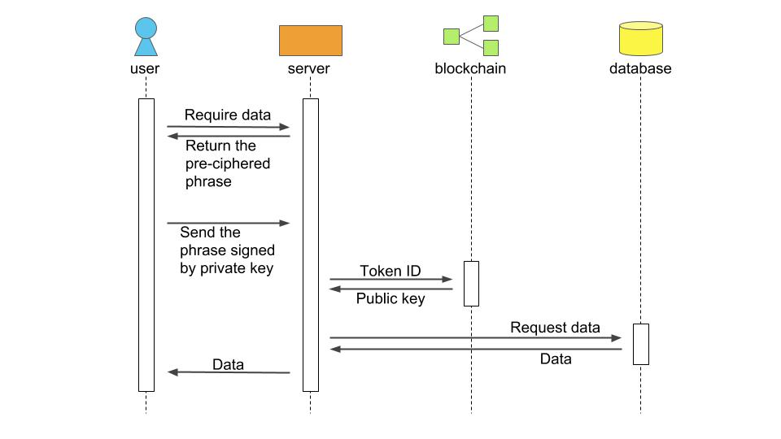
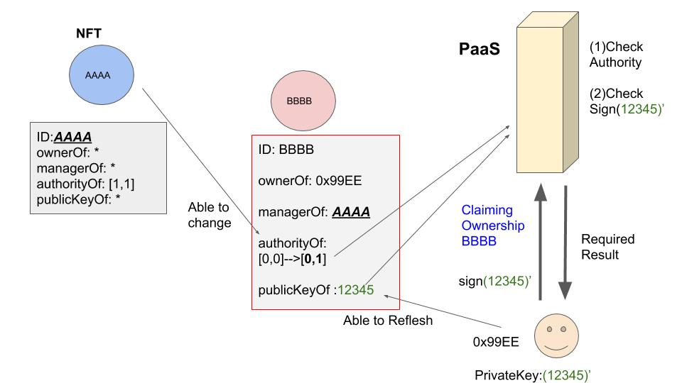

## Simple Summary
Non Fungible Token which can be used in PaaS instead of accounts,API-keys,and serial numbers.

## Abstract
This proposal extends ERC721 token to idenfing owners in any network using a web server,not only in Ethereum Network. Adding a public key to tokens and introducing an order relation enable ERC721 tokens to have practical ID abilities. 
Achieved ID abilities are below.
0 External server can authorize token holder or do Access Control without using Ethereum private key.
1 owner can change account's password or registration at any moment
2 owner can send this NFT to transfer his/her authority without security problems.

## Motivation
Logging in cloud systems by Ethereum address can be done in principle.In addition,policy services or ACL(Access Control List) systems also can be enforced by Ethereum and its clients programs.
"NFT" brought about an adiquate timing to start those practices by its possibility of dealing IDs as assets, which implies sharing API-keys and serial numbers of both dapps/non dapp products. 
In EIP context,By ERC735,Adding attribution to NTFs to claim ownership in Ethereum was proposed,which is extensible for outer networks because a cypher on chain works at off chain as well.
By ERC1115,DAuth was proposed to login services by NTF,which was extensible to have policy system by adding order relation between tokens,and extensible for usages in PaaS by a simplification of the flow shown in the sequence diagram in this proposal.
By ERC998,hiearchy NFT was proposed to manage NTFs as social assets which was extensible for PaaS useage by adding authorize functions.

NFT for Cloud/Ethereum half&half system in minimum extension of ERC721 was needed.

## Specification
####Diaglam
</img>

#### Attributions

mapping (uint8 => bool) authorityOf;
mapping (uint256 => bool) managersOf;
PublicKey publicKeyOf;

#### Functions
function createToken(address _approver) public;   
function switchManagers(uint256 _fromTokenId, uint256 _toTokenId, uint256 _managerTokenId, bool _propriety) public;
function switchAuthority(uint256 _fromTokenId, uint256 _toTokenId, uint8 _authorityId, bool _propriety) public;
function refreshPublicKey(uint256 _tokenId, string _nOfPublicKey, uint256 _eOfPublicKey) public;
function deleteToken(uint256 _tokenId) public;

## Rationale
####Attributions
mapping (uint8 => bool) authorityOf;
This attribution defines what token owner is authorized to do at off chain.This will be referred in PaaS coding.This usually can not be changed by owner his self.
PublicKey publicKeyOf;
This attribution is used to authorize owners at off chain. Encrypting ,digital signing or emai-sending will be done with this attribution.
mapping (uint256 => bool) managersOf;
This attribution defines order relation between tokens. Owners of a token's manager tokens can change the authority attribution of it.

####Functions
* createToken - Only the person owned the token called 'issuer' can execute this function. After calling, \_approver owns new token. The 'issuer' be the 'manager' of the token automatically.

* switchManagers - Only the 'manager' of the token whose id equals \_toTokenId (call 'toToken' below) can execute this function. The owner of the token whose id equals \_fromTokenId (call 'fromToken' below) change the propriety that the \_managerTokenId is included in managers of 'toToken' into \_propriety.

* switchAuthority - As switchManagers, \_fromTokenId owner change the propriety that the \_authorityId is included in authoritys of 'toToken' into \_propriety. But this function caller must own the token with the \_authorityId, in addition.

* refreshPublicKey - Only the token owner can execute this function. The owner resister the value equivalent to the 'n' and 'e' of RSA cryptosystems. By using these values, the owner allow someone to encrypto confidential data and anyone can decrypto the sign by the corresponded private key in advance.

* deleteToken - Only the token owner and issuer can execute this function. After calling, the token whose id equals \_tokenId delete.

## Backwards Compatibility(ERC721)
This standard has no backwards compatibility.This is a NFT standard for cloud useages with minimum extension of ERC721.
And this is not the extension of ERC735,ERC998,ERC1115. 

## Test Cases
Demo is here.Please install Metamask and access with a pc.
<a href="https://www.geomerlin.com/blog/managertoken.html">Enter Demo</a>

## Implementation
Examples of the implemention can be executed at the demo above.
Design patterns of this standard are below.

####Cloud Usage
</img>
1.Requesting a server to execute a function which is authorized with the authority_attribution of the token, and the sign by the private key
2.Server check the sign by the public key,execute the function,and returns the result.

####Sending Token
1.The current owner send token to another,and transfer the authority,with the public key unchanged.
2.The receiver change the public key not to let the previous owner use the token.
3.The manager set the new authority for the token.

####Manager Relation
(1)OneManagerPattern
If a token has only one manager,there are two pattern to manage.
1. allow the higher manager of the token change the authority(authorityOf)
2. don't allow the higher manager of the token change the authority(authorityOf)

(2)SeveralManagerPattern
If a token can have several managers,conflicts of editing authority will occur.
changeAuthority function can describe this pattern,and this depends on a developper's thought.
The codes in the demo above let them conflict,and requires nothing.
</img>

(3)OneIssuerPattern
If all tokens are allowed to be created by one address,
CreateToken function should require the address check.
If CreateToken function require the token Id,the constructor function should create one token initially.
</img>

(4)SeveralIssuerPattern
If token holders can create new tokens,there can be unlimited number of tokens.
Developpers should make rule by limitting CreateToken function to a certain extent.
