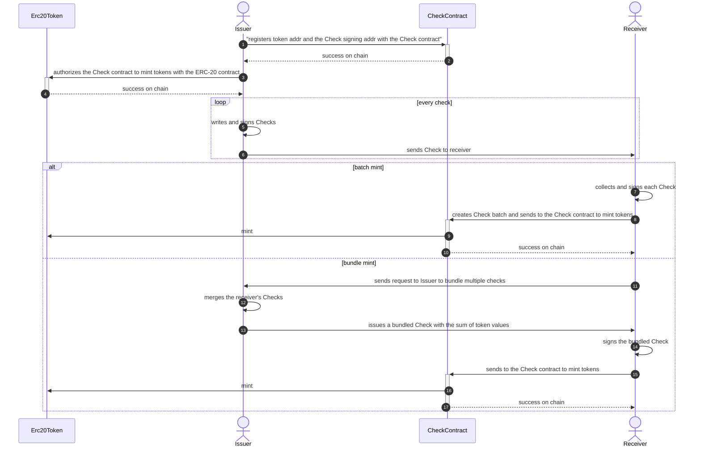

## Abstract

We propose a low cost approach to distribute ERC-20 tokens for high-frequency token issuance use cases such as game rewards, implemented with a one-time deployed Check contract, the off-chain issuing and signing of Checks by the issuers, and batching or bundling of the Checks to mint tokens on-chain by the receivers.

## Motivation

Mass token issuance is one of the most common blockchain activities, traditionally done by direct transfers of tokens to receiver addresses, or programming the issuance logic into smart contracts for receivers to mind their tokens on-chain. Both approaches involve high gas cost especially in large receiver base or high frequency issuance cases.

This approach minimize on-chain operations while maintaining security with the following steps:
1. Issuer register the token once with the Check contract which would mint tokens for the receivers
1. Issuer writes as many off-chain Checks as needed to receivers with no gas, Checks signed by the issuer are non-reputable
1. Receiver collects any number of Checks off-chain with no gas cost
1. Receiver decides when to batch or bundle multiple Checks which can be minted on-chain, with substantial savings in gas cost

## Specification

The key words "MUST", "MUST NOT", "REQUIRED", "SHALL", "SHALL NOT", "SHOULD", "SHOULD NOT", "RECOMMENDED", "NOT RECOMMENDED", "MAY", and "OPTIONAL" in this document are to be interpreted as described in RFC 2119 and RFC 8174.

The Check contract MAY be deployed by any party prior to Check issuance, and MUST implement the following interfaces: 

```javascript
interface ERC20Check {
    /**
     * The Check data structure
     * @param tokenAddr  token contract address
     * @param issuerAddr issuer's Check signing address
     * @param receiverAddr receiver address
     * @param beginId begin id of the issued Check
     * @param endId end id of the issued Check
     * @param amt token amount in the Check
     * For each Check issued individually, beginId == endId
     * For bundled Check, beginId < endId, representing a Check sequence
     */
    struct Check {
        address tokenAddr;
        address issuerAddr;
        address receiverAddr;
        uint256 beginId;
        uint256 endId;
        uint256 amt;
    }

    /**
     * Issuer register a token with the Check contract
     * @dev MUST revert if the msg.sender has no minter role
     * @param tokenAddr token contract address
     * @param issuerAddr issuer's Check signing address
     * @param maxAmt max number of tokens allowed to issue with Check
     * un_register() is not supported because Checks issued are not revokable
     */
    function register(address tokenAddr, address issuerAddr, uint256 maxAmt);

    /**
     * Get the last minted Check id for a (tokenAddr, receiverAddr) tuple
     * @dev MUST revert if tokenAddr is not registered
     * @param tokenAddr token contract address
     * @param receiverAddr receiver address
     * @return The last minted Check id for a (tokenAddr, receiverAddr) tuple
     */
    function getLastCheckId(address tokenAddr, address receiverAddr) view returns (uint256);

    /**
     * Batch mint. Checks in the batch MAY have different tokenAddr, receiverAddr
     * Check numbers for any (tokenAddr, receiverAddr) tuple MUST be continuous, incremental
     * @dev MUST revert if any signature in the batch is invalid
     * @dev MUST revert if the beginId for a (tokenAddr, receiverAddr) != last minted Check id + 1
     * @dev the Check contract MUST keep a record of the last minted Check id for all (tokenAddr, receiverAddr)
     * @param checks list of Check data
     * @param [v|r|s]_[issuer|receiver] list of EIP-712 signatures corresponding to each Check
     */
    function mint(
        Check [] memory checks,
        uint8[] memory v_issuer, 
        bytes32[] memory r_issuer,
        bytes32[] memory s_issuer,
        uint8[] memory v_receiver, 
        bytes32[] memory r_receiver,
        bytes32[] memory s_receiver
    );
}
```

### Off-chain Check data
* The off-chain Check data MUST comply with the Check data structure defined in the ERC20Check interface
* beginId for each (tokenAddr, receiverAddr) MUST starts with 1
* Checks issued individually from the issuer MUST have beginId == endId
* In the bundle request sent from the receiver to the issuer, Check numbers for a (tokenAddr, receiverAddr) tuple MUST be continuous and incremental for the Check sequence
* The issuer's response to the bundle request includes the bundled Check data, in which beginId < endId, representing a Check sequence bundled in a single Check
* Issuer MUST sign each Check before sending to receiver
* Receiver MUST sign each received Check (individual or bundled) before submit to the Check contract to mint

* Example of a single signed Check from issuer
```json
{
    "tokenAddr":"0x80307b478b1e4cc06c5ED1a4cedD0d6Bf312dd4E",
    "issuerAddr":"0x39e60EA6d6417ab2b4a44f714b7503748Ce658eD",
    "receiverAddr":"0x39e60ea6d6417ab2b4a44f714b7503748ce658ed",
    "beginId":10,
    "endId":10,
    "amt":"32000000000000000000",
    "sig": {
        "r":"0x1ed1f53536f6568c9208e63886e367be4cc1ad55fca38299b65bc1c216f1aecc",
        "s":"0x1a682018ceb4a7123d86e1ae6216e243f806997480cbe05aa7660bdbe912ad81",
        "v":27
    }
}
```

* Example of a bundle Check request sent by the receiver to the issuer: "please bundle Check 10-11 into a single Check"
```json
[
    {
        "tokenAddr":"0x80307b478b1e4cc06c5ED1a4cedD0d6Bf312dd4E",
        "issuerAddr":"0x39e60EA6d6417ab2b4a44f714b7503748Ce658eD",
        "receiverAddr":"0x39e60ea6d6417ab2b4a44f714b7503748ce658ed",
        "beginId":10,
        "endId":10,
        "amt":"32000000000000000000",
        "sig": {
                "r":"0x1ed1f53536f6568c9208e63886e367be4cc1ad55fca38299b65bc1c216f1aecc",
                "s":"0x1a682018ceb4a7123d86e1ae6216e243f806997480cbe05aa7660bdbe912ad81",
                "v":27
        }
    },
    {
        "tokenAddr":"0x80307b478b1e4cc06c5ED1a4cedD0d6Bf312dd4E",
        "issuerAddr":"0x39e60EA6d6417ab2b4a44f714b7503748Ce658eD",
        "receiverAddr":"0x39e60ea6d6417ab2b4a44f714b7503748ce658ed",
        "beginId":11,
        "endId":11,
        "amt":"55000000000000000000",
        "sig": {
                "r":"0x0a45617ad36134d2e79a7396ccf08edd6084aa30dcdcf3e06ace4a31c8b2fda0",
                "s":"0x4f61246852246a16319cf62cf4d7b8aca76d3447c6ffb4682287317c3b4c3726",
                "v":28
        }
    }
]
```

* Example of a bundled Check returned by the issuer as response to bundle request
```json
{
    "tokenAddr":"0x80307b478b1e4cc06c5ED1a4cedD0d6Bf312dd4E",
    "issuerAddr":"0x39e60EA6d6417ab2b4a44f714b7503748Ce658eD",
    "receiverAddr":"0x39e60ea6d6417ab2b4a44f714b7503748ce658ed",
    "beginId":10,
    "endId":11,
    "amt":"87000000000000000000",
    "sig": {
            "r":"0x51e35d25c40407fc4540f2cd06d17dfe7fb8deeab403595e2b800db5cede3507",
            "s":"0x136c23c91dfc511d6e7365f011a3739e7f23d0f888210269fa7ab5f1d8f6923c",
            "v":27
    }
}
```

## Check workflow



## Rationale

## Backwards Compatibility

No backward compatibility issues found

## Test Cases

## Reference Implementation

## Security Considerations

<!--
  All EIPs must contain a section that discusses the security implications/considerations relevant to the proposed change. Include information that might be important for security discussions, surfaces risks and can be used throughout the life cycle of the proposal. For example, include security-relevant design decisions, concerns, important discussions, implementation-specific guidance and pitfalls, an outline of threats and risks and how they are being addressed. EIP submissions missing the "Security Considerations" section will be rejected. An EIP cannot proceed to status "Final" without a Security Considerations discussion deemed sufficient by the reviewers.

  The current placeholder is acceptable for a draft.

  TODO: Remove this comment before submitting
-->

To maintain the integrity of the Check sequence issued for a (tokenAddr, receiverAddr), Check ids must follow the numbering rules specified. The Check contract keeps the last minted Check id for each (tokenAddr, receiverAddr) and refuse to mint if the coming beginId in the mint request is out of order. Enforcing the Check sequencing numbers also defies same Check double issue by the issuer or double mint by the receiver.

Off-chain checks are signed by the issuer and are not reputable once issued. After receiving multiple Checks from the issuer, if the issuer refuses to bundle, the receiver can still submit Checks to batch mint, albeit with reduced gas saving effect.

The Check contract requires receiver signature on each Check in the mint request, so that the issuer, after sending a Check with high value, cannot issue a low value Check with the same Check id and mint for the receiver, i.e. replacing a high value Check with a low value Check in the Check sequence on-chain for the receiver before the receive having a chance to mint the high value Check.

## Copyright

Copyright and related rights waived via [CC0](../LICENSE.md).
