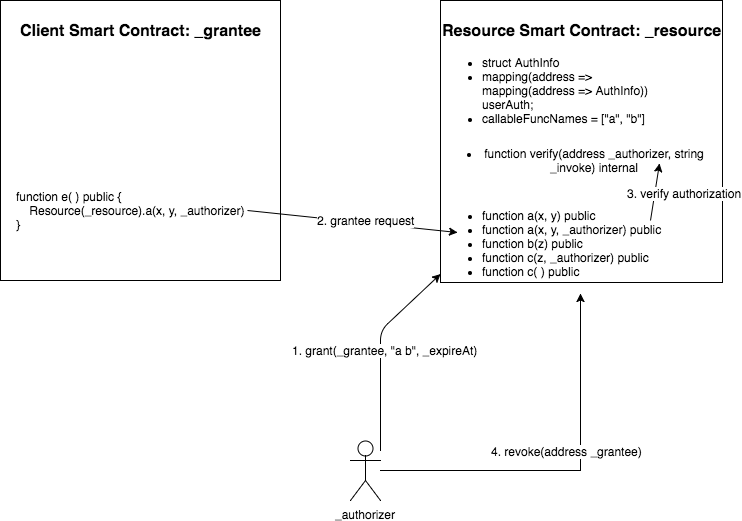

DAuth Access Delegation Standard
=====

## Simple Summary
DAuth is a standard interface for accessing authorization delegation between smart contracts and users.

## Abstract
The DAuth protocol defines a set of standard API allowing identity delegations between smart contracts without the user's private key.  Identity delegations include accessing and operating a user's data and assets contained in the delegated contracts.

## Motivation
The inspiration for designing DAuth comes from OAuth protocol that is extensively used in web applications. But unlike the centralized authorization of OAuth, DAuth works in a  distributed manner, thus providing much more reliability and generality.

## Specification


**Resource owner**: the authorizer

**Resource contract**: the contract providing data and operators

**API**: the resource contract APIs that the grantee contract can invoke

**Client contract**: the grantee contract using authorization to access and operate the data

**Grantee request**: the client contract calls the resource contract with the authorizer authorization


**AuthInfo**
``` js
struct AuthInfo {
    string[] funcNames;
    uint expireAt;
}
```
Required - The struct contains user authorization information
* `funcNames`: a list of function names callable by the granted contract
* `expireAt`: the authorization expire timestamp in seconds

**userAuth**
```  js
mapping(address => mapping(address => AuthInfo)) userAuth;
```
Required - userAuth maps (authorizer address, grantee contract address) pair to the user’s authorization AuthInfo object

**callableFuncNames**
```  js
string[] callableFuncNames;
```
Required - All methods that are allowed other contracts to call
* The callable function MUST verify the grantee’s authorization

**updateCallableFuncNames**
```  js
function updateCallableFuncNames(string _invokes) public returns (bool success);
```
Optional - Update the callable function list for the client contract by the resource contract's administrator
* `_invokes`: the invoke methods that the client contract can call
* return: Whether the callableFuncNames is updated or not
* This method MUST return success or throw, no other outcomes can be possible

**verify**
```  js
function verify(address _authorizer, string _invoke) internal returns (bool success);
```
Required - check the invoke method authority for the client contract
* `_authorizer`: the user address that the client contract agents
* `_invoke`: the invoke method that the client contract wants to call
* return: Whether the grantee request is authorized or not
* This method MUST return success or throw, no other outcomes can be possible

**grant**
```  js
function grant(address _grantee, string _invokes, uint _expireAt) public returns (bool success);
```
Required - delegate a client contract to access the user's resource
* `_grantee`: the client contract address
* `_invokes`: the callable methods that the client contract can access. It is a string which contains all function names split by spaces
* `_expireAt`: the authorization expire timestamp in seconds
* return: Whether the grant is successful or not
* This method MUST return success or throw, no other outcomes can be possible
* A successful grant MUST fire the Grant event(defined below)

**regrant**
```  js
function regrant(address _grantee, string _invokes, uint _expireAt) public returns (bool success);
```
Optional - alter a client contract's delegation

**revoke**
```  js
function revoke(address _grantee) public returns (bool success);
```
Required - delete a client contract's delegation
* `_grantee`: the client contract address
* return: Whether the revoke is successful or not
* A successful revoke MUST fire the Revoke event(defined below).

**Grant**
```  js
event Grant(address _authorizer, address _grantee, string _invokes, uint _expireAt);
```
* This event MUST trigger when the authorizer grant a new authorization when `grant` or `regrant` processes successfully

**Revoke**
```  js
event Revoke(address _authorizer, address _grantee);
```
* This event MUST trigger when the authorizer revoke a specific authorization successfully

**Callable Resource Contract Functions**

All public or external functions that are allowed the grantee to call MUST use overload to implement two functions: The First one is the standard method that the user invokes directly, the second one is the grantee methods of the same function name with one more authorizer address parameter.

Example:
```  js
function approve(address _spender, uint256 _value) public returns (bool success) {
    return _approve(msg.sender, _spender, _value);
}

function approve(address _spender, uint256 _value, address _authorizer) public returns (bool success) {
    verify(_authorizer, "approve");

    return _approve(_authorizer, _spender, _value);
}

function _approve(address sender, address _spender, uint256 _value) internal returns (bool success) {
    allowed[sender][_spender] = _value;
    emit Approval(sender, _spender, _value);
    return true;
}
```

## Rationale

**Current Limitations**

The current design of many smart contracts only considers the user invokes the smart contract functions by themselves using the private key. However, in some case, the user wants to delegate other client smart contracts to access and operate their data or assets in the resource smart contract. There isn’t a common protocol to provide a standard delegation approach.

**Rationale**

On the Ethereum platform, all storage is transparent and the `msg.sender` is reliable. Therefore, the DAuth don't need an `access_token` like OAuth. DAuth just recodes the users' authorization for the specific client smart contract's address. It is simple and reliable on the Ethereum platform.

## Backwards Compatibility
This EIP introduces no backward compatibility issues. In the future, the new version protocol has to keep these interfaces.

## Implementation
Following is the DAuth Interface implementation. Furthermore, the example implementations of EIP20 Interface and ERC-DAuth Interface are also provided. Developers can easily implement their own contracts with ERC-DAuth Interface and other EIP.

* ERC-DAuth Interface implementation is available at:

  https://github.com/DIA-Network/ERC-DAuth/blob/master/ERC-DAuth-Interface.sol

* Example implementation with EIP20 Interface and ERC-DAuth Interface is available at:

  https://github.com/DIA-Network/ERC-DAuth/blob/master/eip20-dauth-example/EIP20DAuth.sol


## Copyright
Copyright and related rights waived via [CC0](https://creativecommons.org/publicdomain/zero/1.0/).
