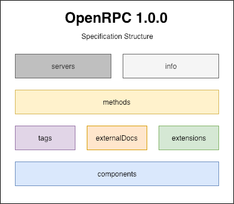
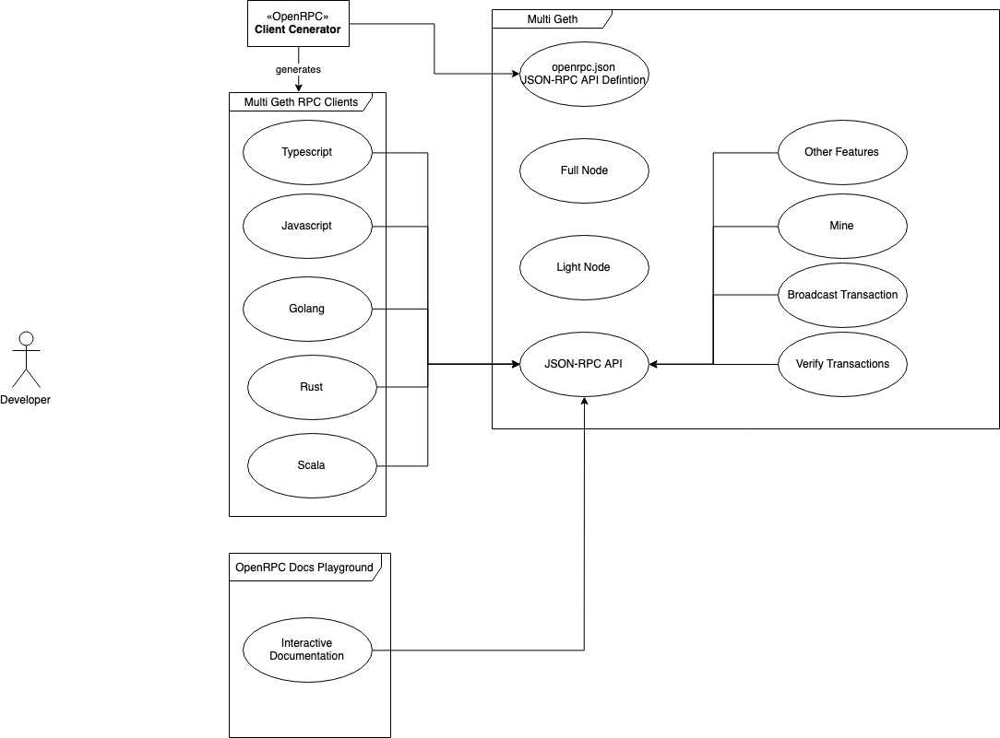

## Abstract
### What is this?

This is a proposal to add [OpenRPC](https://github.com/open-rpc/spec) support to existing and future JSON-RPC services by adding the method [`rpc.discover`](https://github.com/open-rpc/spec#service-discovery-method) to the projects [JSON-RPC](https://www.jsonrpc.org/specification) APIs, enabling automation and tooling.

The OpenRPC Document and generated Documentation that specifies all the methods an EVM-based blockchain should implement can be found [here](https://github.com/etclabscore/ethereum-json-rpc-specification).

This was first proposed [here as an ECIP](https://github.com/etclabscore/ECIPs/blob/master/ECIPs/ECIP-1053.md), but the benefits of this kind of tooling is apparent across Bitcoin, Ethereum Classic, Ethereum and other JSON-RPC accessible blockchains.

## Motivation

Although [EIP-1474](https://github.com/ethereum/EIPs/blob/master/EIPS/eip-1474.md) outlines a JSON-RPC specification. Ethereum still lacks a machine-readable JSON-RPC Specification that can be used as the industry standard for tooling. This proposal attempts to standardize such a specification in a way that is versionable, and both human and machine readable.

Ethereum clients can expose RPC endpoints with different method signatures and cause compatibility issues between clients.

Developers need a reliable developer experience, and an industry standard way to describe Ethereum JSON-RPC 2.0 APIs.

## Specification

### What is OpenRPC?

The [OpenRPC](https://github.com/open-rpc/spec) Specification defines a standard, programming language-agnostic interface description for [JSON-RPC 2.0](https://www.jsonrpc.org/specification) APIs, which allows both humans and computers to discover and understand the capabilities of a service without requiring access to source code, additional documentation, or inspection of network traffic. When properly defined via OpenRPC, a consumer can understand and interact with the remote service with a minimal amount of implementation logic, and share these logic patterns across use cases. Similar to what interface descriptions have done for lower-level programming, the OpenRPC Specification removes guesswork in calling a service.

##### Structure

This is the structure of an OpenRPC Document:

JSON-RPC APIs can support the OpenRPC specification by implementing a service discovery method that will return the [OpenRPC document](https://github.com/open-rpc/spec#openrpc-document) for the JSON-RPC API. The method MUST be named `rpc.discover`. The `rpc.` prefix is a reserved method prefix for [JSON-RPC 2.0 Specification](https://www.jsonrpc.org/specification) system extensions.

### Use Case

This is the vision for the use case of OpenRPC and how it would relate to a client implementation like multi-geth:

## Rationale

### Why would we do this?
Services need to figure out how to talk to each other. If we really want to build the next generation of automation, then having up to date libraries, documented APIs, and modern tools are going to provide easy discovery, on-boarding, and enable end user and developer interaction.

Use cases for machine-readable [JSON-RPC 2.0](https://www.jsonrpc.org/specification) API definition documents include, but are not limited to:

- A common vocabulary and document will keep developers, testers, architects, and technical writers all in sync.
- Server stubs/skeletons generated in many languages
- Clients generated in many languages
- Mock Server generated in many languages
- Tests generated in many languages
- Documentation Generation

### Alternative

[OpenRPC](https://github.com/open-rpc/spec) documents just describe [JSON-RPC](https://www.jsonrpc.org/specification) APIs services, and are represented in JSON format. These documents may be produced and served statically OR generated dynamically from an application and returned via the [`rpc.discover`](https://github.com/open-rpc/spec#service-discovery-method) method. This gives projects and communities the opportunity to adopt tools, documentation, and clients outlined in the [etclabscore/ethereum-json-rpc-specification](https://github.com/ethereum/EIPs/blob/master/EIPS/eip-1474.md) before the [`rpc.discover`](https://github.com/open-rpc/spec#service-discovery-method) method is implemented for a particular client.

## Implementation

- [Multi-Geth OpenRPC Discovery](https://github.com/multi-geth/multi-geth#openrpc-discovery)

## Resources

- [Multi-Geth OpenRPC Discovery](https://github.com/multi-geth/multi-geth#openrpc-discovery)
- [EDCON 2019 talk on OpenRPC and The Future of JSON-RPC Tooling](https://www.youtube.com/watch?v=UgSPMZ9FQ4Q)
- [etclabscore/ethereum-json-rpc-specification](https://github.com/etclabscore/ethereum-json-rpc-specification)
- [open-rpc.org](https://open-rpc.org)

## Copyright

 Copyright and related rights waived via [CC0](https://creativecommons.org/publicdomain/zero/1.0/).