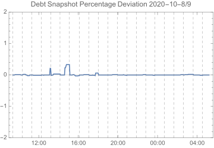

<!--You can leave these HTML comments in your merged SCCP and delete the visible duplicate text guides, they will not appear and may be helpful to refer to if you edit it again. This is the suggested template for new SCCPs. Note that an SCCP number will be assigned by an editor. When opening a pull request to submit your SCCP, please use an abbreviated title in the filename, `sccp-draft_title_abbrev.md`. The title should be 44 characters or less.-->

## Simple Summary
<!--"If you can't explain it simply, you don't understand it well enough." Provide a simplified and layman-accessible explanation of the SCCP.-->

This SCCP proposes changing the debt snapshot stale time to 4 hours.

## Abstract
<!--A short (~200 word) description of the variable change proposed.-->

The pDAO will call [`SystemSettings.setDebtSnapshotStaleTime(15000)`](https://etherscan.io/address/0x703D37fb776A4C905e28f7Ff23C73102ce36E08B#writeContract).
Note that the argument is 15000 seconds, which is actually 4 hours and 10 minutes.
This is to allow a snapshot heartbeat frequency of 4 hours, allowing the keeper bot 10 minutes of leeway.

## Motivation
<!--The motivation is critical for SCCPs that want to update variables within Synthetix. It should clearly explain why the existing variable is not incentive aligned. SCCP submissions without sufficient motivation may be rejected outright.-->

Since [SIP-83](../sips/sip-83.md) went live, snapshots have been operating approximately once per hour to ensure the
accuracy of the snapshot. This cannot be slowed down as the current stale time is also 1 hour.
This stale time was initially set at a cautious level to protect the system, but has proven to be
unnecessarily aggressive. Consider the following chart of the percentage deviation of the cached debt
from the true total system debt over the day following the Deneb release.

{: .center-image }

The dashed lines indicate the times at which complete snapshots were performed to prevent
the snapshot going stale. The upper and lower bounds of this chart are the limits the
deviation would have to breach in order to trigger a fresh snapshot.

Note in particular that the keeper's configured deviation threshold of 2% was never close to
being breached. Over this period, the deviation at snapshot time exceeded 0.06% only twice.
Those two snapshots occurred at deviation levels of 0.21% and 0.33%, so in order to
trigger a debt snapshot, the maximum deviation would need to be sixfold greater.
As each complete snapshot presently costs around 1.5 million gas, it is wasteful to spend
these resources updating a debt cache that is already highly accurate.

The current stale frequency eliminates most of the benefit of [SIP-83's](../sips/sip-83.md)
main snapshot update mechanisms.
First, as the deviation is so low, deviation snapshots are never triggered, so
the partial snapshot mechanism is never able to operate.
This mechanism would allow minimal deviations to be maintained with much less gas expenditure by
targeting only those specific synths which have caused the price to deviate.
Second, the high snapshot frequency obscures the extent to which the deviation
is corrected by cache updates due to synth exchanges.

In effect the high snapshot frequency entails paying more to learn less, and for this reason
and those described above, this SCCP proposes slowing the heartbeat down.
In the long run it may be a better approach to lower the stale time substantially,
while also lowering the deviation threshold on the keeper bot.

## Copyright
Copyright and related rights waived via [CC0](https://creativecommons.org/publicdomain/zero/1.0/).
