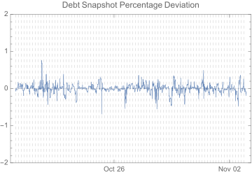

<!--You can leave these HTML comments in your merged SCCP and delete the visible duplicate text guides, they will not appear and may be helpful to refer to if you edit it again. This is the suggested template for new SCCPs. Note that an SCCP number will be assigned by an editor. When opening a pull request to submit your SCCP, please use an abbreviated title in the filename, `sccp-draft_title_abbrev.md`. The title should be 44 characters or less.-->

## Simple Summary
<!--"If you can't explain it simply, you don't understand it well enough." Provide a simplified and layman-accessible explanation of the SCCP.-->

This SCCP proposes changing the debt snapshot stale time to 12 hours.

## Abstract
<!--A short (~200 word) description of the variable change proposed.-->

Following on from [SCCP-52](sccp-52.md), the pDAO will call [`SystemSettings.setDebtSnapshotStaleTime(43800)`](https://etherscan.io/address/0x703D37fb776A4C905e28f7Ff23C73102ce36E08B#writeContract).
Note that the argument corresponds to 12 hours and 10 minutes, allows the keeper bot 10 minutes of leeway
to mine transactions while maintaining a 12 hour snapshot frequency.
The keeper bot will still take snapshots earlier than 12 hours if the deviation exceeds its configured
threshold of 1%, so lowering the frequency should not unduly impact the integrity of the system.

## Motivation
<!--The motivation is critical for SCCPs that want to update variables within Synthetix. It should clearly explain why the existing variable is not incentive aligned. SCCP submissions without sufficient motivation may be rejected outright.-->

Snapshots have been operating reliably for several weeks with a stale time of 4 hours. In this period the system's debt
deviation has not exceeded 1%. The debt snapshot deviation over the last two weeks is described in the following chart:

{: .center-image }

The dashed lines indicate the times at which complete snapshots were performed to prevent
the snapshot going stale. The upper and lower bounds of this chart are the limits the
deviation would have to breach in order to trigger a fresh snapshot.

The maximum deviation over this period was 0.76%. Most dramatic deviations in this period were corrected rapidly
(and well before the next heartbeat) by exchange snapshot updates
(see [the relevant section of SIP-83](../sips/sip-83.md#mint-burn--exchange-debt-delta-adjustments)) and market price
corrections. As a result, there has still been no deviation-triggered partial snapshot over the time debt snapshots
have been operating.

Most of the rationale for slowing down snapshots laid out in [SCCP-52](sccp-52.md) still applies. We have learnt that
synth exchange snapshot updates are effective, but have not seen its full benefit; and all the other reasons to slow
the heartbeat still apply. We could still save significant resources by slowing the heartbeat and lowering the partial
snapshot deviation threshold. A 12 hour snapshot frequency will still be well within the 24-hour issuance delay
described in [SIP-40](../sips/sip-40.md), while further saving resources relative to the current 4 hour frequency.
A final adjustment to a 24-hour snapshot heartbeat may happen in the future;
but a twice-daily heartbeat should be a comfortable setting for some time to come.

## Copyright
Copyright and related rights waived via [CC0](https://creativecommons.org/publicdomain/zero/1.0/).
